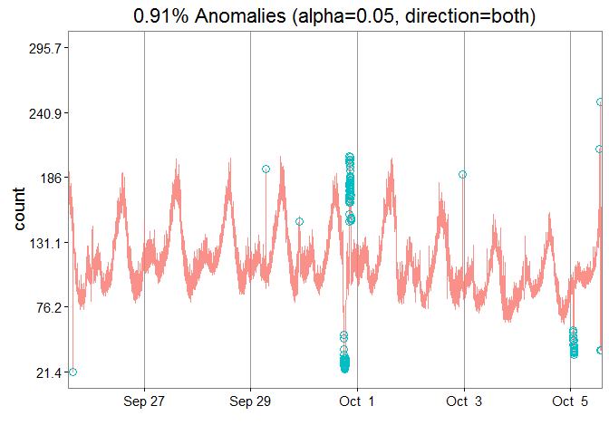
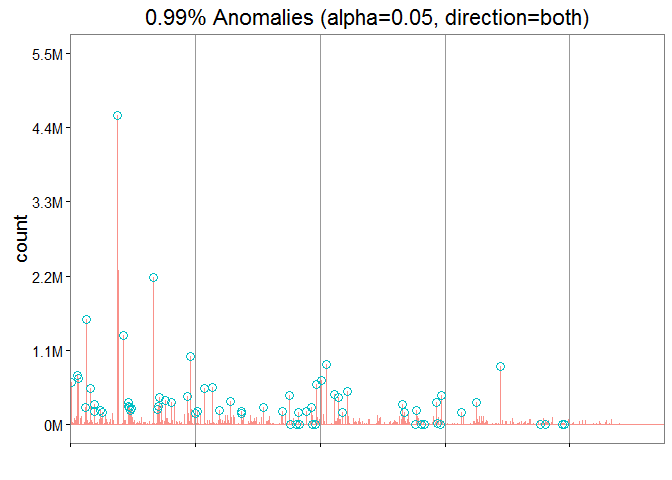

# Twitter Anomaly Detection


https://blog.twitter.com/2015/introducing-practical-and-robust-anomaly-detection-in-a-time-series

'Despite prior research in anomaly detection [1], these techniques are not applicable in the context of social network data because of its inherent seasonal and trend components. Also, as pointed out by Chandola et al. [2], anomalies are contextual in nature and hence, techniques developed for anomaly detection in one domain can rarely be used ‘as is’ in another domain.

Broadly, an anomaly can be characterized in the following ways:
- Global/Local
- Positive/Negative

The primary algorithm, Seasonal Hybrid ESD (S-H-ESD), builds upon the Generalized ESD test [3] for detecting anomalies. S-H-ESD can be used to detect both global and local anomalies. This is achieved by employing time series decomposition and using robust statistical metrics, viz., median together with ESD. In addition, for long time series such as 6 months of minutely data, the algorithm employs piecewise approximation. This is rooted to the fact that trend extraction in the presence of anomalies is non-trivial for anomaly detection [4]'.

## Connect to the database first


```r
library(RPostgreSQL)
```

```
## Loading required package: DBI
```

```r
# create a connection save the password that we can 'hide' it as best as we
# can by collapsing it
pw <- {
    ""
}

# loads the PostgreSQL driver
drv <- dbDriver("PostgreSQL")
# creates a connection to the postgres database note that 'con' will be used
# later in each connection to the database
con <- dbConnect(drv, dbname = "twitter", host = "localhost", port = 5432, user = "postgres", 
    password = "")
# user = postgres for UBUNTU

rm(pw)  # removes the password

# Connection success:
dbExistsTable(con, c("main", "experiment_tweets_shortest"))
```

```
## [1] TRUE
```

##Get the tweets


Total amount of users in the corpus: 6846


```r
head(users)
```

```
##   userid  username no_of_tweets no_of_replies no_of_retweets no_of_friends
## 1    767      xeni         1000           270            347          3984
## 2  11332    Crissy         1000            19            408           481
## 3  12925    Janina         1000           103             28           899
## 4  18713      al3x         1002           612            153           403
## 5  27953   Busymom         1000           406             45          1912
## 6  30973 Starbucks          497           487              6         99958
##   no_of_followers no_of_devices year_opened geo_enabled
## 1           95486             4        2006           1
## 2           79178             8        2006           0
## 3          137646            13        2006           1
## 4           41133            10        2006           1
## 5           52686             1        2006           0
## 6        11654033             3        2006           1
##               location latitude longitude                   timezone
## 1     where data flows       NA        NA Pacific Time (US & Canada)
## 2                 Ohio       NA        NA Eastern Time (US & Canada)
## 3 all up in your DMs.        NA        NA Pacific Time (US & Canada)
## 4       Portland\\, OR       NA        NA Pacific Time (US & Canada)
## 5            Nashville       NA        NA Central Time (US & Canada)
## 6        Seattle\\, WA       NA        NA Pacific Time (US & Canada)
##                                                                             profile_image
## 1                     http://pbs.twimg.com/profile_images/702536731807973376/iDelKqT6.jpg
## 2                     http://pbs.twimg.com/profile_images/633119610477387776/K9aBQma2.jpg
## 3                     http://pbs.twimg.com/profile_images/583690049067155456/VovjQxPp.jpg
## 4                     http://pbs.twimg.com/profile_images/697959498711830528/glceGyFI.png
## 5 http://pbs.twimg.com/profile_images/1083701007/01598788-cc52-4433-a2b1-01a137c02e11.jpg
## 6                     http://pbs.twimg.com/profile_images/629049594047893504/ALcBvCnr.png
##                                                                  background_image
## 1 http://pbs.twimg.com/profile_background_images/462391105808388097/MMAmbCWF.jpeg
## 2 http://pbs.twimg.com/profile_background_images/378800000180398133/BdnLw2ye.jpeg
## 3 http://pbs.twimg.com/profile_background_images/525130313064669184/rxPZNvVF.jpeg
## 4                                http://abs.twimg.com/images/themes/theme1/bg.png
## 5                               http://abs.twimg.com/images/themes/theme16/bg.gif
## 6 http://pbs.twimg.com/profile_background_images/469156785677291520/33CmaU1r.jpeg
##   is_default_profile_image is_default_background_image
## 1                        0                           0
## 2                        0                           0
## 3                        0                           0
## 4                        0                           1
## 5                        0                           0
## 6                        0                           0
##   is_theme_background_image profile_image_uniqueness
## 1                         0                        1
## 2                         0                        1
## 3                         0                        1
## 4                         1                        1
## 5                         1                        1
## 6                         0                        1
##   background_image_uniqueness
## 1                           1
## 2                           1
## 3                           1
## 4                        3599
## 5                          20
## 6                           1
```

```r
# scale the dataset
df <- scale(users[, 3:10])
```

##Play with the package


```r
data(raw_data)
res = AnomalyDetectionTs(raw_data, max_anoms = 0.02, direction = "both", plot = TRUE)
res$plot
```

<!-- -->

##Try with actual data from our dataset

Conclusion is that it might be good for seasonal data but our data is a static set so maybe not.


```r
# friends
res = AnomalyDetectionVec(users[, 6], max_anoms = 0.01, period = 1440, direction = "both", 
    only_last = FALSE, plot = TRUE)
res$plot
```

<!-- -->

```r
# followers
res = AnomalyDetectionVec(users[, 6], max_anoms = 0.01, period = 1440, direction = "both", 
    only_last = FALSE, plot = TRUE)
res$plot
```

<!-- -->


