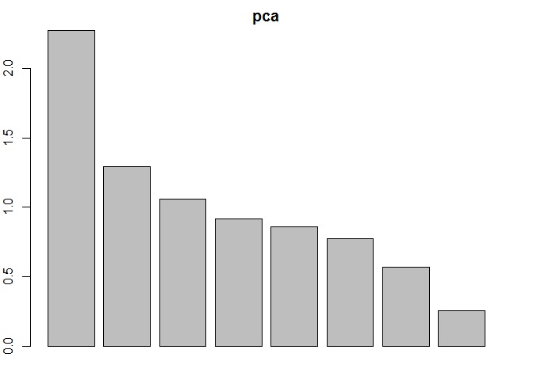
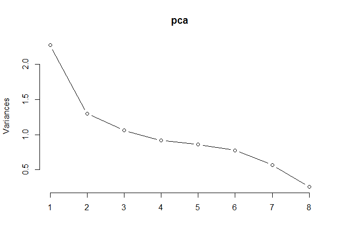
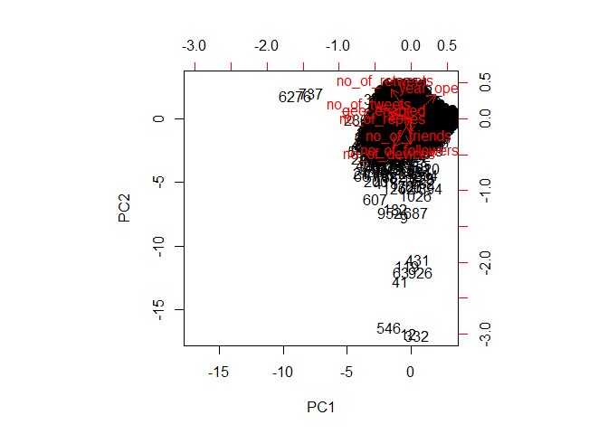
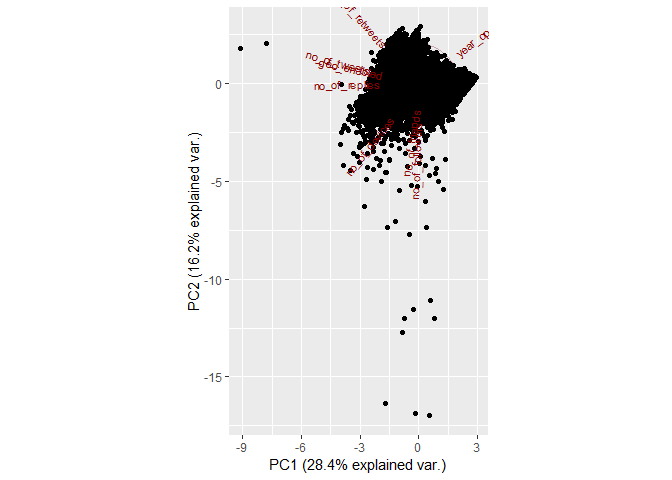

# PCA (Principal Component Analysis)


One of the most commonly faced problems while dealing with data analytics problem such as recommendation engines, text analytics is high-dimensional and sparse data. At many times, we face a situation where we have a large set of features and fewer data points, or we have data with very high feature vectors. In such scenarios, fitting a model to the dataset, results in lower predictive power of the model. This scenario is often termed as the curse of dimensionality. In general, adding more data points or decreasing the feature space, also known as dimensionality reduction, often reduces the effects of the curse of dimensionality.

Mathematically spoken, PCA is a linear orthogonal transformation that transforms the data to a new coordinate system such that the greatest variance by any projection of the data comes to lie on the first coordinate (called the first principal component), the second greatest variance on the second coordinate, and so on.

Assume you have {n} observations of {p} different variables. Define {X} to be a {(n \times p)} matrix where the {i}-th column of {X} contains the observations of the {i}-th variable, {i = 1, ..., p}. Each row {x_i} of {X} can be represented as a point in a {p}-dimensional space. Therefore, {X} contains {n} points in a {p}-dimensional space.

PCA projects {p}-dimensional data into a {q}-dimensional sub-space {(q \leq p)} in a way that minimizes the residual sum of squares (RSS) of the projection. That is, it minimizes the sum of squared distances from the points to their projections. It turns out that this is equivalent to maximizing the covariance matrix (both in trace and determinant) of the projected data

In probability theory and statistics, covariance is a measure of how much two random variables change together. If the greater values of one variable mainly correspond with the greater values of the other variable, and the same holds for the lesser values, i.e., the variables tend to show similar behavior, the covariance is positive.

## Connect to the database first


```r
library(RPostgreSQL)
```

```
## Loading required package: DBI
```

```r
# create a connection save the password that we can 'hide' it as best as we
# can by collapsing it
pw <- {
    ""
}

# loads the PostgreSQL driver
drv <- dbDriver("PostgreSQL")
# creates a connection to the postgres database note that 'con' will be used
# later in each connection to the database
con <- dbConnect(drv, dbname = "twitter", host = "localhost", port = 5432, user = "postgres", 
    password = "")
# user = postgres for UBUNTU

rm(pw)  # removes the password

# Connection success:
dbExistsTable(con, c("main", "experiment_tweets_shortest"))
```

```
## [1] TRUE
```

##Get the tweets

```r
users <- dbGetQuery(con, "SELECT * from main.experiment_user_shortest")
```

Total amount of users in the corpus: 6846


```r
# Preview user dataset
head(users)
```

```
##   userid  username no_of_tweets no_of_replies no_of_retweets no_of_friends
## 1    767      xeni         1000           270            347          3984
## 2  11332    Crissy         1000            19            408           481
## 3  12925    Janina         1000           103             28           899
## 4  18713      al3x         1002           612            153           403
## 5  27953   Busymom         1000           406             45          1912
## 6  30973 Starbucks          497           487              6         99958
##   no_of_followers no_of_devices year_opened geo_enabled
## 1           95486             4        2006           1
## 2           79178             8        2006           0
## 3          137646            13        2006           1
## 4           41133            10        2006           1
## 5           52686             1        2006           0
## 6        11654033             3        2006           1
##               location latitude longitude                   timezone
## 1     where data flows       NA        NA Pacific Time (US & Canada)
## 2                 Ohio       NA        NA Eastern Time (US & Canada)
## 3 all up in your DMs.        NA        NA Pacific Time (US & Canada)
## 4       Portland\\, OR       NA        NA Pacific Time (US & Canada)
## 5            Nashville       NA        NA Central Time (US & Canada)
## 6        Seattle\\, WA       NA        NA Pacific Time (US & Canada)
##                                                                             profile_image
## 1                     http://pbs.twimg.com/profile_images/702536731807973376/iDelKqT6.jpg
## 2                     http://pbs.twimg.com/profile_images/633119610477387776/K9aBQma2.jpg
## 3                     http://pbs.twimg.com/profile_images/583690049067155456/VovjQxPp.jpg
## 4                     http://pbs.twimg.com/profile_images/697959498711830528/glceGyFI.png
## 5 http://pbs.twimg.com/profile_images/1083701007/01598788-cc52-4433-a2b1-01a137c02e11.jpg
## 6                     http://pbs.twimg.com/profile_images/629049594047893504/ALcBvCnr.png
##                                                                  background_image
## 1 http://pbs.twimg.com/profile_background_images/462391105808388097/MMAmbCWF.jpeg
## 2 http://pbs.twimg.com/profile_background_images/378800000180398133/BdnLw2ye.jpeg
## 3 http://pbs.twimg.com/profile_background_images/525130313064669184/rxPZNvVF.jpeg
## 4                                http://abs.twimg.com/images/themes/theme1/bg.png
## 5                               http://abs.twimg.com/images/themes/theme16/bg.gif
## 6 http://pbs.twimg.com/profile_background_images/469156785677291520/33CmaU1r.jpeg
##   is_default_profile_image is_default_background_image
## 1                        0                           0
## 2                        0                           0
## 3                        0                           0
## 4                        0                           1
## 5                        0                           0
## 6                        0                           0
##   is_theme_background_image profile_image_uniqueness
## 1                         0                        1
## 2                         0                        1
## 3                         0                        1
## 4                         1                        1
## 5                         1                        1
## 6                         0                        1
##   background_image_uniqueness
## 1                           1
## 2                           1
## 3                           1
## 4                        3599
## 5                          20
## 6                           1
```

```r
# get numeric dataset
df <- (users[, 3:10])
# for later use in biplot
users.names <- (users[, 2])
```

##Find the most variance


```r
# Use apply() to the corpus row wise to calculate the variance to see how
# each variable is varying.
apply(df, 2, var)
```

```
##    no_of_tweets   no_of_replies  no_of_retweets   no_of_friends 
##    1.595914e+05    2.790709e+04    6.056582e+04    5.986982e+09 
## no_of_followers   no_of_devices     year_opened     geo_enabled 
##    5.698303e+12    8.658642e+00    4.663679e+00    2.438599e-01
```

Let’s plot all the principal components and see how the variance is accounted with each component.

The resultant components of pca object from the above code corresponds to the standard deviations and Rotation. From the above standard deviations we can observe that the 1st PCA explained most of the variation, followed by other pcas’.  Rotation contains the principal component loadings matrix values which explains /proportion of each variable along each principal component.


```r
pca = prcomp(df, center = TRUE, scale = TRUE)  #scale and center the values

pca
```

```
## Standard deviations:
## [1] 1.5073918 1.1381477 1.0294932 0.9573618 0.9261920 0.8805065 0.7534946
## [8] 0.5050886
## 
## Rotation:
##                         PC1          PC2         PC3         PC4
## no_of_tweets    -0.57218072  0.201248073  0.07014025  0.01759636
## no_of_replies   -0.38310697 -0.005174868 -0.26939281  0.29445760
## no_of_retweets  -0.34618205  0.520133331  0.33637873 -0.21540739
## no_of_friends   -0.02761549 -0.243744391  0.66576782  0.69437196
## no_of_followers -0.01266098 -0.441414870  0.48703039 -0.60744188
## no_of_devices   -0.29411621 -0.487912694 -0.34869752  0.02791240
## year_opened      0.42019821  0.428675646  0.01665248  0.08145637
## geo_enabled     -0.37683215  0.113374287  0.08393188 -0.08962390
##                         PC5         PC6         PC7          PC8
## no_of_tweets    -0.13366176  0.22748553  0.04071415  0.745390085
## no_of_replies   -0.73218588 -0.10988759 -0.10814978 -0.366137525
## no_of_retweets   0.18682721  0.36943802 -0.15933454 -0.503281187
## no_of_friends    0.07241109  0.01198134 -0.09294590 -0.020024789
## no_of_followers -0.39286362 -0.03701772 -0.20541146  0.030039523
## no_of_devices    0.36722009  0.24879246 -0.59562116 -0.039432713
## year_opened     -0.19276624 -0.07852791 -0.73163415  0.232689130
## geo_enabled      0.28202723 -0.85446616 -0.14273256 -0.006515001
```

```r
par(mar = rep(2, 4))
plot(pca)
```

<!-- -->

Decide how many PCs to retain for future analysis

```r
plot(pca, type = "l")
```

<!-- -->

The summary method describe the importance of the PCs. The first row describe again the standard deviation associated with each PC. The second row shows the proportion of the variance in the data explained by each component while the third row describe the cumulative proportion of explained variance. 

```r
summary(pca)
```

```
## Importance of components:
##                          PC1    PC2    PC3    PC4    PC5     PC6     PC7
## Standard deviation     1.507 1.1381 1.0295 0.9574 0.9262 0.88051 0.75349
## Proportion of Variance 0.284 0.1619 0.1325 0.1146 0.1072 0.09691 0.07097
## Cumulative Proportion  0.284 0.4460 0.5784 0.6930 0.8002 0.89714 0.96811
##                            PC8
## Standard deviation     0.50509
## Proportion of Variance 0.03189
## Cumulative Proportion  1.00000
```

Clearly the first principal component accounts for maximum information.
Let us interpret the results of pca using biplot graph. Biplot is used to show the proportions of each variable along the two principal components.


```r
# pca$rotation=-pca$rotation pca$x=-pca$x
biplot(pca, scale = 0)
```

<!-- -->

In the preceding image, known as a biplot, we can see the two principal components (PC1 and PC2) of the dataset. The red arrows represent the loading vectors, which represent how the feature space varies along the principal component vectors.

Here is a better version of the plot


```r
library(devtools)
# install_github('ggbiplot', 'vqv')
library(ggbiplot)
```

```
## Loading required package: plyr
```

```
## Loading required package: grid
```

```r
# length(pca) #5 length(users.names) #6846

g <- ggbiplot(pca, obs.scale = 1, var.scale = 1, ellipse = TRUE, circle = TRUE)
g <- g + scale_color_discrete(name = "")
g <- g + theme(legend.direction = "horizontal", legend.position = "top")
print(g)
```

<!-- -->

```r
# groups = users.names, #add this after ellipse if you want to circle groups
# by another variable
```

##Determine what to keep
Another way of deciding how many components to retain is to use Kaiser’s criterion: that we should only retain principal components for which the variance is above 1 (when principal component analysis was applied to standardised data). We can check this by finding the variance of each of the principal components.

```r
(pca$sdev)^2
```

```
## [1] 2.2722301 1.2953801 1.0598563 0.9165415 0.8578316 0.7752918 0.5677542
## [8] 0.2551145
```

```r
# show values to use going forward for regression
loadings <- eigen(cov(df))$vectors
explvar <- loadings^2
explvar
```

```
##              [,1]         [,2]         [,3]         [,4]         [,5]
## [1,] 2.998650e-11 1.509436e-08 8.188662e-01 7.065197e-02 1.104675e-01
## [2,] 4.204182e-12 8.614681e-10 3.336100e-02 2.142108e-01 7.524279e-01
## [3,] 2.955760e-11 1.436318e-09 1.477679e-01 7.151240e-01 1.370977e-01
## [4,] 7.283766e-06 9.999927e-01 8.322914e-09 2.614329e-09 6.453734e-09
## [5,] 9.999927e-01 7.283763e-06 5.876246e-11 4.224674e-12 3.080339e-12
## [6,] 1.384179e-15 3.443144e-15 1.466935e-06 8.587850e-06 2.435518e-06
## [7,] 1.595848e-14 3.015166e-12 3.269666e-06 4.667620e-06 4.451522e-06
## [8,] 9.236617e-18 2.917221e-15 1.525168e-07 1.986812e-10 9.814314e-09
##              [,6]         [,7]         [,8]
## [1,] 1.036846e-05 3.898355e-06 4.668934e-08
## [2,] 2.502791e-09 2.919834e-07 3.239020e-08
## [3,] 9.433886e-06 9.052132e-07 6.216143e-08
## [4,] 1.530306e-17 1.866580e-12 2.872247e-16
## [5,] 6.008808e-15 1.162624e-14 2.052732e-17
## [6,] 8.924313e-01 1.075436e-01 1.260574e-05
## [7,] 1.073372e-01 8.914839e-01 1.166562e-03
## [8,] 2.117806e-04 9.673663e-04 9.988207e-01
```


