# Results Original Data


```
## Loading required package: DBI
```

```
## [1] TRUE
```


##Pre-processing

```r
# CHECK MISSING DATA A function that plots missingness

ggplot_missing <- function(x) {
    
    x %>% is.na %>% melt %>% ggplot(data = ., aes(x = Var2, y = Var1)) + geom_raster(aes(fill = value)) + 
        scale_fill_grey(name = "", labels = c("Present", "Missing")) + theme_minimal() + 
        theme(axis.text.x = element_text(angle = 45, vjust = 0.5)) + labs(x = "Variables in Dataset", 
        y = "Rows / observations")
}

p <- ggplot_missing(data.full)
print(p)
```

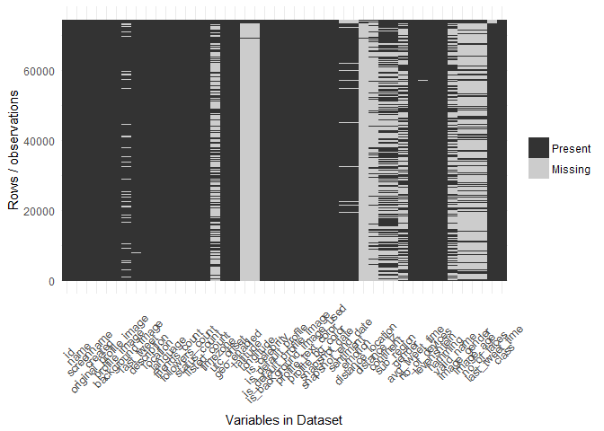<!-- -->

```r
###################################### CLEANUP AND PREPROCESSING
data.full$sentiment[is.na(data.full$sentiment)] <- "Other"
data.full$emotion[is.na(data.full$emotion)] <- "Other"
data.full$distance_location[is.na(data.full$distance_location)] <- 0
data.full$distance_tz[is.na(data.full$distance_tz)] <- 0
data.full$continent[is.na(data.full$continent)] <- "Other"
data.full$sub_region[is.na(data.full$sub_region)] <- "Other"
data.full$gender[is.na(data.full$gender)] <- "Other"
data.full$avg_tweet_time[is.na(data.full$avg_tweet_time)] <- 12
data.full$no_of_devices[is.na(data.full$no_of_devices)] <- 1
data.full$levenshtein[is.na(data.full$levenshtein)] <- 1
data.full$hamming[is.na(data.full$hamming)] <- 1
data.full$valid_name[is.na(data.full$valid_name)] <- 0
data.full$image_gender[is.na(data.full$image_gender)] <- "Other"
data.full$image_age[is.na(data.full$image_age)] <- 20
data.full$no_of_faces[is.na(data.full$no_of_faces)] <- 20
# change last tweet time
data.full$last_tweet_time <- year(ymd_hms(data.full$last_tweet_time))
data.full$last_tweet_time[is.na(data.full$last_tweet_time)] <- 2000
# change location, language, timezone to only have top50 and other
d <- data.full %>% group_by(continent) %>% summarise(n = n()) %>% arrange(desc(n))
l <- subset(data.full, !(continent %in% d$continent[1:50]))$continent
data.full$continent[data.full$continent %in% l] <- "Other"
rm(d, l)
# remove decimals from numerics
data.full$image_age <- round(data.full$image_age)
data.full$avg_tweet_time <- round(data.full$avg_tweet_time)
# update name
data.full[data.full$valid_name != 0, ]$valid_name <- 1
# first replace NA with other
data.full$timezone[is.na(data.full$timezone)] <- "Other"
data.full$latitude[is.na(data.full$latitude)] <- 0
data.full$longitude[is.na(data.full$longitude)] <- 0
# change created to be year of creation
data.full$created <- year(ymd_hms(data.full$created))
data.full$created[is.na(data.full$created)] <- 2000
# change location, language, timezone to only have top50 and other
d <- data.full %>% group_by(location) %>% summarise(n = n()) %>% arrange(desc(n))
l <- subset(data.full, !(location %in% d$location[1:50]))$location
data.full$location[data.full$location %in% l] <- "Other"
rm(d, l)
d <- data.full %>% group_by(timezone) %>% summarise(n = n()) %>% arrange(desc(n))
l <- subset(data.full, !(timezone %in% d$timezone[1:20]))$timezone
data.full$timezone[data.full$timezone %in% l] <- "Other"
rm(d, l)
d <- data.full %>% group_by(language) %>% summarise(n = n()) %>% arrange(desc(n))
l <- subset(data.full, !(language %in% d$language[1:20]))$language
data.full$language[data.full$language %in% l] <- "Other"
rm(d, l)
# remove decimals from lat/lon
data.full$latitude <- round(data.full$latitude)
data.full$longitude <- round(data.full$longitude)

######################################## BUILD SETS
prepareData <- function(x) {
    
    # identify nonzero attributes that can influence result
    nzv <- nearZeroVar(x, saveMetrics = TRUE)
    print(nzv[nzv$nzv, ])
    
    # check that there are no missing values
    p <- ggplot_missing(x)
    print(p)
    
    dmy <- dummyVars("class ~ .", data = x, fullRank = T)
    y <- data.frame(predict(dmy, newdata = x))
    
    # identify correlated predictors
    descrCor <- cor(y)
    highCorr <- sum(abs(descrCor[upper.tri(descrCor)]) > 0.999)
    print(highCorr)
    
    # done automatically? rm(dmy, nzv, descrCor, highCorr)
    y <- cbind(y, x$class)
    colnames(y)[colnames(y) == "x$class"] <- "class"
    return(y)
}

############################### PREPARE DATASETS
myvars <- c("utc_offset", "geo_enabled", "latitude", "longitude", "is_default_profile", 
    "is_default_profile_image", "created", "class")
data.o <- prepareData(data.full[myvars])
```

```
##                           freqRatio percentUnique zeroVar  nzv
## latitude                 2543.75862   0.231810264   FALSE TRUE
## longitude                3513.42857   0.397963286   FALSE TRUE
## is_default_profile_image   32.18364   0.002679887   FALSE TRUE
## class                      73.63000   0.002679887   FALSE TRUE
```

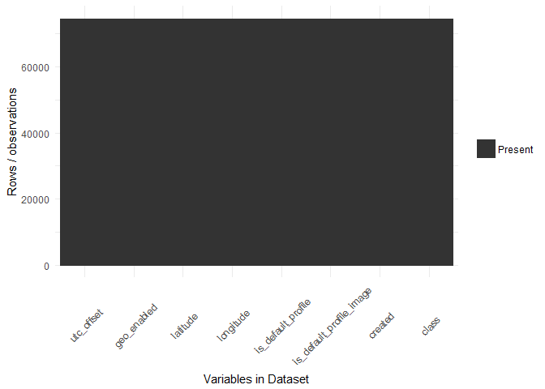<!-- -->

```
## [1] 0
```

```r
myvars <- c("distance_location", "distance_tz", "gender", "levenshtein", "hamming", 
    "valid_name", "image_gender", "image_age", "no_of_faces", "class")
data.e <- prepareData(data.full[myvars])
```

```
##                     freqRatio percentUnique zeroVar  nzv
## distance_location 24563.00000   1.179150476   FALSE TRUE
## distance_tz         358.92737   5.093126089   FALSE TRUE
## image_age            32.26165   0.123274822   FALSE TRUE
## class                73.63000   0.002679887   FALSE TRUE
```

<!-- -->

```
## [1] 2
```

```r
#################################### FUNCTION for partial least squares
runModel <- function(x, s, m, saved) {
    set.seed(123)
    inTrain <- createDataPartition(y = x$class, p = 0.75, list = FALSE)
    # str(inTrain)
    
    training <- x[inTrain, ]
    testing <- x[-inTrain, ]
    rm(inTrain)
    
    ctrl <- trainControl(method = "repeatedcv", repeats = 3, classProbs = TRUE, 
        summaryFunction = twoClassSummary)
    
    # cl <- makeCluster(detectCores()) registerDoParallel(cl)
    s <- paste(s, m, "Fit.RData", sep = "_")
    if (saved == 0) {
        plsFit <- train(class ~ ., data = training, method = m, tuneLength = 15, 
            trControl = ctrl, metric = "ROC", preProc = c("center", "scale"))
        save(plsFit, file = s)
    } else {
        load(s)
        # stopCluster(cl) registerDoSEQ()
    }
    
    # show result
    print(plsFit)
    p <- plot(plsFit)
    print(p)
    # plot(plsFit, metric='Kappa') ggplot(plsFit)
    
    plsImportance <- varImp(plsFit, scale = FALSE)
    p <- plot(plsImportance)
    print(p)
    
    # predict new values
    plsClasses <- predict(plsFit, newdata = testing)
    print(head(plsClasses))
    
    plsProbs <- predict(plsFit, newdata = testing, type = "prob")
    print(head(plsProbs))
    
    p <- confusionMatrix(data = plsClasses, testing$class)
    print(p)
    
    # ROC
    plsRoc <- roc(testing$class, plsProbs[, "deceptive"], levels = c("trustworthy", 
        "deceptive"))
    print(plsRoc)
    p <- plot(plsRoc, print.thres = "best", print.thres.best.method = "closest.topleft")
    print(p)
    plsRocCoords <- coords(plsRoc, "best", best.method = "closest.topleft", 
        ret = c("threshold", "accuracy"))
    print(plsRocCoords)
    
    rm(plsRoc, plsRocCoords, plsProbs, plsClasses, plsImportance)
    
    return(plsFit)
}

resampling <- function(x) {
    # How do these models compare in terms of their resampling results? The
    # resamples function can be used to collect, summarize and contrast the
    # resampling results. Since the random number seeds were initialized to the
    # same value prior to calling train, the same folds were used for each
    # model.
    resamps <- resamples(x)
    print(summary(resamps))
    p <- xyplot(resamps, what = "BlandAltman")
    print(p)
    # boxplots of results
    p <- bwplot(resamps)
    print(p)
    # dot plots of results
    p <- dotplot(resamps)
    print(p)
    
    # Since, for each resample, there are paired results a paired t–test can be
    # used to assess whether there is a difference in the average resampled area
    # under the ROC curve. The diff.resamples function can be used to compute
    # this:
    diffs <- diff(resamps)
    print(summary(diffs))
    
}

# data = full set with class dummy = dummyVars set without class
plsFit.o <- runModel(data.o, "original", "pls", 1)
```

```
## Partial Least Squares 
## 
## 55973 samples
##     7 predictor
##     2 classes: 'deceptive', 'trustworthy' 
## 
## Pre-processing: centered (7), scaled (7) 
## Resampling: Cross-Validated (10 fold, repeated 3 times) 
## Summary of sample sizes: 50376, 50375, 50376, 50375, 50376, 50376, ... 
## Resampling results across tuning parameters:
## 
##   ncomp  ROC        Sens  Spec
##   1      0.8849981  0     1   
##   2      0.8878794  0     1   
##   3      0.8897033  0     1   
##   4      0.8890273  0     1   
##   5      0.8890515  0     1   
##   6      0.8890512  0     1   
## 
## ROC was used to select the optimal model using  the largest value.
## The final value used for the model was ncomp = 3.
```

```
## Loading required package: pls
```

```
## 
## Attaching package: 'pls'
```

```
## The following object is masked from 'package:stats':
## 
##     loadings
```

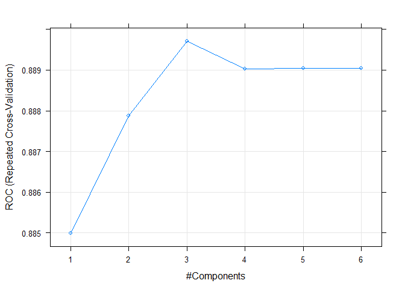<!-- -->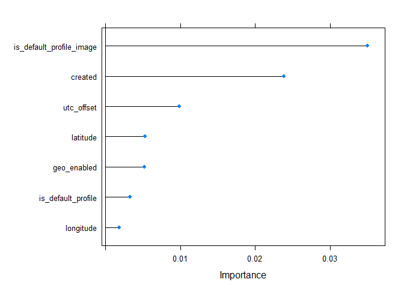<!-- -->

```
## [1] trustworthy trustworthy trustworthy trustworthy trustworthy trustworthy
## Levels: deceptive trustworthy
##    deceptive trustworthy
## 1  0.3588087   0.6411913
## 8  0.2651795   0.7348205
## 10 0.2695366   0.7304634
## 18 0.2651795   0.7348205
## 21 0.2810238   0.7189762
## 22 0.3691070   0.6308930
## Confusion Matrix and Statistics
## 
##              Reference
## Prediction    deceptive trustworthy
##   deceptive           0           0
##   trustworthy       250       18407
##                                           
##                Accuracy : 0.9866          
##                  95% CI : (0.9848, 0.9882)
##     No Information Rate : 0.9866          
##     P-Value [Acc > NIR] : 0.5168          
##                                           
##                   Kappa : 0               
##  Mcnemar's Test P-Value : <2e-16          
##                                           
##             Sensitivity : 0.0000          
##             Specificity : 1.0000          
##          Pos Pred Value :    NaN          
##          Neg Pred Value : 0.9866          
##              Prevalence : 0.0134          
##          Detection Rate : 0.0000          
##    Detection Prevalence : 0.0000          
##       Balanced Accuracy : 0.5000          
##                                           
##        'Positive' Class : deceptive       
##                                           
## 
## Call:
## roc.default(response = testing$class, predictor = plsProbs[,     "deceptive"], levels = c("trustworthy", "deceptive"))
## 
## Data: plsProbs[, "deceptive"] in 18407 controls (testing$class trustworthy) < 250 cases (testing$class deceptive).
## Area under the curve: 0.8789
```

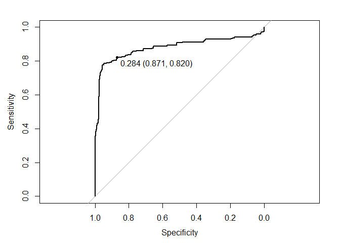<!-- -->

```
## 
## Call:
## roc.default(response = testing$class, predictor = plsProbs[,     "deceptive"], levels = c("trustworthy", "deceptive"))
## 
## Data: plsProbs[, "deceptive"] in 18407 controls (testing$class trustworthy) < 250 cases (testing$class deceptive).
## Area under the curve: 0.8789
## threshold  accuracy 
## 0.2843366 0.8699148
```

```r
plsFit.e <- runModel(data.e, "engineer", "pls", 1)
```

```
## Partial Least Squares 
## 
## 55973 samples
##    14 predictor
##     2 classes: 'deceptive', 'trustworthy' 
## 
## Pre-processing: centered (14), scaled (14) 
## Resampling: Cross-Validated (10 fold, repeated 3 times) 
## Summary of sample sizes: 50376, 50375, 50376, 50375, 50376, 50376, ... 
## Resampling results across tuning parameters:
## 
##   ncomp  ROC        Sens       Spec     
##    1     0.9823433  0.4031111  0.9999457
##    2     0.9832854  0.6280000  0.9998370
##    3     0.9844328  0.6395556  0.9998370
##    4     0.9914181  0.6360000  0.9998370
##    5     0.9917017  0.6355556  0.9998370
##    6     0.9919373  0.6355556  0.9998370
##    7     0.9920742  0.6351111  0.9998370
##    8     0.9921061  0.6355556  0.9998370
##    9     0.9916879  0.6373333  0.9998370
##   10     0.9914684  0.6386667  0.9998370
##   11     0.9924832  0.6355556  0.9998370
##   12     0.9929136  0.6382222  0.9998370
##   13     0.9931283  0.6382222  0.9998370
## 
## ROC was used to select the optimal model using  the largest value.
## The final value used for the model was ncomp = 13.
```

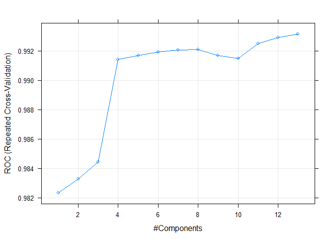<!-- -->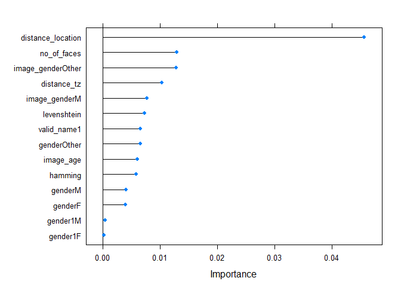<!-- -->

```
## [1] trustworthy trustworthy trustworthy trustworthy trustworthy trustworthy
## Levels: deceptive trustworthy
##    deceptive trustworthy
## 1  0.2664307   0.7335693
## 8  0.2820932   0.7179068
## 10 0.2774546   0.7225454
## 18 0.2709149   0.7290851
## 21 0.2817269   0.7182731
## 22 0.2665578   0.7334422
## Confusion Matrix and Statistics
## 
##              Reference
## Prediction    deceptive trustworthy
##   deceptive         171           1
##   trustworthy        79       18406
##                                           
##                Accuracy : 0.9957          
##                  95% CI : (0.9947, 0.9966)
##     No Information Rate : 0.9866          
##     P-Value [Acc > NIR] : < 2.2e-16       
##                                           
##                   Kappa : 0.8083          
##  Mcnemar's Test P-Value : < 2.2e-16       
##                                           
##             Sensitivity : 0.684000        
##             Specificity : 0.999946        
##          Pos Pred Value : 0.994186        
##          Neg Pred Value : 0.995726        
##              Prevalence : 0.013400        
##          Detection Rate : 0.009165        
##    Detection Prevalence : 0.009219        
##       Balanced Accuracy : 0.841973        
##                                           
##        'Positive' Class : deceptive       
##                                           
## 
## Call:
## roc.default(response = testing$class, predictor = plsProbs[,     "deceptive"], levels = c("trustworthy", "deceptive"))
## 
## Data: plsProbs[, "deceptive"] in 18407 controls (testing$class trustworthy) < 250 cases (testing$class deceptive).
## Area under the curve: 0.9945
```

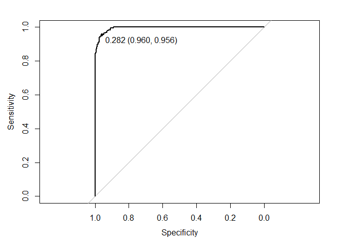<!-- -->

```
## 
## Call:
## roc.default(response = testing$class, predictor = plsProbs[,     "deceptive"], levels = c("trustworthy", "deceptive"))
## 
## Data: plsProbs[, "deceptive"] in 18407 controls (testing$class trustworthy) < 250 cases (testing$class deceptive).
## Area under the curve: 0.9945
## threshold  accuracy 
## 0.2824900 0.9596934
```

```r
resampling(list(opls = plsFit.o, epls = plsFit.e))
```

```
## 
## Call:
## summary.resamples(object = resamps)
## 
## Models: opls, epls 
## Number of resamples: 30 
## 
## ROC 
##        Min. 1st Qu. Median   Mean 3rd Qu.   Max. NA's
## opls 0.7447  0.8792 0.9018 0.8897  0.9104 0.9403    0
## epls 0.9875  0.9925 0.9931 0.9931  0.9945 0.9974    0
## 
## Sens 
##        Min. 1st Qu. Median   Mean 3rd Qu.   Max. NA's
## opls 0.0000     0.0 0.0000 0.0000    0.00 0.0000    0
## epls 0.5467     0.6 0.6333 0.6382    0.68 0.7467    0
## 
## Spec 
##        Min. 1st Qu. Median   Mean 3rd Qu. Max. NA's
## opls 1.0000  1.0000 1.0000 1.0000       1    1    0
## epls 0.9995  0.9997 0.9998 0.9998       1    1    0
```

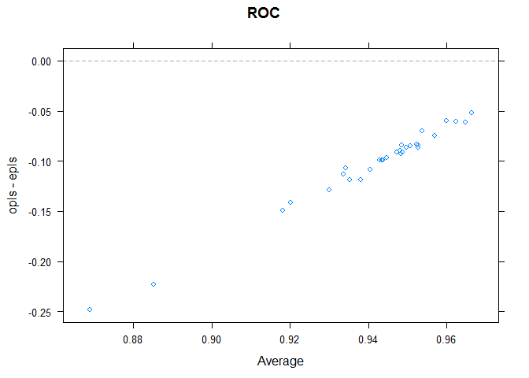<!-- -->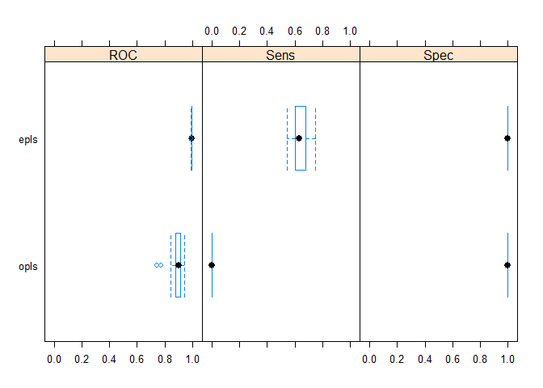<!-- -->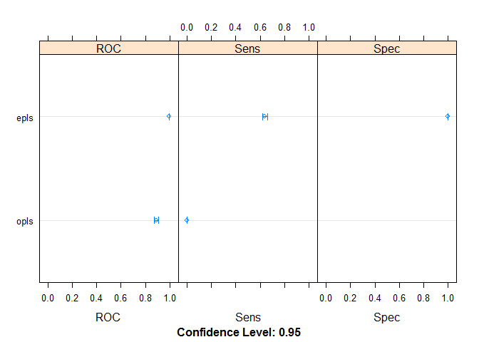<!-- -->

```
## 
## Call:
## summary.diff.resamples(object = diffs)
## 
## p-value adjustment: bonferroni 
## Upper diagonal: estimates of the difference
## Lower diagonal: p-value for H0: difference = 0
## 
## ROC 
##      opls      epls   
## opls           -0.1034
## epls 7.732e-14        
## 
## Sens 
##      opls      epls   
## opls           -0.6382
## epls < 2.2e-16        
## 
## Spec 
##      opls      epls    
## opls           0.000163
## epls 4.534e-05
```

```r
# svmFit.o <- runModel(data.o, 'original','svmRadial', 0) svmFit.e <-
# runModel(data.e, 'engineer','svmRadial', 0) resampling(list(osvm =
# svmFit.o, esvm = svmFit.e))
```
