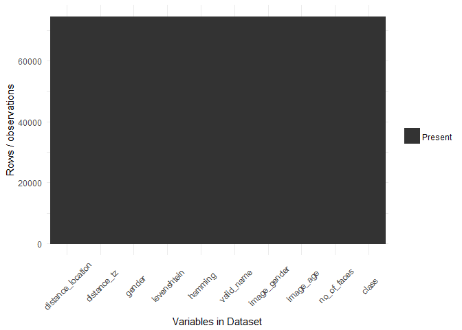

# Entropy


###Load data


```r
data.original <- dbGetQuery(con, "SELECT * from main.zz_full_set") 
data.full <- data.original
```

######################################
###  Cleanup and preprocessing
######################################


```r
data.full$sentiment[is.na(data.full$sentiment)] <- 'Other'
data.full$emotion[is.na(data.full$emotion)] <- 'Other'
data.full$distance_location[is.na(data.full$distance_location)] <- 0
data.full$distance_tz[is.na(data.full$distance_tz)] <- 0
data.full$continent[is.na(data.full$continent)] <- 'Other'
data.full$sub_region[is.na(data.full$sub_region)] <- 'Other'
data.full$gender[is.na(data.full$gender)] <- 'Other'
data.full$avg_tweet_time[is.na(data.full$avg_tweet_time)] <- 12
data.full$no_of_devices[is.na(data.full$no_of_devices)] <- 1
data.full$levenshtein[is.na(data.full$levenshtein)] <- 1
data.full$hamming[is.na(data.full$hamming)] <- 1
data.full$valid_name[is.na(data.full$valid_name)] <- 0
data.full$image_gender[is.na(data.full$image_gender)] <- 'Other'
data.full$image_age[is.na(data.full$image_age)] <- 20
data.full$no_of_faces[is.na(data.full$no_of_faces)] <- 20
#change last tweet time
data.full$last_tweet_time <- year(ymd_hms(data.full$last_tweet_time))
data.full$last_tweet_time[is.na(data.full$last_tweet_time)] <- 2000
#change location, language, timezone to only have top50 and other
d <- data.full %>% 
  group_by(continent) %>%
  summarise(n=n()) %>%
  arrange(desc(n))
l <- subset(data.full, !(continent %in% d$continent[1:50]))$continent
data.full$continent[data.full$continent %in% l] <- 'Other'
rm(d, l)
#remove decimals from numerics
data.full$image_age <- round(data.full$image_age)
data.full$avg_tweet_time <- round(data.full$avg_tweet_time)
#update name
data.full[data.full$valid_name != 0,]$valid_name <- 1
#first replace NA with other
data.full$timezone[is.na(data.full$timezone)] <- 'Other'
data.full$latitude[is.na(data.full$latitude)] <- 0
data.full$longitude[is.na(data.full$longitude)] <- 0
#change created to be year of creation
data.full$created <- year(ymd_hms(data.full$created))
data.full$created[is.na(data.full$created)] <- 2000
#change location, language, timezone to only have top50 and other
d <- data.full %>% 
  group_by(location) %>%
  summarise(n=n()) %>%
  arrange(desc(n))
l <- subset(data.full, !(location %in% d$location[1:50]))$location
data.full$location[data.full$location %in% l] <- 'Other'
rm(d, l)
d <- data.full %>% 
  group_by(timezone) %>%
  summarise(n=n()) %>%
  arrange(desc(n))
l <- subset(data.full, !(timezone %in% d$timezone[1:20]))$timezone
data.full$timezone[data.full$timezone %in% l] <- 'Other'
rm(d, l)
d <- data.full %>% 
  group_by(language) %>%
  summarise(n=n()) %>%
  arrange(desc(n))
l <- subset(data.full, !(language %in% d$language[1:20]))$language
data.full$language[data.full$language %in% l] <- 'Other'
rm(d, l)
#remove decimals from lat/lon
data.full$latitude <- round(data.full$latitude)
data.full$longitude <- round(data.full$longitude)
```

######################################
### Prepare Datasets with dummy vars
######################################


```r
myvars <- c("utc_offset",
            "geo_enabled", "latitude", "longitude",  
            "is_default_profile", "is_default_profile_image", "created", "class")
data.o <- prepareData(data.full[myvars])
```

```
##                           freqRatio percentUnique zeroVar  nzv
## latitude                 2543.75862   0.231810264   FALSE TRUE
## longitude                3513.42857   0.397963286   FALSE TRUE
## is_default_profile_image   32.18364   0.002679887   FALSE TRUE
## class                      73.63000   0.002679887   FALSE TRUE
```

<!-- -->

```
## [1] 0
```

```r
myvars <- c("distance_location","distance_tz",
            "gender","levenshtein","hamming","valid_name","image_gender","image_age",
            "no_of_faces", "class")
data.e <- prepareData(data.full[myvars])
```

```
##                     freqRatio percentUnique zeroVar  nzv
## distance_location 24563.00000   1.179150476   FALSE TRUE
## distance_tz         358.92737   5.093126089   FALSE TRUE
## image_age            32.26165   0.123274822   FALSE TRUE
## class                73.63000   0.002679887   FALSE TRUE
```

<!-- -->

```
## [1] 2
```

######################################
### Determine IG for original data
######################################


######################################
### Determine IG for engineered data
######################################


---
title: "Entropy.R"
author: "Estee"
date: "Wed Mar 01 21:25:52 2017"
---
