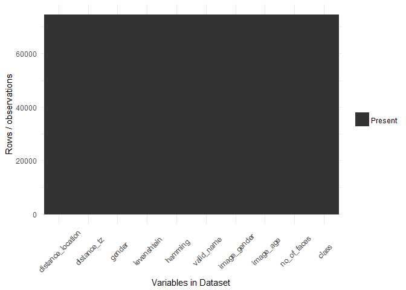
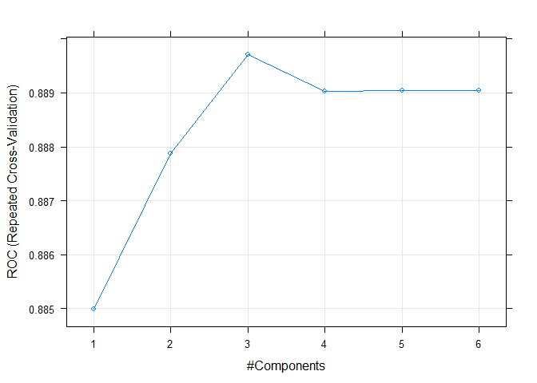
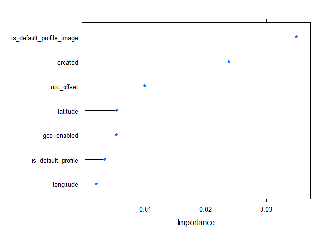
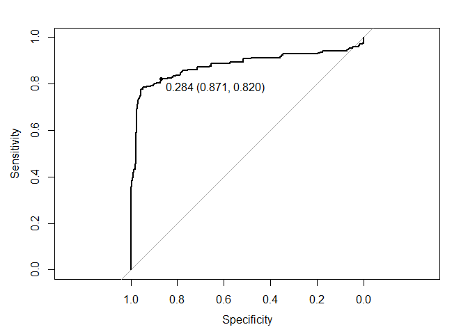
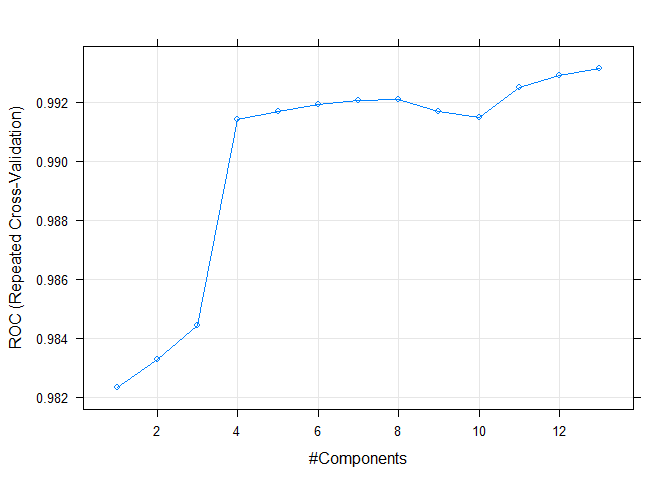
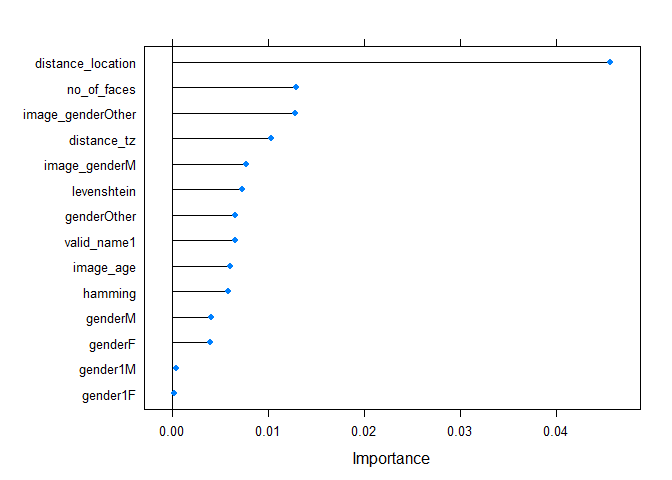
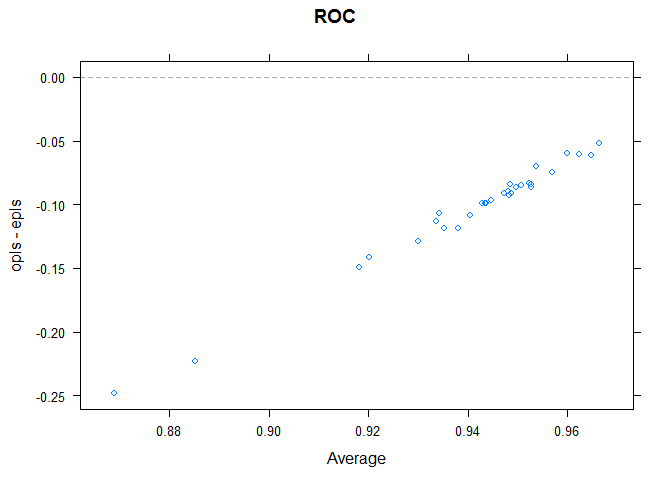
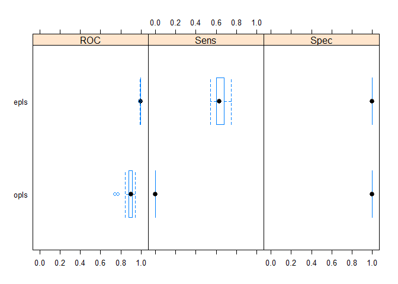

# ML - Linear regression


```
## Loading required package: DBI
```

```
## [1] TRUE
```


##Pre-processing
<!-- -->

```
##                           freqRatio percentUnique zeroVar  nzv
## latitude                 2543.75862   0.231810264   FALSE TRUE
## longitude                3513.42857   0.397963286   FALSE TRUE
## is_default_profile_image   32.18364   0.002679887   FALSE TRUE
## class                      73.63000   0.002679887   FALSE TRUE
```

<!-- -->

```
## [1] 0
```

```
##                     freqRatio percentUnique zeroVar  nzv
## distance_location 24563.00000   1.179150476   FALSE TRUE
## distance_tz         358.92737   5.093126089   FALSE TRUE
## image_age            32.26165   0.123274822   FALSE TRUE
## class                73.63000   0.002679887   FALSE TRUE
```

<!-- -->

```
## [1] 2
```

```
## Loading required package: pls
```

```
## 
## Attaching package: 'pls'
```

```
## The following object is masked from 'package:stats':
## 
##     loadings
```

```
## Partial Least Squares 
## 
## 55973 samples
##     7 predictor
##     2 classes: 'deceptive', 'trustworthy' 
## 
## Pre-processing: centered (7), scaled (7) 
## Resampling: Cross-Validated (10 fold, repeated 3 times) 
## Summary of sample sizes: 50376, 50375, 50376, 50375, 50376, 50376, ... 
## Resampling results across tuning parameters:
## 
##   ncomp  ROC        Sens  Spec
##   1      0.8849981  0     1   
##   2      0.8878794  0     1   
##   3      0.8897033  0     1   
##   4      0.8890273  0     1   
##   5      0.8890515  0     1   
##   6      0.8890512  0     1   
## 
## ROC was used to select the optimal model using  the largest value.
## The final value used for the model was ncomp = 3.
```

<!-- --><!-- -->

```
## [1] trustworthy trustworthy trustworthy trustworthy trustworthy trustworthy
## Levels: deceptive trustworthy
##    deceptive trustworthy
## 1  0.3588087   0.6411913
## 8  0.2651795   0.7348205
## 10 0.2695366   0.7304634
## 18 0.2651795   0.7348205
## 21 0.2810238   0.7189762
## 22 0.3691070   0.6308930
## Confusion Matrix and Statistics
## 
##              Reference
## Prediction    deceptive trustworthy
##   deceptive           0           0
##   trustworthy       250       18407
##                                           
##                Accuracy : 0.9866          
##                  95% CI : (0.9848, 0.9882)
##     No Information Rate : 0.9866          
##     P-Value [Acc > NIR] : 0.5168          
##                                           
##                   Kappa : 0               
##  Mcnemar's Test P-Value : <2e-16          
##                                           
##             Sensitivity : 0.0000          
##             Specificity : 1.0000          
##          Pos Pred Value :    NaN          
##          Neg Pred Value : 0.9866          
##              Prevalence : 0.0134          
##          Detection Rate : 0.0000          
##    Detection Prevalence : 0.0000          
##       Balanced Accuracy : 0.5000          
##                                           
##        'Positive' Class : deceptive       
##                                           
## 
## Call:
## roc.default(response = testing$class, predictor = plsProbs[,     "deceptive"], levels = c("trustworthy", "deceptive"))
## 
## Data: plsProbs[, "deceptive"] in 18407 controls (testing$class trustworthy) < 250 cases (testing$class deceptive).
## Area under the curve: 0.8789
```

<!-- -->

```
## 
## Call:
## roc.default(response = testing$class, predictor = plsProbs[,     "deceptive"], levels = c("trustworthy", "deceptive"))
## 
## Data: plsProbs[, "deceptive"] in 18407 controls (testing$class trustworthy) < 250 cases (testing$class deceptive).
## Area under the curve: 0.8789
## threshold  accuracy 
## 0.2843366 0.8699148
```

```
## Partial Least Squares 
## 
## 55973 samples
##    14 predictor
##     2 classes: 'deceptive', 'trustworthy' 
## 
## Pre-processing: centered (14), scaled (14) 
## Resampling: Cross-Validated (10 fold, repeated 3 times) 
## Summary of sample sizes: 50376, 50375, 50376, 50375, 50376, 50376, ... 
## Resampling results across tuning parameters:
## 
##   ncomp  ROC        Sens       Spec     
##    1     0.9823433  0.4031111  0.9999457
##    2     0.9832854  0.6280000  0.9998370
##    3     0.9844328  0.6395556  0.9998370
##    4     0.9914181  0.6360000  0.9998370
##    5     0.9917017  0.6355556  0.9998370
##    6     0.9919373  0.6355556  0.9998370
##    7     0.9920742  0.6351111  0.9998370
##    8     0.9921061  0.6355556  0.9998370
##    9     0.9916879  0.6373333  0.9998370
##   10     0.9914684  0.6386667  0.9998370
##   11     0.9924832  0.6355556  0.9998370
##   12     0.9929136  0.6382222  0.9998370
##   13     0.9931283  0.6382222  0.9998370
## 
## ROC was used to select the optimal model using  the largest value.
## The final value used for the model was ncomp = 13.
```

<!-- --><!-- -->

```
## [1] trustworthy trustworthy trustworthy trustworthy trustworthy trustworthy
## Levels: deceptive trustworthy
##    deceptive trustworthy
## 1  0.2664307   0.7335693
## 8  0.2820932   0.7179068
## 10 0.2774546   0.7225454
## 18 0.2709149   0.7290851
## 21 0.2817269   0.7182731
## 22 0.2665578   0.7334422
## Confusion Matrix and Statistics
## 
##              Reference
## Prediction    deceptive trustworthy
##   deceptive         171           1
##   trustworthy        79       18406
##                                           
##                Accuracy : 0.9957          
##                  95% CI : (0.9947, 0.9966)
##     No Information Rate : 0.9866          
##     P-Value [Acc > NIR] : < 2.2e-16       
##                                           
##                   Kappa : 0.8083          
##  Mcnemar's Test P-Value : < 2.2e-16       
##                                           
##             Sensitivity : 0.684000        
##             Specificity : 0.999946        
##          Pos Pred Value : 0.994186        
##          Neg Pred Value : 0.995726        
##              Prevalence : 0.013400        
##          Detection Rate : 0.009165        
##    Detection Prevalence : 0.009219        
##       Balanced Accuracy : 0.841973        
##                                           
##        'Positive' Class : deceptive       
##                                           
## 
## Call:
## roc.default(response = testing$class, predictor = plsProbs[,     "deceptive"], levels = c("trustworthy", "deceptive"))
## 
## Data: plsProbs[, "deceptive"] in 18407 controls (testing$class trustworthy) < 250 cases (testing$class deceptive).
## Area under the curve: 0.9945
```

<!-- -->

```
## 
## Call:
## roc.default(response = testing$class, predictor = plsProbs[,     "deceptive"], levels = c("trustworthy", "deceptive"))
## 
## Data: plsProbs[, "deceptive"] in 18407 controls (testing$class trustworthy) < 250 cases (testing$class deceptive).
## Area under the curve: 0.9945
## threshold  accuracy 
## 0.2824900 0.9596934
```

```
## 
## Call:
## summary.resamples(object = resamps)
## 
## Models: opls, epls 
## Number of resamples: 30 
## 
## ROC 
##        Min. 1st Qu. Median   Mean 3rd Qu.   Max. NA's
## opls 0.7447  0.8792 0.9018 0.8897  0.9104 0.9403    0
## epls 0.9875  0.9925 0.9931 0.9931  0.9945 0.9974    0
## 
## Sens 
##        Min. 1st Qu. Median   Mean 3rd Qu.   Max. NA's
## opls 0.0000     0.0 0.0000 0.0000    0.00 0.0000    0
## epls 0.5467     0.6 0.6333 0.6382    0.68 0.7467    0
## 
## Spec 
##        Min. 1st Qu. Median   Mean 3rd Qu. Max. NA's
## opls 1.0000  1.0000 1.0000 1.0000       1    1    0
## epls 0.9995  0.9997 0.9998 0.9998       1    1    0
```

<!-- --><!-- --><!-- -->

```
## 
## Call:
## summary.diff.resamples(object = diffs)
## 
## p-value adjustment: bonferroni 
## Upper diagonal: estimates of the difference
## Lower diagonal: p-value for H0: difference = 0
## 
## ROC 
##      opls      epls   
## opls           -0.1034
## epls 7.732e-14        
## 
## Sens 
##      opls      epls   
## opls           -0.6382
## epls < 2.2e-16        
## 
## Spec 
##      opls      epls    
## opls           0.000163
## epls 4.534e-05
```
