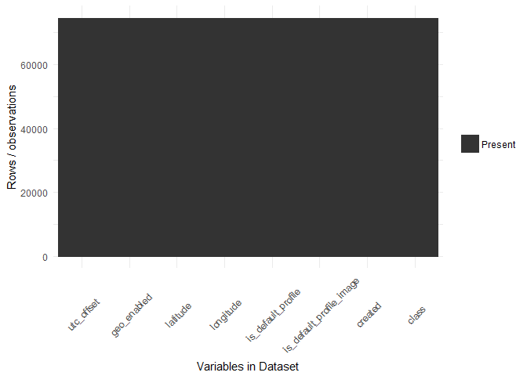

# Using Linear Regression - lm


###Load data


```r
data.original <- dbGetQuery(con, "SELECT * from main.zz_full_set") 
data.full <- data.original
```

###Plot missing data


```r
p <- ggplot_missing(data.full)
print(p)
```

<!-- -->

######################################
###  Cleanup and preprocessing
######################################


```r
data.full$sentiment[is.na(data.full$sentiment)] <- 'Other'
data.full$emotion[is.na(data.full$emotion)] <- 'Other'
data.full$distance_location[is.na(data.full$distance_location)] <- 0
data.full$distance_tz[is.na(data.full$distance_tz)] <- 0
data.full$continent[is.na(data.full$continent)] <- 'Other'
data.full$sub_region[is.na(data.full$sub_region)] <- 'Other'
data.full$gender[is.na(data.full$gender)] <- 'Other'
data.full$avg_tweet_time[is.na(data.full$avg_tweet_time)] <- 12
data.full$no_of_devices[is.na(data.full$no_of_devices)] <- 1
data.full$levenshtein[is.na(data.full$levenshtein)] <- 1
data.full$hamming[is.na(data.full$hamming)] <- 1
data.full$valid_name[is.na(data.full$valid_name)] <- 0
data.full$image_gender[is.na(data.full$image_gender)] <- 'Other'
data.full$image_age[is.na(data.full$image_age)] <- 20
data.full$no_of_faces[is.na(data.full$no_of_faces)] <- 20
#change last tweet time
data.full$last_tweet_time <- year(ymd_hms(data.full$last_tweet_time))
data.full$last_tweet_time[is.na(data.full$last_tweet_time)] <- 2000
#change location, language, timezone to only have top50 and other
d <- data.full %>% 
  group_by(continent) %>%
  summarise(n=n()) %>%
  arrange(desc(n))
l <- subset(data.full, !(continent %in% d$continent[1:50]))$continent
data.full$continent[data.full$continent %in% l] <- 'Other'
rm(d, l)
#remove decimals from numerics
data.full$image_age <- round(data.full$image_age)
data.full$avg_tweet_time <- round(data.full$avg_tweet_time)
#update name
data.full[data.full$valid_name != 0,]$valid_name <- 1
#first replace NA with other
data.full$timezone[is.na(data.full$timezone)] <- 'Other'
data.full$latitude[is.na(data.full$latitude)] <- 0
data.full$longitude[is.na(data.full$longitude)] <- 0
#change created to be year of creation
data.full$created <- year(ymd_hms(data.full$created))
data.full$created[is.na(data.full$created)] <- 2000
#change location, language, timezone to only have top50 and other
d <- data.full %>% 
  group_by(location) %>%
  summarise(n=n()) %>%
  arrange(desc(n))
l <- subset(data.full, !(location %in% d$location[1:50]))$location
data.full$location[data.full$location %in% l] <- 'Other'
rm(d, l)
d <- data.full %>% 
  group_by(timezone) %>%
  summarise(n=n()) %>%
  arrange(desc(n))
l <- subset(data.full, !(timezone %in% d$timezone[1:20]))$timezone
data.full$timezone[data.full$timezone %in% l] <- 'Other'
rm(d, l)
d <- data.full %>% 
  group_by(language) %>%
  summarise(n=n()) %>%
  arrange(desc(n))
l <- subset(data.full, !(language %in% d$language[1:20]))$language
data.full$language[data.full$language %in% l] <- 'Other'
rm(d, l)
#remove decimals from lat/lon
data.full$latitude <- round(data.full$latitude)
data.full$longitude <- round(data.full$longitude)
```

######################################
### Prepare Datasets with dummy vars
######################################


```r
myvars <- c("utc_offset",
            "geo_enabled", "latitude", "longitude",  
            "is_default_profile", "is_default_profile_image", "created", "class")
data.o <- prepareData(data.full[myvars])
```

```
##                           freqRatio percentUnique zeroVar  nzv
## latitude                 2543.75862   0.231810264   FALSE TRUE
## longitude                3513.42857   0.397963286   FALSE TRUE
## is_default_profile_image   32.18364   0.002679887   FALSE TRUE
## class                      73.63000   0.002679887   FALSE TRUE
```

<!-- -->

```
## [1] 0
```

```r
myvars <- c("distance_location","distance_tz",
            "gender","levenshtein","hamming","valid_name","image_gender","image_age",
            "no_of_faces", "class")
data.e <- prepareData(data.full[myvars])
```

```
##                     freqRatio percentUnique zeroVar  nzv
## distance_location 24563.00000   1.179150476   FALSE TRUE
## distance_tz         358.92737   5.093126089   FALSE TRUE
## image_age            32.26165   0.123274822   FALSE TRUE
## class                73.63000   0.002679887   FALSE TRUE
```

<!-- -->

```
## [1] 2
```

######################################
### Run model and print results
######################################


```r
plsFit.o <- runModel(data.o, "original","rf", 10, 0)
```

```
## [1] "Create partition"
## [1] "Run model"
```

```
## Loading required package: randomForest
```

```
## randomForest 4.6-12
```

```
## Type rfNews() to see new features/changes/bug fixes.
```

```
## 
## Attaching package: 'randomForest'
```

```
## The following object is masked from 'package:dplyr':
## 
##     combine
```

```
## The following object is masked from 'package:ggplot2':
## 
##     margin
```

```
## note: only 6 unique complexity parameters in default grid. Truncating the grid to 6 .
## 
## [1] "Show model results"
## Random Forest 
## 
## 55973 samples
##     7 predictor
##     2 classes: 'deceptive', 'trustworthy' 
## 
## Pre-processing: centered (7), scaled (7) 
## Resampling: Cross-Validated (10 fold, repeated 3 times) 
## Summary of sample sizes: 50376, 50375, 50376, 50375, 50376, 50376, ... 
## Resampling results across tuning parameters:
## 
##   mtry  ROC        Sens       Spec     
##   2     0.9400842  0.7386667  0.9990523
##   3     0.9434732  0.7528889  0.9989376
##   4     0.9440901  0.7533333  0.9988773
##   5     0.9453728  0.7475556  0.9987203
##   6     0.9442133  0.7435556  0.9986901
##   7     0.9448724  0.7422222  0.9986539
## 
## ROC was used to select the optimal model using  the largest value.
## The final value used for the model was mtry = 5.
```

<!-- -->

```
## [1] "Show variable importance"
## rf variable importance
## 
##                          Overall
## created                   499.01
## latitude                  299.28
## utc_offset                228.77
## longitude                 124.83
## is_default_profile_image   62.53
## is_default_profile         29.02
## geo_enabled                17.69
```

<!-- -->

```
## [1] "Predict new values - evaluate model"
## [1] trustworthy trustworthy trustworthy trustworthy trustworthy trustworthy
## Levels: deceptive trustworthy
##    deceptive trustworthy
## 1          0           1
## 8          0           1
## 10         0           1
## 18         0           1
## 21         0           1
## 22         0           1
## [1] "Show evaluation results"
## Confusion Matrix and Statistics
## 
##              Reference
## Prediction    deceptive trustworthy
##   deceptive         197          25
##   trustworthy        53       18382
##                                           
##                Accuracy : 0.9958          
##                  95% CI : (0.9948, 0.9967)
##     No Information Rate : 0.9866          
##     P-Value [Acc > NIR] : < 2.2e-16       
##                                           
##                   Kappa : 0.8326          
##  Mcnemar's Test P-Value : 0.002235        
##                                           
##             Sensitivity : 0.78800         
##             Specificity : 0.99864         
##          Pos Pred Value : 0.88739         
##          Neg Pred Value : 0.99713         
##              Prevalence : 0.01340         
##          Detection Rate : 0.01056         
##    Detection Prevalence : 0.01190         
##       Balanced Accuracy : 0.89332         
##                                           
##        'Positive' Class : deceptive       
##                                           
## 
## Call:
## roc.default(response = testing$class, predictor = mProbs[, "deceptive"],     levels = c("trustworthy", "deceptive"))
## 
## Data: mProbs[, "deceptive"] in 18407 controls (testing$class trustworthy) < 250 cases (testing$class deceptive).
## Area under the curve: 0.9425
```

<!-- -->

```
## 
## Call:
## roc.default(response = testing$class, predictor = mProbs[, "deceptive"],     levels = c("trustworthy", "deceptive"))
## 
## Data: mProbs[, "deceptive"] in 18407 controls (testing$class trustworthy) < 250 cases (testing$class deceptive).
## Area under the curve: 0.9425
## threshold  accuracy 
## 0.0010000 0.9842954
```

```r
plsFit.e <- runModel(data.e, "engineer","rf", 10, 0)
```

```
## [1] "Create partition"
## [1] "Run model"
## [1] "Show model results"
## Random Forest 
## 
## 55973 samples
##    14 predictor
##     2 classes: 'deceptive', 'trustworthy' 
## 
## Pre-processing: centered (14), scaled (14) 
## Resampling: Cross-Validated (10 fold, repeated 3 times) 
## Summary of sample sizes: 50376, 50375, 50376, 50375, 50376, 50376, ... 
## Resampling results across tuning parameters:
## 
##   mtry  ROC        Sens       Spec     
##    2    0.9998089  0.7813333  1.0000000
##    3    0.9998732  0.7928889  0.9999577
##    4    0.9999015  0.9164444  0.9997525
##    6    0.9996882  0.9426667  0.9994930
##    7    0.9999106  0.9493333  0.9994085
##    8    0.9994637  0.9586667  0.9993119
##   10    0.9992250  0.9671111  0.9992938
##   11    0.9992263  0.9684444  0.9992455
##   12    0.9985491  0.9693333  0.9992394
##   14    0.9985500  0.9684444  0.9992093
## 
## ROC was used to select the optimal model using  the largest value.
## The final value used for the model was mtry = 7.
```

<!-- -->

```
## [1] "Show variable importance"
## rf variable importance
## 
##                    Overall
## distance_location 879.8446
## image_age         184.3031
## distance_tz       138.1405
## levenshtein        54.9097
## no_of_faces        35.1293
## image_genderM      31.9373
## genderF            28.2080
## hamming            26.4938
## image_genderOther  12.8838
## genderM             9.6975
## genderOther         5.7930
## valid_name1         5.5228
## gender1M            0.5028
## gender1F            0.3692
```

<!-- -->

```
## [1] "Predict new values - evaluate model"
## [1] trustworthy trustworthy trustworthy trustworthy trustworthy trustworthy
## Levels: deceptive trustworthy
##    deceptive trustworthy
## 1          0           1
## 8          0           1
## 10         0           1
## 18         0           1
## 21         0           1
## 22         0           1
## [1] "Show evaluation results"
## Confusion Matrix and Statistics
## 
##              Reference
## Prediction    deceptive trustworthy
##   deceptive         239           5
##   trustworthy        11       18402
##                                           
##                Accuracy : 0.9991          
##                  95% CI : (0.9986, 0.9995)
##     No Information Rate : 0.9866          
##     P-Value [Acc > NIR] : <2e-16          
##                                           
##                   Kappa : 0.9672          
##  Mcnemar's Test P-Value : 0.2113          
##                                           
##             Sensitivity : 0.95600         
##             Specificity : 0.99973         
##          Pos Pred Value : 0.97951         
##          Neg Pred Value : 0.99940         
##              Prevalence : 0.01340         
##          Detection Rate : 0.01281         
##    Detection Prevalence : 0.01308         
##       Balanced Accuracy : 0.97786         
##                                           
##        'Positive' Class : deceptive       
##                                           
## 
## Call:
## roc.default(response = testing$class, predictor = mProbs[, "deceptive"],     levels = c("trustworthy", "deceptive"))
## 
## Data: mProbs[, "deceptive"] in 18407 controls (testing$class trustworthy) < 250 cases (testing$class deceptive).
## Area under the curve: 0.9999
```

<!-- -->

```
## 
## Call:
## roc.default(response = testing$class, predictor = mProbs[, "deceptive"],     levels = c("trustworthy", "deceptive"))
## 
## Data: mProbs[, "deceptive"] in 18407 controls (testing$class trustworthy) < 250 cases (testing$class deceptive).
## Area under the curve: 0.9999
## threshold  accuracy 
## 0.0310000 0.9974272
```

######################################
### Compare models
######################################


```r
resampling(list(opls = plsFit.o, epls = plsFit.e))
```

```
## 
## Call:
## summary.resamples(object = resamps)
## 
## Models: opls, epls 
## Number of resamples: 30 
## 
## ROC 
##        Min. 1st Qu. Median   Mean 3rd Qu.  Max. NA's
## opls 0.9119  0.9319 0.9452 0.9454  0.9568 0.979    0
## epls 0.9998  0.9999 0.9999 0.9999  0.9999 1.000    0
## 
## Sens 
##        Min. 1st Qu. Median   Mean 3rd Qu.   Max. NA's
## opls 0.6533  0.7100 0.7467 0.7476  0.7833 0.8667    0
## epls 0.8800  0.9333 0.9533 0.9493  0.9733 1.0000    0
## 
## Spec 
##        Min. 1st Qu. Median   Mean 3rd Qu.   Max. NA's
## opls 0.9975  0.9982 0.9988 0.9987  0.9992 0.9995    0
## epls 0.9984  0.9993 0.9995 0.9994  0.9998 1.0000    0
```

<!-- --><!-- --><!-- -->

```
## 
## Call:
## summary.diff.resamples(object = diffs)
## 
## p-value adjustment: bonferroni 
## Upper diagonal: estimates of the difference
## Lower diagonal: p-value for H0: difference = 0
## 
## ROC 
##      opls      epls    
## opls           -0.05454
## epls < 2.2e-16         
## 
## Sens 
##      opls      epls   
## opls           -0.2018
## epls < 2.2e-16        
## 
## Spec 
##      opls      epls      
## opls           -0.0006881
## epls 9.903e-06
```

```r
#svmFit.o <- runModel(data.o, "original","svmRadial", 0)
#svmFit.e <- runModel(data.e, "engineer","svmRadial", 0)
#resampling(list(osvm = svmFit.o, esvm = svmFit.e))
```


---
title: "ML_lm.R"
author: "Estee"
date: "Fri Mar 03 15:09:16 2017"
---
