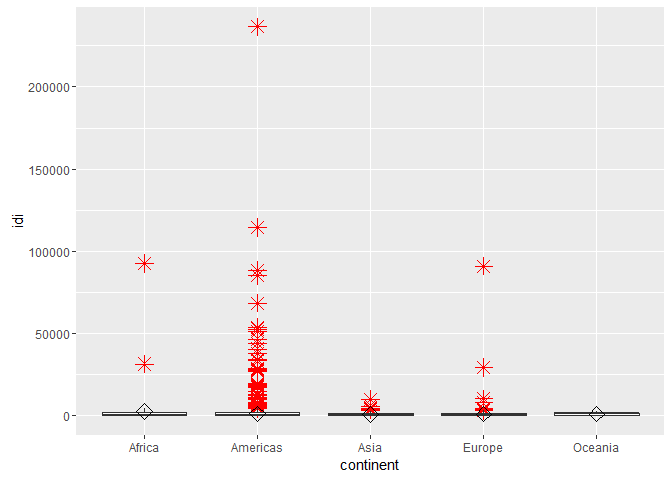

# Attribute analysis - Combined


## Connect to the database first


```
## Loading required package: DBI
```

```
## [1] TRUE
```

##Score the data

###first create a score

```r
factor_no <- 0
exp_no <- 1
period_no <- 1

sql <- paste("DELETE FROM main.experiment_user_score where factor_no = 0", sep = "")
dbSendQuery(con, sql)
```

```
## <PostgreSQLResult>
```

```r
sql <- paste("INSERT INTO main.experiment_user_score(experiment_no, period_no, userid, factor_no, idi_full)", 
    sep = "")
sql <- paste(sql, "select u1.experiment_no, u1.period_no, u1.userid, 0,", sep = "")
sql <- paste(sql, "(coalesce(u1.idi_full,0)+coalesce(u2.idi_full,0)+coalesce(u3.idi_full,0)+coalesce(u4.idi_full,0)+coalesce(u5.idi_full,0)+coalesce(u6.idi_full,0))/6 as idi_full", 
    sep = "")
sql <- paste(sql, " from main.experiment_user_score u1", sep = "")
sql <- paste(sql, " left join main.experiment_user_score u2 on u1.userid = u2.userid and u2.factor_no=2", 
    sep = "")
sql <- paste(sql, " left join main.experiment_user_score u3 on u1.userid = u3.userid and u3.factor_no=3", 
    sep = "")
sql <- paste(sql, " left join main.experiment_user_score u4 on u1.userid = u4.userid and u4.factor_no=4", 
    sep = "")
sql <- paste(sql, " left join main.experiment_user_score u5 on u1.userid = u5.userid and u5.factor_no=5", 
    sep = "")
sql <- paste(sql, " left join main.experiment_user_score u6 on u1.userid = u6.userid and u6.factor_no=6", 
    sep = "")
sql <- paste(sql, " where u1.factor_no=1", sep = "")
dbSendQuery(con, sql)
```

```
## <PostgreSQLResult>
```

###show results
No scaling required


```r
user.score <- dbGetQuery(con, "SELECT s.userid, s.idi_full, tz.continent from main.experiment_user_score s join main.experiment_user u on u.userid = s.userid left join main.timezone_r tz on tz.timezone = u.timezone where s.factor_no = 0 and s.experiment_no = u.experiment_no and s.period_no = u.period_no")

colnames(user.score) = c("userid", "idi", "continent")

ggplot(user.score, aes(x = continent, y = idi)) + geom_boxplot(outlier.colour = "red", 
    outlier.shape = 8, outlier.size = 4) + stat_summary(fun.y = mean, geom = "point", 
    shape = 23, size = 4)
```

<!-- -->

##Outlier detection
Use Tukey's method to update all scores that were outliers


```r
markoutlier <- function(x, exp_no, period_no, factor_no) {
    sql <- paste("update main.experiment_user_score set outlier_full=1", sep = "")
    sql <- paste(sql, " where userid='", x["userid"], "'", sep = "")
    sql <- paste(sql, " and experiment_no=", exp_no, sep = "")
    sql <- paste(sql, " and period_no=", period_no, sep = "")
    sql <- paste(sql, " and factor_no=", factor_no, sep = "")
    dbSendQuery(con, sql)
}

# TODO outliers per continent
continents <- unique(user.score$continent)

user.continent_score <- user.score
outlier <- boxplot.stats(user.continent_score$idi, coef = 1.5)$out
user.outlier <- user.continent_score[user.continent_score$idi %in% outlier, 
    ]
apply(user.outlier, 1, markoutlier, exp_no = exp_no, period_no = period_no, 
    factor_no = factor_no)
# na1 <- nrow(user.outlier) Outliers identified: na1 Propotion (%) of
# outliers: round(na1 / sum(!is.na(user.continent_score$idi))*100, 1)
```

Total outliers: 1239 out of 6846


