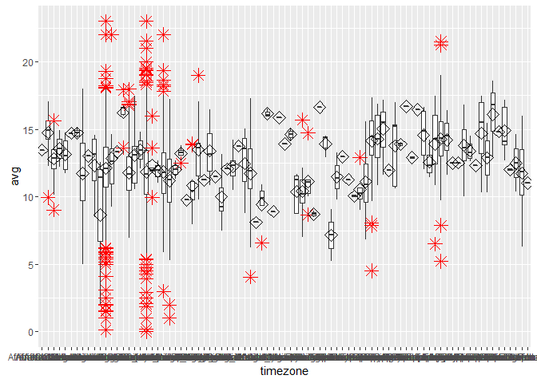
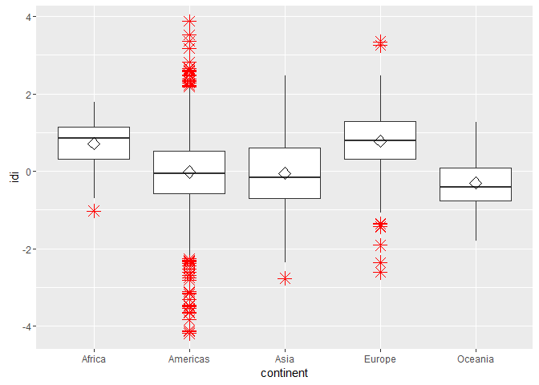

# Attribute analysis - TZ vs Avg Tweet Time


## Connect to the database first


```r
library(RPostgreSQL)
```

```
## Loading required package: DBI
```

```r
# create a connection save the password that we can 'hide' it as best as we
# can by collapsing it
pw <- {
    ""
}

# loads the PostgreSQL driver
drv <- dbDriver("PostgreSQL")
# creates a connection to the postgres database note that 'con' will be used
# later in each connection to the database
con <- dbConnect(drv, dbname = "twitter", host = "localhost", port = 5432, user = "postgres", 
    password = "")
# user = postgres for UBUNTU

rm(pw)  # removes the password

# Connection success:
dbExistsTable(con, c("main", "experiment_tweets_shortest"))
```

```
## [1] TRUE
```

##Get the tweets


##Display avg tweet hour per timezone

```r
df <- data.frame(users$avg, users$timezone)
user.data <- df[complete.cases(df), ]
colnames(user.data) = c("avg", "timezone")
ggplot(user.data, aes(x = timezone, y = avg)) + geom_boxplot(outlier.colour = "red", 
    outlier.shape = 8, outlier.size = 4) + stat_summary(fun.y = mean, geom = "point", 
    shape = 23, size = 4)
```

<!-- -->

```r
# geom_dotplot(binaxis='y', stackdir='center', dotsize=1)
# geom_jitter(shape=16, position=position_jitter(0.2))
```

##Display avg tweet hour per continent

```r
df <- data.frame(users$avg, users$continent)
user.data <- df[complete.cases(df), ]
colnames(user.data) = c("avg", "continent")
ggplot(user.data, aes(x = continent, y = avg)) + geom_boxplot(outlier.colour = "red", 
    outlier.shape = 8, outlier.size = 4) + stat_summary(fun.y = mean, geom = "point", 
    shape = 23, size = 4)
```

<!-- -->

```r
# geom_dotplot(binaxis='y', stackdir='center', dotsize=1)
# geom_jitter(shape=16, position=position_jitter(0.2))
```

##first create a score

```r
factor_no <- 4
exp_no <- 1
period_no <- 1

sql <- paste("DELETE FROM main.experiment_user_score where factor_no = 4", sep = "")
dbSendQuery(con, sql)
```

```
## <PostgreSQLResult>
```

```r
sql <- paste("INSERT INTO main.experiment_user_score(experiment_no, period_no, userid, factor_no, idi_full)", 
    sep = "")
sql <- paste(sql, "select experiment_no, period_no, userid, 4,", sep = "")
sql <- paste(sql, "avg_tweet_hour", sep = "")
sql <- paste(sql, " from main.experiment_user", sep = "")
dbSendQuery(con, sql)
```

```
## <PostgreSQLResult>
```

##normalise the score and show results
The standard formula to normalize data =(value-min)/(max-min) 
R has a built in function to do this

```r
user.score <- dbGetQuery(con, "SELECT s.idi_full, tz.continent from main.experiment_user_score s join main.experiment_user u on u.userid = s.userid left join main.timezone_r tz on tz.timezone = u.timezone where s.factor_no = 4 and s.experiment_no = u.experiment_no and s.period_no = u.period_no")

user.scaled_score <- data.frame(as.data.frame(scale(user.score[1])), user.score[2])
colnames(user.scaled_score) = c("idi", "continent")

ggplot(user.scaled_score, aes(x = continent, y = idi)) + geom_boxplot(outlier.colour = "red", 
    outlier.shape = 8, outlier.size = 4) + stat_summary(fun.y = mean, geom = "point", 
    shape = 23, size = 4)
```

<!-- -->

##Outlier detection
Use Tukey's method to update all scores that were outliers


```r
markoutlier <- function(x, exp_no, period_no, factor_no) {
    sql <- paste("update main.experiment_user_score set outlier_full=1", sep = "")
    sql <- paste(sql, " where userid='", x["userid"], "'", sep = "")
    sql <- paste(sql, " and experiment_no=", exp_no, sep = "")
    sql <- paste(sql, " and period_no=", period_no, sep = "")
    sql <- paste(sql, " and factor_no=", factor_no, sep = "")
    dbSendQuery(con, sql, echo = FALSE)
}

# TODO outliers per continent
continents <- unique(user.scaled_score$continent)

user.continent_score <- user.scaled_score
outlier <- boxplot.stats(user.continent_score$idi, coef = 1.5)$out
user.outlier <- user.continent_score[user.continent_score$idi %in% outlier, 
    ]
apply(user.outlier, 1, markoutlier, exp_no = exp_no, period_no = period_no, 
    factor_no = factor_no)
```

```
## $`341`
## <PostgreSQLResult>
## 
## $`399`
## <PostgreSQLResult>
## 
## $`444`
## <PostgreSQLResult>
## 
## $`445`
## <PostgreSQLResult>
## 
## $`486`
## <PostgreSQLResult>
## 
## $`571`
## <PostgreSQLResult>
## 
## $`633`
## <PostgreSQLResult>
## 
## $`736`
## <PostgreSQLResult>
## 
## $`781`
## <PostgreSQLResult>
## 
## $`798`
## <PostgreSQLResult>
## 
## $`864`
## <PostgreSQLResult>
## 
## $`881`
## <PostgreSQLResult>
## 
## $`976`
## <PostgreSQLResult>
## 
## $`997`
## <PostgreSQLResult>
## 
## $`1084`
## <PostgreSQLResult>
## 
## $`1089`
## <PostgreSQLResult>
## 
## $`1186`
## <PostgreSQLResult>
## 
## $`1190`
## <PostgreSQLResult>
## 
## $`1226`
## <PostgreSQLResult>
## 
## $`1272`
## <PostgreSQLResult>
## 
## $`1304`
## <PostgreSQLResult>
## 
## $`1306`
## <PostgreSQLResult>
## 
## $`1307`
## <PostgreSQLResult>
## 
## $`1309`
## <PostgreSQLResult>
## 
## $`1334`
## <PostgreSQLResult>
## 
## $`1365`
## <PostgreSQLResult>
## 
## $`1384`
## <PostgreSQLResult>
## 
## $`1413`
## <PostgreSQLResult>
## 
## $`1448`
## <PostgreSQLResult>
## 
## $`1469`
## <PostgreSQLResult>
## 
## $`1471`
## <PostgreSQLResult>
## 
## $`1472`
## <PostgreSQLResult>
## 
## $`1473`
## <PostgreSQLResult>
## 
## $`1477`
## <PostgreSQLResult>
## 
## $`1488`
## <PostgreSQLResult>
## 
## $`1490`
## <PostgreSQLResult>
## 
## $`1498`
## <PostgreSQLResult>
## 
## $`1499`
## <PostgreSQLResult>
## 
## $`1530`
## <PostgreSQLResult>
## 
## $`1540`
## <PostgreSQLResult>
## 
## $`1554`
## <PostgreSQLResult>
## 
## $`1558`
## <PostgreSQLResult>
## 
## $`1563`
## <PostgreSQLResult>
## 
## $`1571`
## <PostgreSQLResult>
## 
## $`1585`
## <PostgreSQLResult>
## 
## $`1595`
## <PostgreSQLResult>
## 
## $`1613`
## <PostgreSQLResult>
## 
## $`1641`
## <PostgreSQLResult>
## 
## $`1643`
## <PostgreSQLResult>
## 
## $`1645`
## <PostgreSQLResult>
## 
## $`1655`
## <PostgreSQLResult>
## 
## $`1664`
## <PostgreSQLResult>
## 
## $`1670`
## <PostgreSQLResult>
## 
## $`1674`
## <PostgreSQLResult>
## 
## $`1737`
## <PostgreSQLResult>
## 
## $`1761`
## <PostgreSQLResult>
## 
## $`1764`
## <PostgreSQLResult>
## 
## $`1770`
## <PostgreSQLResult>
## 
## $`1771`
## <PostgreSQLResult>
## 
## $`1800`
## <PostgreSQLResult>
## 
## $`1807`
## <PostgreSQLResult>
## 
## $`1938`
## <PostgreSQLResult>
## 
## $`1988`
## <PostgreSQLResult>
## 
## $`2001`
## <PostgreSQLResult>
## 
## $`2010`
## <PostgreSQLResult>
## 
## $`2047`
## <PostgreSQLResult>
## 
## $`2079`
## <PostgreSQLResult>
## 
## $`2232`
## <PostgreSQLResult>
## 
## $`2310`
## <PostgreSQLResult>
## 
## $`2351`
## <PostgreSQLResult>
## 
## $`2500`
## <PostgreSQLResult>
## 
## $`2503`
## <PostgreSQLResult>
## 
## $`2526`
## <PostgreSQLResult>
## 
## $`2590`
## <PostgreSQLResult>
## 
## $`2709`
## <PostgreSQLResult>
## 
## $`2740`
## <PostgreSQLResult>
## 
## $`2792`
## <PostgreSQLResult>
## 
## $`2812`
## <PostgreSQLResult>
## 
## $`2860`
## <PostgreSQLResult>
## 
## $`2902`
## <PostgreSQLResult>
## 
## $`3004`
## <PostgreSQLResult>
## 
## $`3027`
## <PostgreSQLResult>
## 
## $`3102`
## <PostgreSQLResult>
## 
## $`3227`
## <PostgreSQLResult>
## 
## $`3278`
## <PostgreSQLResult>
## 
## $`3326`
## <PostgreSQLResult>
## 
## $`3327`
## <PostgreSQLResult>
## 
## $`3357`
## <PostgreSQLResult>
## 
## $`3405`
## <PostgreSQLResult>
## 
## $`3428`
## <PostgreSQLResult>
## 
## $`3449`
## <PostgreSQLResult>
## 
## $`3553`
## <PostgreSQLResult>
## 
## $`3600`
## <PostgreSQLResult>
## 
## $`3689`
## <PostgreSQLResult>
## 
## $`3921`
## <PostgreSQLResult>
## 
## $`3947`
## <PostgreSQLResult>
## 
## $`3952`
## <PostgreSQLResult>
## 
## $`4066`
## <PostgreSQLResult>
## 
## $`4096`
## <PostgreSQLResult>
## 
## $`4148`
## <PostgreSQLResult>
## 
## $`4296`
## <PostgreSQLResult>
## 
## $`4333`
## <PostgreSQLResult>
## 
## $`4419`
## <PostgreSQLResult>
## 
## $`4423`
## <PostgreSQLResult>
## 
## $`4492`
## <PostgreSQLResult>
## 
## $`4667`
## <PostgreSQLResult>
## 
## $`4699`
## <PostgreSQLResult>
## 
## $`4740`
## <PostgreSQLResult>
## 
## $`4829`
## <PostgreSQLResult>
## 
## $`4838`
## <PostgreSQLResult>
## 
## $`4870`
## <PostgreSQLResult>
## 
## $`4879`
## <PostgreSQLResult>
## 
## $`4882`
## <PostgreSQLResult>
## 
## $`4965`
## <PostgreSQLResult>
## 
## $`4998`
## <PostgreSQLResult>
## 
## $`5009`
## <PostgreSQLResult>
## 
## $`5085`
## <PostgreSQLResult>
## 
## $`5120`
## <PostgreSQLResult>
## 
## $`5138`
## <PostgreSQLResult>
## 
## $`5243`
## <PostgreSQLResult>
## 
## $`5267`
## <PostgreSQLResult>
## 
## $`5268`
## <PostgreSQLResult>
## 
## $`5373`
## <PostgreSQLResult>
## 
## $`5409`
## <PostgreSQLResult>
## 
## $`5500`
## <PostgreSQLResult>
## 
## $`5539`
## <PostgreSQLResult>
## 
## $`5624`
## <PostgreSQLResult>
## 
## $`5632`
## <PostgreSQLResult>
## 
## $`5673`
## <PostgreSQLResult>
## 
## $`5737`
## <PostgreSQLResult>
## 
## $`5764`
## <PostgreSQLResult>
## 
## $`5843`
## <PostgreSQLResult>
## 
## $`5873`
## <PostgreSQLResult>
## 
## $`5942`
## <PostgreSQLResult>
## 
## $`5976`
## <PostgreSQLResult>
## 
## $`5984`
## <PostgreSQLResult>
## 
## $`6334`
## <PostgreSQLResult>
## 
## $`6347`
## <PostgreSQLResult>
## 
## $`6357`
## <PostgreSQLResult>
## 
## $`6376`
## <PostgreSQLResult>
## 
## $`6451`
## <PostgreSQLResult>
## 
## $`6457`
## <PostgreSQLResult>
## 
## $`6516`
## <PostgreSQLResult>
## 
## $`6659`
## <PostgreSQLResult>
## 
## $`6664`
## <PostgreSQLResult>
## 
## $`6674`
## <PostgreSQLResult>
## 
## $`6677`
## <PostgreSQLResult>
## 
## $`6783`
## <PostgreSQLResult>
## 
## $`6786`
## <PostgreSQLResult>
```

```r
na1 <- nrow(user.outlier)
# Outliers identified:
na1
```

```
## [1] 149
```

```r
# Propotion (%) of outliers:
round(na1/sum(!is.na(user.continent_score$idi)) * 100, 1)
```

```
## [1] 2.2
```

Total outliers: 149 out of 6846


