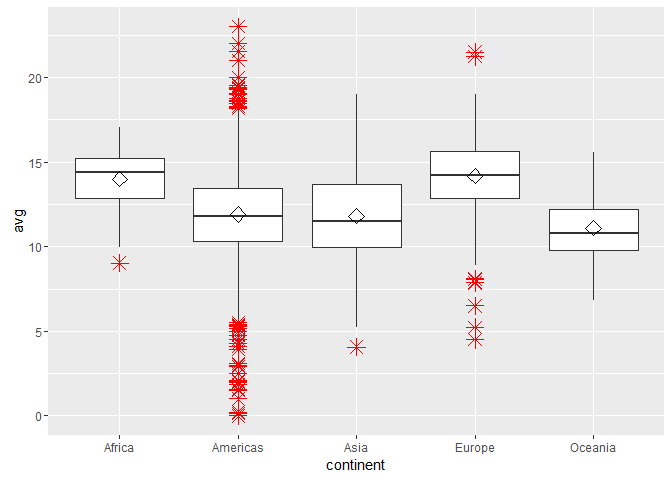

# Attribute analysis - TZ vs Avg Tweet Time


## Connect to the database first


```
## Loading required package: DBI
```

```
## [1] TRUE
```

##Get the tweets


##Display avg tweet hour per timezone

```r
df <- data.frame(users$avg, users$timezone)
user.data <- df[complete.cases(df), ]
colnames(user.data) = c("avg", "timezone")
ggplot(user.data, aes(x = timezone, y = avg)) + geom_boxplot(outlier.colour = "red", 
    outlier.shape = 8, outlier.size = 4) + stat_summary(fun.y = mean, geom = "point", 
    shape = 23, size = 4)
```

<!-- -->

```r
# geom_dotplot(binaxis='y', stackdir='center', dotsize=1)
# geom_jitter(shape=16, position=position_jitter(0.2))
```

##Display avg tweet hour per continent

```r
df <- data.frame(users$avg, users$continent)
user.data <- df[complete.cases(df), ]
colnames(user.data) = c("avg", "continent")
ggplot(user.data, aes(x = continent, y = avg)) + geom_boxplot(outlier.colour = "red", 
    outlier.shape = 8, outlier.size = 4) + stat_summary(fun.y = mean, geom = "point", 
    shape = 23, size = 4)
```

<!-- -->

```r
# geom_dotplot(binaxis='y', stackdir='center', dotsize=1)
# geom_jitter(shape=16, position=position_jitter(0.2))
```

##first create a score

```r
factor_no <- 4
exp_no <- 1
period_no <- 1

sql <- paste("DELETE FROM main.experiment_user_score where factor_no = 4", sep = "")
dbSendQuery(con, sql)
```

```
## <PostgreSQLResult>
```

```r
sql <- paste("INSERT INTO main.experiment_user_score(experiment_no, period_no, userid, factor_no, idi_full)", 
    sep = "")
sql <- paste(sql, "select experiment_no, period_no, userid, 4,", sep = "")
sql <- paste(sql, "avg_tweet_hour", sep = "")
sql <- paste(sql, " from main.experiment_user", sep = "")
dbSendQuery(con, sql)
```

```
## <PostgreSQLResult>
```

##normalise the score and show results
The standard formula to normalize data =(value-min)/(max-min) 
R has a built in function to do this

```r
user.score <- dbGetQuery(con, "SELECT s.userid, s.idi_full, tz.continent from main.experiment_user_score s join main.experiment_user u on u.userid = s.userid left join main.timezone_r tz on tz.timezone = u.timezone where s.factor_no = 4 and s.experiment_no = u.experiment_no and s.period_no = u.period_no")

user.scaled_score <- data.frame(user.score[1], scale(user.score[2]), user.score[3])
colnames(user.scaled_score) = c("userid", "idi", "continent")

ggplot(user.scaled_score, aes(x = continent, y = idi)) + geom_boxplot(outlier.colour = "red", 
    outlier.shape = 8, outlier.size = 4) + stat_summary(fun.y = mean, geom = "point", 
    shape = 23, size = 4)
```

<!-- -->

##Outlier detection
Use Tukey's method to update all scores that were outliers


```r
markoutlier <- function(x, exp_no, period_no, factor_no) {
    sql <- paste("update main.experiment_user_score set outlier_full=1", sep = "")
    sql <- paste(sql, " where userid='", x["userid"], "'", sep = "")
    sql <- paste(sql, " and experiment_no=", exp_no, sep = "")
    sql <- paste(sql, " and period_no=", period_no, sep = "")
    sql <- paste(sql, " and factor_no=", factor_no, sep = "")
    dbSendQuery(con, sql, echo = FALSE)
}

# TODO outliers per continent
continents <- unique(user.scaled_score$continent)

user.continent_score <- user.scaled_score
outlier <- boxplot.stats(user.continent_score$idi, coef = 1.5)$out
user.outlier <- user.continent_score[user.continent_score$idi %in% outlier, 
    ]
apply(user.outlier, 1, markoutlier, exp_no = exp_no, period_no = period_no, 
    factor_no = factor_no)
# na1 <- nrow(user.outlier) Outliers identified: na1 Propotion (%) of
# outliers: round(na1 / sum(!is.na(user.continent_score$idi))*100, 1)
```

Total outliers: 149 out of 6846


