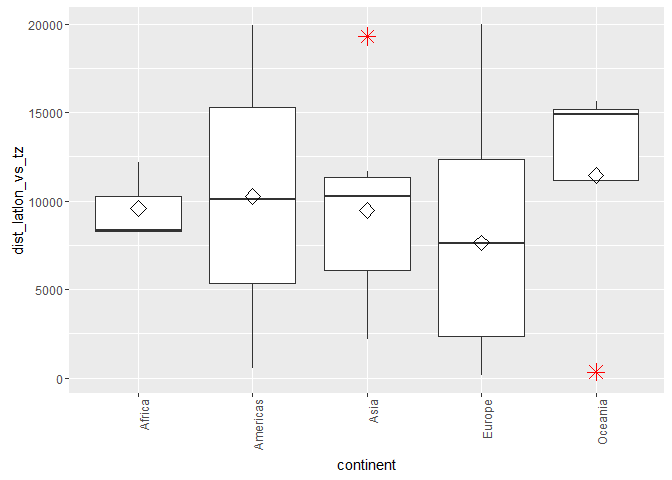
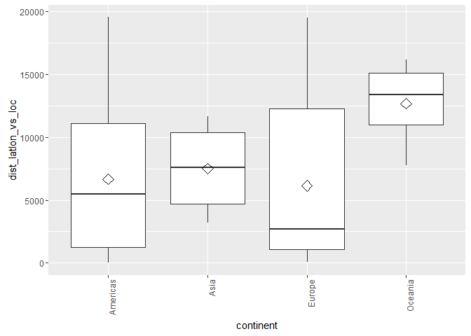
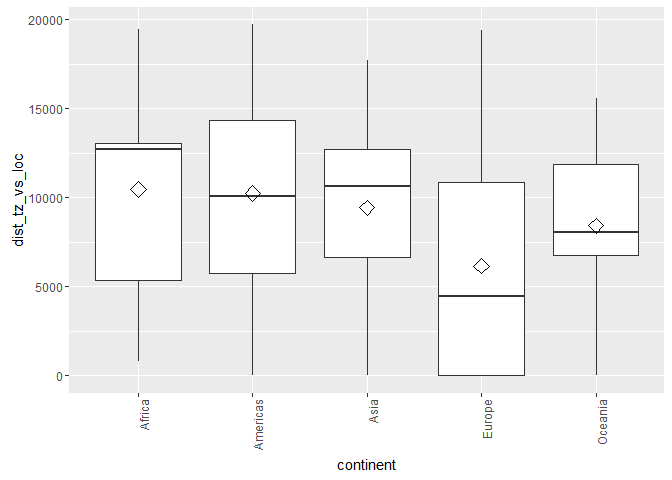
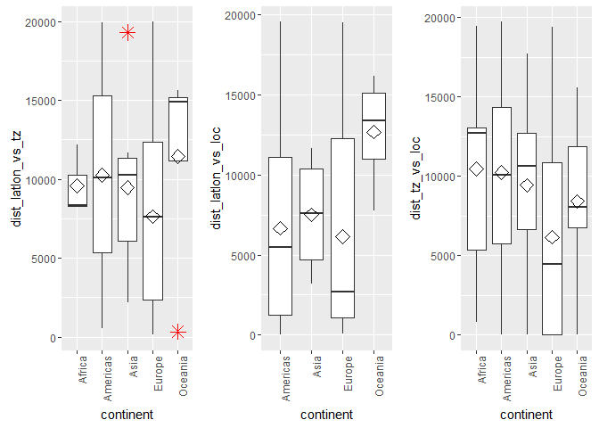
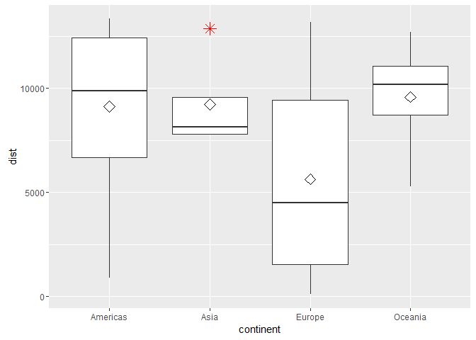
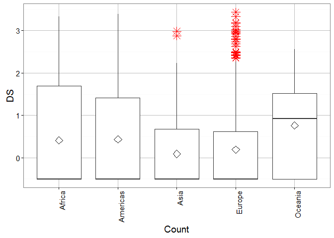

# Attribute analysis - Distances


## Connect to the database first


```
## Loading required package: DBI
```

```
## [1] TRUE
```

##Get the tweets


###Display latitude, longitude vs timezone

```r
df <- data.frame(users$dist_latlon_vs_tz, users$continent)
user.data <- df[complete.cases(df), ]
colnames(user.data) = c("dist_latlon_vs_tz", "continent")
p2 <- ggplot(user.data, aes(x = continent, y = dist_latlon_vs_tz)) + geom_boxplot(outlier.colour = "red", 
    outlier.shape = 8, outlier.size = 4) + stat_summary(fun.y = mean, geom = "point", 
    shape = 23, size = 4) + theme(axis.text.x = element_text(angle = 90, hjust = 1))
# geom_dotplot(binaxis='y', stackdir='center', dotsize=1)
# geom_jitter(shape=16, position=position_jitter(0.2))
p2
```

<!-- -->
###Display latitude, longitude vs location

```r
df <- data.frame(users$dist_latlon_vs_loc, users$continent)
user.data <- df[complete.cases(df), ]
colnames(user.data) = c("dist_latlon_vs_loc", "continent")
p3 <- ggplot(user.data, aes(x = continent, y = dist_latlon_vs_loc)) + geom_boxplot(outlier.colour = "red", 
    outlier.shape = 8, outlier.size = 4) + stat_summary(fun.y = mean, geom = "point", 
    shape = 23, size = 4) + theme(axis.text.x = element_text(angle = 90, hjust = 1))
# geom_dotplot(binaxis='y', stackdir='center', dotsize=1)
# geom_jitter(shape=16, position=position_jitter(0.2))
p3
```

<!-- -->
###Display location vs timezone

```r
df <- data.frame(users$dist_tz_vs_loc, users$continent)
user.data <- df[complete.cases(df), ]
colnames(user.data) = c("dist_tz_vs_loc", "continent")
p4 <- ggplot(user.data, aes(x = continent, y = dist_tz_vs_loc)) + geom_boxplot(outlier.colour = "red", 
    outlier.shape = 8, outlier.size = 4) + stat_summary(fun.y = mean, geom = "point", 
    shape = 23, size = 4) + theme(axis.text.x = element_text(angle = 90, hjust = 1))
# geom_dotplot(binaxis='y', stackdir='center', dotsize=1)
# geom_jitter(shape=16, position=position_jitter(0.2))
p4
```

<!-- -->

##All in one grid

```r
grid.arrange(p2, p3, p4, nrow = 1)
```

<!-- -->

##Combined results

```r
df <- data.frame((users$dist_latlon_vs_tz + users$dist_latlon_vs_loc + users$dist_tz_vs_loc)/3, 
    users$continent)
user.data <- df[complete.cases(df), ]
colnames(user.data) = c("dist", "continent")
ggplot(user.data, aes(x = continent, y = dist)) + geom_boxplot(outlier.colour = "red", 
    outlier.shape = 8, outlier.size = 4) + stat_summary(fun.y = mean, geom = "point", 
    shape = 23, size = 4)
```

<!-- -->

```r
# geom_dotplot(binaxis='y', stackdir='center', dotsize=1)
# geom_jitter(shape=16, position=position_jitter(0.2))
```

###Score the data

##first create a score

```r
exp_no <- 1
period_no <- 1
factor_no <- 5

sql <- paste("DELETE FROM main.experiment_user_score where factor_no = 5", sep = "")
dbSendQuery(con, sql)
```

```
## <PostgreSQLResult>
```

```r
sql <- paste("INSERT INTO main.experiment_user_score(experiment_no, period_no, userid, factor_no, idi_full)", 
    sep = "")
sql <- paste(sql, "select experiment_no, period_no, userid, 5,", sep = "")
sql <- paste(sql, "sum((coalesce(dist_latlon_vs_tz,0)+coalesce(dist_latlon_vs_loc,0)+coalesce(dist_tz_vs_loc,0)))/sum(case when dist_latlon_vs_tz is null and dist_latlon_vs_loc is null and dist_tz_vs_loc is null then 1 else 0 end + case when dist_latlon_vs_tz is not null then 1 else 0 end + case when dist_latlon_vs_loc is not null then 1 else 0 end + case when dist_tz_vs_loc is not null then 1 else 0 end)", 
    sep = "")
sql <- paste(sql, " from main.experiment_user", sep = "")
sql <- paste(sql, " group by experiment_no, period_no, userid", sep = "")
dbSendQuery(con, sql)
```

```
## <PostgreSQLResult>
```

##normalise the score and show results
The standard formula to normalize data =(value-min)/(max-min) 
R has a built in function to do this

```r
user.score <- dbGetQuery(con, "SELECT s.idi_full, tz.continent, s.userid from main.experiment_user_score s join main.experiment_user u on u.userid = s.userid left join main.timezone_r tz on tz.timezone = u.timezone where s.factor_no = 5 and s.experiment_no = u.experiment_no and s.period_no = u.period_no")

user.scaled_score <- data.frame(as.data.frame(scale(user.score[1])), user.score[2], 
    user.score[3])
colnames(user.scaled_score) = c("idi", "continent", "userid")

science_theme = theme(panel.grid.major = element_line(size = 0.5, color = "grey"), 
    axis.line = element_line(size = 0.7, color = "black"), legend.position = c(0.85, 
        0.7), text = element_text(size = 14))

distplot <- ggplot(user.scaled_score, aes(x = continent, y = idi)) + geom_boxplot(outlier.colour = "red", 
    outlier.shape = 8, outlier.size = 4) + stat_summary(fun.y = mean, geom = "point", 
    shape = 23, size = 4) + theme_bw() + science_theme + theme(axis.text.x = element_text(angle = 90, 
    hjust = 1)) + labs(x = "Count", y = "DS")

distplot
```

<!-- -->

```r
svg(filename = "distplot.svg", width = 6, height = 4)
distplot
dev.off()
```

```
## png 
##   2
```


##Outlier detection
Use Tukey's method to update all scores that were outliers


```r
markoutlier <- function(x, exp_no, period_no, factor_no) {
    sql <- paste("update main.experiment_user_score set outlier_full=1", sep = "")
    sql <- paste(sql, " where userid='", x["userid"], "'", sep = "")
    sql <- paste(sql, " and experiment_no=", exp_no, sep = "")
    sql <- paste(sql, " and period_no=", period_no, sep = "")
    sql <- paste(sql, " and factor_no=", factor_no, sep = "")
    dbSendQuery(con, sql, echo = FALSE)
}

# TODO outliers per continent
continents <- unique(user.scaled_score$continent)

user.continent_score <- user.scaled_score
outlier <- boxplot.stats(user.continent_score$idi, coef = 1.5)$out
user.outlier <- user.continent_score[user.continent_score$idi %in% outlier, 
    ]
apply(user.outlier, 1, markoutlier, exp_no = exp_no, period_no = period_no, 
    factor_no = factor_no)
# na1 <- nrow(user.outlier) Outliers identified: na1 Propotion (%) of
# outliers: round(na1 / sum(!is.na(user.continent_score$idi))*100, 1)
```

Total outliers: 1507 out of 6846


