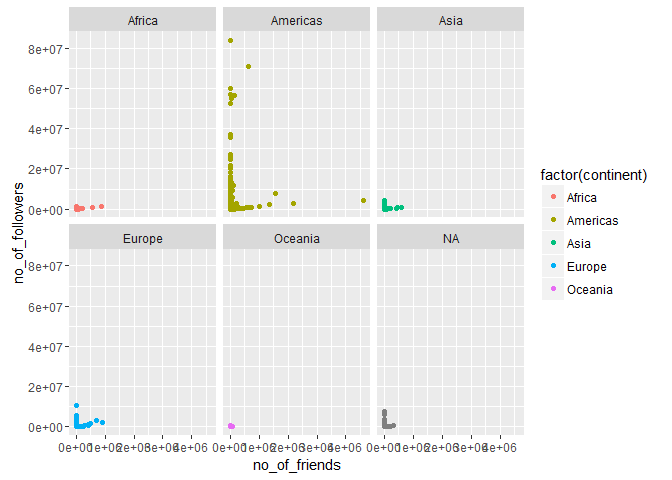

# Attribute analysis - Friends vs Followers


## Connect to the database first


```r
library(RPostgreSQL)
```

```
## Loading required package: DBI
```

```r
# create a connection save the password that we can 'hide' it as best as we
# can by collapsing it
pw <- {
    ""
}

# loads the PostgreSQL driver
drv <- dbDriver("PostgreSQL")
# creates a connection to the postgres database note that 'con' will be used
# later in each connection to the database
con <- dbConnect(drv, dbname = "twitter", host = "localhost", port = 5432, user = "postgres", 
    password = "")
# user = postgres for UBUNTU

rm(pw)  # removes the password

# Connection success:
dbExistsTable(con, c("main", "experiment_tweets_shortest"))
```

```
## [1] TRUE
```

##Get the tweets


##Friends vs Followers

```r
ggplot(users, aes(x = no_of_friends, y = no_of_followers)) + geom_point(aes(color = factor(continent)))
```

<!-- -->

##Friends vs Followers per continent

```r
ggplot(users, aes(x = no_of_friends, y = no_of_followers)) + geom_point(aes(color = factor(continent))) + 
    facet_wrap(~continent)
```

<!-- -->

##Score the data

###first create a score

```r
factor_no <- 2
exp_no <- 1
period_no <- 1

sql <- paste("DELETE FROM main.experiment_user_score where factor_no = 2", sep = "")
dbSendQuery(con, sql)
```

```
## <PostgreSQLResult>
```

```r
sql <- paste("INSERT INTO main.experiment_user_score(experiment_no, period_no, userid, factor_no, idi_full)", 
    sep = "")
sql <- paste(sql, "select experiment_no, period_no, userid, 2,", sep = "")
sql <- paste(sql, "case when no_of_friends > 1 then abs(no_of_followers / no_of_friends) else 0 end", 
    sep = "")
sql <- paste(sql, " from main.experiment_user", sep = "")
dbSendQuery(con, sql)
```

```
## <PostgreSQLResult>
```

###show results
No scaling required


```r
user.score <- dbGetQuery(con, "SELECT s.idi_full, tz.continent from main.experiment_user_score s join main.experiment_user u on u.userid = s.userid left join main.timezone_r tz on tz.timezone = u.timezone where s.factor_no = 2 and s.experiment_no = u.experiment_no and s.period_no = u.period_no")

user.scaled_score <- data.frame(as.data.frame(scale(user.score[1])), user.score[2])
colnames(user.scaled_score) = c("idi", "continent")

ggplot(user.scaled_score, aes(x = continent, y = idi)) + geom_boxplot(outlier.colour = "red", 
    outlier.shape = 8, outlier.size = 4) + stat_summary(fun.y = mean, geom = "point", 
    shape = 23, size = 4)
```

<!-- -->
##Outlier detection
Use Tukey's method to update all scores that were outliers


```r
markoutlier <- function(x, exp_no, period_no, factor_no) {
    sql <- paste("update main.experiment_user_score set outlier_full=1", sep = "")
    sql <- paste(sql, " where userid='", x["userid"], "'", sep = "")
    sql <- paste(sql, " and experiment_no=", exp_no, sep = "")
    sql <- paste(sql, " and period_no=", period_no, sep = "")
    sql <- paste(sql, " and factor_no=", factor_no, sep = "")
    dbSendQuery(con, sql, echo = FALSE)
}

# TODO outliers per continent
continents <- unique(user.scaled_score$continent)

user.continent_score <- user.scaled_score
outlier <- boxplot.stats(user.continent_score$idi, coef = 1.5)$out
user.outlier <- user.continent_score[user.continent_score$idi %in% outlier, 
    ]
apply(user.outlier, 1, markoutlier, exp_no = exp_no, period_no = period_no, 
    factor_no = factor_no)
```

```
## $`1`
## <PostgreSQLResult>
## 
## $`9`
## <PostgreSQLResult>
## 
## $`18`
## <PostgreSQLResult>
## 
## $`19`
## <PostgreSQLResult>
## 
## $`55`
## <PostgreSQLResult>
## 
## $`74`
## <PostgreSQLResult>
## 
## $`78`
## <PostgreSQLResult>
## 
## $`86`
## <PostgreSQLResult>
## 
## $`95`
## <PostgreSQLResult>
## 
## $`96`
## <PostgreSQLResult>
## 
## $`97`
## <PostgreSQLResult>
## 
## $`98`
## <PostgreSQLResult>
## 
## $`103`
## <PostgreSQLResult>
## 
## $`106`
## <PostgreSQLResult>
## 
## $`110`
## <PostgreSQLResult>
## 
## $`113`
## <PostgreSQLResult>
## 
## $`114`
## <PostgreSQLResult>
## 
## $`115`
## <PostgreSQLResult>
## 
## $`118`
## <PostgreSQLResult>
## 
## $`119`
## <PostgreSQLResult>
## 
## $`120`
## <PostgreSQLResult>
## 
## $`121`
## <PostgreSQLResult>
## 
## $`122`
## <PostgreSQLResult>
## 
## $`124`
## <PostgreSQLResult>
## 
## $`125`
## <PostgreSQLResult>
## 
## $`126`
## <PostgreSQLResult>
## 
## $`128`
## <PostgreSQLResult>
## 
## $`131`
## <PostgreSQLResult>
## 
## $`133`
## <PostgreSQLResult>
## 
## $`134`
## <PostgreSQLResult>
## 
## $`136`
## <PostgreSQLResult>
## 
## $`139`
## <PostgreSQLResult>
## 
## $`140`
## <PostgreSQLResult>
## 
## $`142`
## <PostgreSQLResult>
## 
## $`144`
## <PostgreSQLResult>
## 
## $`145`
## <PostgreSQLResult>
## 
## $`146`
## <PostgreSQLResult>
## 
## $`148`
## <PostgreSQLResult>
## 
## $`155`
## <PostgreSQLResult>
## 
## $`158`
## <PostgreSQLResult>
## 
## $`159`
## <PostgreSQLResult>
## 
## $`161`
## <PostgreSQLResult>
## 
## $`163`
## <PostgreSQLResult>
## 
## $`165`
## <PostgreSQLResult>
## 
## $`169`
## <PostgreSQLResult>
## 
## $`170`
## <PostgreSQLResult>
## 
## $`173`
## <PostgreSQLResult>
## 
## $`176`
## <PostgreSQLResult>
## 
## $`180`
## <PostgreSQLResult>
## 
## $`182`
## <PostgreSQLResult>
## 
## $`186`
## <PostgreSQLResult>
## 
## $`187`
## <PostgreSQLResult>
## 
## $`188`
## <PostgreSQLResult>
## 
## $`189`
## <PostgreSQLResult>
## 
## $`193`
## <PostgreSQLResult>
## 
## $`196`
## <PostgreSQLResult>
## 
## $`202`
## <PostgreSQLResult>
## 
## $`205`
## <PostgreSQLResult>
## 
## $`209`
## <PostgreSQLResult>
## 
## $`211`
## <PostgreSQLResult>
## 
## $`212`
## <PostgreSQLResult>
## 
## $`213`
## <PostgreSQLResult>
## 
## $`218`
## <PostgreSQLResult>
## 
## $`219`
## <PostgreSQLResult>
## 
## $`220`
## <PostgreSQLResult>
## 
## $`222`
## <PostgreSQLResult>
## 
## $`223`
## <PostgreSQLResult>
## 
## $`225`
## <PostgreSQLResult>
## 
## $`231`
## <PostgreSQLResult>
## 
## $`238`
## <PostgreSQLResult>
## 
## $`240`
## <PostgreSQLResult>
## 
## $`241`
## <PostgreSQLResult>
## 
## $`245`
## <PostgreSQLResult>
## 
## $`246`
## <PostgreSQLResult>
## 
## $`251`
## <PostgreSQLResult>
## 
## $`252`
## <PostgreSQLResult>
## 
## $`253`
## <PostgreSQLResult>
## 
## $`255`
## <PostgreSQLResult>
## 
## $`266`
## <PostgreSQLResult>
## 
## $`272`
## <PostgreSQLResult>
## 
## $`273`
## <PostgreSQLResult>
## 
## $`280`
## <PostgreSQLResult>
## 
## $`284`
## <PostgreSQLResult>
## 
## $`289`
## <PostgreSQLResult>
## 
## $`296`
## <PostgreSQLResult>
## 
## $`299`
## <PostgreSQLResult>
## 
## $`308`
## <PostgreSQLResult>
## 
## $`317`
## <PostgreSQLResult>
## 
## $`322`
## <PostgreSQLResult>
## 
## $`324`
## <PostgreSQLResult>
## 
## $`334`
## <PostgreSQLResult>
## 
## $`344`
## <PostgreSQLResult>
## 
## $`346`
## <PostgreSQLResult>
## 
## $`347`
## <PostgreSQLResult>
## 
## $`356`
## <PostgreSQLResult>
## 
## $`357`
## <PostgreSQLResult>
## 
## $`365`
## <PostgreSQLResult>
## 
## $`378`
## <PostgreSQLResult>
## 
## $`383`
## <PostgreSQLResult>
## 
## $`387`
## <PostgreSQLResult>
## 
## $`390`
## <PostgreSQLResult>
## 
## $`393`
## <PostgreSQLResult>
## 
## $`407`
## <PostgreSQLResult>
## 
## $`411`
## <PostgreSQLResult>
## 
## $`416`
## <PostgreSQLResult>
## 
## $`426`
## <PostgreSQLResult>
## 
## $`430`
## <PostgreSQLResult>
## 
## $`431`
## <PostgreSQLResult>
## 
## $`443`
## <PostgreSQLResult>
## 
## $`449`
## <PostgreSQLResult>
## 
## $`456`
## <PostgreSQLResult>
## 
## $`457`
## <PostgreSQLResult>
## 
## $`461`
## <PostgreSQLResult>
## 
## $`470`
## <PostgreSQLResult>
## 
## $`475`
## <PostgreSQLResult>
## 
## $`478`
## <PostgreSQLResult>
## 
## $`483`
## <PostgreSQLResult>
## 
## $`484`
## <PostgreSQLResult>
## 
## $`488`
## <PostgreSQLResult>
## 
## $`497`
## <PostgreSQLResult>
## 
## $`500`
## <PostgreSQLResult>
## 
## $`509`
## <PostgreSQLResult>
## 
## $`512`
## <PostgreSQLResult>
## 
## $`516`
## <PostgreSQLResult>
## 
## $`523`
## <PostgreSQLResult>
## 
## $`525`
## <PostgreSQLResult>
## 
## $`526`
## <PostgreSQLResult>
## 
## $`529`
## <PostgreSQLResult>
## 
## $`537`
## <PostgreSQLResult>
## 
## $`538`
## <PostgreSQLResult>
## 
## $`541`
## <PostgreSQLResult>
## 
## $`542`
## <PostgreSQLResult>
## 
## $`555`
## <PostgreSQLResult>
## 
## $`564`
## <PostgreSQLResult>
## 
## $`567`
## <PostgreSQLResult>
## 
## $`577`
## <PostgreSQLResult>
## 
## $`585`
## <PostgreSQLResult>
## 
## $`593`
## <PostgreSQLResult>
## 
## $`596`
## <PostgreSQLResult>
## 
## $`602`
## <PostgreSQLResult>
## 
## $`611`
## <PostgreSQLResult>
## 
## $`615`
## <PostgreSQLResult>
## 
## $`632`
## <PostgreSQLResult>
## 
## $`685`
## <PostgreSQLResult>
## 
## $`701`
## <PostgreSQLResult>
## 
## $`713`
## <PostgreSQLResult>
## 
## $`729`
## <PostgreSQLResult>
## 
## $`771`
## <PostgreSQLResult>
## 
## $`776`
## <PostgreSQLResult>
## 
## $`802`
## <PostgreSQLResult>
## 
## $`811`
## <PostgreSQLResult>
## 
## $`818`
## <PostgreSQLResult>
## 
## $`821`
## <PostgreSQLResult>
## 
## $`845`
## <PostgreSQLResult>
## 
## $`850`
## <PostgreSQLResult>
## 
## $`857`
## <PostgreSQLResult>
## 
## $`858`
## <PostgreSQLResult>
## 
## $`859`
## <PostgreSQLResult>
## 
## $`860`
## <PostgreSQLResult>
## 
## $`861`
## <PostgreSQLResult>
## 
## $`862`
## <PostgreSQLResult>
## 
## $`865`
## <PostgreSQLResult>
## 
## $`870`
## <PostgreSQLResult>
## 
## $`872`
## <PostgreSQLResult>
## 
## $`878`
## <PostgreSQLResult>
## 
## $`887`
## <PostgreSQLResult>
## 
## $`897`
## <PostgreSQLResult>
## 
## $`906`
## <PostgreSQLResult>
## 
## $`913`
## <PostgreSQLResult>
## 
## $`916`
## <PostgreSQLResult>
## 
## $`919`
## <PostgreSQLResult>
## 
## $`921`
## <PostgreSQLResult>
## 
## $`928`
## <PostgreSQLResult>
## 
## $`931`
## <PostgreSQLResult>
## 
## $`939`
## <PostgreSQLResult>
## 
## $`958`
## <PostgreSQLResult>
## 
## $`972`
## <PostgreSQLResult>
## 
## $`984`
## <PostgreSQLResult>
## 
## $`998`
## <PostgreSQLResult>
## 
## $`1020`
## <PostgreSQLResult>
## 
## $`1049`
## <PostgreSQLResult>
## 
## $`1050`
## <PostgreSQLResult>
## 
## $`1065`
## <PostgreSQLResult>
## 
## $`1072`
## <PostgreSQLResult>
## 
## $`1086`
## <PostgreSQLResult>
## 
## $`1128`
## <PostgreSQLResult>
## 
## $`1138`
## <PostgreSQLResult>
## 
## $`1153`
## <PostgreSQLResult>
## 
## $`1177`
## <PostgreSQLResult>
## 
## $`1202`
## <PostgreSQLResult>
## 
## $`1203`
## <PostgreSQLResult>
## 
## $`1210`
## <PostgreSQLResult>
## 
## $`1236`
## <PostgreSQLResult>
## 
## $`1241`
## <PostgreSQLResult>
## 
## $`1255`
## <PostgreSQLResult>
## 
## $`1265`
## <PostgreSQLResult>
## 
## $`1328`
## <PostgreSQLResult>
## 
## $`1462`
## <PostgreSQLResult>
## 
## $`1487`
## <PostgreSQLResult>
## 
## $`1549`
## <PostgreSQLResult>
## 
## $`1625`
## <PostgreSQLResult>
## 
## $`1692`
## <PostgreSQLResult>
## 
## $`1695`
## <PostgreSQLResult>
## 
## $`1723`
## <PostgreSQLResult>
## 
## $`1756`
## <PostgreSQLResult>
## 
## $`1781`
## <PostgreSQLResult>
## 
## $`1814`
## <PostgreSQLResult>
## 
## $`1820`
## <PostgreSQLResult>
## 
## $`1822`
## <PostgreSQLResult>
## 
## $`1824`
## <PostgreSQLResult>
## 
## $`1828`
## <PostgreSQLResult>
## 
## $`1832`
## <PostgreSQLResult>
## 
## $`1833`
## <PostgreSQLResult>
## 
## $`1835`
## <PostgreSQLResult>
## 
## $`1838`
## <PostgreSQLResult>
## 
## $`1839`
## <PostgreSQLResult>
## 
## $`1847`
## <PostgreSQLResult>
## 
## $`1848`
## <PostgreSQLResult>
## 
## $`1850`
## <PostgreSQLResult>
## 
## $`1855`
## <PostgreSQLResult>
## 
## $`1859`
## <PostgreSQLResult>
## 
## $`1869`
## <PostgreSQLResult>
## 
## $`1870`
## <PostgreSQLResult>
## 
## $`1877`
## <PostgreSQLResult>
## 
## $`1891`
## <PostgreSQLResult>
## 
## $`1909`
## <PostgreSQLResult>
## 
## $`1919`
## <PostgreSQLResult>
## 
## $`1924`
## <PostgreSQLResult>
## 
## $`1926`
## <PostgreSQLResult>
## 
## $`1934`
## <PostgreSQLResult>
## 
## $`1958`
## <PostgreSQLResult>
## 
## $`1961`
## <PostgreSQLResult>
## 
## $`1970`
## <PostgreSQLResult>
## 
## $`1973`
## <PostgreSQLResult>
## 
## $`1981`
## <PostgreSQLResult>
## 
## $`1990`
## <PostgreSQLResult>
## 
## $`1998`
## <PostgreSQLResult>
## 
## $`1999`
## <PostgreSQLResult>
## 
## $`2000`
## <PostgreSQLResult>
## 
## $`2002`
## <PostgreSQLResult>
## 
## $`2009`
## <PostgreSQLResult>
## 
## $`2014`
## <PostgreSQLResult>
## 
## $`2020`
## <PostgreSQLResult>
## 
## $`2027`
## <PostgreSQLResult>
## 
## $`2031`
## <PostgreSQLResult>
## 
## $`2035`
## <PostgreSQLResult>
## 
## $`2050`
## <PostgreSQLResult>
## 
## $`2053`
## <PostgreSQLResult>
## 
## $`2054`
## <PostgreSQLResult>
## 
## $`2056`
## <PostgreSQLResult>
## 
## $`2060`
## <PostgreSQLResult>
## 
## $`2062`
## <PostgreSQLResult>
## 
## $`2064`
## <PostgreSQLResult>
## 
## $`2070`
## <PostgreSQLResult>
## 
## $`2072`
## <PostgreSQLResult>
## 
## $`2073`
## <PostgreSQLResult>
## 
## $`2076`
## <PostgreSQLResult>
## 
## $`2080`
## <PostgreSQLResult>
## 
## $`2085`
## <PostgreSQLResult>
## 
## $`2088`
## <PostgreSQLResult>
## 
## $`2089`
## <PostgreSQLResult>
## 
## $`2090`
## <PostgreSQLResult>
## 
## $`2091`
## <PostgreSQLResult>
## 
## $`2093`
## <PostgreSQLResult>
## 
## $`2095`
## <PostgreSQLResult>
## 
## $`2098`
## <PostgreSQLResult>
## 
## $`2100`
## <PostgreSQLResult>
## 
## $`2101`
## <PostgreSQLResult>
## 
## $`2102`
## <PostgreSQLResult>
## 
## $`2103`
## <PostgreSQLResult>
## 
## $`2104`
## <PostgreSQLResult>
## 
## $`2107`
## <PostgreSQLResult>
## 
## $`2112`
## <PostgreSQLResult>
## 
## $`2113`
## <PostgreSQLResult>
## 
## $`2114`
## <PostgreSQLResult>
## 
## $`2118`
## <PostgreSQLResult>
## 
## $`2119`
## <PostgreSQLResult>
## 
## $`2120`
## <PostgreSQLResult>
## 
## $`2122`
## <PostgreSQLResult>
## 
## $`2124`
## <PostgreSQLResult>
## 
## $`2126`
## <PostgreSQLResult>
## 
## $`2127`
## <PostgreSQLResult>
## 
## $`2128`
## <PostgreSQLResult>
## 
## $`2130`
## <PostgreSQLResult>
## 
## $`2131`
## <PostgreSQLResult>
## 
## $`2132`
## <PostgreSQLResult>
## 
## $`2136`
## <PostgreSQLResult>
## 
## $`2137`
## <PostgreSQLResult>
## 
## $`2138`
## <PostgreSQLResult>
## 
## $`2139`
## <PostgreSQLResult>
## 
## $`2140`
## <PostgreSQLResult>
## 
## $`2142`
## <PostgreSQLResult>
## 
## $`2143`
## <PostgreSQLResult>
## 
## $`2147`
## <PostgreSQLResult>
## 
## $`2149`
## <PostgreSQLResult>
## 
## $`2151`
## <PostgreSQLResult>
## 
## $`2152`
## <PostgreSQLResult>
## 
## $`2153`
## <PostgreSQLResult>
## 
## $`2157`
## <PostgreSQLResult>
## 
## $`2160`
## <PostgreSQLResult>
## 
## $`2161`
## <PostgreSQLResult>
## 
## $`2162`
## <PostgreSQLResult>
## 
## $`2163`
## <PostgreSQLResult>
## 
## $`2166`
## <PostgreSQLResult>
## 
## $`2171`
## <PostgreSQLResult>
## 
## $`2172`
## <PostgreSQLResult>
## 
## $`2174`
## <PostgreSQLResult>
## 
## $`2176`
## <PostgreSQLResult>
## 
## $`2180`
## <PostgreSQLResult>
## 
## $`2181`
## <PostgreSQLResult>
## 
## $`2182`
## <PostgreSQLResult>
## 
## $`2183`
## <PostgreSQLResult>
## 
## $`2184`
## <PostgreSQLResult>
## 
## $`2186`
## <PostgreSQLResult>
## 
## $`2190`
## <PostgreSQLResult>
## 
## $`2191`
## <PostgreSQLResult>
## 
## $`2193`
## <PostgreSQLResult>
## 
## $`2194`
## <PostgreSQLResult>
## 
## $`2197`
## <PostgreSQLResult>
## 
## $`2199`
## <PostgreSQLResult>
## 
## $`2205`
## <PostgreSQLResult>
## 
## $`2208`
## <PostgreSQLResult>
## 
## $`2209`
## <PostgreSQLResult>
## 
## $`2211`
## <PostgreSQLResult>
## 
## $`2212`
## <PostgreSQLResult>
## 
## $`2214`
## <PostgreSQLResult>
## 
## $`2215`
## <PostgreSQLResult>
## 
## $`2216`
## <PostgreSQLResult>
## 
## $`2219`
## <PostgreSQLResult>
## 
## $`2220`
## <PostgreSQLResult>
## 
## $`2226`
## <PostgreSQLResult>
## 
## $`2227`
## <PostgreSQLResult>
## 
## $`2228`
## <PostgreSQLResult>
## 
## $`2234`
## <PostgreSQLResult>
## 
## $`2237`
## <PostgreSQLResult>
## 
## $`2241`
## <PostgreSQLResult>
## 
## $`2244`
## <PostgreSQLResult>
## 
## $`2245`
## <PostgreSQLResult>
## 
## $`2247`
## <PostgreSQLResult>
## 
## $`2249`
## <PostgreSQLResult>
## 
## $`2250`
## <PostgreSQLResult>
## 
## $`2252`
## <PostgreSQLResult>
## 
## $`2253`
## <PostgreSQLResult>
## 
## $`2258`
## <PostgreSQLResult>
## 
## $`2260`
## <PostgreSQLResult>
## 
## $`2261`
## <PostgreSQLResult>
## 
## $`2269`
## <PostgreSQLResult>
## 
## $`2272`
## <PostgreSQLResult>
## 
## $`2273`
## <PostgreSQLResult>
## 
## $`2274`
## <PostgreSQLResult>
## 
## $`2275`
## <PostgreSQLResult>
## 
## $`2279`
## <PostgreSQLResult>
## 
## $`2283`
## <PostgreSQLResult>
## 
## $`2286`
## <PostgreSQLResult>
## 
## $`2292`
## <PostgreSQLResult>
## 
## $`2294`
## <PostgreSQLResult>
## 
## $`2300`
## <PostgreSQLResult>
## 
## $`2303`
## <PostgreSQLResult>
## 
## $`2304`
## <PostgreSQLResult>
## 
## $`2307`
## <PostgreSQLResult>
## 
## $`2309`
## <PostgreSQLResult>
## 
## $`2318`
## <PostgreSQLResult>
## 
## $`2324`
## <PostgreSQLResult>
## 
## $`2327`
## <PostgreSQLResult>
## 
## $`2328`
## <PostgreSQLResult>
## 
## $`2331`
## <PostgreSQLResult>
## 
## $`2334`
## <PostgreSQLResult>
## 
## $`2335`
## <PostgreSQLResult>
## 
## $`2337`
## <PostgreSQLResult>
## 
## $`2341`
## <PostgreSQLResult>
## 
## $`2343`
## <PostgreSQLResult>
## 
## $`2344`
## <PostgreSQLResult>
## 
## $`2349`
## <PostgreSQLResult>
## 
## $`2351`
## <PostgreSQLResult>
## 
## $`2352`
## <PostgreSQLResult>
## 
## $`2353`
## <PostgreSQLResult>
## 
## $`2354`
## <PostgreSQLResult>
## 
## $`2355`
## <PostgreSQLResult>
## 
## $`2359`
## <PostgreSQLResult>
## 
## $`2363`
## <PostgreSQLResult>
## 
## $`2365`
## <PostgreSQLResult>
## 
## $`2366`
## <PostgreSQLResult>
## 
## $`2368`
## <PostgreSQLResult>
## 
## $`2370`
## <PostgreSQLResult>
## 
## $`2371`
## <PostgreSQLResult>
## 
## $`2372`
## <PostgreSQLResult>
## 
## $`2373`
## <PostgreSQLResult>
## 
## $`2375`
## <PostgreSQLResult>
## 
## $`2380`
## <PostgreSQLResult>
## 
## $`2383`
## <PostgreSQLResult>
## 
## $`2384`
## <PostgreSQLResult>
## 
## $`2386`
## <PostgreSQLResult>
## 
## $`2395`
## <PostgreSQLResult>
## 
## $`2396`
## <PostgreSQLResult>
## 
## $`2397`
## <PostgreSQLResult>
## 
## $`2400`
## <PostgreSQLResult>
## 
## $`2401`
## <PostgreSQLResult>
## 
## $`2408`
## <PostgreSQLResult>
## 
## $`2410`
## <PostgreSQLResult>
## 
## $`2413`
## <PostgreSQLResult>
## 
## $`2415`
## <PostgreSQLResult>
## 
## $`2417`
## <PostgreSQLResult>
## 
## $`2418`
## <PostgreSQLResult>
## 
## $`2420`
## <PostgreSQLResult>
## 
## $`2424`
## <PostgreSQLResult>
## 
## $`2426`
## <PostgreSQLResult>
## 
## $`2430`
## <PostgreSQLResult>
## 
## $`2433`
## <PostgreSQLResult>
## 
## $`2437`
## <PostgreSQLResult>
## 
## $`2438`
## <PostgreSQLResult>
## 
## $`2440`
## <PostgreSQLResult>
## 
## $`2441`
## <PostgreSQLResult>
## 
## $`2444`
## <PostgreSQLResult>
## 
## $`2447`
## <PostgreSQLResult>
## 
## $`2448`
## <PostgreSQLResult>
## 
## $`2449`
## <PostgreSQLResult>
## 
## $`2450`
## <PostgreSQLResult>
## 
## $`2454`
## <PostgreSQLResult>
## 
## $`2456`
## <PostgreSQLResult>
## 
## $`2457`
## <PostgreSQLResult>
## 
## $`2460`
## <PostgreSQLResult>
## 
## $`2462`
## <PostgreSQLResult>
## 
## $`2463`
## <PostgreSQLResult>
## 
## $`2464`
## <PostgreSQLResult>
## 
## $`2467`
## <PostgreSQLResult>
## 
## $`2470`
## <PostgreSQLResult>
## 
## $`2472`
## <PostgreSQLResult>
## 
## $`2473`
## <PostgreSQLResult>
## 
## $`2474`
## <PostgreSQLResult>
## 
## $`2480`
## <PostgreSQLResult>
## 
## $`2483`
## <PostgreSQLResult>
## 
## $`2485`
## <PostgreSQLResult>
## 
## $`2490`
## <PostgreSQLResult>
## 
## $`2491`
## <PostgreSQLResult>
## 
## $`2493`
## <PostgreSQLResult>
## 
## $`2494`
## <PostgreSQLResult>
## 
## $`2496`
## <PostgreSQLResult>
## 
## $`2499`
## <PostgreSQLResult>
## 
## $`2502`
## <PostgreSQLResult>
## 
## $`2509`
## <PostgreSQLResult>
## 
## $`2510`
## <PostgreSQLResult>
## 
## $`2511`
## <PostgreSQLResult>
## 
## $`2513`
## <PostgreSQLResult>
## 
## $`2514`
## <PostgreSQLResult>
## 
## $`2516`
## <PostgreSQLResult>
## 
## $`2517`
## <PostgreSQLResult>
## 
## $`2519`
## <PostgreSQLResult>
## 
## $`2520`
## <PostgreSQLResult>
## 
## $`2522`
## <PostgreSQLResult>
## 
## $`2523`
## <PostgreSQLResult>
## 
## $`2527`
## <PostgreSQLResult>
## 
## $`2529`
## <PostgreSQLResult>
## 
## $`2532`
## <PostgreSQLResult>
## 
## $`2533`
## <PostgreSQLResult>
## 
## $`2537`
## <PostgreSQLResult>
## 
## $`2541`
## <PostgreSQLResult>
## 
## $`2543`
## <PostgreSQLResult>
## 
## $`2544`
## <PostgreSQLResult>
## 
## $`2547`
## <PostgreSQLResult>
## 
## $`2548`
## <PostgreSQLResult>
## 
## $`2553`
## <PostgreSQLResult>
## 
## $`2554`
## <PostgreSQLResult>
## 
## $`2557`
## <PostgreSQLResult>
## 
## $`2558`
## <PostgreSQLResult>
## 
## $`2560`
## <PostgreSQLResult>
## 
## $`2563`
## <PostgreSQLResult>
## 
## $`2564`
## <PostgreSQLResult>
## 
## $`2572`
## <PostgreSQLResult>
## 
## $`2573`
## <PostgreSQLResult>
## 
## $`2574`
## <PostgreSQLResult>
## 
## $`2580`
## <PostgreSQLResult>
## 
## $`2582`
## <PostgreSQLResult>
## 
## $`2583`
## <PostgreSQLResult>
## 
## $`2589`
## <PostgreSQLResult>
## 
## $`2593`
## <PostgreSQLResult>
## 
## $`2597`
## <PostgreSQLResult>
## 
## $`2601`
## <PostgreSQLResult>
## 
## $`2603`
## <PostgreSQLResult>
## 
## $`2604`
## <PostgreSQLResult>
## 
## $`2606`
## <PostgreSQLResult>
## 
## $`2609`
## <PostgreSQLResult>
## 
## $`2613`
## <PostgreSQLResult>
## 
## $`2614`
## <PostgreSQLResult>
## 
## $`2616`
## <PostgreSQLResult>
## 
## $`2622`
## <PostgreSQLResult>
## 
## $`2626`
## <PostgreSQLResult>
## 
## $`2628`
## <PostgreSQLResult>
## 
## $`2629`
## <PostgreSQLResult>
## 
## $`2631`
## <PostgreSQLResult>
## 
## $`2634`
## <PostgreSQLResult>
## 
## $`2637`
## <PostgreSQLResult>
## 
## $`2640`
## <PostgreSQLResult>
## 
## $`2656`
## <PostgreSQLResult>
## 
## $`2660`
## <PostgreSQLResult>
## 
## $`2661`
## <PostgreSQLResult>
## 
## $`2662`
## <PostgreSQLResult>
## 
## $`2665`
## <PostgreSQLResult>
## 
## $`2670`
## <PostgreSQLResult>
## 
## $`2671`
## <PostgreSQLResult>
## 
## $`2673`
## <PostgreSQLResult>
## 
## $`2674`
## <PostgreSQLResult>
## 
## $`2678`
## <PostgreSQLResult>
## 
## $`2679`
## <PostgreSQLResult>
## 
## $`2687`
## <PostgreSQLResult>
## 
## $`2689`
## <PostgreSQLResult>
## 
## $`2690`
## <PostgreSQLResult>
## 
## $`2692`
## <PostgreSQLResult>
## 
## $`2693`
## <PostgreSQLResult>
## 
## $`2694`
## <PostgreSQLResult>
## 
## $`2696`
## <PostgreSQLResult>
## 
## $`2697`
## <PostgreSQLResult>
## 
## $`2700`
## <PostgreSQLResult>
## 
## $`2709`
## <PostgreSQLResult>
## 
## $`2711`
## <PostgreSQLResult>
## 
## $`2712`
## <PostgreSQLResult>
## 
## $`2713`
## <PostgreSQLResult>
## 
## $`2715`
## <PostgreSQLResult>
## 
## $`2718`
## <PostgreSQLResult>
## 
## $`2721`
## <PostgreSQLResult>
## 
## $`2726`
## <PostgreSQLResult>
## 
## $`2731`
## <PostgreSQLResult>
## 
## $`2736`
## <PostgreSQLResult>
## 
## $`2740`
## <PostgreSQLResult>
## 
## $`2741`
## <PostgreSQLResult>
## 
## $`2742`
## <PostgreSQLResult>
## 
## $`2743`
## <PostgreSQLResult>
## 
## $`2748`
## <PostgreSQLResult>
## 
## $`2751`
## <PostgreSQLResult>
## 
## $`2752`
## <PostgreSQLResult>
## 
## $`2754`
## <PostgreSQLResult>
## 
## $`2762`
## <PostgreSQLResult>
## 
## $`2763`
## <PostgreSQLResult>
## 
## $`2764`
## <PostgreSQLResult>
## 
## $`2766`
## <PostgreSQLResult>
## 
## $`2768`
## <PostgreSQLResult>
## 
## $`2770`
## <PostgreSQLResult>
## 
## $`2773`
## <PostgreSQLResult>
## 
## $`2774`
## <PostgreSQLResult>
## 
## $`2778`
## <PostgreSQLResult>
## 
## $`2787`
## <PostgreSQLResult>
## 
## $`2788`
## <PostgreSQLResult>
## 
## $`2790`
## <PostgreSQLResult>
## 
## $`2795`
## <PostgreSQLResult>
## 
## $`2798`
## <PostgreSQLResult>
## 
## $`2801`
## <PostgreSQLResult>
## 
## $`2802`
## <PostgreSQLResult>
## 
## $`2804`
## <PostgreSQLResult>
## 
## $`2806`
## <PostgreSQLResult>
## 
## $`2807`
## <PostgreSQLResult>
## 
## $`2810`
## <PostgreSQLResult>
## 
## $`2811`
## <PostgreSQLResult>
## 
## $`2814`
## <PostgreSQLResult>
## 
## $`2816`
## <PostgreSQLResult>
## 
## $`2826`
## <PostgreSQLResult>
## 
## $`2828`
## <PostgreSQLResult>
## 
## $`2830`
## <PostgreSQLResult>
## 
## $`2831`
## <PostgreSQLResult>
## 
## $`2834`
## <PostgreSQLResult>
## 
## $`2839`
## <PostgreSQLResult>
## 
## $`2841`
## <PostgreSQLResult>
## 
## $`2846`
## <PostgreSQLResult>
## 
## $`2848`
## <PostgreSQLResult>
## 
## $`2854`
## <PostgreSQLResult>
## 
## $`2857`
## <PostgreSQLResult>
## 
## $`2862`
## <PostgreSQLResult>
## 
## $`2864`
## <PostgreSQLResult>
## 
## $`2865`
## <PostgreSQLResult>
## 
## $`2869`
## <PostgreSQLResult>
## 
## $`2873`
## <PostgreSQLResult>
## 
## $`2881`
## <PostgreSQLResult>
## 
## $`2884`
## <PostgreSQLResult>
## 
## $`2886`
## <PostgreSQLResult>
## 
## $`2888`
## <PostgreSQLResult>
## 
## $`2890`
## <PostgreSQLResult>
## 
## $`2892`
## <PostgreSQLResult>
## 
## $`2896`
## <PostgreSQLResult>
## 
## $`2897`
## <PostgreSQLResult>
## 
## $`2904`
## <PostgreSQLResult>
## 
## $`2905`
## <PostgreSQLResult>
## 
## $`2916`
## <PostgreSQLResult>
## 
## $`2918`
## <PostgreSQLResult>
## 
## $`2919`
## <PostgreSQLResult>
## 
## $`2920`
## <PostgreSQLResult>
## 
## $`2925`
## <PostgreSQLResult>
## 
## $`2932`
## <PostgreSQLResult>
## 
## $`2935`
## <PostgreSQLResult>
## 
## $`2936`
## <PostgreSQLResult>
## 
## $`2937`
## <PostgreSQLResult>
## 
## $`2938`
## <PostgreSQLResult>
## 
## $`2939`
## <PostgreSQLResult>
## 
## $`2943`
## <PostgreSQLResult>
## 
## $`2947`
## <PostgreSQLResult>
## 
## $`2950`
## <PostgreSQLResult>
## 
## $`2954`
## <PostgreSQLResult>
## 
## $`2956`
## <PostgreSQLResult>
## 
## $`2961`
## <PostgreSQLResult>
## 
## $`2965`
## <PostgreSQLResult>
## 
## $`2969`
## <PostgreSQLResult>
## 
## $`2977`
## <PostgreSQLResult>
## 
## $`2983`
## <PostgreSQLResult>
## 
## $`2990`
## <PostgreSQLResult>
## 
## $`2992`
## <PostgreSQLResult>
## 
## $`2994`
## <PostgreSQLResult>
## 
## $`3009`
## <PostgreSQLResult>
## 
## $`3011`
## <PostgreSQLResult>
## 
## $`3013`
## <PostgreSQLResult>
## 
## $`3018`
## <PostgreSQLResult>
## 
## $`3020`
## <PostgreSQLResult>
## 
## $`3022`
## <PostgreSQLResult>
## 
## $`3024`
## <PostgreSQLResult>
## 
## $`3026`
## <PostgreSQLResult>
## 
## $`3034`
## <PostgreSQLResult>
## 
## $`3037`
## <PostgreSQLResult>
## 
## $`3042`
## <PostgreSQLResult>
## 
## $`3045`
## <PostgreSQLResult>
## 
## $`3047`
## <PostgreSQLResult>
## 
## $`3051`
## <PostgreSQLResult>
## 
## $`3053`
## <PostgreSQLResult>
## 
## $`3058`
## <PostgreSQLResult>
## 
## $`3061`
## <PostgreSQLResult>
## 
## $`3066`
## <PostgreSQLResult>
## 
## $`3071`
## <PostgreSQLResult>
## 
## $`3072`
## <PostgreSQLResult>
## 
## $`3077`
## <PostgreSQLResult>
## 
## $`3078`
## <PostgreSQLResult>
## 
## $`3084`
## <PostgreSQLResult>
## 
## $`3085`
## <PostgreSQLResult>
## 
## $`3088`
## <PostgreSQLResult>
## 
## $`3089`
## <PostgreSQLResult>
## 
## $`3090`
## <PostgreSQLResult>
## 
## $`3091`
## <PostgreSQLResult>
## 
## $`3092`
## <PostgreSQLResult>
## 
## $`3093`
## <PostgreSQLResult>
## 
## $`3094`
## <PostgreSQLResult>
## 
## $`3096`
## <PostgreSQLResult>
## 
## $`3098`
## <PostgreSQLResult>
## 
## $`3100`
## <PostgreSQLResult>
## 
## $`3106`
## <PostgreSQLResult>
## 
## $`3107`
## <PostgreSQLResult>
## 
## $`3108`
## <PostgreSQLResult>
## 
## $`3112`
## <PostgreSQLResult>
## 
## $`3114`
## <PostgreSQLResult>
## 
## $`3117`
## <PostgreSQLResult>
## 
## $`3119`
## <PostgreSQLResult>
## 
## $`3126`
## <PostgreSQLResult>
## 
## $`3129`
## <PostgreSQLResult>
## 
## $`3133`
## <PostgreSQLResult>
## 
## $`3137`
## <PostgreSQLResult>
## 
## $`3138`
## <PostgreSQLResult>
## 
## $`3142`
## <PostgreSQLResult>
## 
## $`3143`
## <PostgreSQLResult>
## 
## $`3144`
## <PostgreSQLResult>
## 
## $`3146`
## <PostgreSQLResult>
## 
## $`3147`
## <PostgreSQLResult>
## 
## $`3157`
## <PostgreSQLResult>
## 
## $`3160`
## <PostgreSQLResult>
## 
## $`3162`
## <PostgreSQLResult>
## 
## $`3170`
## <PostgreSQLResult>
## 
## $`3174`
## <PostgreSQLResult>
## 
## $`3180`
## <PostgreSQLResult>
## 
## $`3182`
## <PostgreSQLResult>
## 
## $`3192`
## <PostgreSQLResult>
## 
## $`3197`
## <PostgreSQLResult>
## 
## $`3198`
## <PostgreSQLResult>
## 
## $`3202`
## <PostgreSQLResult>
## 
## $`3206`
## <PostgreSQLResult>
## 
## $`3213`
## <PostgreSQLResult>
## 
## $`3225`
## <PostgreSQLResult>
## 
## $`3237`
## <PostgreSQLResult>
## 
## $`3254`
## <PostgreSQLResult>
## 
## $`3255`
## <PostgreSQLResult>
## 
## $`3263`
## <PostgreSQLResult>
## 
## $`3265`
## <PostgreSQLResult>
## 
## $`3266`
## <PostgreSQLResult>
## 
## $`3276`
## <PostgreSQLResult>
## 
## $`3277`
## <PostgreSQLResult>
## 
## $`3279`
## <PostgreSQLResult>
## 
## $`3281`
## <PostgreSQLResult>
## 
## $`3283`
## <PostgreSQLResult>
## 
## $`3295`
## <PostgreSQLResult>
## 
## $`3298`
## <PostgreSQLResult>
## 
## $`3303`
## <PostgreSQLResult>
## 
## $`3312`
## <PostgreSQLResult>
## 
## $`3314`
## <PostgreSQLResult>
## 
## $`3317`
## <PostgreSQLResult>
## 
## $`3319`
## <PostgreSQLResult>
## 
## $`3321`
## <PostgreSQLResult>
## 
## $`3324`
## <PostgreSQLResult>
## 
## $`3330`
## <PostgreSQLResult>
## 
## $`3352`
## <PostgreSQLResult>
## 
## $`3362`
## <PostgreSQLResult>
## 
## $`3364`
## <PostgreSQLResult>
## 
## $`3365`
## <PostgreSQLResult>
## 
## $`3369`
## <PostgreSQLResult>
## 
## $`3376`
## <PostgreSQLResult>
## 
## $`3378`
## <PostgreSQLResult>
## 
## $`3381`
## <PostgreSQLResult>
## 
## $`3387`
## <PostgreSQLResult>
## 
## $`3389`
## <PostgreSQLResult>
## 
## $`3392`
## <PostgreSQLResult>
## 
## $`3395`
## <PostgreSQLResult>
## 
## $`3406`
## <PostgreSQLResult>
## 
## $`3408`
## <PostgreSQLResult>
## 
## $`3411`
## <PostgreSQLResult>
## 
## $`3413`
## <PostgreSQLResult>
## 
## $`3414`
## <PostgreSQLResult>
## 
## $`3415`
## <PostgreSQLResult>
## 
## $`3416`
## <PostgreSQLResult>
## 
## $`3418`
## <PostgreSQLResult>
## 
## $`3419`
## <PostgreSQLResult>
## 
## $`3420`
## <PostgreSQLResult>
## 
## $`3421`
## <PostgreSQLResult>
## 
## $`3423`
## <PostgreSQLResult>
## 
## $`3427`
## <PostgreSQLResult>
## 
## $`3436`
## <PostgreSQLResult>
## 
## $`3439`
## <PostgreSQLResult>
## 
## $`3442`
## <PostgreSQLResult>
## 
## $`3443`
## <PostgreSQLResult>
## 
## $`3444`
## <PostgreSQLResult>
## 
## $`3448`
## <PostgreSQLResult>
## 
## $`3451`
## <PostgreSQLResult>
## 
## $`3452`
## <PostgreSQLResult>
## 
## $`3461`
## <PostgreSQLResult>
## 
## $`3463`
## <PostgreSQLResult>
## 
## $`3473`
## <PostgreSQLResult>
## 
## $`3476`
## <PostgreSQLResult>
## 
## $`3484`
## <PostgreSQLResult>
## 
## $`3489`
## <PostgreSQLResult>
## 
## $`3492`
## <PostgreSQLResult>
## 
## $`3496`
## <PostgreSQLResult>
## 
## $`3503`
## <PostgreSQLResult>
## 
## $`3506`
## <PostgreSQLResult>
## 
## $`3513`
## <PostgreSQLResult>
## 
## $`3521`
## <PostgreSQLResult>
## 
## $`3532`
## <PostgreSQLResult>
## 
## $`3543`
## <PostgreSQLResult>
## 
## $`3544`
## <PostgreSQLResult>
## 
## $`3545`
## <PostgreSQLResult>
## 
## $`3552`
## <PostgreSQLResult>
## 
## $`3567`
## <PostgreSQLResult>
## 
## $`3568`
## <PostgreSQLResult>
## 
## $`3571`
## <PostgreSQLResult>
## 
## $`3577`
## <PostgreSQLResult>
## 
## $`3578`
## <PostgreSQLResult>
## 
## $`3585`
## <PostgreSQLResult>
## 
## $`3605`
## <PostgreSQLResult>
## 
## $`3607`
## <PostgreSQLResult>
## 
## $`3609`
## <PostgreSQLResult>
## 
## $`3610`
## <PostgreSQLResult>
## 
## $`3618`
## <PostgreSQLResult>
## 
## $`3632`
## <PostgreSQLResult>
## 
## $`3643`
## <PostgreSQLResult>
## 
## $`3644`
## <PostgreSQLResult>
## 
## $`3645`
## <PostgreSQLResult>
## 
## $`3652`
## <PostgreSQLResult>
## 
## $`3653`
## <PostgreSQLResult>
## 
## $`3658`
## <PostgreSQLResult>
## 
## $`3665`
## <PostgreSQLResult>
## 
## $`3677`
## <PostgreSQLResult>
## 
## $`3689`
## <PostgreSQLResult>
## 
## $`3691`
## <PostgreSQLResult>
## 
## $`3696`
## <PostgreSQLResult>
## 
## $`3697`
## <PostgreSQLResult>
## 
## $`3717`
## <PostgreSQLResult>
## 
## $`3744`
## <PostgreSQLResult>
## 
## $`3746`
## <PostgreSQLResult>
## 
## $`3749`
## <PostgreSQLResult>
## 
## $`3754`
## <PostgreSQLResult>
## 
## $`3782`
## <PostgreSQLResult>
## 
## $`3783`
## <PostgreSQLResult>
## 
## $`3804`
## <PostgreSQLResult>
## 
## $`3852`
## <PostgreSQLResult>
## 
## $`3855`
## <PostgreSQLResult>
## 
## $`3858`
## <PostgreSQLResult>
## 
## $`3859`
## <PostgreSQLResult>
## 
## $`3861`
## <PostgreSQLResult>
## 
## $`3869`
## <PostgreSQLResult>
## 
## $`3877`
## <PostgreSQLResult>
## 
## $`3882`
## <PostgreSQLResult>
## 
## $`3884`
## <PostgreSQLResult>
## 
## $`3906`
## <PostgreSQLResult>
## 
## $`3908`
## <PostgreSQLResult>
## 
## $`3910`
## <PostgreSQLResult>
## 
## $`3916`
## <PostgreSQLResult>
## 
## $`3917`
## <PostgreSQLResult>
## 
## $`3919`
## <PostgreSQLResult>
## 
## $`3923`
## <PostgreSQLResult>
## 
## $`3924`
## <PostgreSQLResult>
## 
## $`3935`
## <PostgreSQLResult>
## 
## $`3938`
## <PostgreSQLResult>
## 
## $`3941`
## <PostgreSQLResult>
## 
## $`3947`
## <PostgreSQLResult>
## 
## $`3951`
## <PostgreSQLResult>
## 
## $`3954`
## <PostgreSQLResult>
## 
## $`3955`
## <PostgreSQLResult>
## 
## $`3960`
## <PostgreSQLResult>
## 
## $`3962`
## <PostgreSQLResult>
## 
## $`3974`
## <PostgreSQLResult>
## 
## $`3975`
## <PostgreSQLResult>
## 
## $`3981`
## <PostgreSQLResult>
## 
## $`3982`
## <PostgreSQLResult>
## 
## $`3996`
## <PostgreSQLResult>
## 
## $`3998`
## <PostgreSQLResult>
## 
## $`4006`
## <PostgreSQLResult>
## 
## $`4008`
## <PostgreSQLResult>
## 
## $`4013`
## <PostgreSQLResult>
## 
## $`4014`
## <PostgreSQLResult>
## 
## $`4019`
## <PostgreSQLResult>
## 
## $`4024`
## <PostgreSQLResult>
## 
## $`4027`
## <PostgreSQLResult>
## 
## $`4031`
## <PostgreSQLResult>
## 
## $`4033`
## <PostgreSQLResult>
## 
## $`4052`
## <PostgreSQLResult>
## 
## $`4054`
## <PostgreSQLResult>
## 
## $`4061`
## <PostgreSQLResult>
## 
## $`4065`
## <PostgreSQLResult>
## 
## $`4066`
## <PostgreSQLResult>
## 
## $`4072`
## <PostgreSQLResult>
## 
## $`4088`
## <PostgreSQLResult>
## 
## $`4089`
## <PostgreSQLResult>
## 
## $`4093`
## <PostgreSQLResult>
## 
## $`4102`
## <PostgreSQLResult>
## 
## $`4105`
## <PostgreSQLResult>
## 
## $`4106`
## <PostgreSQLResult>
## 
## $`4126`
## <PostgreSQLResult>
## 
## $`4129`
## <PostgreSQLResult>
## 
## $`4139`
## <PostgreSQLResult>
## 
## $`4148`
## <PostgreSQLResult>
## 
## $`4157`
## <PostgreSQLResult>
## 
## $`4163`
## <PostgreSQLResult>
## 
## $`4164`
## <PostgreSQLResult>
## 
## $`4173`
## <PostgreSQLResult>
## 
## $`4178`
## <PostgreSQLResult>
## 
## $`4185`
## <PostgreSQLResult>
## 
## $`4188`
## <PostgreSQLResult>
## 
## $`4190`
## <PostgreSQLResult>
## 
## $`4201`
## <PostgreSQLResult>
## 
## $`4207`
## <PostgreSQLResult>
## 
## $`4211`
## <PostgreSQLResult>
## 
## $`4221`
## <PostgreSQLResult>
## 
## $`4231`
## <PostgreSQLResult>
## 
## $`4245`
## <PostgreSQLResult>
## 
## $`4252`
## <PostgreSQLResult>
## 
## $`4265`
## <PostgreSQLResult>
## 
## $`4272`
## <PostgreSQLResult>
## 
## $`4282`
## <PostgreSQLResult>
## 
## $`4288`
## <PostgreSQLResult>
## 
## $`4299`
## <PostgreSQLResult>
## 
## $`4305`
## <PostgreSQLResult>
## 
## $`4310`
## <PostgreSQLResult>
## 
## $`4315`
## <PostgreSQLResult>
## 
## $`4324`
## <PostgreSQLResult>
## 
## $`4326`
## <PostgreSQLResult>
## 
## $`4335`
## <PostgreSQLResult>
## 
## $`4336`
## <PostgreSQLResult>
## 
## $`4337`
## <PostgreSQLResult>
## 
## $`4355`
## <PostgreSQLResult>
## 
## $`4360`
## <PostgreSQLResult>
## 
## $`4365`
## <PostgreSQLResult>
## 
## $`4367`
## <PostgreSQLResult>
## 
## $`4376`
## <PostgreSQLResult>
## 
## $`4382`
## <PostgreSQLResult>
## 
## $`4384`
## <PostgreSQLResult>
## 
## $`4393`
## <PostgreSQLResult>
## 
## $`4398`
## <PostgreSQLResult>
## 
## $`4407`
## <PostgreSQLResult>
## 
## $`4414`
## <PostgreSQLResult>
## 
## $`4420`
## <PostgreSQLResult>
## 
## $`4425`
## <PostgreSQLResult>
## 
## $`4429`
## <PostgreSQLResult>
## 
## $`4436`
## <PostgreSQLResult>
## 
## $`4443`
## <PostgreSQLResult>
## 
## $`4448`
## <PostgreSQLResult>
## 
## $`4469`
## <PostgreSQLResult>
## 
## $`4471`
## <PostgreSQLResult>
## 
## $`4472`
## <PostgreSQLResult>
## 
## $`4474`
## <PostgreSQLResult>
## 
## $`4479`
## <PostgreSQLResult>
## 
## $`4481`
## <PostgreSQLResult>
## 
## $`4483`
## <PostgreSQLResult>
## 
## $`4491`
## <PostgreSQLResult>
## 
## $`4507`
## <PostgreSQLResult>
## 
## $`4520`
## <PostgreSQLResult>
## 
## $`4528`
## <PostgreSQLResult>
## 
## $`4530`
## <PostgreSQLResult>
## 
## $`4544`
## <PostgreSQLResult>
## 
## $`4547`
## <PostgreSQLResult>
## 
## $`4552`
## <PostgreSQLResult>
## 
## $`4553`
## <PostgreSQLResult>
## 
## $`4582`
## <PostgreSQLResult>
## 
## $`4584`
## <PostgreSQLResult>
## 
## $`4587`
## <PostgreSQLResult>
## 
## $`4595`
## <PostgreSQLResult>
## 
## $`4601`
## <PostgreSQLResult>
## 
## $`4603`
## <PostgreSQLResult>
## 
## $`4613`
## <PostgreSQLResult>
## 
## $`4620`
## <PostgreSQLResult>
## 
## $`4621`
## <PostgreSQLResult>
## 
## $`4623`
## <PostgreSQLResult>
## 
## $`4624`
## <PostgreSQLResult>
## 
## $`4627`
## <PostgreSQLResult>
## 
## $`4630`
## <PostgreSQLResult>
## 
## $`4631`
## <PostgreSQLResult>
## 
## $`4639`
## <PostgreSQLResult>
## 
## $`4640`
## <PostgreSQLResult>
## 
## $`4650`
## <PostgreSQLResult>
## 
## $`4656`
## <PostgreSQLResult>
## 
## $`4673`
## <PostgreSQLResult>
## 
## $`4674`
## <PostgreSQLResult>
## 
## $`4684`
## <PostgreSQLResult>
## 
## $`4694`
## <PostgreSQLResult>
## 
## $`4695`
## <PostgreSQLResult>
## 
## $`4702`
## <PostgreSQLResult>
## 
## $`4711`
## <PostgreSQLResult>
## 
## $`4713`
## <PostgreSQLResult>
## 
## $`4729`
## <PostgreSQLResult>
## 
## $`4741`
## <PostgreSQLResult>
## 
## $`4745`
## <PostgreSQLResult>
## 
## $`4749`
## <PostgreSQLResult>
## 
## $`4751`
## <PostgreSQLResult>
## 
## $`4760`
## <PostgreSQLResult>
## 
## $`4762`
## <PostgreSQLResult>
## 
## $`4769`
## <PostgreSQLResult>
## 
## $`4781`
## <PostgreSQLResult>
## 
## $`4806`
## <PostgreSQLResult>
## 
## $`4811`
## <PostgreSQLResult>
## 
## $`4816`
## <PostgreSQLResult>
## 
## $`4817`
## <PostgreSQLResult>
## 
## $`4818`
## <PostgreSQLResult>
## 
## $`4834`
## <PostgreSQLResult>
## 
## $`4856`
## <PostgreSQLResult>
## 
## $`4859`
## <PostgreSQLResult>
## 
## $`4860`
## <PostgreSQLResult>
## 
## $`4879`
## <PostgreSQLResult>
## 
## $`4882`
## <PostgreSQLResult>
## 
## $`4884`
## <PostgreSQLResult>
## 
## $`4888`
## <PostgreSQLResult>
## 
## $`4890`
## <PostgreSQLResult>
## 
## $`4893`
## <PostgreSQLResult>
## 
## $`4904`
## <PostgreSQLResult>
## 
## $`4917`
## <PostgreSQLResult>
## 
## $`4924`
## <PostgreSQLResult>
## 
## $`4928`
## <PostgreSQLResult>
## 
## $`4956`
## <PostgreSQLResult>
## 
## $`4962`
## <PostgreSQLResult>
## 
## $`4976`
## <PostgreSQLResult>
## 
## $`4978`
## <PostgreSQLResult>
## 
## $`4998`
## <PostgreSQLResult>
## 
## $`5004`
## <PostgreSQLResult>
## 
## $`5005`
## <PostgreSQLResult>
## 
## $`5011`
## <PostgreSQLResult>
## 
## $`5013`
## <PostgreSQLResult>
## 
## $`5038`
## <PostgreSQLResult>
## 
## $`5039`
## <PostgreSQLResult>
## 
## $`5041`
## <PostgreSQLResult>
## 
## $`5045`
## <PostgreSQLResult>
## 
## $`5047`
## <PostgreSQLResult>
## 
## $`5050`
## <PostgreSQLResult>
## 
## $`5069`
## <PostgreSQLResult>
## 
## $`5084`
## <PostgreSQLResult>
## 
## $`5109`
## <PostgreSQLResult>
## 
## $`5112`
## <PostgreSQLResult>
## 
## $`5113`
## <PostgreSQLResult>
## 
## $`5134`
## <PostgreSQLResult>
## 
## $`5151`
## <PostgreSQLResult>
## 
## $`5156`
## <PostgreSQLResult>
## 
## $`5162`
## <PostgreSQLResult>
## 
## $`5181`
## <PostgreSQLResult>
## 
## $`5216`
## <PostgreSQLResult>
## 
## $`5217`
## <PostgreSQLResult>
## 
## $`5228`
## <PostgreSQLResult>
## 
## $`5231`
## <PostgreSQLResult>
## 
## $`5233`
## <PostgreSQLResult>
## 
## $`5240`
## <PostgreSQLResult>
## 
## $`5254`
## <PostgreSQLResult>
## 
## $`5263`
## <PostgreSQLResult>
## 
## $`5266`
## <PostgreSQLResult>
## 
## $`5269`
## <PostgreSQLResult>
## 
## $`5271`
## <PostgreSQLResult>
## 
## $`5285`
## <PostgreSQLResult>
## 
## $`5289`
## <PostgreSQLResult>
## 
## $`5290`
## <PostgreSQLResult>
## 
## $`5295`
## <PostgreSQLResult>
## 
## $`5313`
## <PostgreSQLResult>
## 
## $`5316`
## <PostgreSQLResult>
## 
## $`5326`
## <PostgreSQLResult>
## 
## $`5327`
## <PostgreSQLResult>
## 
## $`5329`
## <PostgreSQLResult>
## 
## $`5360`
## <PostgreSQLResult>
## 
## $`5367`
## <PostgreSQLResult>
## 
## $`5377`
## <PostgreSQLResult>
## 
## $`5382`
## <PostgreSQLResult>
## 
## $`5393`
## <PostgreSQLResult>
## 
## $`5403`
## <PostgreSQLResult>
## 
## $`5408`
## <PostgreSQLResult>
## 
## $`5414`
## <PostgreSQLResult>
## 
## $`5419`
## <PostgreSQLResult>
## 
## $`5426`
## <PostgreSQLResult>
## 
## $`5432`
## <PostgreSQLResult>
## 
## $`5433`
## <PostgreSQLResult>
## 
## $`5434`
## <PostgreSQLResult>
## 
## $`5438`
## <PostgreSQLResult>
## 
## $`5452`
## <PostgreSQLResult>
## 
## $`5455`
## <PostgreSQLResult>
## 
## $`5459`
## <PostgreSQLResult>
## 
## $`5460`
## <PostgreSQLResult>
## 
## $`5465`
## <PostgreSQLResult>
## 
## $`5466`
## <PostgreSQLResult>
## 
## $`5467`
## <PostgreSQLResult>
## 
## $`5468`
## <PostgreSQLResult>
## 
## $`5469`
## <PostgreSQLResult>
## 
## $`5482`
## <PostgreSQLResult>
## 
## $`5486`
## <PostgreSQLResult>
## 
## $`5491`
## <PostgreSQLResult>
## 
## $`5514`
## <PostgreSQLResult>
## 
## $`5522`
## <PostgreSQLResult>
## 
## $`5523`
## <PostgreSQLResult>
## 
## $`5531`
## <PostgreSQLResult>
## 
## $`5573`
## <PostgreSQLResult>
## 
## $`5582`
## <PostgreSQLResult>
## 
## $`5593`
## <PostgreSQLResult>
## 
## $`5601`
## <PostgreSQLResult>
## 
## $`5620`
## <PostgreSQLResult>
## 
## $`5621`
## <PostgreSQLResult>
## 
## $`5627`
## <PostgreSQLResult>
## 
## $`5637`
## <PostgreSQLResult>
## 
## $`5640`
## <PostgreSQLResult>
## 
## $`5645`
## <PostgreSQLResult>
## 
## $`5646`
## <PostgreSQLResult>
## 
## $`5686`
## <PostgreSQLResult>
## 
## $`5696`
## <PostgreSQLResult>
## 
## $`5721`
## <PostgreSQLResult>
## 
## $`5749`
## <PostgreSQLResult>
## 
## $`5760`
## <PostgreSQLResult>
## 
## $`5774`
## <PostgreSQLResult>
## 
## $`5783`
## <PostgreSQLResult>
## 
## $`5797`
## <PostgreSQLResult>
## 
## $`5812`
## <PostgreSQLResult>
## 
## $`5852`
## <PostgreSQLResult>
## 
## $`5865`
## <PostgreSQLResult>
## 
## $`5889`
## <PostgreSQLResult>
## 
## $`5906`
## <PostgreSQLResult>
## 
## $`5908`
## <PostgreSQLResult>
## 
## $`5914`
## <PostgreSQLResult>
## 
## $`5925`
## <PostgreSQLResult>
## 
## $`5932`
## <PostgreSQLResult>
## 
## $`5934`
## <PostgreSQLResult>
## 
## $`5952`
## <PostgreSQLResult>
## 
## $`5982`
## <PostgreSQLResult>
## 
## $`5984`
## <PostgreSQLResult>
## 
## $`5994`
## <PostgreSQLResult>
## 
## $`5997`
## <PostgreSQLResult>
## 
## $`6005`
## <PostgreSQLResult>
## 
## $`6012`
## <PostgreSQLResult>
## 
## $`6019`
## <PostgreSQLResult>
## 
## $`6020`
## <PostgreSQLResult>
## 
## $`6021`
## <PostgreSQLResult>
## 
## $`6023`
## <PostgreSQLResult>
## 
## $`6024`
## <PostgreSQLResult>
## 
## $`6027`
## <PostgreSQLResult>
## 
## $`6034`
## <PostgreSQLResult>
## 
## $`6048`
## <PostgreSQLResult>
## 
## $`6050`
## <PostgreSQLResult>
## 
## $`6060`
## <PostgreSQLResult>
## 
## $`6073`
## <PostgreSQLResult>
## 
## $`6079`
## <PostgreSQLResult>
## 
## $`6086`
## <PostgreSQLResult>
## 
## $`6087`
## <PostgreSQLResult>
## 
## $`6101`
## <PostgreSQLResult>
## 
## $`6104`
## <PostgreSQLResult>
## 
## $`6114`
## <PostgreSQLResult>
## 
## $`6121`
## <PostgreSQLResult>
## 
## $`6124`
## <PostgreSQLResult>
## 
## $`6125`
## <PostgreSQLResult>
## 
## $`6133`
## <PostgreSQLResult>
## 
## $`6140`
## <PostgreSQLResult>
## 
## $`6141`
## <PostgreSQLResult>
## 
## $`6149`
## <PostgreSQLResult>
## 
## $`6150`
## <PostgreSQLResult>
## 
## $`6151`
## <PostgreSQLResult>
## 
## $`6154`
## <PostgreSQLResult>
## 
## $`6180`
## <PostgreSQLResult>
## 
## $`6181`
## <PostgreSQLResult>
## 
## $`6198`
## <PostgreSQLResult>
## 
## $`6200`
## <PostgreSQLResult>
## 
## $`6205`
## <PostgreSQLResult>
## 
## $`6228`
## <PostgreSQLResult>
## 
## $`6238`
## <PostgreSQLResult>
## 
## $`6266`
## <PostgreSQLResult>
## 
## $`6269`
## <PostgreSQLResult>
## 
## $`6273`
## <PostgreSQLResult>
## 
## $`6275`
## <PostgreSQLResult>
## 
## $`6287`
## <PostgreSQLResult>
## 
## $`6300`
## <PostgreSQLResult>
## 
## $`6321`
## <PostgreSQLResult>
## 
## $`6326`
## <PostgreSQLResult>
## 
## $`6333`
## <PostgreSQLResult>
## 
## $`6353`
## <PostgreSQLResult>
## 
## $`6373`
## <PostgreSQLResult>
## 
## $`6374`
## <PostgreSQLResult>
## 
## $`6382`
## <PostgreSQLResult>
## 
## $`6403`
## <PostgreSQLResult>
## 
## $`6416`
## <PostgreSQLResult>
## 
## $`6441`
## <PostgreSQLResult>
## 
## $`6442`
## <PostgreSQLResult>
## 
## $`6444`
## <PostgreSQLResult>
## 
## $`6445`
## <PostgreSQLResult>
## 
## $`6446`
## <PostgreSQLResult>
## 
## $`6465`
## <PostgreSQLResult>
## 
## $`6487`
## <PostgreSQLResult>
## 
## $`6527`
## <PostgreSQLResult>
## 
## $`6535`
## <PostgreSQLResult>
## 
## $`6551`
## <PostgreSQLResult>
## 
## $`6557`
## <PostgreSQLResult>
## 
## $`6561`
## <PostgreSQLResult>
## 
## $`6563`
## <PostgreSQLResult>
## 
## $`6584`
## <PostgreSQLResult>
## 
## $`6598`
## <PostgreSQLResult>
## 
## $`6627`
## <PostgreSQLResult>
## 
## $`6629`
## <PostgreSQLResult>
## 
## $`6639`
## <PostgreSQLResult>
## 
## $`6645`
## <PostgreSQLResult>
## 
## $`6657`
## <PostgreSQLResult>
## 
## $`6661`
## <PostgreSQLResult>
## 
## $`6679`
## <PostgreSQLResult>
## 
## $`6685`
## <PostgreSQLResult>
## 
## $`6716`
## <PostgreSQLResult>
## 
## $`6717`
## <PostgreSQLResult>
## 
## $`6719`
## <PostgreSQLResult>
## 
## $`6720`
## <PostgreSQLResult>
## 
## $`6723`
## <PostgreSQLResult>
## 
## $`6751`
## <PostgreSQLResult>
## 
## $`6758`
## <PostgreSQLResult>
## 
## $`6762`
## <PostgreSQLResult>
## 
## $`6763`
## <PostgreSQLResult>
## 
## $`6764`
## <PostgreSQLResult>
## 
## $`6767`
## <PostgreSQLResult>
## 
## $`6772`
## <PostgreSQLResult>
## 
## $`6775`
## <PostgreSQLResult>
## 
## $`6776`
## <PostgreSQLResult>
## 
## $`6777`
## <PostgreSQLResult>
## 
## $`6780`
## <PostgreSQLResult>
## 
## $`6790`
## <PostgreSQLResult>
## 
## $`6793`
## <PostgreSQLResult>
## 
## $`6801`
## <PostgreSQLResult>
## 
## $`6813`
## <PostgreSQLResult>
## 
## $`6822`
## <PostgreSQLResult>
## 
## $`6831`
## <PostgreSQLResult>
## 
## $`6832`
## <PostgreSQLResult>
## 
## $`6842`
## <PostgreSQLResult>
## 
## $`6845`
## <PostgreSQLResult>
```

```r
na1 <- nrow(user.outlier)
# Outliers identified:
na1
```

```
## [1] 1151
```

```r
# Propotion (%) of outliers:
round(na1/sum(!is.na(user.continent_score$idi)) * 100, 1)
```

```
## [1] 16.8
```

Total outliers: 1151 out of 6846


