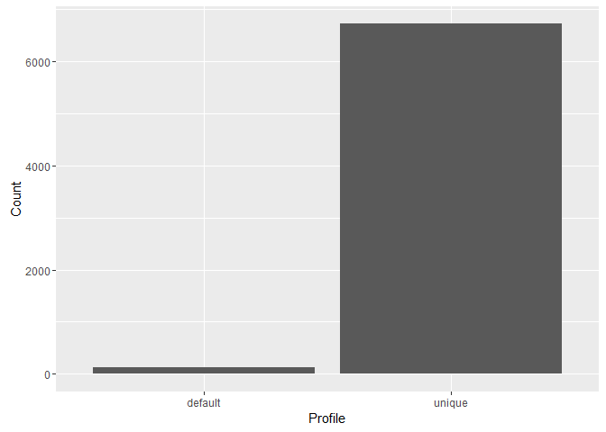
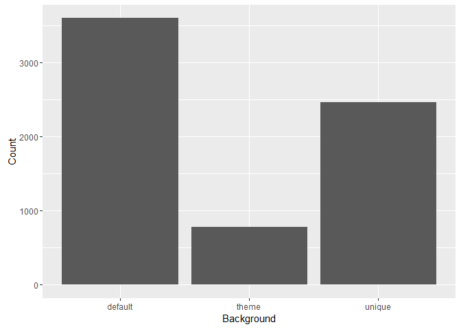
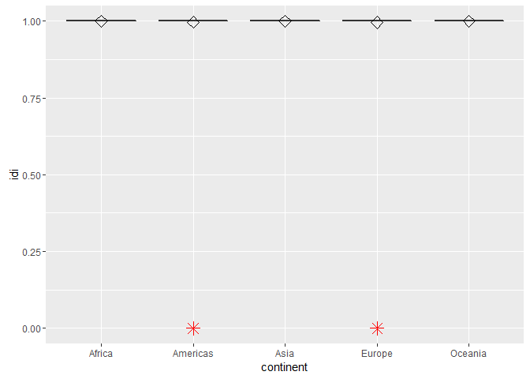

# Attribute analysis - Type of Image


## Connect to the database first


```r
library(RPostgreSQL)
```

```
## Loading required package: DBI
```

```r
# create a connection save the password that we can 'hide' it as best as we
# can by collapsing it
pw <- {
    ""
}

# loads the PostgreSQL driver
drv <- dbDriver("PostgreSQL")
# creates a connection to the postgres database note that 'con' will be used
# later in each connection to the database
con <- dbConnect(drv, dbname = "twitter", host = "localhost", port = 5432, user = "postgres", 
    password = "")
# user = postgres for UBUNTU

rm(pw)  # removes the password

# Connection success:
dbExistsTable(con, c("main", "experiment_tweets_shortest"))
```

```
## [1] TRUE
```

##Get the tweets


##Profile image type

```r
ggplot(data = users, aes(x = profile_image_type)) + geom_bar() + theme(legend.position = "none") + 
    xlab("Profile") + ylab("Count") + scale_fill_gradient(low = "midnightblue", 
    high = "aquamarine4")
```

<!-- -->

##Background image type

```r
ggplot(data = users, aes(x = background_image_type)) + geom_bar() + theme(legend.position = "none") + 
    xlab("Background") + ylab("Count") + scale_fill_gradient(low = "midnightblue", 
    high = "aquamarine4")
```

<!-- -->

##Score the data

###first create a score

```r
factor_no <- 3
exp_no <- 1
period_no <- 1

sql <- paste("DELETE FROM main.experiment_user_score where factor_no = 3", sep = "")
dbSendQuery(con, sql)
```

```
## <PostgreSQLResult>
```

```r
sql <- paste("INSERT INTO main.experiment_user_score(experiment_no, period_no, userid, factor_no, idi_full)", 
    sep = "")
sql <- paste(sql, "select experiment_no, period_no, userid, 3,", sep = "")
sql <- paste(sql, "case when profile_image_type = 'unique' then 1 else 0 end", 
    sep = "")
sql <- paste(sql, " from main.experiment_user", sep = "")
dbSendQuery(con, sql)
```

```
## <PostgreSQLResult>
```

###show results
No scaling required


```r
user.score <- dbGetQuery(con, "SELECT s.idi_full, tz.continent from main.experiment_user_score s join main.experiment_user u on u.userid = s.userid left join main.timezone_r tz on tz.timezone = u.timezone where s.factor_no = 3 and s.experiment_no = u.experiment_no and s.period_no = u.period_no")

# user.scaled_score <- data.frame(as.data.frame( scale(user.score[1] )),
# user.score[2])
colnames(user.score) = c("idi", "continent")

ggplot(user.score, aes(x = continent, y = idi)) + geom_boxplot(outlier.colour = "red", 
    outlier.shape = 8, outlier.size = 4) + stat_summary(fun.y = mean, geom = "point", 
    shape = 23, size = 4)
```

<!-- -->
##Outlier detection
Use Tukey's method to update all scores that were outliers


```r
markoutlier <- function(x, exp_no, period_no, factor_no) {
    sql <- paste("update main.experiment_user_score set outlier_full=1", sep = "")
    sql <- paste(sql, " where userid='", x["userid"], "'", sep = "")
    sql <- paste(sql, " and experiment_no=", exp_no, sep = "")
    sql <- paste(sql, " and period_no=", period_no, sep = "")
    sql <- paste(sql, " and factor_no=", factor_no, sep = "")
    dbSendQuery(con, sql, echo = FALSE)
}

# TODO outliers per continent
continents <- unique(user.score$continent)

user.continent_score <- user.score
outlier <- boxplot.stats(user.continent_score$idi, coef = 1.5)$out
user.outlier <- user.continent_score[user.continent_score$idi %in% outlier, 
    ]
apply(user.outlier, 1, markoutlier, exp_no = exp_no, period_no = period_no, 
    factor_no = factor_no)
```

```
## $`21`
## <PostgreSQLResult>
## 
## $`224`
## <PostgreSQLResult>
## 
## $`287`
## <PostgreSQLResult>
## 
## $`341`
## <PostgreSQLResult>
## 
## $`399`
## <PostgreSQLResult>
## 
## $`404`
## <PostgreSQLResult>
## 
## $`635`
## <PostgreSQLResult>
## 
## $`672`
## <PostgreSQLResult>
## 
## $`676`
## <PostgreSQLResult>
## 
## $`684`
## <PostgreSQLResult>
## 
## $`685`
## <PostgreSQLResult>
## 
## $`687`
## <PostgreSQLResult>
## 
## $`690`
## <PostgreSQLResult>
## 
## $`755`
## <PostgreSQLResult>
## 
## $`797`
## <PostgreSQLResult>
## 
## $`801`
## <PostgreSQLResult>
## 
## $`812`
## <PostgreSQLResult>
## 
## $`815`
## <PostgreSQLResult>
## 
## $`838`
## <PostgreSQLResult>
## 
## $`863`
## <PostgreSQLResult>
## 
## $`883`
## <PostgreSQLResult>
## 
## $`895`
## <PostgreSQLResult>
## 
## $`947`
## <PostgreSQLResult>
## 
## $`954`
## <PostgreSQLResult>
## 
## $`976`
## <PostgreSQLResult>
## 
## $`1089`
## <PostgreSQLResult>
## 
## $`1097`
## <PostgreSQLResult>
## 
## $`1101`
## <PostgreSQLResult>
## 
## $`1119`
## <PostgreSQLResult>
## 
## $`1148`
## <PostgreSQLResult>
## 
## $`1170`
## <PostgreSQLResult>
## 
## $`1176`
## <PostgreSQLResult>
## 
## $`1181`
## <PostgreSQLResult>
## 
## $`1278`
## <PostgreSQLResult>
## 
## $`1280`
## <PostgreSQLResult>
## 
## $`1304`
## <PostgreSQLResult>
## 
## $`1306`
## <PostgreSQLResult>
## 
## $`1335`
## <PostgreSQLResult>
## 
## $`1353`
## <PostgreSQLResult>
## 
## $`1369`
## <PostgreSQLResult>
## 
## $`1411`
## <PostgreSQLResult>
## 
## $`1414`
## <PostgreSQLResult>
## 
## $`1416`
## <PostgreSQLResult>
## 
## $`1422`
## <PostgreSQLResult>
## 
## $`1476`
## <PostgreSQLResult>
## 
## $`1501`
## <PostgreSQLResult>
## 
## $`1513`
## <PostgreSQLResult>
## 
## $`1542`
## <PostgreSQLResult>
## 
## $`1581`
## <PostgreSQLResult>
## 
## $`1585`
## <PostgreSQLResult>
## 
## $`1597`
## <PostgreSQLResult>
## 
## $`1632`
## <PostgreSQLResult>
## 
## $`1664`
## <PostgreSQLResult>
## 
## $`1693`
## <PostgreSQLResult>
## 
## $`1696`
## <PostgreSQLResult>
## 
## $`1708`
## <PostgreSQLResult>
## 
## $`1710`
## <PostgreSQLResult>
## 
## $`1727`
## <PostgreSQLResult>
## 
## $`1769`
## <PostgreSQLResult>
## 
## $`1772`
## <PostgreSQLResult>
## 
## $`1796`
## <PostgreSQLResult>
## 
## $`1810`
## <PostgreSQLResult>
## 
## $`1933`
## <PostgreSQLResult>
## 
## $`1942`
## <PostgreSQLResult>
## 
## $`1989`
## <PostgreSQLResult>
## 
## $`2109`
## <PostgreSQLResult>
## 
## $`2165`
## <PostgreSQLResult>
## 
## $`2187`
## <PostgreSQLResult>
## 
## $`2247`
## <PostgreSQLResult>
## 
## $`2310`
## <PostgreSQLResult>
## 
## $`2357`
## <PostgreSQLResult>
## 
## $`2465`
## <PostgreSQLResult>
## 
## $`2500`
## <PostgreSQLResult>
## 
## $`2654`
## <PostgreSQLResult>
## 
## $`2879`
## <PostgreSQLResult>
## 
## $`2923`
## <PostgreSQLResult>
## 
## $`2932`
## <PostgreSQLResult>
## 
## $`3012`
## <PostgreSQLResult>
## 
## $`3054`
## <PostgreSQLResult>
## 
## $`3063`
## <PostgreSQLResult>
## 
## $`3095`
## <PostgreSQLResult>
## 
## $`3116`
## <PostgreSQLResult>
## 
## $`3152`
## <PostgreSQLResult>
## 
## $`3201`
## <PostgreSQLResult>
## 
## $`3278`
## <PostgreSQLResult>
## 
## $`3280`
## <PostgreSQLResult>
## 
## $`3396`
## <PostgreSQLResult>
## 
## $`3405`
## <PostgreSQLResult>
## 
## $`3551`
## <PostgreSQLResult>
## 
## $`3553`
## <PostgreSQLResult>
## 
## $`3684`
## <PostgreSQLResult>
## 
## $`3818`
## <PostgreSQLResult>
## 
## $`4134`
## <PostgreSQLResult>
## 
## $`4197`
## <PostgreSQLResult>
## 
## $`4333`
## <PostgreSQLResult>
## 
## $`4428`
## <PostgreSQLResult>
## 
## $`4550`
## <PostgreSQLResult>
## 
## $`4648`
## <PostgreSQLResult>
## 
## $`4740`
## <PostgreSQLResult>
## 
## $`4838`
## <PostgreSQLResult>
## 
## $`4865`
## <PostgreSQLResult>
## 
## $`4873`
## <PostgreSQLResult>
## 
## $`4901`
## <PostgreSQLResult>
## 
## $`4908`
## <PostgreSQLResult>
## 
## $`4965`
## <PostgreSQLResult>
## 
## $`5185`
## <PostgreSQLResult>
## 
## $`5204`
## <PostgreSQLResult>
## 
## $`5243`
## <PostgreSQLResult>
## 
## $`5510`
## <PostgreSQLResult>
## 
## $`5552`
## <PostgreSQLResult>
## 
## $`5555`
## <PostgreSQLResult>
## 
## $`5560`
## <PostgreSQLResult>
## 
## $`5624`
## <PostgreSQLResult>
## 
## $`5751`
## <PostgreSQLResult>
## 
## $`5976`
## <PostgreSQLResult>
## 
## $`6017`
## <PostgreSQLResult>
## 
## $`6056`
## <PostgreSQLResult>
## 
## $`6148`
## <PostgreSQLResult>
## 
## $`6162`
## <PostgreSQLResult>
## 
## $`6239`
## <PostgreSQLResult>
## 
## $`6283`
## <PostgreSQLResult>
## 
## $`6295`
## <PostgreSQLResult>
## 
## $`6392`
## <PostgreSQLResult>
## 
## $`6531`
## <PostgreSQLResult>
## 
## $`6613`
## <PostgreSQLResult>
## 
## $`6659`
## <PostgreSQLResult>
## 
## $`6809`
## <PostgreSQLResult>
```

```r
na1 <- nrow(user.outlier)
# Outliers identified:
na1
```

```
## [1] 127
```

```r
# Propotion (%) of outliers:
round(na1/sum(!is.na(user.continent_score$idi)) * 100, 1)
```

```
## [1] 1.9
```

Total outliers: 127 out of 6846


