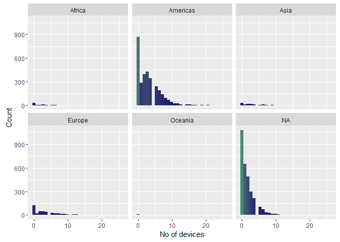

# Attribute analysis - No of Devices


## Connect to the database first


```r
library(RPostgreSQL)
```

```
## Loading required package: DBI
```

```r
# create a connection save the password that we can 'hide' it as best as we
# can by collapsing it
pw <- {
    ""
}

# loads the PostgreSQL driver
drv <- dbDriver("PostgreSQL")
# creates a connection to the postgres database note that 'con' will be used
# later in each connection to the database
con <- dbConnect(drv, dbname = "twitter", host = "localhost", port = 5432, user = "postgres", 
    password = "")
# user = postgres for UBUNTU

rm(pw)  # removes the password

# Connection success:
dbExistsTable(con, c("main", "experiment_tweets_shortest"))
```

```
## [1] TRUE
```

##Get the tweets


##Display no of devices overall

```r
ggplot(data = users, aes(x = no_of_devices)) + geom_histogram(aes(fill = ..count..)) + 
    theme(legend.position = "none") + xlab("No of devices") + ylab("Count") + 
    scale_fill_gradient(low = "midnightblue", high = "aquamarine4")
```

```
## `stat_bin()` using `bins = 30`. Pick better value with `binwidth`.
```

<!-- -->

##Display no of devices per continent

```r
ggplot(data = users, aes(x = no_of_devices)) + geom_histogram(aes(fill = ..count..)) + 
    theme(legend.position = "none") + facet_wrap(~continent) + xlab("No of devices") + 
    ylab("Count") + scale_fill_gradient(low = "midnightblue", high = "aquamarine4")
```

```
## `stat_bin()` using `bins = 30`. Pick better value with `binwidth`.
```

<!-- -->
##Display no of devices for only Africa

```r
a_users <- users[users$continent == "Africa", ]
ggplot(data = a_users, aes(x = no_of_devices)) + geom_histogram(aes(fill = ..count..)) + 
    theme(legend.position = "none") + facet_wrap(~continent) + xlab("No of devices") + 
    ylab("Count") + scale_fill_gradient(low = "midnightblue", high = "aquamarine4")
```

```
## `stat_bin()` using `bins = 30`. Pick better value with `binwidth`.
```

<!-- -->


