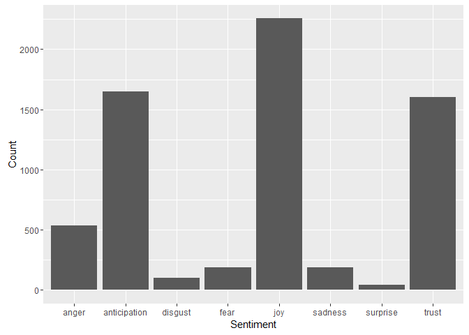
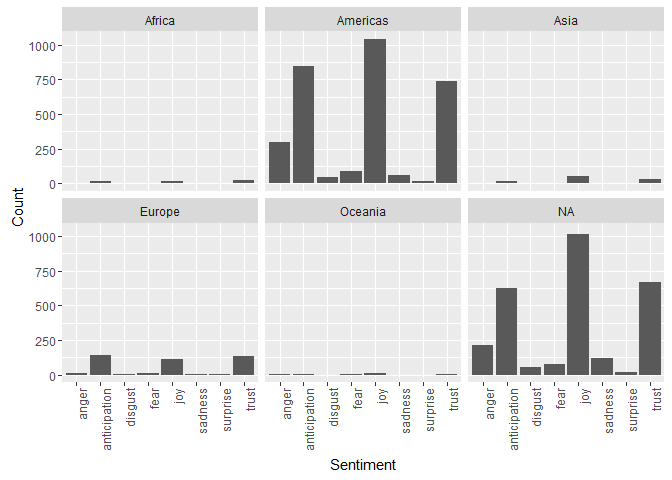
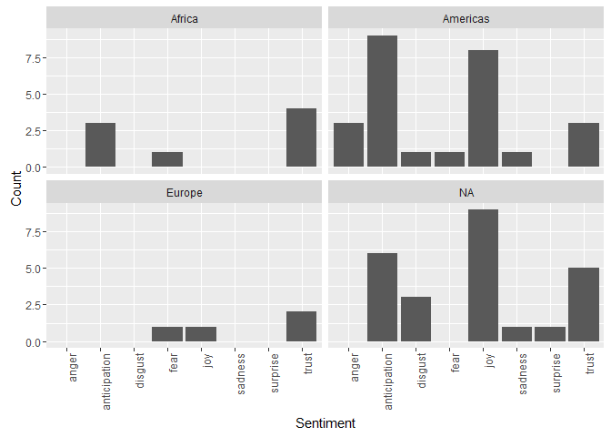
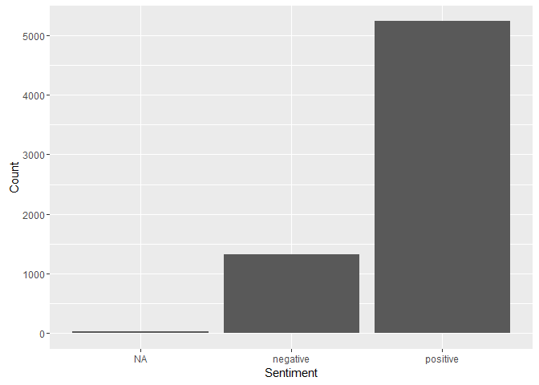
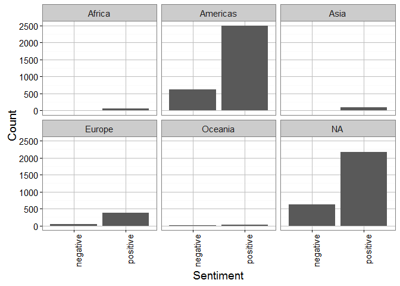
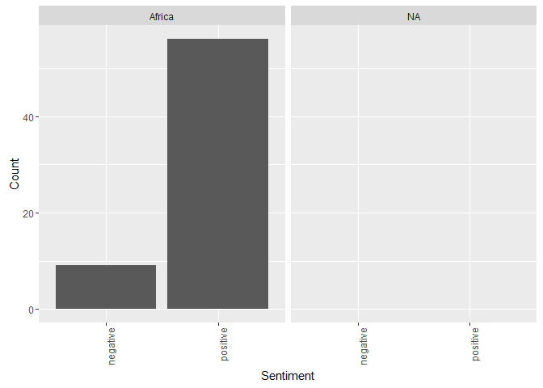
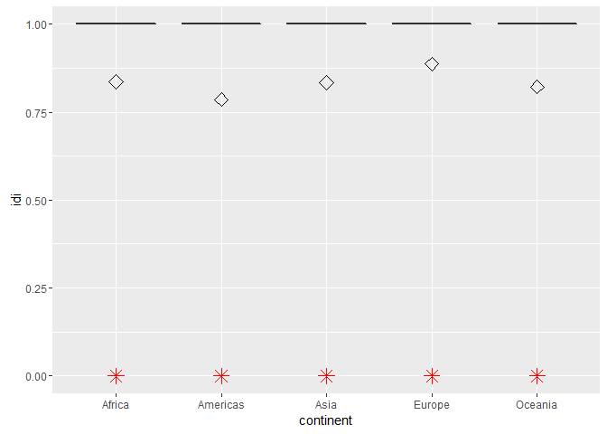

# Attribute analysis - Sentiment


## Connect to the database first


```
## Loading required package: DBI
```

```
## [1] TRUE
```

##Get the tweets


##Display overall sentiment

```r
user.s <- users[users$sentiment != "NA", ]
ggplot(data = user.s, aes(x = sentiment)) + geom_bar() + theme(legend.position = "none") + 
    xlab("Sentiment") + ylab("Count") + scale_fill_gradient(low = "midnightblue", 
    high = "aquamarine4")
```

<!-- -->

##Display sentiment per continent

```r
science_theme = theme(panel.grid.major = element_line(size = 0.5, color = "grey"), 
    axis.line = element_line(size = 0.7, color = "black"), legend.position = c(0.85, 
        0.7), text = element_text(size = 14))

sentiplot <- ggplot(data = user.s, aes(x = sentiment)) + geom_bar() + theme(legend.position = "none") + 
    facet_wrap(~continent) + xlab("Sentiment") + ylab("Count") + scale_fill_gradient(low = "midnightblue", 
    high = "aquamarine4") + # theme_bw(base_size = 12, base_family = 'Helvetica') +
theme_bw() + science_theme + theme(axis.text.x = element_text(angle = 90, hjust = 1))

sentiplot
```

<!-- -->

```r
svg(filename = "sentiplot.svg", width = 6, height = 4)
sentiplot
dev.off()
```

```
## png 
##   2
```
##Sentiment for only Africa

```r
a_users <- users[user.s$continent == "Africa", ]
ggplot(data = a_users, aes(x = sentiment)) + geom_bar() + theme(legend.position = "none") + 
    facet_wrap(~continent) + xlab("Sentiment") + ylab("Count") + scale_fill_gradient(low = "midnightblue", 
    high = "aquamarine4") + theme(axis.text.x = element_text(angle = 90, hjust = 1))
```

<!-- -->
###Positive, Negative sentiment

##Display overall sentiment

```r
user.s <- users[users$sentiment_pos_neg != "NA", ]
ggplot(data = users, aes(x = sentiment_pos_neg)) + geom_bar() + theme(legend.position = "none") + 
    xlab("Sentiment") + ylab("Count") + scale_fill_gradient(low = "midnightblue", 
    high = "aquamarine4")
```

<!-- -->

##Display sentiment per continent

```r
sentiplot2 <- ggplot(data = user.s, aes(x = sentiment_pos_neg)) + geom_bar() + 
    theme(legend.position = "none") + facet_wrap(~continent) + xlab("Sentiment") + 
    ylab("Count") + scale_fill_gradient(low = "midnightblue", high = "aquamarine4") + 
    theme_bw() + science_theme + theme(axis.text.x = element_text(angle = 90, 
    hjust = 1))

sentiplot2
```

<!-- -->

```r
svg(filename = "sentiplot2.svg", width = 6, height = 4)
sentiplot2
dev.off()
```

```
## png 
##   2
```
##Sentiment for only Africa

```r
a_user <- user.s[user.s$continent == "Africa", ]
ggplot(data = a_user, aes(x = sentiment_pos_neg)) + geom_bar() + theme(legend.position = "none") + 
    facet_wrap(~continent) + xlab("Sentiment") + ylab("Count") + scale_fill_gradient(low = "midnightblue", 
    high = "aquamarine4") + theme(axis.text.x = element_text(angle = 90, hjust = 1))
```

<!-- -->
##Score the data

###first create a score

```r
factor_no <- 6
exp_no <- 1
period_no <- 1

sql <- paste("DELETE FROM main.experiment_user_score where factor_no = 6", sep = "")
dbSendQuery(con, sql)
```

```
## <PostgreSQLResult>
```

```r
sql <- paste("INSERT INTO main.experiment_user_score(experiment_no, period_no, userid, factor_no, idi_full)", 
    sep = "")
sql <- paste(sql, "select experiment_no, period_no, userid, 6,", sep = "")
sql <- paste(sql, "case when sentiment_pos_neg = 'positive' then 1 else 0 end", 
    sep = "")
sql <- paste(sql, " from main.experiment_user", sep = "")
dbSendQuery(con, sql)
```

```
## <PostgreSQLResult>
```

###show results
No scaling required


```r
user.score <- dbGetQuery(con, "SELECT s.userid, s.idi_full, tz.continent from main.experiment_user_score s join main.experiment_user u on u.userid = s.userid left join main.timezone_r tz on tz.timezone = u.timezone where s.factor_no = 6 and s.experiment_no = u.experiment_no and s.period_no = u.period_no")

# user.scaled_score <- data.frame(as.data.frame( scale(user.score[1] )),
# user.score[2])
colnames(user.score) = c("userid", "idi", "continent")

ggplot(user.score, aes(x = continent, y = idi)) + geom_boxplot(outlier.colour = "red", 
    outlier.shape = 8, outlier.size = 4) + stat_summary(fun.y = mean, geom = "point", 
    shape = 23, size = 4)
```

<!-- -->
##Outlier detection
Use Tukey's method to update all scores that were outliers


```r
markoutlier <- function(x, exp_no, period_no, factor_no) {
    sql <- paste("update main.experiment_user_score set outlier_full=1", sep = "")
    sql <- paste(sql, " where userid='", x["userid"], "'", sep = "")
    sql <- paste(sql, " and experiment_no=", exp_no, sep = "")
    sql <- paste(sql, " and period_no=", period_no, sep = "")
    sql <- paste(sql, " and factor_no=", factor_no, sep = "")
    dbSendQuery(con, sql, echo = FALSE)
}

# TODO outliers per continent
continents <- unique(user.score$continent)

user.continent_score <- user.score
outlier <- boxplot.stats(user.continent_score$idi, coef = 1.5)$out
user.outlier <- user.continent_score[user.continent_score$idi %in% outlier, 
    ]
apply(user.outlier, 1, markoutlier, exp_no = exp_no, period_no = period_no, 
    factor_no = factor_no)
# na1 <- nrow(user.outlier) Outliers identified: na1 Propotion (%) of
# outliers: round(na1 / sum(!is.na(user.continent_score$idi))*100, 1)
```

Total outliers: 1610 out of 6846


