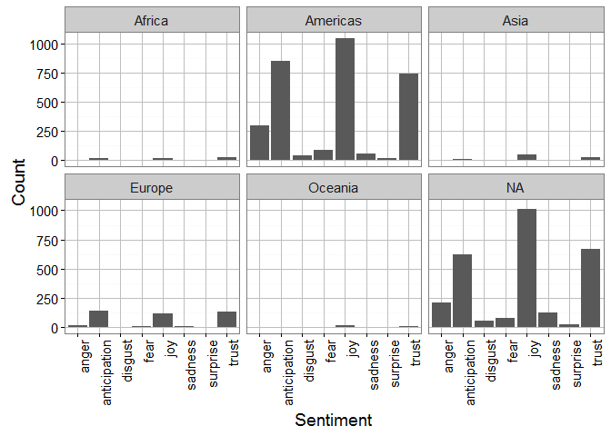

# Attribute analysis - Sentiment


## Connect to the database first


```r
library(RPostgreSQL)
```

```
## Loading required package: DBI
```

```r
# create a connection save the password that we can 'hide' it as best as we
# can by collapsing it
pw <- {
    ""
}

# loads the PostgreSQL driver
drv <- dbDriver("PostgreSQL")
# creates a connection to the postgres database note that 'con' will be used
# later in each connection to the database
con <- dbConnect(drv, dbname = "twitter", host = "localhost", port = 5432, user = "postgres", 
    password = "")
# user = postgres for UBUNTU

rm(pw)  # removes the password

# Connection success:
dbExistsTable(con, c("main", "experiment_tweets_shortest"))
```

```
## [1] TRUE
```

##Get the tweets


##Display overall sentiment

```r
user.s <- users[users$sentiment != "NA", ]
ggplot(data = user.s, aes(x = sentiment)) + geom_bar() + theme(legend.position = "none") + 
    xlab("Sentiment") + ylab("Count") + scale_fill_gradient(low = "midnightblue", 
    high = "aquamarine4")
```

<!-- -->

##Display sentiment per continent

```r
ggplot(data = user.s, aes(x = sentiment)) + geom_bar() + theme(legend.position = "none") + 
    facet_wrap(~continent) + xlab("Sentiment") + ylab("Count") + scale_fill_gradient(low = "midnightblue", 
    high = "aquamarine4") + theme(axis.text.x = element_text(angle = 90, hjust = 1))
```

<!-- -->
##Sentiment for only Africa

```r
a_users <- users[user.s$continent == "Africa", ]
ggplot(data = a_users, aes(x = sentiment)) + geom_bar() + theme(legend.position = "none") + 
    facet_wrap(~continent) + xlab("Sentiment") + ylab("Count") + scale_fill_gradient(low = "midnightblue", 
    high = "aquamarine4") + theme(axis.text.x = element_text(angle = 90, hjust = 1))
```

<!-- -->
###Positive, Negative sentiment

##Display overall sentiment

```r
user.s <- users[users$sentiment_pos_neg != "NA", ]
ggplot(data = users, aes(x = sentiment_pos_neg)) + geom_bar() + theme(legend.position = "none") + 
    xlab("Sentiment") + ylab("Count") + scale_fill_gradient(low = "midnightblue", 
    high = "aquamarine4")
```

<!-- -->

##Display sentiment per continent

```r
ggplot(data = user.s, aes(x = sentiment_pos_neg)) + geom_bar() + theme(legend.position = "none") + 
    facet_wrap(~continent) + xlab("Sentiment") + ylab("Count") + scale_fill_gradient(low = "midnightblue", 
    high = "aquamarine4") + theme(axis.text.x = element_text(angle = 90, hjust = 1))
```

<!-- -->
##Sentiment for only Africa

```r
a_user <- user.s[user.s$continent == "Africa", ]
ggplot(data = a_user, aes(x = sentiment_pos_neg)) + geom_bar() + theme(legend.position = "none") + 
    facet_wrap(~continent) + xlab("Sentiment") + ylab("Count") + scale_fill_gradient(low = "midnightblue", 
    high = "aquamarine4") + theme(axis.text.x = element_text(angle = 90, hjust = 1))
```

<!-- -->
##Score the data

###first create a score

```r
factor_no <- 6
exp_no <- 1
period_no <- 1

sql <- paste("DELETE FROM main.experiment_user_score where factor_no = 6", sep = "")
dbSendQuery(con, sql)
```

```
## <PostgreSQLResult>
```

```r
sql <- paste("INSERT INTO main.experiment_user_score(experiment_no, period_no, userid, factor_no, idi_full)", 
    sep = "")
sql <- paste(sql, "select experiment_no, period_no, userid, 6,", sep = "")
sql <- paste(sql, "case when sentiment_pos_neg = 'positive' then 1 else 0 end", 
    sep = "")
sql <- paste(sql, " from main.experiment_user", sep = "")
dbSendQuery(con, sql)
```

```
## <PostgreSQLResult>
```

###show results
No scaling required


```r
user.score <- dbGetQuery(con, "SELECT s.idi_full, tz.continent from main.experiment_user_score s join main.experiment_user u on u.userid = s.userid left join main.timezone_r tz on tz.timezone = u.timezone where s.factor_no = 6 and s.experiment_no = u.experiment_no and s.period_no = u.period_no")

# user.scaled_score <- data.frame(as.data.frame( scale(user.score[1] )),
# user.score[2])
colnames(user.score) = c("idi", "continent")

ggplot(user.score, aes(x = continent, y = idi)) + geom_boxplot(outlier.colour = "red", 
    outlier.shape = 8, outlier.size = 4) + stat_summary(fun.y = mean, geom = "point", 
    shape = 23, size = 4)
```

<!-- -->
##Outlier detection
Use Tukey's method to update all scores that were outliers


```r
markoutlier <- function(x, exp_no, period_no, factor_no) {
    sql <- paste("update main.experiment_user_score set outlier_full=1", sep = "")
    sql <- paste(sql, " where userid='", x["userid"], "'", sep = "")
    sql <- paste(sql, " and experiment_no=", exp_no, sep = "")
    sql <- paste(sql, " and period_no=", period_no, sep = "")
    sql <- paste(sql, " and factor_no=", factor_no, sep = "")
    dbSendQuery(con, sql, echo = FALSE)
}

# TODO outliers per continent
continents <- unique(user.score$continent)

user.continent_score <- user.score
outlier <- boxplot.stats(user.continent_score$idi, coef = 1.5)$out
user.outlier <- user.continent_score[user.continent_score$idi %in% outlier, 
    ]
apply(user.outlier, 1, markoutlier, exp_no = exp_no, period_no = period_no, 
    factor_no = factor_no)
```

```
## $`2`
## <PostgreSQLResult>
## 
## $`6`
## <PostgreSQLResult>
## 
## $`9`
## <PostgreSQLResult>
## 
## $`13`
## <PostgreSQLResult>
## 
## $`14`
## <PostgreSQLResult>
## 
## $`17`
## <PostgreSQLResult>
## 
## $`24`
## <PostgreSQLResult>
## 
## $`38`
## <PostgreSQLResult>
## 
## $`45`
## <PostgreSQLResult>
## 
## $`52`
## <PostgreSQLResult>
## 
## $`54`
## <PostgreSQLResult>
## 
## $`58`
## <PostgreSQLResult>
## 
## $`64`
## <PostgreSQLResult>
## 
## $`67`
## <PostgreSQLResult>
## 
## $`73`
## <PostgreSQLResult>
## 
## $`74`
## <PostgreSQLResult>
## 
## $`76`
## <PostgreSQLResult>
## 
## $`79`
## <PostgreSQLResult>
## 
## $`93`
## <PostgreSQLResult>
## 
## $`102`
## <PostgreSQLResult>
## 
## $`105`
## <PostgreSQLResult>
## 
## $`129`
## <PostgreSQLResult>
## 
## $`134`
## <PostgreSQLResult>
## 
## $`147`
## <PostgreSQLResult>
## 
## $`162`
## <PostgreSQLResult>
## 
## $`177`
## <PostgreSQLResult>
## 
## $`191`
## <PostgreSQLResult>
## 
## $`194`
## <PostgreSQLResult>
## 
## $`204`
## <PostgreSQLResult>
## 
## $`212`
## <PostgreSQLResult>
## 
## $`215`
## <PostgreSQLResult>
## 
## $`228`
## <PostgreSQLResult>
## 
## $`230`
## <PostgreSQLResult>
## 
## $`232`
## <PostgreSQLResult>
## 
## $`239`
## <PostgreSQLResult>
## 
## $`241`
## <PostgreSQLResult>
## 
## $`250`
## <PostgreSQLResult>
## 
## $`256`
## <PostgreSQLResult>
## 
## $`257`
## <PostgreSQLResult>
## 
## $`258`
## <PostgreSQLResult>
## 
## $`260`
## <PostgreSQLResult>
## 
## $`268`
## <PostgreSQLResult>
## 
## $`270`
## <PostgreSQLResult>
## 
## $`274`
## <PostgreSQLResult>
## 
## $`276`
## <PostgreSQLResult>
## 
## $`280`
## <PostgreSQLResult>
## 
## $`281`
## <PostgreSQLResult>
## 
## $`282`
## <PostgreSQLResult>
## 
## $`291`
## <PostgreSQLResult>
## 
## $`295`
## <PostgreSQLResult>
## 
## $`298`
## <PostgreSQLResult>
## 
## $`304`
## <PostgreSQLResult>
## 
## $`307`
## <PostgreSQLResult>
## 
## $`310`
## <PostgreSQLResult>
## 
## $`311`
## <PostgreSQLResult>
## 
## $`323`
## <PostgreSQLResult>
## 
## $`326`
## <PostgreSQLResult>
## 
## $`328`
## <PostgreSQLResult>
## 
## $`330`
## <PostgreSQLResult>
## 
## $`331`
## <PostgreSQLResult>
## 
## $`337`
## <PostgreSQLResult>
## 
## $`338`
## <PostgreSQLResult>
## 
## $`343`
## <PostgreSQLResult>
## 
## $`345`
## <PostgreSQLResult>
## 
## $`352`
## <PostgreSQLResult>
## 
## $`353`
## <PostgreSQLResult>
## 
## $`354`
## <PostgreSQLResult>
## 
## $`360`
## <PostgreSQLResult>
## 
## $`367`
## <PostgreSQLResult>
## 
## $`369`
## <PostgreSQLResult>
## 
## $`370`
## <PostgreSQLResult>
## 
## $`371`
## <PostgreSQLResult>
## 
## $`372`
## <PostgreSQLResult>
## 
## $`373`
## <PostgreSQLResult>
## 
## $`375`
## <PostgreSQLResult>
## 
## $`379`
## <PostgreSQLResult>
## 
## $`389`
## <PostgreSQLResult>
## 
## $`395`
## <PostgreSQLResult>
## 
## $`400`
## <PostgreSQLResult>
## 
## $`402`
## <PostgreSQLResult>
## 
## $`416`
## <PostgreSQLResult>
## 
## $`417`
## <PostgreSQLResult>
## 
## $`423`
## <PostgreSQLResult>
## 
## $`436`
## <PostgreSQLResult>
## 
## $`437`
## <PostgreSQLResult>
## 
## $`438`
## <PostgreSQLResult>
## 
## $`439`
## <PostgreSQLResult>
## 
## $`443`
## <PostgreSQLResult>
## 
## $`452`
## <PostgreSQLResult>
## 
## $`455`
## <PostgreSQLResult>
## 
## $`460`
## <PostgreSQLResult>
## 
## $`468`
## <PostgreSQLResult>
## 
## $`474`
## <PostgreSQLResult>
## 
## $`476`
## <PostgreSQLResult>
## 
## $`479`
## <PostgreSQLResult>
## 
## $`480`
## <PostgreSQLResult>
## 
## $`482`
## <PostgreSQLResult>
## 
## $`485`
## <PostgreSQLResult>
## 
## $`486`
## <PostgreSQLResult>
## 
## $`487`
## <PostgreSQLResult>
## 
## $`495`
## <PostgreSQLResult>
## 
## $`503`
## <PostgreSQLResult>
## 
## $`516`
## <PostgreSQLResult>
## 
## $`518`
## <PostgreSQLResult>
## 
## $`531`
## <PostgreSQLResult>
## 
## $`533`
## <PostgreSQLResult>
## 
## $`538`
## <PostgreSQLResult>
## 
## $`540`
## <PostgreSQLResult>
## 
## $`543`
## <PostgreSQLResult>
## 
## $`553`
## <PostgreSQLResult>
## 
## $`555`
## <PostgreSQLResult>
## 
## $`561`
## <PostgreSQLResult>
## 
## $`580`
## <PostgreSQLResult>
## 
## $`583`
## <PostgreSQLResult>
## 
## $`586`
## <PostgreSQLResult>
## 
## $`594`
## <PostgreSQLResult>
## 
## $`595`
## <PostgreSQLResult>
## 
## $`597`
## <PostgreSQLResult>
## 
## $`598`
## <PostgreSQLResult>
## 
## $`601`
## <PostgreSQLResult>
## 
## $`603`
## <PostgreSQLResult>
## 
## $`621`
## <PostgreSQLResult>
## 
## $`624`
## <PostgreSQLResult>
## 
## $`628`
## <PostgreSQLResult>
## 
## $`629`
## <PostgreSQLResult>
## 
## $`633`
## <PostgreSQLResult>
## 
## $`635`
## <PostgreSQLResult>
## 
## $`636`
## <PostgreSQLResult>
## 
## $`639`
## <PostgreSQLResult>
## 
## $`642`
## <PostgreSQLResult>
## 
## $`643`
## <PostgreSQLResult>
## 
## $`644`
## <PostgreSQLResult>
## 
## $`645`
## <PostgreSQLResult>
## 
## $`647`
## <PostgreSQLResult>
## 
## $`650`
## <PostgreSQLResult>
## 
## $`660`
## <PostgreSQLResult>
## 
## $`667`
## <PostgreSQLResult>
## 
## $`682`
## <PostgreSQLResult>
## 
## $`683`
## <PostgreSQLResult>
## 
## $`684`
## <PostgreSQLResult>
## 
## $`686`
## <PostgreSQLResult>
## 
## $`687`
## <PostgreSQLResult>
## 
## $`692`
## <PostgreSQLResult>
## 
## $`702`
## <PostgreSQLResult>
## 
## $`704`
## <PostgreSQLResult>
## 
## $`706`
## <PostgreSQLResult>
## 
## $`707`
## <PostgreSQLResult>
## 
## $`711`
## <PostgreSQLResult>
## 
## $`718`
## <PostgreSQLResult>
## 
## $`719`
## <PostgreSQLResult>
## 
## $`727`
## <PostgreSQLResult>
## 
## $`731`
## <PostgreSQLResult>
## 
## $`736`
## <PostgreSQLResult>
## 
## $`739`
## <PostgreSQLResult>
## 
## $`741`
## <PostgreSQLResult>
## 
## $`745`
## <PostgreSQLResult>
## 
## $`748`
## <PostgreSQLResult>
## 
## $`751`
## <PostgreSQLResult>
## 
## $`752`
## <PostgreSQLResult>
## 
## $`757`
## <PostgreSQLResult>
## 
## $`758`
## <PostgreSQLResult>
## 
## $`760`
## <PostgreSQLResult>
## 
## $`764`
## <PostgreSQLResult>
## 
## $`767`
## <PostgreSQLResult>
## 
## $`770`
## <PostgreSQLResult>
## 
## $`772`
## <PostgreSQLResult>
## 
## $`775`
## <PostgreSQLResult>
## 
## $`787`
## <PostgreSQLResult>
## 
## $`791`
## <PostgreSQLResult>
## 
## $`799`
## <PostgreSQLResult>
## 
## $`801`
## <PostgreSQLResult>
## 
## $`807`
## <PostgreSQLResult>
## 
## $`813`
## <PostgreSQLResult>
## 
## $`815`
## <PostgreSQLResult>
## 
## $`816`
## <PostgreSQLResult>
## 
## $`825`
## <PostgreSQLResult>
## 
## $`829`
## <PostgreSQLResult>
## 
## $`830`
## <PostgreSQLResult>
## 
## $`832`
## <PostgreSQLResult>
## 
## $`835`
## <PostgreSQLResult>
## 
## $`846`
## <PostgreSQLResult>
## 
## $`864`
## <PostgreSQLResult>
## 
## $`874`
## <PostgreSQLResult>
## 
## $`879`
## <PostgreSQLResult>
## 
## $`880`
## <PostgreSQLResult>
## 
## $`882`
## <PostgreSQLResult>
## 
## $`883`
## <PostgreSQLResult>
## 
## $`884`
## <PostgreSQLResult>
## 
## $`886`
## <PostgreSQLResult>
## 
## $`888`
## <PostgreSQLResult>
## 
## $`893`
## <PostgreSQLResult>
## 
## $`918`
## <PostgreSQLResult>
## 
## $`938`
## <PostgreSQLResult>
## 
## $`947`
## <PostgreSQLResult>
## 
## $`951`
## <PostgreSQLResult>
## 
## $`952`
## <PostgreSQLResult>
## 
## $`953`
## <PostgreSQLResult>
## 
## $`955`
## <PostgreSQLResult>
## 
## $`969`
## <PostgreSQLResult>
## 
## $`971`
## <PostgreSQLResult>
## 
## $`976`
## <PostgreSQLResult>
## 
## $`977`
## <PostgreSQLResult>
## 
## $`978`
## <PostgreSQLResult>
## 
## $`983`
## <PostgreSQLResult>
## 
## $`987`
## <PostgreSQLResult>
## 
## $`991`
## <PostgreSQLResult>
## 
## $`994`
## <PostgreSQLResult>
## 
## $`997`
## <PostgreSQLResult>
## 
## $`1001`
## <PostgreSQLResult>
## 
## $`1005`
## <PostgreSQLResult>
## 
## $`1006`
## <PostgreSQLResult>
## 
## $`1008`
## <PostgreSQLResult>
## 
## $`1013`
## <PostgreSQLResult>
## 
## $`1017`
## <PostgreSQLResult>
## 
## $`1023`
## <PostgreSQLResult>
## 
## $`1025`
## <PostgreSQLResult>
## 
## $`1027`
## <PostgreSQLResult>
## 
## $`1034`
## <PostgreSQLResult>
## 
## $`1038`
## <PostgreSQLResult>
## 
## $`1042`
## <PostgreSQLResult>
## 
## $`1043`
## <PostgreSQLResult>
## 
## $`1046`
## <PostgreSQLResult>
## 
## $`1048`
## <PostgreSQLResult>
## 
## $`1050`
## <PostgreSQLResult>
## 
## $`1060`
## <PostgreSQLResult>
## 
## $`1061`
## <PostgreSQLResult>
## 
## $`1063`
## <PostgreSQLResult>
## 
## $`1068`
## <PostgreSQLResult>
## 
## $`1069`
## <PostgreSQLResult>
## 
## $`1070`
## <PostgreSQLResult>
## 
## $`1074`
## <PostgreSQLResult>
## 
## $`1077`
## <PostgreSQLResult>
## 
## $`1078`
## <PostgreSQLResult>
## 
## $`1082`
## <PostgreSQLResult>
## 
## $`1087`
## <PostgreSQLResult>
## 
## $`1088`
## <PostgreSQLResult>
## 
## $`1089`
## <PostgreSQLResult>
## 
## $`1090`
## <PostgreSQLResult>
## 
## $`1100`
## <PostgreSQLResult>
## 
## $`1104`
## <PostgreSQLResult>
## 
## $`1105`
## <PostgreSQLResult>
## 
## $`1110`
## <PostgreSQLResult>
## 
## $`1116`
## <PostgreSQLResult>
## 
## $`1119`
## <PostgreSQLResult>
## 
## $`1134`
## <PostgreSQLResult>
## 
## $`1135`
## <PostgreSQLResult>
## 
## $`1139`
## <PostgreSQLResult>
## 
## $`1143`
## <PostgreSQLResult>
## 
## $`1144`
## <PostgreSQLResult>
## 
## $`1148`
## <PostgreSQLResult>
## 
## $`1158`
## <PostgreSQLResult>
## 
## $`1163`
## <PostgreSQLResult>
## 
## $`1169`
## <PostgreSQLResult>
## 
## $`1170`
## <PostgreSQLResult>
## 
## $`1174`
## <PostgreSQLResult>
## 
## $`1178`
## <PostgreSQLResult>
## 
## $`1182`
## <PostgreSQLResult>
## 
## $`1186`
## <PostgreSQLResult>
## 
## $`1188`
## <PostgreSQLResult>
## 
## $`1189`
## <PostgreSQLResult>
## 
## $`1194`
## <PostgreSQLResult>
## 
## $`1195`
## <PostgreSQLResult>
## 
## $`1198`
## <PostgreSQLResult>
## 
## $`1207`
## <PostgreSQLResult>
## 
## $`1213`
## <PostgreSQLResult>
## 
## $`1217`
## <PostgreSQLResult>
## 
## $`1221`
## <PostgreSQLResult>
## 
## $`1225`
## <PostgreSQLResult>
## 
## $`1229`
## <PostgreSQLResult>
## 
## $`1231`
## <PostgreSQLResult>
## 
## $`1234`
## <PostgreSQLResult>
## 
## $`1236`
## <PostgreSQLResult>
## 
## $`1245`
## <PostgreSQLResult>
## 
## $`1249`
## <PostgreSQLResult>
## 
## $`1250`
## <PostgreSQLResult>
## 
## $`1255`
## <PostgreSQLResult>
## 
## $`1257`
## <PostgreSQLResult>
## 
## $`1265`
## <PostgreSQLResult>
## 
## $`1267`
## <PostgreSQLResult>
## 
## $`1271`
## <PostgreSQLResult>
## 
## $`1272`
## <PostgreSQLResult>
## 
## $`1273`
## <PostgreSQLResult>
## 
## $`1274`
## <PostgreSQLResult>
## 
## $`1275`
## <PostgreSQLResult>
## 
## $`1276`
## <PostgreSQLResult>
## 
## $`1277`
## <PostgreSQLResult>
## 
## $`1278`
## <PostgreSQLResult>
## 
## $`1281`
## <PostgreSQLResult>
## 
## $`1286`
## <PostgreSQLResult>
## 
## $`1290`
## <PostgreSQLResult>
## 
## $`1296`
## <PostgreSQLResult>
## 
## $`1300`
## <PostgreSQLResult>
## 
## $`1301`
## <PostgreSQLResult>
## 
## $`1302`
## <PostgreSQLResult>
## 
## $`1303`
## <PostgreSQLResult>
## 
## $`1304`
## <PostgreSQLResult>
## 
## $`1305`
## <PostgreSQLResult>
## 
## $`1306`
## <PostgreSQLResult>
## 
## $`1307`
## <PostgreSQLResult>
## 
## $`1308`
## <PostgreSQLResult>
## 
## $`1309`
## <PostgreSQLResult>
## 
## $`1310`
## <PostgreSQLResult>
## 
## $`1311`
## <PostgreSQLResult>
## 
## $`1317`
## <PostgreSQLResult>
## 
## $`1322`
## <PostgreSQLResult>
## 
## $`1323`
## <PostgreSQLResult>
## 
## $`1324`
## <PostgreSQLResult>
## 
## $`1326`
## <PostgreSQLResult>
## 
## $`1329`
## <PostgreSQLResult>
## 
## $`1330`
## <PostgreSQLResult>
## 
## $`1331`
## <PostgreSQLResult>
## 
## $`1332`
## <PostgreSQLResult>
## 
## $`1333`
## <PostgreSQLResult>
## 
## $`1334`
## <PostgreSQLResult>
## 
## $`1339`
## <PostgreSQLResult>
## 
## $`1346`
## <PostgreSQLResult>
## 
## $`1349`
## <PostgreSQLResult>
## 
## $`1356`
## <PostgreSQLResult>
## 
## $`1357`
## <PostgreSQLResult>
## 
## $`1358`
## <PostgreSQLResult>
## 
## $`1365`
## <PostgreSQLResult>
## 
## $`1369`
## <PostgreSQLResult>
## 
## $`1371`
## <PostgreSQLResult>
## 
## $`1372`
## <PostgreSQLResult>
## 
## $`1382`
## <PostgreSQLResult>
## 
## $`1383`
## <PostgreSQLResult>
## 
## $`1384`
## <PostgreSQLResult>
## 
## $`1385`
## <PostgreSQLResult>
## 
## $`1387`
## <PostgreSQLResult>
## 
## $`1392`
## <PostgreSQLResult>
## 
## $`1394`
## <PostgreSQLResult>
## 
## $`1400`
## <PostgreSQLResult>
## 
## $`1401`
## <PostgreSQLResult>
## 
## $`1404`
## <PostgreSQLResult>
## 
## $`1409`
## <PostgreSQLResult>
## 
## $`1411`
## <PostgreSQLResult>
## 
## $`1412`
## <PostgreSQLResult>
## 
## $`1413`
## <PostgreSQLResult>
## 
## $`1426`
## <PostgreSQLResult>
## 
## $`1427`
## <PostgreSQLResult>
## 
## $`1432`
## <PostgreSQLResult>
## 
## $`1439`
## <PostgreSQLResult>
## 
## $`1455`
## <PostgreSQLResult>
## 
## $`1467`
## <PostgreSQLResult>
## 
## $`1468`
## <PostgreSQLResult>
## 
## $`1469`
## <PostgreSQLResult>
## 
## $`1470`
## <PostgreSQLResult>
## 
## $`1471`
## <PostgreSQLResult>
## 
## $`1472`
## <PostgreSQLResult>
## 
## $`1473`
## <PostgreSQLResult>
## 
## $`1474`
## <PostgreSQLResult>
## 
## $`1475`
## <PostgreSQLResult>
## 
## $`1476`
## <PostgreSQLResult>
## 
## $`1477`
## <PostgreSQLResult>
## 
## $`1481`
## <PostgreSQLResult>
## 
## $`1488`
## <PostgreSQLResult>
## 
## $`1490`
## <PostgreSQLResult>
## 
## $`1494`
## <PostgreSQLResult>
## 
## $`1495`
## <PostgreSQLResult>
## 
## $`1497`
## <PostgreSQLResult>
## 
## $`1498`
## <PostgreSQLResult>
## 
## $`1499`
## <PostgreSQLResult>
## 
## $`1506`
## <PostgreSQLResult>
## 
## $`1511`
## <PostgreSQLResult>
## 
## $`1516`
## <PostgreSQLResult>
## 
## $`1519`
## <PostgreSQLResult>
## 
## $`1524`
## <PostgreSQLResult>
## 
## $`1525`
## <PostgreSQLResult>
## 
## $`1526`
## <PostgreSQLResult>
## 
## $`1527`
## <PostgreSQLResult>
## 
## $`1528`
## <PostgreSQLResult>
## 
## $`1530`
## <PostgreSQLResult>
## 
## $`1532`
## <PostgreSQLResult>
## 
## $`1534`
## <PostgreSQLResult>
## 
## $`1538`
## <PostgreSQLResult>
## 
## $`1542`
## <PostgreSQLResult>
## 
## $`1543`
## <PostgreSQLResult>
## 
## $`1544`
## <PostgreSQLResult>
## 
## $`1547`
## <PostgreSQLResult>
## 
## $`1553`
## <PostgreSQLResult>
## 
## $`1554`
## <PostgreSQLResult>
## 
## $`1555`
## <PostgreSQLResult>
## 
## $`1556`
## <PostgreSQLResult>
## 
## $`1557`
## <PostgreSQLResult>
## 
## $`1558`
## <PostgreSQLResult>
## 
## $`1561`
## <PostgreSQLResult>
## 
## $`1564`
## <PostgreSQLResult>
## 
## $`1565`
## <PostgreSQLResult>
## 
## $`1574`
## <PostgreSQLResult>
## 
## $`1579`
## <PostgreSQLResult>
## 
## $`1580`
## <PostgreSQLResult>
## 
## $`1581`
## <PostgreSQLResult>
## 
## $`1582`
## <PostgreSQLResult>
## 
## $`1583`
## <PostgreSQLResult>
## 
## $`1584`
## <PostgreSQLResult>
## 
## $`1585`
## <PostgreSQLResult>
## 
## $`1586`
## <PostgreSQLResult>
## 
## $`1587`
## <PostgreSQLResult>
## 
## $`1589`
## <PostgreSQLResult>
## 
## $`1600`
## <PostgreSQLResult>
## 
## $`1602`
## <PostgreSQLResult>
## 
## $`1606`
## <PostgreSQLResult>
## 
## $`1607`
## <PostgreSQLResult>
## 
## $`1610`
## <PostgreSQLResult>
## 
## $`1611`
## <PostgreSQLResult>
## 
## $`1612`
## <PostgreSQLResult>
## 
## $`1621`
## <PostgreSQLResult>
## 
## $`1627`
## <PostgreSQLResult>
## 
## $`1628`
## <PostgreSQLResult>
## 
## $`1633`
## <PostgreSQLResult>
## 
## $`1640`
## <PostgreSQLResult>
## 
## $`1641`
## <PostgreSQLResult>
## 
## $`1642`
## <PostgreSQLResult>
## 
## $`1643`
## <PostgreSQLResult>
## 
## $`1644`
## <PostgreSQLResult>
## 
## $`1645`
## <PostgreSQLResult>
## 
## $`1652`
## <PostgreSQLResult>
## 
## $`1655`
## <PostgreSQLResult>
## 
## $`1657`
## <PostgreSQLResult>
## 
## $`1668`
## <PostgreSQLResult>
## 
## $`1669`
## <PostgreSQLResult>
## 
## $`1670`
## <PostgreSQLResult>
## 
## $`1671`
## <PostgreSQLResult>
## 
## $`1672`
## <PostgreSQLResult>
## 
## $`1673`
## <PostgreSQLResult>
## 
## $`1674`
## <PostgreSQLResult>
## 
## $`1675`
## <PostgreSQLResult>
## 
## $`1677`
## <PostgreSQLResult>
## 
## $`1679`
## <PostgreSQLResult>
## 
## $`1680`
## <PostgreSQLResult>
## 
## $`1682`
## <PostgreSQLResult>
## 
## $`1683`
## <PostgreSQLResult>
## 
## $`1684`
## <PostgreSQLResult>
## 
## $`1686`
## <PostgreSQLResult>
## 
## $`1700`
## <PostgreSQLResult>
## 
## $`1702`
## <PostgreSQLResult>
## 
## $`1703`
## <PostgreSQLResult>
## 
## $`1704`
## <PostgreSQLResult>
## 
## $`1705`
## <PostgreSQLResult>
## 
## $`1706`
## <PostgreSQLResult>
## 
## $`1707`
## <PostgreSQLResult>
## 
## $`1708`
## <PostgreSQLResult>
## 
## $`1709`
## <PostgreSQLResult>
## 
## $`1711`
## <PostgreSQLResult>
## 
## $`1717`
## <PostgreSQLResult>
## 
## $`1719`
## <PostgreSQLResult>
## 
## $`1725`
## <PostgreSQLResult>
## 
## $`1730`
## <PostgreSQLResult>
## 
## $`1733`
## <PostgreSQLResult>
## 
## $`1735`
## <PostgreSQLResult>
## 
## $`1736`
## <PostgreSQLResult>
## 
## $`1737`
## <PostgreSQLResult>
## 
## $`1738`
## <PostgreSQLResult>
## 
## $`1739`
## <PostgreSQLResult>
## 
## $`1740`
## <PostgreSQLResult>
## 
## $`1744`
## <PostgreSQLResult>
## 
## $`1748`
## <PostgreSQLResult>
## 
## $`1754`
## <PostgreSQLResult>
## 
## $`1759`
## <PostgreSQLResult>
## 
## $`1760`
## <PostgreSQLResult>
## 
## $`1761`
## <PostgreSQLResult>
## 
## $`1767`
## <PostgreSQLResult>
## 
## $`1768`
## <PostgreSQLResult>
## 
## $`1769`
## <PostgreSQLResult>
## 
## $`1770`
## <PostgreSQLResult>
## 
## $`1771`
## <PostgreSQLResult>
## 
## $`1772`
## <PostgreSQLResult>
## 
## $`1773`
## <PostgreSQLResult>
## 
## $`1774`
## <PostgreSQLResult>
## 
## $`1775`
## <PostgreSQLResult>
## 
## $`1776`
## <PostgreSQLResult>
## 
## $`1777`
## <PostgreSQLResult>
## 
## $`1787`
## <PostgreSQLResult>
## 
## $`1788`
## <PostgreSQLResult>
## 
## $`1791`
## <PostgreSQLResult>
## 
## $`1792`
## <PostgreSQLResult>
## 
## $`1796`
## <PostgreSQLResult>
## 
## $`1797`
## <PostgreSQLResult>
## 
## $`1801`
## <PostgreSQLResult>
## 
## $`1802`
## <PostgreSQLResult>
## 
## $`1803`
## <PostgreSQLResult>
## 
## $`1808`
## <PostgreSQLResult>
## 
## $`1812`
## <PostgreSQLResult>
## 
## $`1814`
## <PostgreSQLResult>
## 
## $`1829`
## <PostgreSQLResult>
## 
## $`1830`
## <PostgreSQLResult>
## 
## $`1831`
## <PostgreSQLResult>
## 
## $`1846`
## <PostgreSQLResult>
## 
## $`1851`
## <PostgreSQLResult>
## 
## $`1872`
## <PostgreSQLResult>
## 
## $`1882`
## <PostgreSQLResult>
## 
## $`1884`
## <PostgreSQLResult>
## 
## $`1892`
## <PostgreSQLResult>
## 
## $`1894`
## <PostgreSQLResult>
## 
## $`1911`
## <PostgreSQLResult>
## 
## $`1920`
## <PostgreSQLResult>
## 
## $`1924`
## <PostgreSQLResult>
## 
## $`1926`
## <PostgreSQLResult>
## 
## $`1930`
## <PostgreSQLResult>
## 
## $`1932`
## <PostgreSQLResult>
## 
## $`1933`
## <PostgreSQLResult>
## 
## $`1936`
## <PostgreSQLResult>
## 
## $`1942`
## <PostgreSQLResult>
## 
## $`1954`
## <PostgreSQLResult>
## 
## $`1963`
## <PostgreSQLResult>
## 
## $`1964`
## <PostgreSQLResult>
## 
## $`1971`
## <PostgreSQLResult>
## 
## $`1976`
## <PostgreSQLResult>
## 
## $`1978`
## <PostgreSQLResult>
## 
## $`1988`
## <PostgreSQLResult>
## 
## $`2001`
## <PostgreSQLResult>
## 
## $`2005`
## <PostgreSQLResult>
## 
## $`2010`
## <PostgreSQLResult>
## 
## $`2028`
## <PostgreSQLResult>
## 
## $`2032`
## <PostgreSQLResult>
## 
## $`2033`
## <PostgreSQLResult>
## 
## $`2036`
## <PostgreSQLResult>
## 
## $`2037`
## <PostgreSQLResult>
## 
## $`2047`
## <PostgreSQLResult>
## 
## $`2076`
## <PostgreSQLResult>
## 
## $`2077`
## <PostgreSQLResult>
## 
## $`2079`
## <PostgreSQLResult>
## 
## $`2085`
## <PostgreSQLResult>
## 
## $`2094`
## <PostgreSQLResult>
## 
## $`2113`
## <PostgreSQLResult>
## 
## $`2115`
## <PostgreSQLResult>
## 
## $`2122`
## <PostgreSQLResult>
## 
## $`2128`
## <PostgreSQLResult>
## 
## $`2137`
## <PostgreSQLResult>
## 
## $`2141`
## <PostgreSQLResult>
## 
## $`2142`
## <PostgreSQLResult>
## 
## $`2143`
## <PostgreSQLResult>
## 
## $`2150`
## <PostgreSQLResult>
## 
## $`2160`
## <PostgreSQLResult>
## 
## $`2161`
## <PostgreSQLResult>
## 
## $`2167`
## <PostgreSQLResult>
## 
## $`2202`
## <PostgreSQLResult>
## 
## $`2212`
## <PostgreSQLResult>
## 
## $`2213`
## <PostgreSQLResult>
## 
## $`2218`
## <PostgreSQLResult>
## 
## $`2234`
## <PostgreSQLResult>
## 
## $`2254`
## <PostgreSQLResult>
## 
## $`2276`
## <PostgreSQLResult>
## 
## $`2298`
## <PostgreSQLResult>
## 
## $`2301`
## <PostgreSQLResult>
## 
## $`2315`
## <PostgreSQLResult>
## 
## $`2317`
## <PostgreSQLResult>
## 
## $`2334`
## <PostgreSQLResult>
## 
## $`2339`
## <PostgreSQLResult>
## 
## $`2343`
## <PostgreSQLResult>
## 
## $`2355`
## <PostgreSQLResult>
## 
## $`2356`
## <PostgreSQLResult>
## 
## $`2357`
## <PostgreSQLResult>
## 
## $`2358`
## <PostgreSQLResult>
## 
## $`2361`
## <PostgreSQLResult>
## 
## $`2364`
## <PostgreSQLResult>
## 
## $`2369`
## <PostgreSQLResult>
## 
## $`2376`
## <PostgreSQLResult>
## 
## $`2377`
## <PostgreSQLResult>
## 
## $`2393`
## <PostgreSQLResult>
## 
## $`2404`
## <PostgreSQLResult>
## 
## $`2427`
## <PostgreSQLResult>
## 
## $`2429`
## <PostgreSQLResult>
## 
## $`2442`
## <PostgreSQLResult>
## 
## $`2443`
## <PostgreSQLResult>
## 
## $`2451`
## <PostgreSQLResult>
## 
## $`2452`
## <PostgreSQLResult>
## 
## $`2453`
## <PostgreSQLResult>
## 
## $`2461`
## <PostgreSQLResult>
## 
## $`2489`
## <PostgreSQLResult>
## 
## $`2490`
## <PostgreSQLResult>
## 
## $`2493`
## <PostgreSQLResult>
## 
## $`2508`
## <PostgreSQLResult>
## 
## $`2510`
## <PostgreSQLResult>
## 
## $`2521`
## <PostgreSQLResult>
## 
## $`2524`
## <PostgreSQLResult>
## 
## $`2525`
## <PostgreSQLResult>
## 
## $`2527`
## <PostgreSQLResult>
## 
## $`2530`
## <PostgreSQLResult>
## 
## $`2533`
## <PostgreSQLResult>
## 
## $`2534`
## <PostgreSQLResult>
## 
## $`2544`
## <PostgreSQLResult>
## 
## $`2545`
## <PostgreSQLResult>
## 
## $`2562`
## <PostgreSQLResult>
## 
## $`2575`
## <PostgreSQLResult>
## 
## $`2581`
## <PostgreSQLResult>
## 
## $`2590`
## <PostgreSQLResult>
## 
## $`2596`
## <PostgreSQLResult>
## 
## $`2605`
## <PostgreSQLResult>
## 
## $`2620`
## <PostgreSQLResult>
## 
## $`2621`
## <PostgreSQLResult>
## 
## $`2623`
## <PostgreSQLResult>
## 
## $`2624`
## <PostgreSQLResult>
## 
## $`2626`
## <PostgreSQLResult>
## 
## $`2632`
## <PostgreSQLResult>
## 
## $`2634`
## <PostgreSQLResult>
## 
## $`2635`
## <PostgreSQLResult>
## 
## $`2649`
## <PostgreSQLResult>
## 
## $`2666`
## <PostgreSQLResult>
## 
## $`2667`
## <PostgreSQLResult>
## 
## $`2669`
## <PostgreSQLResult>
## 
## $`2673`
## <PostgreSQLResult>
## 
## $`2675`
## <PostgreSQLResult>
## 
## $`2688`
## <PostgreSQLResult>
## 
## $`2706`
## <PostgreSQLResult>
## 
## $`2707`
## <PostgreSQLResult>
## 
## $`2716`
## <PostgreSQLResult>
## 
## $`2719`
## <PostgreSQLResult>
## 
## $`2720`
## <PostgreSQLResult>
## 
## $`2728`
## <PostgreSQLResult>
## 
## $`2729`
## <PostgreSQLResult>
## 
## $`2732`
## <PostgreSQLResult>
## 
## $`2733`
## <PostgreSQLResult>
## 
## $`2735`
## <PostgreSQLResult>
## 
## $`2737`
## <PostgreSQLResult>
## 
## $`2740`
## <PostgreSQLResult>
## 
## $`2745`
## <PostgreSQLResult>
## 
## $`2746`
## <PostgreSQLResult>
## 
## $`2753`
## <PostgreSQLResult>
## 
## $`2756`
## <PostgreSQLResult>
## 
## $`2763`
## <PostgreSQLResult>
## 
## $`2782`
## <PostgreSQLResult>
## 
## $`2785`
## <PostgreSQLResult>
## 
## $`2786`
## <PostgreSQLResult>
## 
## $`2792`
## <PostgreSQLResult>
## 
## $`2794`
## <PostgreSQLResult>
## 
## $`2799`
## <PostgreSQLResult>
## 
## $`2812`
## <PostgreSQLResult>
## 
## $`2813`
## <PostgreSQLResult>
## 
## $`2832`
## <PostgreSQLResult>
## 
## $`2836`
## <PostgreSQLResult>
## 
## $`2841`
## <PostgreSQLResult>
## 
## $`2843`
## <PostgreSQLResult>
## 
## $`2846`
## <PostgreSQLResult>
## 
## $`2849`
## <PostgreSQLResult>
## 
## $`2860`
## <PostgreSQLResult>
## 
## $`2892`
## <PostgreSQLResult>
## 
## $`2893`
## <PostgreSQLResult>
## 
## $`2894`
## <PostgreSQLResult>
## 
## $`2895`
## <PostgreSQLResult>
## 
## $`2910`
## <PostgreSQLResult>
## 
## $`2914`
## <PostgreSQLResult>
## 
## $`2917`
## <PostgreSQLResult>
## 
## $`2926`
## <PostgreSQLResult>
## 
## $`2930`
## <PostgreSQLResult>
## 
## $`2931`
## <PostgreSQLResult>
## 
## $`2932`
## <PostgreSQLResult>
## 
## $`2933`
## <PostgreSQLResult>
## 
## $`2941`
## <PostgreSQLResult>
## 
## $`2945`
## <PostgreSQLResult>
## 
## $`2953`
## <PostgreSQLResult>
## 
## $`2958`
## <PostgreSQLResult>
## 
## $`2969`
## <PostgreSQLResult>
## 
## $`2972`
## <PostgreSQLResult>
## 
## $`2973`
## <PostgreSQLResult>
## 
## $`2979`
## <PostgreSQLResult>
## 
## $`2982`
## <PostgreSQLResult>
## 
## $`2986`
## <PostgreSQLResult>
## 
## $`2988`
## <PostgreSQLResult>
## 
## $`2992`
## <PostgreSQLResult>
## 
## $`2997`
## <PostgreSQLResult>
## 
## $`2998`
## <PostgreSQLResult>
## 
## $`3001`
## <PostgreSQLResult>
## 
## $`3003`
## <PostgreSQLResult>
## 
## $`3004`
## <PostgreSQLResult>
## 
## $`3006`
## <PostgreSQLResult>
## 
## $`3010`
## <PostgreSQLResult>
## 
## $`3030`
## <PostgreSQLResult>
## 
## $`3037`
## <PostgreSQLResult>
## 
## $`3040`
## <PostgreSQLResult>
## 
## $`3048`
## <PostgreSQLResult>
## 
## $`3049`
## <PostgreSQLResult>
## 
## $`3051`
## <PostgreSQLResult>
## 
## $`3052`
## <PostgreSQLResult>
## 
## $`3058`
## <PostgreSQLResult>
## 
## $`3061`
## <PostgreSQLResult>
## 
## $`3063`
## <PostgreSQLResult>
## 
## $`3064`
## <PostgreSQLResult>
## 
## $`3074`
## <PostgreSQLResult>
## 
## $`3079`
## <PostgreSQLResult>
## 
## $`3084`
## <PostgreSQLResult>
## 
## $`3101`
## <PostgreSQLResult>
## 
## $`3102`
## <PostgreSQLResult>
## 
## $`3103`
## <PostgreSQLResult>
## 
## $`3105`
## <PostgreSQLResult>
## 
## $`3118`
## <PostgreSQLResult>
## 
## $`3121`
## <PostgreSQLResult>
## 
## $`3123`
## <PostgreSQLResult>
## 
## $`3127`
## <PostgreSQLResult>
## 
## $`3129`
## <PostgreSQLResult>
## 
## $`3136`
## <PostgreSQLResult>
## 
## $`3138`
## <PostgreSQLResult>
## 
## $`3148`
## <PostgreSQLResult>
## 
## $`3150`
## <PostgreSQLResult>
## 
## $`3153`
## <PostgreSQLResult>
## 
## $`3156`
## <PostgreSQLResult>
## 
## $`3167`
## <PostgreSQLResult>
## 
## $`3168`
## <PostgreSQLResult>
## 
## $`3171`
## <PostgreSQLResult>
## 
## $`3177`
## <PostgreSQLResult>
## 
## $`3185`
## <PostgreSQLResult>
## 
## $`3194`
## <PostgreSQLResult>
## 
## $`3201`
## <PostgreSQLResult>
## 
## $`3204`
## <PostgreSQLResult>
## 
## $`3215`
## <PostgreSQLResult>
## 
## $`3217`
## <PostgreSQLResult>
## 
## $`3227`
## <PostgreSQLResult>
## 
## $`3231`
## <PostgreSQLResult>
## 
## $`3234`
## <PostgreSQLResult>
## 
## $`3235`
## <PostgreSQLResult>
## 
## $`3244`
## <PostgreSQLResult>
## 
## $`3246`
## <PostgreSQLResult>
## 
## $`3247`
## <PostgreSQLResult>
## 
## $`3254`
## <PostgreSQLResult>
## 
## $`3261`
## <PostgreSQLResult>
## 
## $`3269`
## <PostgreSQLResult>
## 
## $`3278`
## <PostgreSQLResult>
## 
## $`3279`
## <PostgreSQLResult>
## 
## $`3283`
## <PostgreSQLResult>
## 
## $`3288`
## <PostgreSQLResult>
## 
## $`3302`
## <PostgreSQLResult>
## 
## $`3305`
## <PostgreSQLResult>
## 
## $`3306`
## <PostgreSQLResult>
## 
## $`3321`
## <PostgreSQLResult>
## 
## $`3324`
## <PostgreSQLResult>
## 
## $`3326`
## <PostgreSQLResult>
## 
## $`3327`
## <PostgreSQLResult>
## 
## $`3328`
## <PostgreSQLResult>
## 
## $`3333`
## <PostgreSQLResult>
## 
## $`3343`
## <PostgreSQLResult>
## 
## $`3350`
## <PostgreSQLResult>
## 
## $`3356`
## <PostgreSQLResult>
## 
## $`3363`
## <PostgreSQLResult>
## 
## $`3373`
## <PostgreSQLResult>
## 
## $`3382`
## <PostgreSQLResult>
## 
## $`3386`
## <PostgreSQLResult>
## 
## $`3389`
## <PostgreSQLResult>
## 
## $`3390`
## <PostgreSQLResult>
## 
## $`3398`
## <PostgreSQLResult>
## 
## $`3401`
## <PostgreSQLResult>
## 
## $`3404`
## <PostgreSQLResult>
## 
## $`3405`
## <PostgreSQLResult>
## 
## $`3412`
## <PostgreSQLResult>
## 
## $`3413`
## <PostgreSQLResult>
## 
## $`3427`
## <PostgreSQLResult>
## 
## $`3428`
## <PostgreSQLResult>
## 
## $`3429`
## <PostgreSQLResult>
## 
## $`3430`
## <PostgreSQLResult>
## 
## $`3433`
## <PostgreSQLResult>
## 
## $`3446`
## <PostgreSQLResult>
## 
## $`3451`
## <PostgreSQLResult>
## 
## $`3453`
## <PostgreSQLResult>
## 
## $`3458`
## <PostgreSQLResult>
## 
## $`3459`
## <PostgreSQLResult>
## 
## $`3464`
## <PostgreSQLResult>
## 
## $`3469`
## <PostgreSQLResult>
## 
## $`3470`
## <PostgreSQLResult>
## 
## $`3472`
## <PostgreSQLResult>
## 
## $`3477`
## <PostgreSQLResult>
## 
## $`3480`
## <PostgreSQLResult>
## 
## $`3481`
## <PostgreSQLResult>
## 
## $`3484`
## <PostgreSQLResult>
## 
## $`3485`
## <PostgreSQLResult>
## 
## $`3494`
## <PostgreSQLResult>
## 
## $`3499`
## <PostgreSQLResult>
## 
## $`3501`
## <PostgreSQLResult>
## 
## $`3502`
## <PostgreSQLResult>
## 
## $`3520`
## <PostgreSQLResult>
## 
## $`3524`
## <PostgreSQLResult>
## 
## $`3527`
## <PostgreSQLResult>
## 
## $`3528`
## <PostgreSQLResult>
## 
## $`3530`
## <PostgreSQLResult>
## 
## $`3539`
## <PostgreSQLResult>
## 
## $`3542`
## <PostgreSQLResult>
## 
## $`3544`
## <PostgreSQLResult>
## 
## $`3551`
## <PostgreSQLResult>
## 
## $`3555`
## <PostgreSQLResult>
## 
## $`3556`
## <PostgreSQLResult>
## 
## $`3562`
## <PostgreSQLResult>
## 
## $`3563`
## <PostgreSQLResult>
## 
## $`3565`
## <PostgreSQLResult>
## 
## $`3577`
## <PostgreSQLResult>
## 
## $`3595`
## <PostgreSQLResult>
## 
## $`3596`
## <PostgreSQLResult>
## 
## $`3606`
## <PostgreSQLResult>
## 
## $`3617`
## <PostgreSQLResult>
## 
## $`3621`
## <PostgreSQLResult>
## 
## $`3623`
## <PostgreSQLResult>
## 
## $`3626`
## <PostgreSQLResult>
## 
## $`3628`
## <PostgreSQLResult>
## 
## $`3630`
## <PostgreSQLResult>
## 
## $`3634`
## <PostgreSQLResult>
## 
## $`3641`
## <PostgreSQLResult>
## 
## $`3643`
## <PostgreSQLResult>
## 
## $`3647`
## <PostgreSQLResult>
## 
## $`3648`
## <PostgreSQLResult>
## 
## $`3651`
## <PostgreSQLResult>
## 
## $`3657`
## <PostgreSQLResult>
## 
## $`3658`
## <PostgreSQLResult>
## 
## $`3663`
## <PostgreSQLResult>
## 
## $`3664`
## <PostgreSQLResult>
## 
## $`3668`
## <PostgreSQLResult>
## 
## $`3669`
## <PostgreSQLResult>
## 
## $`3684`
## <PostgreSQLResult>
## 
## $`3686`
## <PostgreSQLResult>
## 
## $`3693`
## <PostgreSQLResult>
## 
## $`3698`
## <PostgreSQLResult>
## 
## $`3700`
## <PostgreSQLResult>
## 
## $`3706`
## <PostgreSQLResult>
## 
## $`3709`
## <PostgreSQLResult>
## 
## $`3711`
## <PostgreSQLResult>
## 
## $`3713`
## <PostgreSQLResult>
## 
## $`3720`
## <PostgreSQLResult>
## 
## $`3724`
## <PostgreSQLResult>
## 
## $`3726`
## <PostgreSQLResult>
## 
## $`3728`
## <PostgreSQLResult>
## 
## $`3729`
## <PostgreSQLResult>
## 
## $`3730`
## <PostgreSQLResult>
## 
## $`3735`
## <PostgreSQLResult>
## 
## $`3742`
## <PostgreSQLResult>
## 
## $`3748`
## <PostgreSQLResult>
## 
## $`3749`
## <PostgreSQLResult>
## 
## $`3750`
## <PostgreSQLResult>
## 
## $`3755`
## <PostgreSQLResult>
## 
## $`3757`
## <PostgreSQLResult>
## 
## $`3761`
## <PostgreSQLResult>
## 
## $`3768`
## <PostgreSQLResult>
## 
## $`3771`
## <PostgreSQLResult>
## 
## $`3773`
## <PostgreSQLResult>
## 
## $`3780`
## <PostgreSQLResult>
## 
## $`3781`
## <PostgreSQLResult>
## 
## $`3782`
## <PostgreSQLResult>
## 
## $`3787`
## <PostgreSQLResult>
## 
## $`3788`
## <PostgreSQLResult>
## 
## $`3789`
## <PostgreSQLResult>
## 
## $`3790`
## <PostgreSQLResult>
## 
## $`3791`
## <PostgreSQLResult>
## 
## $`3792`
## <PostgreSQLResult>
## 
## $`3794`
## <PostgreSQLResult>
## 
## $`3796`
## <PostgreSQLResult>
## 
## $`3809`
## <PostgreSQLResult>
## 
## $`3810`
## <PostgreSQLResult>
## 
## $`3820`
## <PostgreSQLResult>
## 
## $`3821`
## <PostgreSQLResult>
## 
## $`3822`
## <PostgreSQLResult>
## 
## $`3826`
## <PostgreSQLResult>
## 
## $`3829`
## <PostgreSQLResult>
## 
## $`3831`
## <PostgreSQLResult>
## 
## $`3834`
## <PostgreSQLResult>
## 
## $`3839`
## <PostgreSQLResult>
## 
## $`3844`
## <PostgreSQLResult>
## 
## $`3846`
## <PostgreSQLResult>
## 
## $`3851`
## <PostgreSQLResult>
## 
## $`3857`
## <PostgreSQLResult>
## 
## $`3864`
## <PostgreSQLResult>
## 
## $`3867`
## <PostgreSQLResult>
## 
## $`3874`
## <PostgreSQLResult>
## 
## $`3876`
## <PostgreSQLResult>
## 
## $`3888`
## <PostgreSQLResult>
## 
## $`3896`
## <PostgreSQLResult>
## 
## $`3897`
## <PostgreSQLResult>
## 
## $`3899`
## <PostgreSQLResult>
## 
## $`3900`
## <PostgreSQLResult>
## 
## $`3902`
## <PostgreSQLResult>
## 
## $`3904`
## <PostgreSQLResult>
## 
## $`3908`
## <PostgreSQLResult>
## 
## $`3912`
## <PostgreSQLResult>
## 
## $`3913`
## <PostgreSQLResult>
## 
## $`3917`
## <PostgreSQLResult>
## 
## $`3921`
## <PostgreSQLResult>
## 
## $`3929`
## <PostgreSQLResult>
## 
## $`3930`
## <PostgreSQLResult>
## 
## $`3932`
## <PostgreSQLResult>
## 
## $`3943`
## <PostgreSQLResult>
## 
## $`3945`
## <PostgreSQLResult>
## 
## $`3947`
## <PostgreSQLResult>
## 
## $`3948`
## <PostgreSQLResult>
## 
## $`3950`
## <PostgreSQLResult>
## 
## $`3959`
## <PostgreSQLResult>
## 
## $`3973`
## <PostgreSQLResult>
## 
## $`3977`
## <PostgreSQLResult>
## 
## $`3978`
## <PostgreSQLResult>
## 
## $`3979`
## <PostgreSQLResult>
## 
## $`3991`
## <PostgreSQLResult>
## 
## $`4003`
## <PostgreSQLResult>
## 
## $`4007`
## <PostgreSQLResult>
## 
## $`4008`
## <PostgreSQLResult>
## 
## $`4035`
## <PostgreSQLResult>
## 
## $`4036`
## <PostgreSQLResult>
## 
## $`4038`
## <PostgreSQLResult>
## 
## $`4039`
## <PostgreSQLResult>
## 
## $`4044`
## <PostgreSQLResult>
## 
## $`4045`
## <PostgreSQLResult>
## 
## $`4049`
## <PostgreSQLResult>
## 
## $`4058`
## <PostgreSQLResult>
## 
## $`4059`
## <PostgreSQLResult>
## 
## $`4064`
## <PostgreSQLResult>
## 
## $`4068`
## <PostgreSQLResult>
## 
## $`4071`
## <PostgreSQLResult>
## 
## $`4073`
## <PostgreSQLResult>
## 
## $`4077`
## <PostgreSQLResult>
## 
## $`4087`
## <PostgreSQLResult>
## 
## $`4095`
## <PostgreSQLResult>
## 
## $`4096`
## <PostgreSQLResult>
## 
## $`4100`
## <PostgreSQLResult>
## 
## $`4101`
## <PostgreSQLResult>
## 
## $`4103`
## <PostgreSQLResult>
## 
## $`4105`
## <PostgreSQLResult>
## 
## $`4109`
## <PostgreSQLResult>
## 
## $`4111`
## <PostgreSQLResult>
## 
## $`4114`
## <PostgreSQLResult>
## 
## $`4118`
## <PostgreSQLResult>
## 
## $`4119`
## <PostgreSQLResult>
## 
## $`4135`
## <PostgreSQLResult>
## 
## $`4139`
## <PostgreSQLResult>
## 
## $`4140`
## <PostgreSQLResult>
## 
## $`4141`
## <PostgreSQLResult>
## 
## $`4143`
## <PostgreSQLResult>
## 
## $`4152`
## <PostgreSQLResult>
## 
## $`4156`
## <PostgreSQLResult>
## 
## $`4158`
## <PostgreSQLResult>
## 
## $`4161`
## <PostgreSQLResult>
## 
## $`4170`
## <PostgreSQLResult>
## 
## $`4172`
## <PostgreSQLResult>
## 
## $`4174`
## <PostgreSQLResult>
## 
## $`4195`
## <PostgreSQLResult>
## 
## $`4196`
## <PostgreSQLResult>
## 
## $`4203`
## <PostgreSQLResult>
## 
## $`4206`
## <PostgreSQLResult>
## 
## $`4209`
## <PostgreSQLResult>
## 
## $`4212`
## <PostgreSQLResult>
## 
## $`4214`
## <PostgreSQLResult>
## 
## $`4215`
## <PostgreSQLResult>
## 
## $`4218`
## <PostgreSQLResult>
## 
## $`4220`
## <PostgreSQLResult>
## 
## $`4221`
## <PostgreSQLResult>
## 
## $`4224`
## <PostgreSQLResult>
## 
## $`4225`
## <PostgreSQLResult>
## 
## $`4229`
## <PostgreSQLResult>
## 
## $`4241`
## <PostgreSQLResult>
## 
## $`4246`
## <PostgreSQLResult>
## 
## $`4249`
## <PostgreSQLResult>
## 
## $`4255`
## <PostgreSQLResult>
## 
## $`4267`
## <PostgreSQLResult>
## 
## $`4269`
## <PostgreSQLResult>
## 
## $`4272`
## <PostgreSQLResult>
## 
## $`4277`
## <PostgreSQLResult>
## 
## $`4284`
## <PostgreSQLResult>
## 
## $`4296`
## <PostgreSQLResult>
## 
## $`4298`
## <PostgreSQLResult>
## 
## $`4302`
## <PostgreSQLResult>
## 
## $`4306`
## <PostgreSQLResult>
## 
## $`4307`
## <PostgreSQLResult>
## 
## $`4309`
## <PostgreSQLResult>
## 
## $`4314`
## <PostgreSQLResult>
## 
## $`4317`
## <PostgreSQLResult>
## 
## $`4345`
## <PostgreSQLResult>
## 
## $`4346`
## <PostgreSQLResult>
## 
## $`4348`
## <PostgreSQLResult>
## 
## $`4351`
## <PostgreSQLResult>
## 
## $`4353`
## <PostgreSQLResult>
## 
## $`4355`
## <PostgreSQLResult>
## 
## $`4357`
## <PostgreSQLResult>
## 
## $`4361`
## <PostgreSQLResult>
## 
## $`4369`
## <PostgreSQLResult>
## 
## $`4372`
## <PostgreSQLResult>
## 
## $`4373`
## <PostgreSQLResult>
## 
## $`4376`
## <PostgreSQLResult>
## 
## $`4381`
## <PostgreSQLResult>
## 
## $`4387`
## <PostgreSQLResult>
## 
## $`4388`
## <PostgreSQLResult>
## 
## $`4390`
## <PostgreSQLResult>
## 
## $`4394`
## <PostgreSQLResult>
## 
## $`4396`
## <PostgreSQLResult>
## 
## $`4398`
## <PostgreSQLResult>
## 
## $`4400`
## <PostgreSQLResult>
## 
## $`4403`
## <PostgreSQLResult>
## 
## $`4404`
## <PostgreSQLResult>
## 
## $`4405`
## <PostgreSQLResult>
## 
## $`4416`
## <PostgreSQLResult>
## 
## $`4423`
## <PostgreSQLResult>
## 
## $`4424`
## <PostgreSQLResult>
## 
## $`4428`
## <PostgreSQLResult>
## 
## $`4439`
## <PostgreSQLResult>
## 
## $`4445`
## <PostgreSQLResult>
## 
## $`4446`
## <PostgreSQLResult>
## 
## $`4454`
## <PostgreSQLResult>
## 
## $`4459`
## <PostgreSQLResult>
## 
## $`4462`
## <PostgreSQLResult>
## 
## $`4467`
## <PostgreSQLResult>
## 
## $`4472`
## <PostgreSQLResult>
## 
## $`4478`
## <PostgreSQLResult>
## 
## $`4484`
## <PostgreSQLResult>
## 
## $`4487`
## <PostgreSQLResult>
## 
## $`4489`
## <PostgreSQLResult>
## 
## $`4490`
## <PostgreSQLResult>
## 
## $`4491`
## <PostgreSQLResult>
## 
## $`4492`
## <PostgreSQLResult>
## 
## $`4498`
## <PostgreSQLResult>
## 
## $`4505`
## <PostgreSQLResult>
## 
## $`4510`
## <PostgreSQLResult>
## 
## $`4515`
## <PostgreSQLResult>
## 
## $`4516`
## <PostgreSQLResult>
## 
## $`4521`
## <PostgreSQLResult>
## 
## $`4529`
## <PostgreSQLResult>
## 
## $`4532`
## <PostgreSQLResult>
## 
## $`4543`
## <PostgreSQLResult>
## 
## $`4549`
## <PostgreSQLResult>
## 
## $`4550`
## <PostgreSQLResult>
## 
## $`4551`
## <PostgreSQLResult>
## 
## $`4553`
## <PostgreSQLResult>
## 
## $`4555`
## <PostgreSQLResult>
## 
## $`4562`
## <PostgreSQLResult>
## 
## $`4569`
## <PostgreSQLResult>
## 
## $`4572`
## <PostgreSQLResult>
## 
## $`4577`
## <PostgreSQLResult>
## 
## $`4592`
## <PostgreSQLResult>
## 
## $`4593`
## <PostgreSQLResult>
## 
## $`4594`
## <PostgreSQLResult>
## 
## $`4595`
## <PostgreSQLResult>
## 
## $`4597`
## <PostgreSQLResult>
## 
## $`4604`
## <PostgreSQLResult>
## 
## $`4615`
## <PostgreSQLResult>
## 
## $`4616`
## <PostgreSQLResult>
## 
## $`4624`
## <PostgreSQLResult>
## 
## $`4625`
## <PostgreSQLResult>
## 
## $`4626`
## <PostgreSQLResult>
## 
## $`4629`
## <PostgreSQLResult>
## 
## $`4633`
## <PostgreSQLResult>
## 
## $`4638`
## <PostgreSQLResult>
## 
## $`4652`
## <PostgreSQLResult>
## 
## $`4653`
## <PostgreSQLResult>
## 
## $`4658`
## <PostgreSQLResult>
## 
## $`4659`
## <PostgreSQLResult>
## 
## $`4663`
## <PostgreSQLResult>
## 
## $`4666`
## <PostgreSQLResult>
## 
## $`4670`
## <PostgreSQLResult>
## 
## $`4676`
## <PostgreSQLResult>
## 
## $`4677`
## <PostgreSQLResult>
## 
## $`4686`
## <PostgreSQLResult>
## 
## $`4687`
## <PostgreSQLResult>
## 
## $`4693`
## <PostgreSQLResult>
## 
## $`4696`
## <PostgreSQLResult>
## 
## $`4698`
## <PostgreSQLResult>
## 
## $`4700`
## <PostgreSQLResult>
## 
## $`4701`
## <PostgreSQLResult>
## 
## $`4705`
## <PostgreSQLResult>
## 
## $`4711`
## <PostgreSQLResult>
## 
## $`4714`
## <PostgreSQLResult>
## 
## $`4717`
## <PostgreSQLResult>
## 
## $`4723`
## <PostgreSQLResult>
## 
## $`4727`
## <PostgreSQLResult>
## 
## $`4729`
## <PostgreSQLResult>
## 
## $`4731`
## <PostgreSQLResult>
## 
## $`4733`
## <PostgreSQLResult>
## 
## $`4737`
## <PostgreSQLResult>
## 
## $`4740`
## <PostgreSQLResult>
## 
## $`4743`
## <PostgreSQLResult>
## 
## $`4744`
## <PostgreSQLResult>
## 
## $`4747`
## <PostgreSQLResult>
## 
## $`4752`
## <PostgreSQLResult>
## 
## $`4755`
## <PostgreSQLResult>
## 
## $`4759`
## <PostgreSQLResult>
## 
## $`4765`
## <PostgreSQLResult>
## 
## $`4774`
## <PostgreSQLResult>
## 
## $`4779`
## <PostgreSQLResult>
## 
## $`4782`
## <PostgreSQLResult>
## 
## $`4791`
## <PostgreSQLResult>
## 
## $`4792`
## <PostgreSQLResult>
## 
## $`4793`
## <PostgreSQLResult>
## 
## $`4798`
## <PostgreSQLResult>
## 
## $`4808`
## <PostgreSQLResult>
## 
## $`4812`
## <PostgreSQLResult>
## 
## $`4814`
## <PostgreSQLResult>
## 
## $`4817`
## <PostgreSQLResult>
## 
## $`4826`
## <PostgreSQLResult>
## 
## $`4831`
## <PostgreSQLResult>
## 
## $`4832`
## <PostgreSQLResult>
## 
## $`4837`
## <PostgreSQLResult>
## 
## $`4838`
## <PostgreSQLResult>
## 
## $`4840`
## <PostgreSQLResult>
## 
## $`4846`
## <PostgreSQLResult>
## 
## $`4851`
## <PostgreSQLResult>
## 
## $`4857`
## <PostgreSQLResult>
## 
## $`4864`
## <PostgreSQLResult>
## 
## $`4868`
## <PostgreSQLResult>
## 
## $`4879`
## <PostgreSQLResult>
## 
## $`4893`
## <PostgreSQLResult>
## 
## $`4898`
## <PostgreSQLResult>
## 
## $`4901`
## <PostgreSQLResult>
## 
## $`4902`
## <PostgreSQLResult>
## 
## $`4904`
## <PostgreSQLResult>
## 
## $`4912`
## <PostgreSQLResult>
## 
## $`4913`
## <PostgreSQLResult>
## 
## $`4915`
## <PostgreSQLResult>
## 
## $`4918`
## <PostgreSQLResult>
## 
## $`4927`
## <PostgreSQLResult>
## 
## $`4929`
## <PostgreSQLResult>
## 
## $`4942`
## <PostgreSQLResult>
## 
## $`4943`
## <PostgreSQLResult>
## 
## $`4945`
## <PostgreSQLResult>
## 
## $`4954`
## <PostgreSQLResult>
## 
## $`4958`
## <PostgreSQLResult>
## 
## $`4963`
## <PostgreSQLResult>
## 
## $`4965`
## <PostgreSQLResult>
## 
## $`4968`
## <PostgreSQLResult>
## 
## $`4969`
## <PostgreSQLResult>
## 
## $`4970`
## <PostgreSQLResult>
## 
## $`4977`
## <PostgreSQLResult>
## 
## $`4983`
## <PostgreSQLResult>
## 
## $`4991`
## <PostgreSQLResult>
## 
## $`4997`
## <PostgreSQLResult>
## 
## $`5002`
## <PostgreSQLResult>
## 
## $`5004`
## <PostgreSQLResult>
## 
## $`5008`
## <PostgreSQLResult>
## 
## $`5009`
## <PostgreSQLResult>
## 
## $`5011`
## <PostgreSQLResult>
## 
## $`5012`
## <PostgreSQLResult>
## 
## $`5014`
## <PostgreSQLResult>
## 
## $`5016`
## <PostgreSQLResult>
## 
## $`5018`
## <PostgreSQLResult>
## 
## $`5022`
## <PostgreSQLResult>
## 
## $`5024`
## <PostgreSQLResult>
## 
## $`5033`
## <PostgreSQLResult>
## 
## $`5037`
## <PostgreSQLResult>
## 
## $`5039`
## <PostgreSQLResult>
## 
## $`5042`
## <PostgreSQLResult>
## 
## $`5043`
## <PostgreSQLResult>
## 
## $`5052`
## <PostgreSQLResult>
## 
## $`5055`
## <PostgreSQLResult>
## 
## $`5065`
## <PostgreSQLResult>
## 
## $`5068`
## <PostgreSQLResult>
## 
## $`5073`
## <PostgreSQLResult>
## 
## $`5077`
## <PostgreSQLResult>
## 
## $`5083`
## <PostgreSQLResult>
## 
## $`5085`
## <PostgreSQLResult>
## 
## $`5088`
## <PostgreSQLResult>
## 
## $`5091`
## <PostgreSQLResult>
## 
## $`5100`
## <PostgreSQLResult>
## 
## $`5101`
## <PostgreSQLResult>
## 
## $`5110`
## <PostgreSQLResult>
## 
## $`5114`
## <PostgreSQLResult>
## 
## $`5121`
## <PostgreSQLResult>
## 
## $`5124`
## <PostgreSQLResult>
## 
## $`5132`
## <PostgreSQLResult>
## 
## $`5133`
## <PostgreSQLResult>
## 
## $`5138`
## <PostgreSQLResult>
## 
## $`5139`
## <PostgreSQLResult>
## 
## $`5146`
## <PostgreSQLResult>
## 
## $`5147`
## <PostgreSQLResult>
## 
## $`5148`
## <PostgreSQLResult>
## 
## $`5155`
## <PostgreSQLResult>
## 
## $`5157`
## <PostgreSQLResult>
## 
## $`5158`
## <PostgreSQLResult>
## 
## $`5165`
## <PostgreSQLResult>
## 
## $`5166`
## <PostgreSQLResult>
## 
## $`5170`
## <PostgreSQLResult>
## 
## $`5174`
## <PostgreSQLResult>
## 
## $`5176`
## <PostgreSQLResult>
## 
## $`5179`
## <PostgreSQLResult>
## 
## $`5181`
## <PostgreSQLResult>
## 
## $`5182`
## <PostgreSQLResult>
## 
## $`5188`
## <PostgreSQLResult>
## 
## $`5190`
## <PostgreSQLResult>
## 
## $`5193`
## <PostgreSQLResult>
## 
## $`5201`
## <PostgreSQLResult>
## 
## $`5202`
## <PostgreSQLResult>
## 
## $`5204`
## <PostgreSQLResult>
## 
## $`5209`
## <PostgreSQLResult>
## 
## $`5215`
## <PostgreSQLResult>
## 
## $`5218`
## <PostgreSQLResult>
## 
## $`5223`
## <PostgreSQLResult>
## 
## $`5230`
## <PostgreSQLResult>
## 
## $`5233`
## <PostgreSQLResult>
## 
## $`5235`
## <PostgreSQLResult>
## 
## $`5240`
## <PostgreSQLResult>
## 
## $`5242`
## <PostgreSQLResult>
## 
## $`5245`
## <PostgreSQLResult>
## 
## $`5247`
## <PostgreSQLResult>
## 
## $`5248`
## <PostgreSQLResult>
## 
## $`5249`
## <PostgreSQLResult>
## 
## $`5250`
## <PostgreSQLResult>
## 
## $`5264`
## <PostgreSQLResult>
## 
## $`5266`
## <PostgreSQLResult>
## 
## $`5267`
## <PostgreSQLResult>
## 
## $`5270`
## <PostgreSQLResult>
## 
## $`5272`
## <PostgreSQLResult>
## 
## $`5276`
## <PostgreSQLResult>
## 
## $`5278`
## <PostgreSQLResult>
## 
## $`5286`
## <PostgreSQLResult>
## 
## $`5289`
## <PostgreSQLResult>
## 
## $`5290`
## <PostgreSQLResult>
## 
## $`5295`
## <PostgreSQLResult>
## 
## $`5296`
## <PostgreSQLResult>
## 
## $`5300`
## <PostgreSQLResult>
## 
## $`5304`
## <PostgreSQLResult>
## 
## $`5306`
## <PostgreSQLResult>
## 
## $`5308`
## <PostgreSQLResult>
## 
## $`5310`
## <PostgreSQLResult>
## 
## $`5312`
## <PostgreSQLResult>
## 
## $`5314`
## <PostgreSQLResult>
## 
## $`5315`
## <PostgreSQLResult>
## 
## $`5316`
## <PostgreSQLResult>
## 
## $`5317`
## <PostgreSQLResult>
## 
## $`5318`
## <PostgreSQLResult>
## 
## $`5325`
## <PostgreSQLResult>
## 
## $`5329`
## <PostgreSQLResult>
## 
## $`5330`
## <PostgreSQLResult>
## 
## $`5335`
## <PostgreSQLResult>
## 
## $`5347`
## <PostgreSQLResult>
## 
## $`5350`
## <PostgreSQLResult>
## 
## $`5352`
## <PostgreSQLResult>
## 
## $`5359`
## <PostgreSQLResult>
## 
## $`5367`
## <PostgreSQLResult>
## 
## $`5368`
## <PostgreSQLResult>
## 
## $`5372`
## <PostgreSQLResult>
## 
## $`5373`
## <PostgreSQLResult>
## 
## $`5376`
## <PostgreSQLResult>
## 
## $`5380`
## <PostgreSQLResult>
## 
## $`5381`
## <PostgreSQLResult>
## 
## $`5386`
## <PostgreSQLResult>
## 
## $`5387`
## <PostgreSQLResult>
## 
## $`5391`
## <PostgreSQLResult>
## 
## $`5397`
## <PostgreSQLResult>
## 
## $`5398`
## <PostgreSQLResult>
## 
## $`5400`
## <PostgreSQLResult>
## 
## $`5405`
## <PostgreSQLResult>
## 
## $`5407`
## <PostgreSQLResult>
## 
## $`5408`
## <PostgreSQLResult>
## 
## $`5416`
## <PostgreSQLResult>
## 
## $`5420`
## <PostgreSQLResult>
## 
## $`5421`
## <PostgreSQLResult>
## 
## $`5424`
## <PostgreSQLResult>
## 
## $`5425`
## <PostgreSQLResult>
## 
## $`5427`
## <PostgreSQLResult>
## 
## $`5433`
## <PostgreSQLResult>
## 
## $`5437`
## <PostgreSQLResult>
## 
## $`5443`
## <PostgreSQLResult>
## 
## $`5448`
## <PostgreSQLResult>
## 
## $`5449`
## <PostgreSQLResult>
## 
## $`5451`
## <PostgreSQLResult>
## 
## $`5453`
## <PostgreSQLResult>
## 
## $`5454`
## <PostgreSQLResult>
## 
## $`5456`
## <PostgreSQLResult>
## 
## $`5462`
## <PostgreSQLResult>
## 
## $`5463`
## <PostgreSQLResult>
## 
## $`5469`
## <PostgreSQLResult>
## 
## $`5475`
## <PostgreSQLResult>
## 
## $`5477`
## <PostgreSQLResult>
## 
## $`5500`
## <PostgreSQLResult>
## 
## $`5501`
## <PostgreSQLResult>
## 
## $`5502`
## <PostgreSQLResult>
## 
## $`5503`
## <PostgreSQLResult>
## 
## $`5510`
## <PostgreSQLResult>
## 
## $`5511`
## <PostgreSQLResult>
## 
## $`5515`
## <PostgreSQLResult>
## 
## $`5518`
## <PostgreSQLResult>
## 
## $`5519`
## <PostgreSQLResult>
## 
## $`5530`
## <PostgreSQLResult>
## 
## $`5535`
## <PostgreSQLResult>
## 
## $`5536`
## <PostgreSQLResult>
## 
## $`5538`
## <PostgreSQLResult>
## 
## $`5548`
## <PostgreSQLResult>
## 
## $`5549`
## <PostgreSQLResult>
## 
## $`5550`
## <PostgreSQLResult>
## 
## $`5552`
## <PostgreSQLResult>
## 
## $`5556`
## <PostgreSQLResult>
## 
## $`5557`
## <PostgreSQLResult>
## 
## $`5561`
## <PostgreSQLResult>
## 
## $`5562`
## <PostgreSQLResult>
## 
## $`5566`
## <PostgreSQLResult>
## 
## $`5575`
## <PostgreSQLResult>
## 
## $`5577`
## <PostgreSQLResult>
## 
## $`5579`
## <PostgreSQLResult>
## 
## $`5588`
## <PostgreSQLResult>
## 
## $`5589`
## <PostgreSQLResult>
## 
## $`5590`
## <PostgreSQLResult>
## 
## $`5593`
## <PostgreSQLResult>
## 
## $`5597`
## <PostgreSQLResult>
## 
## $`5599`
## <PostgreSQLResult>
## 
## $`5600`
## <PostgreSQLResult>
## 
## $`5601`
## <PostgreSQLResult>
## 
## $`5602`
## <PostgreSQLResult>
## 
## $`5604`
## <PostgreSQLResult>
## 
## $`5611`
## <PostgreSQLResult>
## 
## $`5624`
## <PostgreSQLResult>
## 
## $`5626`
## <PostgreSQLResult>
## 
## $`5630`
## <PostgreSQLResult>
## 
## $`5632`
## <PostgreSQLResult>
## 
## $`5638`
## <PostgreSQLResult>
## 
## $`5639`
## <PostgreSQLResult>
## 
## $`5647`
## <PostgreSQLResult>
## 
## $`5653`
## <PostgreSQLResult>
## 
## $`5656`
## <PostgreSQLResult>
## 
## $`5657`
## <PostgreSQLResult>
## 
## $`5664`
## <PostgreSQLResult>
## 
## $`5666`
## <PostgreSQLResult>
## 
## $`5681`
## <PostgreSQLResult>
## 
## $`5691`
## <PostgreSQLResult>
## 
## $`5704`
## <PostgreSQLResult>
## 
## $`5706`
## <PostgreSQLResult>
## 
## $`5719`
## <PostgreSQLResult>
## 
## $`5720`
## <PostgreSQLResult>
## 
## $`5722`
## <PostgreSQLResult>
## 
## $`5726`
## <PostgreSQLResult>
## 
## $`5733`
## <PostgreSQLResult>
## 
## $`5737`
## <PostgreSQLResult>
## 
## $`5738`
## <PostgreSQLResult>
## 
## $`5739`
## <PostgreSQLResult>
## 
## $`5740`
## <PostgreSQLResult>
## 
## $`5742`
## <PostgreSQLResult>
## 
## $`5743`
## <PostgreSQLResult>
## 
## $`5748`
## <PostgreSQLResult>
## 
## $`5758`
## <PostgreSQLResult>
## 
## $`5763`
## <PostgreSQLResult>
## 
## $`5764`
## <PostgreSQLResult>
## 
## $`5769`
## <PostgreSQLResult>
## 
## $`5773`
## <PostgreSQLResult>
## 
## $`5778`
## <PostgreSQLResult>
## 
## $`5782`
## <PostgreSQLResult>
## 
## $`5783`
## <PostgreSQLResult>
## 
## $`5784`
## <PostgreSQLResult>
## 
## $`5785`
## <PostgreSQLResult>
## 
## $`5790`
## <PostgreSQLResult>
## 
## $`5791`
## <PostgreSQLResult>
## 
## $`5795`
## <PostgreSQLResult>
## 
## $`5796`
## <PostgreSQLResult>
## 
## $`5798`
## <PostgreSQLResult>
## 
## $`5799`
## <PostgreSQLResult>
## 
## $`5802`
## <PostgreSQLResult>
## 
## $`5807`
## <PostgreSQLResult>
## 
## $`5808`
## <PostgreSQLResult>
## 
## $`5812`
## <PostgreSQLResult>
## 
## $`5815`
## <PostgreSQLResult>
## 
## $`5819`
## <PostgreSQLResult>
## 
## $`5824`
## <PostgreSQLResult>
## 
## $`5828`
## <PostgreSQLResult>
## 
## $`5840`
## <PostgreSQLResult>
## 
## $`5841`
## <PostgreSQLResult>
## 
## $`5842`
## <PostgreSQLResult>
## 
## $`5843`
## <PostgreSQLResult>
## 
## $`5845`
## <PostgreSQLResult>
## 
## $`5850`
## <PostgreSQLResult>
## 
## $`5862`
## <PostgreSQLResult>
## 
## $`5864`
## <PostgreSQLResult>
## 
## $`5868`
## <PostgreSQLResult>
## 
## $`5879`
## <PostgreSQLResult>
## 
## $`5881`
## <PostgreSQLResult>
## 
## $`5891`
## <PostgreSQLResult>
## 
## $`5894`
## <PostgreSQLResult>
## 
## $`5906`
## <PostgreSQLResult>
## 
## $`5907`
## <PostgreSQLResult>
## 
## $`5908`
## <PostgreSQLResult>
## 
## $`5912`
## <PostgreSQLResult>
## 
## $`5918`
## <PostgreSQLResult>
## 
## $`5919`
## <PostgreSQLResult>
## 
## $`5928`
## <PostgreSQLResult>
## 
## $`5933`
## <PostgreSQLResult>
## 
## $`5936`
## <PostgreSQLResult>
## 
## $`5939`
## <PostgreSQLResult>
## 
## $`5942`
## <PostgreSQLResult>
## 
## $`5945`
## <PostgreSQLResult>
## 
## $`5946`
## <PostgreSQLResult>
## 
## $`5948`
## <PostgreSQLResult>
## 
## $`5951`
## <PostgreSQLResult>
## 
## $`5953`
## <PostgreSQLResult>
## 
## $`5954`
## <PostgreSQLResult>
## 
## $`5958`
## <PostgreSQLResult>
## 
## $`5965`
## <PostgreSQLResult>
## 
## $`5967`
## <PostgreSQLResult>
## 
## $`5968`
## <PostgreSQLResult>
## 
## $`5976`
## <PostgreSQLResult>
## 
## $`5982`
## <PostgreSQLResult>
## 
## $`5987`
## <PostgreSQLResult>
## 
## $`5989`
## <PostgreSQLResult>
## 
## $`5991`
## <PostgreSQLResult>
## 
## $`5993`
## <PostgreSQLResult>
## 
## $`6004`
## <PostgreSQLResult>
## 
## $`6013`
## <PostgreSQLResult>
## 
## $`6017`
## <PostgreSQLResult>
## 
## $`6031`
## <PostgreSQLResult>
## 
## $`6035`
## <PostgreSQLResult>
## 
## $`6039`
## <PostgreSQLResult>
## 
## $`6046`
## <PostgreSQLResult>
## 
## $`6051`
## <PostgreSQLResult>
## 
## $`6053`
## <PostgreSQLResult>
## 
## $`6055`
## <PostgreSQLResult>
## 
## $`6056`
## <PostgreSQLResult>
## 
## $`6060`
## <PostgreSQLResult>
## 
## $`6061`
## <PostgreSQLResult>
## 
## $`6081`
## <PostgreSQLResult>
## 
## $`6082`
## <PostgreSQLResult>
## 
## $`6083`
## <PostgreSQLResult>
## 
## $`6084`
## <PostgreSQLResult>
## 
## $`6085`
## <PostgreSQLResult>
## 
## $`6086`
## <PostgreSQLResult>
## 
## $`6088`
## <PostgreSQLResult>
## 
## $`6090`
## <PostgreSQLResult>
## 
## $`6110`
## <PostgreSQLResult>
## 
## $`6113`
## <PostgreSQLResult>
## 
## $`6117`
## <PostgreSQLResult>
## 
## $`6123`
## <PostgreSQLResult>
## 
## $`6125`
## <PostgreSQLResult>
## 
## $`6130`
## <PostgreSQLResult>
## 
## $`6133`
## <PostgreSQLResult>
## 
## $`6134`
## <PostgreSQLResult>
## 
## $`6137`
## <PostgreSQLResult>
## 
## $`6139`
## <PostgreSQLResult>
## 
## $`6144`
## <PostgreSQLResult>
## 
## $`6147`
## <PostgreSQLResult>
## 
## $`6156`
## <PostgreSQLResult>
## 
## $`6157`
## <PostgreSQLResult>
## 
## $`6161`
## <PostgreSQLResult>
## 
## $`6162`
## <PostgreSQLResult>
## 
## $`6166`
## <PostgreSQLResult>
## 
## $`6169`
## <PostgreSQLResult>
## 
## $`6170`
## <PostgreSQLResult>
## 
## $`6176`
## <PostgreSQLResult>
## 
## $`6177`
## <PostgreSQLResult>
## 
## $`6180`
## <PostgreSQLResult>
## 
## $`6189`
## <PostgreSQLResult>
## 
## $`6192`
## <PostgreSQLResult>
## 
## $`6199`
## <PostgreSQLResult>
## 
## $`6200`
## <PostgreSQLResult>
## 
## $`6209`
## <PostgreSQLResult>
## 
## $`6214`
## <PostgreSQLResult>
## 
## $`6216`
## <PostgreSQLResult>
## 
## $`6217`
## <PostgreSQLResult>
## 
## $`6221`
## <PostgreSQLResult>
## 
## $`6225`
## <PostgreSQLResult>
## 
## $`6228`
## <PostgreSQLResult>
## 
## $`6232`
## <PostgreSQLResult>
## 
## $`6236`
## <PostgreSQLResult>
## 
## $`6240`
## <PostgreSQLResult>
## 
## $`6241`
## <PostgreSQLResult>
## 
## $`6242`
## <PostgreSQLResult>
## 
## $`6243`
## <PostgreSQLResult>
## 
## $`6250`
## <PostgreSQLResult>
## 
## $`6258`
## <PostgreSQLResult>
## 
## $`6262`
## <PostgreSQLResult>
## 
## $`6278`
## <PostgreSQLResult>
## 
## $`6281`
## <PostgreSQLResult>
## 
## $`6282`
## <PostgreSQLResult>
## 
## $`6285`
## <PostgreSQLResult>
## 
## $`6294`
## <PostgreSQLResult>
## 
## $`6295`
## <PostgreSQLResult>
## 
## $`6296`
## <PostgreSQLResult>
## 
## $`6299`
## <PostgreSQLResult>
## 
## $`6303`
## <PostgreSQLResult>
## 
## $`6305`
## <PostgreSQLResult>
## 
## $`6308`
## <PostgreSQLResult>
## 
## $`6310`
## <PostgreSQLResult>
## 
## $`6311`
## <PostgreSQLResult>
## 
## $`6316`
## <PostgreSQLResult>
## 
## $`6318`
## <PostgreSQLResult>
## 
## $`6319`
## <PostgreSQLResult>
## 
## $`6320`
## <PostgreSQLResult>
## 
## $`6321`
## <PostgreSQLResult>
## 
## $`6322`
## <PostgreSQLResult>
## 
## $`6326`
## <PostgreSQLResult>
## 
## $`6342`
## <PostgreSQLResult>
## 
## $`6343`
## <PostgreSQLResult>
## 
## $`6345`
## <PostgreSQLResult>
## 
## $`6346`
## <PostgreSQLResult>
## 
## $`6347`
## <PostgreSQLResult>
## 
## $`6349`
## <PostgreSQLResult>
## 
## $`6350`
## <PostgreSQLResult>
## 
## $`6352`
## <PostgreSQLResult>
## 
## $`6354`
## <PostgreSQLResult>
## 
## $`6356`
## <PostgreSQLResult>
## 
## $`6359`
## <PostgreSQLResult>
## 
## $`6367`
## <PostgreSQLResult>
## 
## $`6368`
## <PostgreSQLResult>
## 
## $`6369`
## <PostgreSQLResult>
## 
## $`6377`
## <PostgreSQLResult>
## 
## $`6387`
## <PostgreSQLResult>
## 
## $`6390`
## <PostgreSQLResult>
## 
## $`6396`
## <PostgreSQLResult>
## 
## $`6397`
## <PostgreSQLResult>
## 
## $`6398`
## <PostgreSQLResult>
## 
## $`6400`
## <PostgreSQLResult>
## 
## $`6402`
## <PostgreSQLResult>
## 
## $`6404`
## <PostgreSQLResult>
## 
## $`6410`
## <PostgreSQLResult>
## 
## $`6412`
## <PostgreSQLResult>
## 
## $`6419`
## <PostgreSQLResult>
## 
## $`6423`
## <PostgreSQLResult>
## 
## $`6424`
## <PostgreSQLResult>
## 
## $`6425`
## <PostgreSQLResult>
## 
## $`6427`
## <PostgreSQLResult>
## 
## $`6434`
## <PostgreSQLResult>
## 
## $`6436`
## <PostgreSQLResult>
## 
## $`6438`
## <PostgreSQLResult>
## 
## $`6443`
## <PostgreSQLResult>
## 
## $`6445`
## <PostgreSQLResult>
## 
## $`6446`
## <PostgreSQLResult>
## 
## $`6448`
## <PostgreSQLResult>
## 
## $`6449`
## <PostgreSQLResult>
## 
## $`6452`
## <PostgreSQLResult>
## 
## $`6456`
## <PostgreSQLResult>
## 
## $`6457`
## <PostgreSQLResult>
## 
## $`6460`
## <PostgreSQLResult>
## 
## $`6474`
## <PostgreSQLResult>
## 
## $`6481`
## <PostgreSQLResult>
## 
## $`6485`
## <PostgreSQLResult>
## 
## $`6487`
## <PostgreSQLResult>
## 
## $`6489`
## <PostgreSQLResult>
## 
## $`6495`
## <PostgreSQLResult>
## 
## $`6497`
## <PostgreSQLResult>
## 
## $`6511`
## <PostgreSQLResult>
## 
## $`6514`
## <PostgreSQLResult>
## 
## $`6518`
## <PostgreSQLResult>
## 
## $`6521`
## <PostgreSQLResult>
## 
## $`6530`
## <PostgreSQLResult>
## 
## $`6531`
## <PostgreSQLResult>
## 
## $`6532`
## <PostgreSQLResult>
## 
## $`6533`
## <PostgreSQLResult>
## 
## $`6534`
## <PostgreSQLResult>
## 
## $`6539`
## <PostgreSQLResult>
## 
## $`6541`
## <PostgreSQLResult>
## 
## $`6543`
## <PostgreSQLResult>
## 
## $`6544`
## <PostgreSQLResult>
## 
## $`6547`
## <PostgreSQLResult>
## 
## $`6549`
## <PostgreSQLResult>
## 
## $`6550`
## <PostgreSQLResult>
## 
## $`6551`
## <PostgreSQLResult>
## 
## $`6556`
## <PostgreSQLResult>
## 
## $`6557`
## <PostgreSQLResult>
## 
## $`6561`
## <PostgreSQLResult>
## 
## $`6564`
## <PostgreSQLResult>
## 
## $`6565`
## <PostgreSQLResult>
## 
## $`6566`
## <PostgreSQLResult>
## 
## $`6567`
## <PostgreSQLResult>
## 
## $`6568`
## <PostgreSQLResult>
## 
## $`6573`
## <PostgreSQLResult>
## 
## $`6574`
## <PostgreSQLResult>
## 
## $`6575`
## <PostgreSQLResult>
## 
## $`6577`
## <PostgreSQLResult>
## 
## $`6584`
## <PostgreSQLResult>
## 
## $`6585`
## <PostgreSQLResult>
## 
## $`6586`
## <PostgreSQLResult>
## 
## $`6587`
## <PostgreSQLResult>
## 
## $`6588`
## <PostgreSQLResult>
## 
## $`6595`
## <PostgreSQLResult>
## 
## $`6610`
## <PostgreSQLResult>
## 
## $`6615`
## <PostgreSQLResult>
## 
## $`6620`
## <PostgreSQLResult>
## 
## $`6623`
## <PostgreSQLResult>
## 
## $`6624`
## <PostgreSQLResult>
## 
## $`6628`
## <PostgreSQLResult>
## 
## $`6629`
## <PostgreSQLResult>
## 
## $`6637`
## <PostgreSQLResult>
## 
## $`6640`
## <PostgreSQLResult>
## 
## $`6644`
## <PostgreSQLResult>
## 
## $`6646`
## <PostgreSQLResult>
## 
## $`6647`
## <PostgreSQLResult>
## 
## $`6649`
## <PostgreSQLResult>
## 
## $`6650`
## <PostgreSQLResult>
## 
## $`6651`
## <PostgreSQLResult>
## 
## $`6652`
## <PostgreSQLResult>
## 
## $`6653`
## <PostgreSQLResult>
## 
## $`6655`
## <PostgreSQLResult>
## 
## $`6675`
## <PostgreSQLResult>
## 
## $`6678`
## <PostgreSQLResult>
## 
## $`6679`
## <PostgreSQLResult>
## 
## $`6681`
## <PostgreSQLResult>
## 
## $`6684`
## <PostgreSQLResult>
## 
## $`6686`
## <PostgreSQLResult>
## 
## $`6690`
## <PostgreSQLResult>
## 
## $`6691`
## <PostgreSQLResult>
## 
## $`6692`
## <PostgreSQLResult>
## 
## $`6694`
## <PostgreSQLResult>
## 
## $`6700`
## <PostgreSQLResult>
## 
## $`6710`
## <PostgreSQLResult>
## 
## $`6711`
## <PostgreSQLResult>
## 
## $`6713`
## <PostgreSQLResult>
## 
## $`6728`
## <PostgreSQLResult>
## 
## $`6729`
## <PostgreSQLResult>
## 
## $`6733`
## <PostgreSQLResult>
## 
## $`6734`
## <PostgreSQLResult>
## 
## $`6735`
## <PostgreSQLResult>
## 
## $`6739`
## <PostgreSQLResult>
## 
## $`6744`
## <PostgreSQLResult>
## 
## $`6745`
## <PostgreSQLResult>
## 
## $`6748`
## <PostgreSQLResult>
## 
## $`6752`
## <PostgreSQLResult>
## 
## $`6753`
## <PostgreSQLResult>
## 
## $`6758`
## <PostgreSQLResult>
## 
## $`6759`
## <PostgreSQLResult>
## 
## $`6764`
## <PostgreSQLResult>
## 
## $`6766`
## <PostgreSQLResult>
## 
## $`6767`
## <PostgreSQLResult>
## 
## $`6768`
## <PostgreSQLResult>
## 
## $`6781`
## <PostgreSQLResult>
## 
## $`6785`
## <PostgreSQLResult>
## 
## $`6786`
## <PostgreSQLResult>
## 
## $`6788`
## <PostgreSQLResult>
## 
## $`6794`
## <PostgreSQLResult>
## 
## $`6795`
## <PostgreSQLResult>
## 
## $`6798`
## <PostgreSQLResult>
## 
## $`6800`
## <PostgreSQLResult>
## 
## $`6803`
## <PostgreSQLResult>
## 
## $`6810`
## <PostgreSQLResult>
## 
## $`6811`
## <PostgreSQLResult>
## 
## $`6812`
## <PostgreSQLResult>
## 
## $`6814`
## <PostgreSQLResult>
## 
## $`6819`
## <PostgreSQLResult>
## 
## $`6821`
## <PostgreSQLResult>
## 
## $`6837`
## <PostgreSQLResult>
## 
## $`6840`
## <PostgreSQLResult>
```

```r
na1 <- nrow(user.outlier)
# Outliers identified:
na1
```

```
## [1] 1610
```

```r
# Propotion (%) of outliers:
round(na1/sum(!is.na(user.continent_score$idi)) * 100, 1)
```

```
## [1] 23.5
```

Total outliers: 1610 out of 6846


