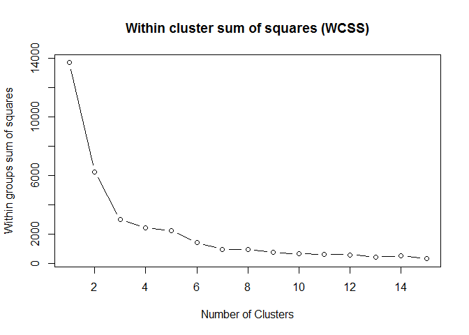
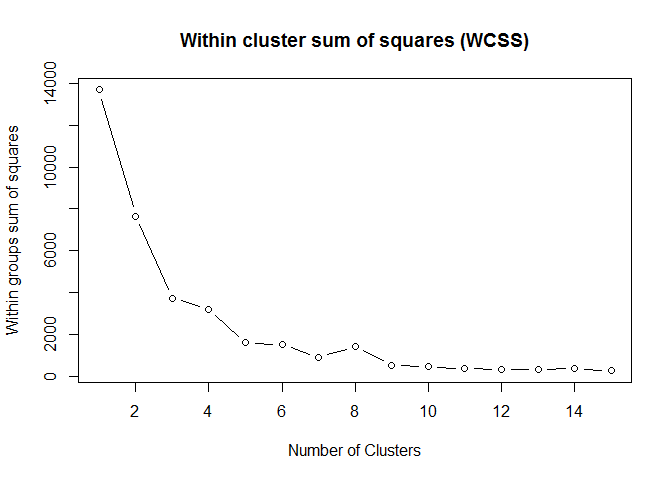
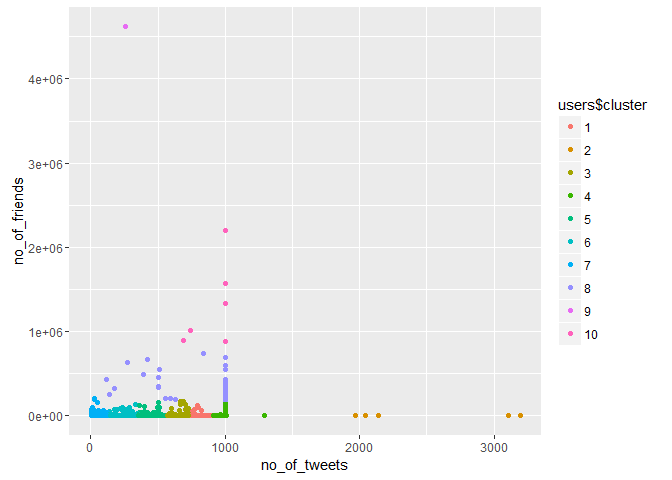
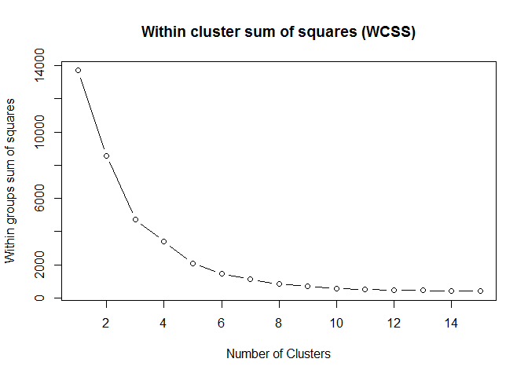

# TweetShort-Factor1


The K-means algorithm aims to choose centroids C that minimize the within cluster sum of squares objective function with a dataset X with n samples

## Connect to the database first


```r
library(RPostgreSQL)
```

```
## Loading required package: DBI
```

```r
# create a connection save the password that we can 'hide' it as best as we
# can by collapsing it
pw <- {
    ""
}

# loads the PostgreSQL driver
drv <- dbDriver("PostgreSQL")
# creates a connection to the postgres database note that 'con' will be used
# later in each connection to the database
con <- dbConnect(drv, dbname = "twitter", host = "localhost", port = 5432, user = "postgres", 
    password = "")
# user = postgres for UBUNTU

rm(pw)  # removes the password

# Connection success:
dbExistsTable(con, c("main", "experiment_tweets_shortest"))
```

```
## [1] TRUE
```

##Get the tweets

```r
users <- dbGetQuery(con, "SELECT * from main.experiment_user_shortest")
```

Total amount of users in the corpus: 6846


```r
# Preview user dataset
head(users)
```

```
##   userid  username no_of_tweets no_of_replies no_of_retweets no_of_friends
## 1    767      xeni         1000           270            347          3984
## 2  11332    Crissy         1000            19            408           481
## 3  12925    Janina         1000           103             28           899
## 4  18713      al3x         1002           612            153           403
## 5  27953   Busymom         1000           406             45          1912
## 6  30973 Starbucks          497           487              6         99958
##   no_of_followers no_of_devices year_opened geo_enabled
## 1           95486             4        2006           1
## 2           79178             8        2006           0
## 3          137646            13        2006           1
## 4           41133            10        2006           1
## 5           52686             1        2006           0
## 6        11654033             3        2006           1
##               location latitude longitude                   timezone
## 1     where data flows       NA        NA Pacific Time (US & Canada)
## 2                 Ohio       NA        NA Eastern Time (US & Canada)
## 3 all up in your DMs.        NA        NA Pacific Time (US & Canada)
## 4       Portland\\, OR       NA        NA Pacific Time (US & Canada)
## 5            Nashville       NA        NA Central Time (US & Canada)
## 6        Seattle\\, WA       NA        NA Pacific Time (US & Canada)
##                                                                             profile_image
## 1                     http://pbs.twimg.com/profile_images/702536731807973376/iDelKqT6.jpg
## 2                     http://pbs.twimg.com/profile_images/633119610477387776/K9aBQma2.jpg
## 3                     http://pbs.twimg.com/profile_images/583690049067155456/VovjQxPp.jpg
## 4                     http://pbs.twimg.com/profile_images/697959498711830528/glceGyFI.png
## 5 http://pbs.twimg.com/profile_images/1083701007/01598788-cc52-4433-a2b1-01a137c02e11.jpg
## 6                     http://pbs.twimg.com/profile_images/629049594047893504/ALcBvCnr.png
##                                                                  background_image
## 1 http://pbs.twimg.com/profile_background_images/462391105808388097/MMAmbCWF.jpeg
## 2 http://pbs.twimg.com/profile_background_images/378800000180398133/BdnLw2ye.jpeg
## 3 http://pbs.twimg.com/profile_background_images/525130313064669184/rxPZNvVF.jpeg
## 4                                http://abs.twimg.com/images/themes/theme1/bg.png
## 5                               http://abs.twimg.com/images/themes/theme16/bg.gif
## 6 http://pbs.twimg.com/profile_background_images/469156785677291520/33CmaU1r.jpeg
##   is_default_profile_image is_default_background_image
## 1                        0                           0
## 2                        0                           0
## 3                        0                           0
## 4                        0                           1
## 5                        0                           0
## 6                        0                           0
##   is_theme_background_image profile_image_uniqueness
## 1                         0                        1
## 2                         0                        1
## 3                         0                        1
## 4                         1                        1
## 5                         1                        1
## 6                         0                        1
##   background_image_uniqueness
## 1                           1
## 2                           1
## 3                           1
## 4                        3599
## 5                          20
## 6                           1
```

```r
# scale the dataset
df <- scale(users[, 3:10])

# Preview scaled dataset
head(df)
```

```
##   no_of_tweets no_of_replies no_of_retweets no_of_friends no_of_followers
## 1    0.7610025     0.8309349      0.4625978   -0.05619278     -0.05946240
## 2    0.7610025    -0.6715718      0.7104633   -0.10146545     -0.06629409
## 3    0.7610025    -0.1687409     -0.8336167   -0.09606323     -0.04180089
## 4    0.7660089     2.8781751     -0.3256957   -0.10247352     -0.08223176
## 5    0.7610025     1.6450421     -0.7645394   -0.08297125     -0.07739202
## 6   -0.4981061     2.1299148     -0.9230108    1.18417252      4.78260119
##   no_of_devices year_opened geo_enabled
## 1     0.4861317   -2.907811   1.1716497
## 2     1.8454937   -2.907811  -0.8533727
## 3     3.5446961   -2.907811   1.1716497
## 4     2.5251746   -2.907811   1.1716497
## 5    -0.5333897   -2.907811  -0.8533727
## 6     0.1462913   -2.907811   1.1716497
```

##Train the data
We need to find the optimal amount of clusters first

###Lets look at: no_of_tweets vs no_of_replies:


```r
mydata <- df[, 1:2]

set.seed(20)
wss <- (nrow(mydata) - 1) * sum(apply(mydata, 2, var))
for (i in 2:15) wss[i] <- sum(kmeans(mydata, centers = i)$withinss)
# par(mar=c(5.1,4.1,4.1,2.1))
plot(1:15, wss, type = "b", xlab = "Number of Clusters", ylab = "Within groups sum of squares", 
    main = "Within cluster sum of squares (WCSS)")
```

<!-- -->

```r
myCluster <- kmeans(mydata, 8)
users$cluster <- as.factor(myCluster$cluster)
ggplot(users, aes(no_of_tweets, no_of_replies, color = users$cluster)) + geom_point()
```

<!-- -->

###Lets look at: no_of_tweets vs no_of_friends:


```r
mydata <- df[, c(1, 4)]

set.seed(20)
wss <- (nrow(mydata) - 1) * sum(apply(mydata, 2, var))
for (i in 2:15) wss[i] <- sum(kmeans(mydata, centers = i)$withinss)
# par(mar=c(5.1,4.1,4.1,2.1))
plot(1:15, wss, type = "b", xlab = "Number of Clusters", ylab = "Within groups sum of squares", 
    main = "Within cluster sum of squares (WCSS)")
```

<!-- -->

```r
myCluster <- kmeans(mydata, 10)
users$cluster <- as.factor(myCluster$cluster)
ggplot(users, aes(no_of_tweets, no_of_friends, color = users$cluster)) + geom_point()
```

<!-- -->

###Lets look at: no_of_friends vs no_of_followers:


```r
mydata <- df[, 4:5]

set.seed(20)
wss <- (nrow(mydata) - 1) * sum(apply(mydata, 2, var))
for (i in 2:15) wss[i] <- sum(kmeans(mydata, centers = i)$withinss)
# par(mar=c(5.1,4.1,4.1,2.1))
plot(1:15, wss, type = "b", xlab = "Number of Clusters", ylab = "Within groups sum of squares", 
    main = "Within cluster sum of squares (WCSS)")
```

<!-- -->

```r
myCluster <- kmeans(mydata, 10)
users$cluster <- as.factor(myCluster$cluster)
ggplot(users, aes(no_of_friends, no_of_followers, color = users$cluster)) + 
    geom_point()
```

<!-- -->


