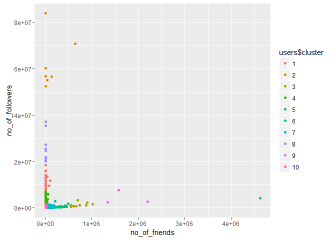
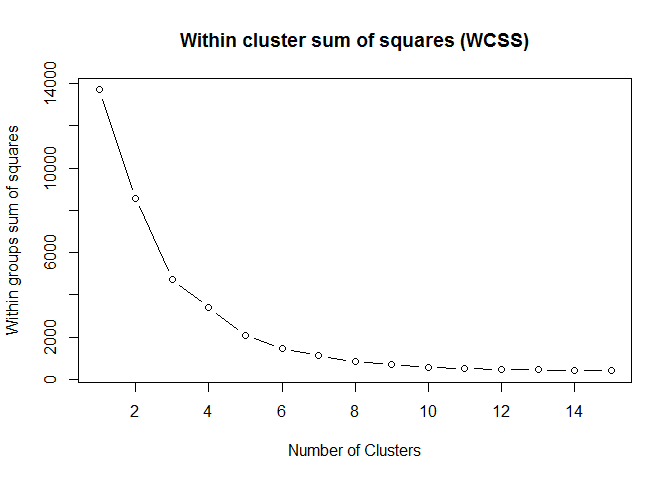

# TweetShort-Factor2 : Friends vs Followers


With this factor we investigate the numbers of devices a use has

## Connect to the database first


```r
library(RPostgreSQL)
```

```
## Loading required package: DBI
```

```r
# create a connection save the password that we can 'hide' it as best as we
# can by collapsing it
pw <- {
    ""
}

# loads the PostgreSQL driver
drv <- dbDriver("PostgreSQL")
# creates a connection to the postgres database note that 'con' will be used
# later in each connection to the database
con <- dbConnect(drv, dbname = "twitter", host = "localhost", port = 5432, user = "postgres", 
    password = "")
# user = postgres for UBUNTU

rm(pw)  # removes the password

# Connection success:
dbExistsTable(con, c("main", "experiment_tweets_shortest"))
```

```
## [1] TRUE
```

##Get the tweets


Total amount of users in the corpus: 6846


```r
# scale the dataset
df <- scale(users[, 3:10])
```

##Train the data
We need to find the optimal amount of clusters first

###Lets look at: no_of_friends vs no_of_followers: without outliers removed


```r
mydata <- df[, 4:5]

set.seed(20)
wss <- (nrow(mydata) - 1) * sum(apply(mydata, 2, var))
for (i in 2:15) wss[i] <- sum(kmeans(mydata, centers = i)$withinss)
# par(mar=c(5.1,4.1,4.1,2.1))
plot(1:15, wss, type = "b", xlab = "Number of Clusters", ylab = "Within groups sum of squares", 
    main = "Within cluster sum of squares (WCSS)")
```

<!-- -->

```r
myCluster <- kmeans(mydata, 10)
users$cluster <- as.factor(myCluster$cluster)
ggplot(users, aes(no_of_friends, no_of_followers, color = users$cluster)) + 
    geom_point()
```

<!-- -->

###Lets look at: no_of_friends vs no_of_followers: with outliers removed


```r
mydata <- df[, 4:5]

set.seed(20)
wss <- (nrow(mydata) - 1) * sum(apply(mydata, 2, var))
for (i in 2:15) wss[i] <- sum(kmeans(mydata, centers = i)$withinss)
# par(mar=c(5.1,4.1,4.1,2.1))
plot(1:15, wss, type = "b", xlab = "Number of Clusters", ylab = "Within groups sum of squares", 
    main = "Within cluster sum of squares (WCSS)")
```

<!-- -->

```r
myCluster <- kmeans(mydata, 10)
users$cluster <- as.factor(myCluster$cluster)
ggplot(users, aes(no_of_friends, no_of_followers, color = users$cluster)) + 
    geom_point()
```

<!-- -->

###Lets look at: no_of_friends vs no_of_followers: with direct messages


```r
mydata <- df[, 4:5]

set.seed(20)
wss <- (nrow(mydata) - 1) * sum(apply(mydata, 2, var))
for (i in 2:15) wss[i] <- sum(kmeans(mydata, centers = i)$withinss)
# par(mar=c(5.1,4.1,4.1,2.1))
plot(1:15, wss, type = "b", xlab = "Number of Clusters", ylab = "Within groups sum of squares", 
    main = "Within cluster sum of squares (WCSS)")
```

<!-- -->

```r
myCluster <- kmeans(mydata, 10)
users$cluster <- as.factor(myCluster$cluster)
ggplot(users, aes(no_of_friends, no_of_followers, color = users$cluster)) + 
    geom_point()
```

<!-- -->


