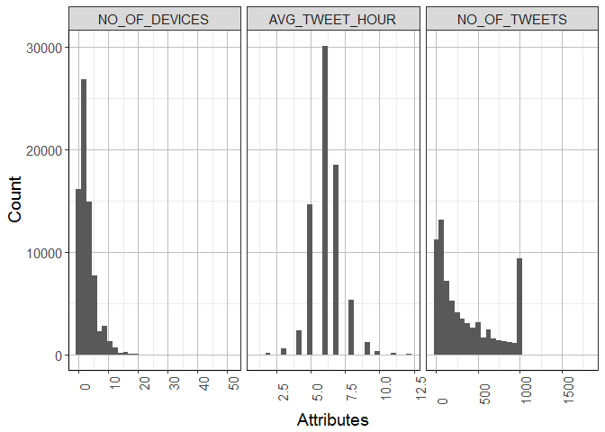
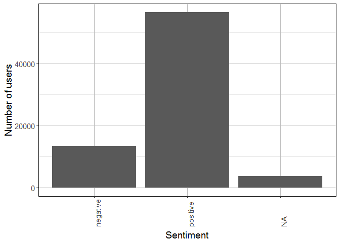
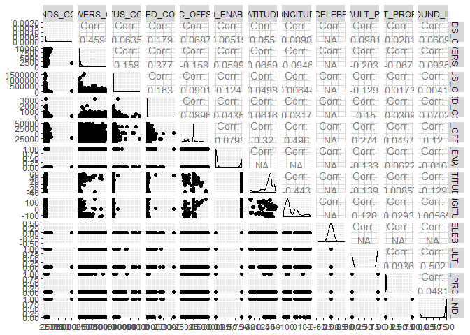
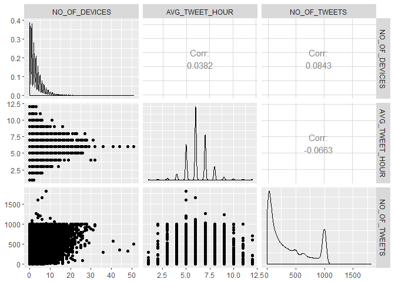

# Feature Identification


```
## Loading required package: DBI
```

```
## [1] TRUE
```


##Investigate all attributes of the user set

```r
## show all available attribues
names(users)
```

```
##  [1] "id"                       "name"                    
##  [3] "screenname"               "created"                 
##  [5] "original_profile_image"   "profile_image"           
##  [7] "background_image"         "last_tweet"              
##  [9] "description"              "location"                
## [11] "language"                 "friends_count"           
## [13] "followers_count"          "status_count"            
## [15] "listed_count"             "timezone"                
## [17] "utc_offset"               "geo_enabled"             
## [19] "latitude"                 "longitude"               
## [21] "is_celebrity"             "is_default_profile"      
## [23] "is_default_profile_image" "is_background_image_used"
## [25] "profile_text_color"       "profile_bg_color"        
## [27] "snapshot_date"            "snapshot_end_date"
```

```r
## fix dates
suppressMessages(library(lubridate))
users$created <- ymd_hms(users$created)
users$snapshot_date <- year(users$snapshot_date)
users$snapshot_end_date <- year(users$snapshot_end_date)

## describes the data
suppressMessages(library(psych))
describe(users)
```

```
##                          vars     n           mean            sd
## id                          1 73630   7.923276e+16  2.303413e+17
## name*                       2 73630            Inf           NaN
## screenname*                 3 73630   1.890473e+08  4.238644e+08
## created*                    4 73630            NaN            NA
## original_profile_image*     5 73630            NaN            NA
## profile_image*              6 73630            NaN            NA
## background_image*           7 64574            NaN            NA
## last_tweet*                 8 72378   2.029413e+08  6.416541e+08
## description*                9 73630  1.191668e+124 1.092182e+125
## location*                  10 73630   8.513832e+06  7.766552e+07
## language*                  11 73630            NaN            NA
## friends_count              12 73630   8.033100e+02  1.222660e+03
## followers_count            13 73630   7.090700e+02  1.361650e+03
## status_count               14 73630   2.953120e+03  1.685906e+04
## listed_count               15 73630   8.090000e+00  3.467000e+01
## timezone*                  16 28309            NaN            NA
## utc_offset                 17 73630  -6.199280e+03  1.223396e+04
## geo_enabled                18 73630   2.900000e-01  4.600000e-01
## latitude                   19   365   3.139000e+01  1.988000e+01
## longitude                  20   365  -3.711000e+01  7.389000e+01
## is_celebrity               21 73630   0.000000e+00  0.000000e+00
## is_default_profile         22 73630   6.100000e-01  4.900000e-01
## is_default_profile_image   23 73630   2.000000e-02  1.500000e-01
## is_background_image_used   24 73630   8.600000e-01  3.500000e-01
## profile_text_color*        25 73630            Inf           NaN
## profile_bg_color*          26 73630            Inf           NaN
## snapshot_date              27 73630   2.000000e+03  0.000000e+00
## snapshot_end_date          28 73630   2.099000e+03  0.000000e+00
##                                median       trimmed          mad       min
## id                        2.32500e+09  5.240003e+15 2.278572e+09   1548.00
## name*                     1.16000e+02  1.681800e+07 1.719800e+02      0.00
## screenname*               2.96304e+05  1.890473e+08 4.288680e+05   2203.00
## created*                           NA           NaN           NA       Inf
## original_profile_image*            NA           NaN           NA       Inf
## profile_image*                     NA           NaN           NA       Inf
## background_image*                  NA           NaN           NA       Inf
## last_tweet*               1.21850e+03  3.655838e+04 1.788020e+03      1.00
## description*              2.15000e+01  7.589141e+07 2.298000e+01    -17.00
## location*                 5.74000e+02  6.781200e+02 3.795500e+02      3.00
## language*                          NA           NaN           NA       Inf
## friends_count             3.57000e+02  5.401600e+02 3.825100e+02      0.00
## followers_count           2.36000e+02  3.733500e+02 2.772500e+02      0.00
## status_count              2.62000e+02  4.788100e+02 3.350700e+02     11.00
## listed_count              1.00000e+00  2.280000e+00 1.480000e+00      0.00
## timezone*                          NA           NaN           NA       Inf
## utc_offset               -1.00000e+00 -4.970770e+03 0.000000e+00 -39600.00
## geo_enabled               0.00000e+00  2.400000e-01 0.000000e+00      0.00
## latitude                  3.58000e+01  3.456000e+01 9.070000e+00    -37.89
## longitude                -7.51900e+01 -4.714000e+01 4.612000e+01   -124.20
## is_celebrity              0.00000e+00  0.000000e+00 0.000000e+00      0.00
## is_default_profile        1.00000e+00  6.400000e-01 0.000000e+00      0.00
## is_default_profile_image  0.00000e+00  0.000000e+00 0.000000e+00      0.00
## is_background_image_used  1.00000e+00  9.500000e-01 0.000000e+00      0.00
## profile_text_color*       3.33333e+05  3.132527e+05 0.000000e+00      0.00
## profile_bg_color*         0.00000e+00  2.260301e+04 0.000000e+00      0.00
## snapshot_date             2.00000e+03  2.000000e+03 0.000000e+00   2000.00
## snapshot_end_date         2.09900e+03  2.099000e+03 0.000000e+00   2099.00
##                                    max         range  skew kurtosis
## id                        8.135140e+17  8.135140e+17  2.57     4.62
## name*                              Inf           Inf   NaN      NaN
## screenname*               1.051672e+09  1.051670e+09  1.34    -0.11
## created*                          -Inf          -Inf    NA       NA
## original_profile_image*           -Inf          -Inf    NA       NA
## profile_image*                    -Inf          -Inf    NA       NA
## background_image*                 -Inf          -Inf    NA       NA
## last_tweet*               2.029121e+09  2.029121e+09  2.28     3.57
## description*             1.001001e+126 1.001001e+126   NaN      NaN
## location*                 8.241010e+08  8.241010e+08  9.25    86.73
## language*                         -Inf          -Inf    NA       NA
## friends_count             9.918500e+04  9.918500e+04  9.90   582.37
## followers_count           9.995000e+03  9.995000e+03  3.75    15.99
## status_count              1.551448e+06  1.551437e+06 36.06  2388.81
## listed_count              3.265000e+03  3.265000e+03 24.55  1460.00
## timezone*                         -Inf          -Inf    NA       NA
## utc_offset                4.680000e+04  8.640000e+04 -0.45     0.59
## geo_enabled               1.000000e+00  1.000000e+00  0.91    -1.18
## latitude                  6.017000e+01  9.806000e+01 -1.81     3.52
## longitude                 1.528900e+02  2.770900e+02  1.02    -0.01
## is_celebrity              0.000000e+00  0.000000e+00   NaN      NaN
## is_default_profile        1.000000e+00  1.000000e+00 -0.46    -1.79
## is_default_profile_image  1.000000e+00  1.000000e+00  6.27    37.31
## is_background_image_used  1.000000e+00  1.000000e+00 -2.10     2.39
## profile_text_color*                Inf           Inf   NaN      NaN
## profile_bg_color*                  Inf           Inf   NaN      NaN
## snapshot_date             2.000000e+03  0.000000e+00   NaN      NaN
## snapshot_end_date         2.099000e+03  0.000000e+00   NaN      NaN
##                                     se
## id                        8.488764e+14
## name*                              NaN
## screenname*               1.562067e+06
## created*                            NA
## original_profile_image*             NA
## profile_image*                      NA
## background_image*                   NA
## last_tweet*               2.385051e+06
## description*             4.025015e+122
## location*                 2.862206e+05
## language*                           NA
## friends_count             4.510000e+00
## followers_count           5.020000e+00
## status_count              6.213000e+01
## listed_count              1.300000e-01
## timezone*                           NA
## utc_offset                4.509000e+01
## geo_enabled               0.000000e+00
## latitude                  1.040000e+00
## longitude                 3.870000e+00
## is_celebrity              0.000000e+00
## is_default_profile        0.000000e+00
## is_default_profile_image  0.000000e+00
## is_background_image_used  0.000000e+00
## profile_text_color*                NaN
## profile_bg_color*                  NaN
## snapshot_date             0.000000e+00
## snapshot_end_date         0.000000e+00
```

```r
# plot distribution of numeric type attributes
suppressMessages(library(reshape2))
suppressMessages(library(ggplot2))
d <- melt(users)
```

```
## Using name, screenname, original_profile_image, profile_image, background_image, last_tweet, description, location, language, timezone, profile_text_color, profile_bg_color as id variables
```

```r
science_theme = theme(panel.grid.major = element_line(size = 0.5, color = "grey"), 
    axis.line = element_line(size = 0.7, color = "black"), legend.position = c(0.85, 
        0.7), text = element_text(size = 14))

ggplot(d, aes(x = value)) + facet_wrap(~variable, scales = "free_x", ncol = 6) + 
    geom_histogram() + theme_bw() + theme(axis.text.x = element_text(angle = 90, 
    hjust = 0)) + science_theme + labs(y = "Count", x = "Attributes")
```

```
## `stat_bin()` using `bins = 30`. Pick better value with `binwidth`.
```

<!-- -->

```r
# cleaned up a bit
users.n <- users[, c(12, 13, 14, 15, 17, 18, 19, 20, 21, 22, 23, 24)]
d <- melt(users.n)
```

```
## No id variables; using all as measure variables
```

```r
options(scipen = 999)  # remove exponential notation in numbers, ie amount of decimals to show
ggplot(d, aes(x = value)) + facet_wrap(~variable, scales = "free_x", ncol = 6) + 
    geom_histogram() + theme_bw() + theme(axis.text.x = element_text(angle = 90, 
    hjust = 0)) + science_theme + labs(y = "Count", x = "Attributes")
```

```
## `stat_bin()` using `bins = 30`. Pick better value with `binwidth`.
```

<!-- -->

```r
users.t <- users[, c(11, 16, 17, 18, 21, 22, 23, 24, 25, 26)]
# Categorical features
ggplot(data = users.t, aes(x = language)) + geom_bar(stat = "count") + theme_bw() + 
    theme(axis.text.x = element_text(angle = 90, hjust = 0)) + xlab("Language") + 
    ylab("Number of users") + science_theme
```

<!-- -->

```r
ggplot(data = users.t, aes(x = timezone)) + geom_bar(stat = "count") + theme_bw() + 
    theme(axis.text.x = element_text(angle = 90, hjust = 0)) + xlab("Timezone") + 
    ylab("Number of users") + science_theme
```

<!-- -->

```r
ggplot(data = users.t, aes(x = profile_text_color)) + geom_bar(stat = "count") + 
    theme_bw() + theme(axis.text.x = element_text(angle = 90, hjust = 0)) + 
    xlab("Profile text color") + ylab("Number of users") + science_theme
```

<!-- -->

```r
ggplot(data = users.t, aes(x = profile_bg_color)) + geom_bar(stat = "count") + 
    theme_bw() + theme(axis.text.x = element_text(angle = 90, hjust = 0)) + 
    xlab("Profile bg color") + ylab("Number of users") + science_theme
```

<!-- -->

```r
## profile most prominent profile timezone
suppressMessages(library(dplyr))
set.seed(1)
users.t %>% group_by(timezone) %>% summarise(n = n()) %>% arrange(desc(n))
```

```
## # A tibble: 190 × 2
##                       timezone     n
##                          <chr> <int>
## 1                         <NA> 45321
## 2   Pacific Time (US & Canada)  7516
## 3   Eastern Time (US & Canada)  5258
## 4   Central Time (US & Canada)  3749
## 5                       London  2006
## 6       Atlantic Time (Canada)  1406
## 7                        Quito   994
## 8                      Arizona   753
## 9                    Amsterdam   651
## 10 Mountain Time (US & Canada)   636
## # ... with 180 more rows
```

```r
## profile color
users.t %>% group_by(profile_text_color) %>% summarise(n = n()) %>% arrange(desc(n))
```

```
## # A tibble: 1,903 × 2
##    profile_text_color     n
##                 <chr> <int>
## 1              333333 56989
## 2              000000 10141
## 3              666666   959
## 4              3D1957   789
## 5              3C3940   570
## 6              3E4415   397
## 7              362720   375
## 8              663B12   294
## 9              634047   259
## 10             0C3E53   246
## # ... with 1,893 more rows
```

##Investigate all attributes of the tweets set

```r
suppressMessages(library(RODBC))

#### connect to DB
myconn <- odbcConnect("FSOC", uid = "SYSTEM", pwd = "oEqm66jccx", believeNRows = FALSE, 
    rows_at_time = 1, DBMSencoding = "UTF-8")

## get the tweet data from HANA
tweets <- sqlQuery(myconn, "SELECT t.userid, count(distinct t.source) no_of_devices, 
  max(e.sentiment) sentiment, max(e.emotion) emotion, 
  round(avg(to_number(to_char(t.createdat, 'HH')))) avg_tweet_hour, count(0) as no_of_tweets 
  from twitter.zz_tweets t\t
  left join twitter.zz_users_enrich e on e.id = t.userid 
  where t.userid in (select id from twitter.zz_users) group by userid;")

## show all available attribues
names(tweets)
```

```
## [1] "USERID"         "NO_OF_DEVICES"  "SENTIMENT"      "EMOTION"       
## [5] "AVG_TWEET_HOUR" "NO_OF_TWEETS"
```

```r
## describes the data
suppressMessages(library(psych))
describe(tweets)
```

```
##                vars     n                 mean                    sd
## USERID            1 73036 78601455206048992.00 229518842714096608.00
## NO_OF_DEVICES     2 73036                 2.72                  2.99
## SENTIMENT*        3 39199                 1.77                  0.42
## EMOTION*          4 39199                 4.87                  2.35
## AVG_TWEET_HOUR    5 73036                 6.19                  1.23
## NO_OF_TWEETS      6 73036               271.40                284.23
##                    median             trimmed           mad  min
## USERID         2315895295 4512297264393648.00 2267338985.77 1548
## NO_OF_DEVICES           2                2.21          2.97    0
## SENTIMENT*              2                1.84          0.00    1
## EMOTION*                5                4.92          4.45    1
## AVG_TWEET_HOUR          6                6.15          1.48    1
## NO_OF_TWEETS          158              228.65        204.60    1
##                               max              range  skew kurtosis
## USERID         813513970745221120 813513970745219584  2.58     4.69
## NO_OF_DEVICES                  50                 50  2.18     9.04
## SENTIMENT*                      2                  1 -1.27    -0.38
## EMOTION*                        8                  7 -0.07    -1.18
## AVG_TWEET_HOUR                 12                 11  0.29     2.23
## NO_OF_TWEETS                 3869               3868  1.34     2.68
##                                se
## USERID         849277963522201.75
## NO_OF_DEVICES                0.01
## SENTIMENT*                   0.00
## EMOTION*                     0.01
## AVG_TWEET_HOUR               0.00
## NO_OF_TWEETS                 1.05
```

```r
# plot distribution of numeric type attributes
d <- melt(tweets)
```

```
## Using SENTIMENT, EMOTION as id variables
```

```r
ggplot(d, aes(x = value)) + facet_wrap(~variable, scales = "free_x") + geom_histogram() + 
    theme_bw() + theme(axis.text.x = element_text(angle = 90, hjust = 0)) + 
    science_theme + labs(y = "Count", x = "Attributes")
```

```
## `stat_bin()` using `bins = 30`. Pick better value with `binwidth`.
```

<!-- -->

```r
# cleaned up a bit
tweets.n <- tweets[, c(2, 5, 6)]
d <- melt(tweets.n)
```

```
## No id variables; using all as measure variables
```

```r
options(scipen = 999)  # remove exponential notation in numbers, ie amount of decimals to show
ggplot(d, aes(x = value)) + facet_wrap(~variable, scales = "free_x", ncol = 6) + 
    geom_histogram() + theme_bw() + theme(axis.text.x = element_text(angle = 90, 
    hjust = 0)) + science_theme + labs(y = "Count", x = "Attributes")
```

```
## `stat_bin()` using `bins = 30`. Pick better value with `binwidth`.
```

<!-- -->

```r
tweets.t <- tweets[, c(3, 4)]
# Categorical features
ggplot(data = tweets.t, aes(x = SENTIMENT)) + geom_bar(stat = "count") + theme_bw() + 
    theme(axis.text.x = element_text(angle = 90, hjust = 0)) + xlab("Sentiment") + 
    ylab("Number of users") + science_theme
```

<!-- -->

```r
ggplot(data = tweets.t, aes(x = EMOTION)) + geom_bar(stat = "count") + theme_bw() + 
    theme(axis.text.x = element_text(angle = 90, hjust = 0)) + xlab("Emotion") + 
    ylab("Number of users") + science_theme
```

<!-- -->

```r
## profile most prominent profile sentiment
suppressMessages(library(dplyr))
set.seed(1)
tweets.t %>% group_by(SENTIMENT) %>% summarise(n = n()) %>% arrange(desc(n))
```

```
## # A tibble: 3 × 2
##   SENTIMENT     n
##      <fctr> <int>
## 1        NA 33837
## 2  positive 30118
## 3  negative  9081
```

```r
## profile emotion
tweets.t %>% group_by(EMOTION) %>% summarise(n = n()) %>% arrange(desc(n))
```

```
## # A tibble: 9 × 2
##        EMOTION     n
##         <fctr> <int>
## 1           NA 33837
## 2          joy 13627
## 3        trust 10192
## 4 anticipation  8072
## 5        anger  2716
## 6      sadness  1758
## 7         fear  1441
## 8      disgust   943
## 9     surprise   450
```


##Evaluate features

<!-- --><!-- --><!-- -->

