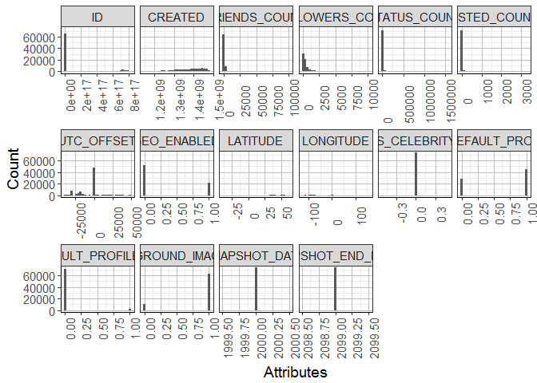
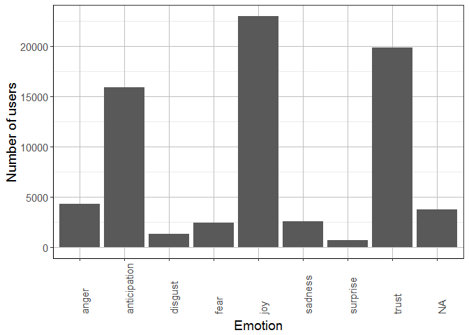
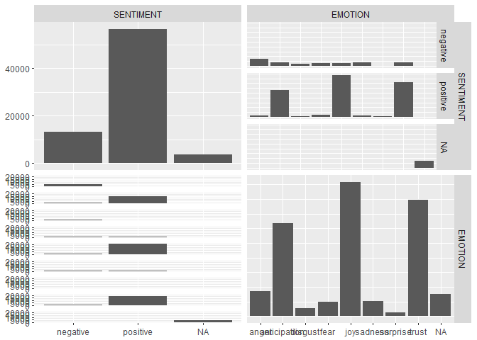

# Feature Identification


##Investigate all attributes of the user set

```r
## show all available attribues
names(users)
```

```
##  [1] "ID"                       "NAME"                    
##  [3] "SCREENNAME"               "CREATED"                 
##  [5] "ORIGINAL_PROFILE_IMAGE"   "PROFILE_IMAGE"           
##  [7] "BACKGROUND_IMAGE"         "LAST_TWEET"              
##  [9] "DESCRIPTION"              "LOCATION"                
## [11] "LANGUAGE"                 "FRIENDS_COUNT"           
## [13] "FOLLOWERS_COUNT"          "STATUS_COUNT"            
## [15] "LISTED_COUNT"             "TIMEZONE"                
## [17] "UTC_OFFSET"               "GEO_ENABLED"             
## [19] "LATITUDE"                 "LONGITUDE"               
## [21] "IS_CELEBRITY"             "IS_DEFAULT_PROFILE"      
## [23] "IS_DEFAULT_PROFILE_IMAGE" "IS_BACKGROUND_IMAGE_USED"
## [25] "PROFILE_TEXT_COLOR"       "PROFILE_BG_COLOR"        
## [27] "SNAPSHOT_DATE"            "SNAPSHOT_END_DATE"
```

```r
## fix dates
suppressMessages(library(lubridate))
users$CREATED <- ymd_hms(users$CREATED)
users$SNAPSHOT_DATE <- year(users$SNAPSHOT_DATE)
users$SNAPSHOT_END_DATE <- year(users$SNAPSHOT_END_DATE)

## describes the data
suppressMessages(library(psych))
describe(users)
```

```
##                          vars     n          mean           sd     median
## ID                          1 73630  7.923276e+16 2.303413e+17  2.325e+09
## NAME*                       2     0           NaN           NA         NA
## SCREENNAME*                 3     0           NaN           NA         NA
## CREATED*                    4 73630           NaN           NA         NA
## ORIGINAL_PROFILE_IMAGE*     5     0           NaN           NA         NA
## PROFILE_IMAGE*              6     0           NaN           NA         NA
## BACKGROUND_IMAGE*           7     0           NaN           NA         NA
## LAST_TWEET*                 8     0           NaN           NA         NA
## DESCRIPTION*                9     0           NaN           NA         NA
## LOCATION*                  10     0           NaN           NA         NA
## LANGUAGE*                  11 73630  1.024000e+01 5.570000e+00  9.000e+00
## FRIENDS_COUNT              12 73630  8.033100e+02 1.222660e+03  3.570e+02
## FOLLOWERS_COUNT            13 73630  7.090700e+02 1.361650e+03  2.360e+02
## STATUS_COUNT               14 73630  2.953120e+03 1.685906e+04  2.620e+02
## LISTED_COUNT               15 73630  8.090000e+00 3.467000e+01  1.000e+00
## TIMEZONE*                  16 28309  9.851000e+01 4.508000e+01  7.300e+01
## UTC_OFFSET                 17 73630 -6.199280e+03 1.223396e+04 -1.000e+00
## GEO_ENABLED                18 73630  2.900000e-01 4.600000e-01  0.000e+00
## LATITUDE                   19   365  3.139000e+01 1.988000e+01  3.580e+01
## LONGITUDE                  20   365 -3.711000e+01 7.389000e+01 -7.519e+01
## IS_CELEBRITY               21 73630  0.000000e+00 0.000000e+00  0.000e+00
## IS_DEFAULT_PROFILE         22 73630  6.100000e-01 4.900000e-01  1.000e+00
## IS_DEFAULT_PROFILE_IMAGE   23 73630  2.000000e-02 1.500000e-01  0.000e+00
## IS_BACKGROUND_IMAGE_USED   24 73630  8.600000e-01 3.500000e-01  1.000e+00
## PROFILE_TEXT_COLOR*        25 73630  4.882800e+02 2.379700e+02  5.430e+02
## PROFILE_BG_COLOR*          26 73630  1.960290e+03 9.820200e+02  2.255e+03
## SNAPSHOT_DATE              27 73630  2.000000e+03 0.000000e+00  2.000e+03
## SNAPSHOT_END_DATE          28 73630  2.099000e+03 0.000000e+00  2.099e+03
##                                trimmed          mad       min          max
## ID                        5.240003e+15 2.278572e+09   1548.00 8.135140e+17
## NAME*                              NaN           NA       Inf         -Inf
## SCREENNAME*                        NaN           NA       Inf         -Inf
## CREATED*                           NaN           NA       Inf         -Inf
## ORIGINAL_PROFILE_IMAGE*            NaN           NA       Inf         -Inf
## PROFILE_IMAGE*                     NaN           NA       Inf         -Inf
## BACKGROUND_IMAGE*                  NaN           NA       Inf         -Inf
## LAST_TWEET*                        NaN           NA       Inf         -Inf
## DESCRIPTION*                       NaN           NA       Inf         -Inf
## LOCATION*                          NaN           NA       Inf         -Inf
## LANGUAGE*                 9.000000e+00 0.000000e+00      1.00 5.700000e+01
## FRIENDS_COUNT             5.401600e+02 3.825100e+02      0.00 9.918500e+04
## FOLLOWERS_COUNT           3.733500e+02 2.772500e+02      0.00 9.995000e+03
## STATUS_COUNT              4.788100e+02 3.350700e+02     11.00 1.551448e+06
## LISTED_COUNT              2.280000e+00 1.480000e+00      0.00 3.265000e+03
## TIMEZONE*                 1.003600e+02 6.968000e+01      1.00 1.890000e+02
## UTC_OFFSET               -4.970770e+03 0.000000e+00 -39600.00 4.680000e+04
## GEO_ENABLED               2.400000e-01 0.000000e+00      0.00 1.000000e+00
## LATITUDE                  3.456000e+01 9.070000e+00    -37.89 6.017000e+01
## LONGITUDE                -4.714000e+01 4.612000e+01   -124.20 1.528900e+02
## IS_CELEBRITY              0.000000e+00 0.000000e+00      0.00 0.000000e+00
## IS_DEFAULT_PROFILE        6.400000e-01 0.000000e+00      0.00 1.000000e+00
## IS_DEFAULT_PROFILE_IMAGE  0.000000e+00 0.000000e+00      0.00 1.000000e+00
## IS_BACKGROUND_IMAGE_USED  9.500000e-01 0.000000e+00      0.00 1.000000e+00
## PROFILE_TEXT_COLOR*       5.119100e+02 0.000000e+00      1.00 1.903000e+03
## PROFILE_BG_COLOR*         2.047380e+03 0.000000e+00      1.00 3.440000e+03
## SNAPSHOT_DATE             2.000000e+03 0.000000e+00   2000.00 2.000000e+03
## SNAPSHOT_END_DATE         2.099000e+03 0.000000e+00   2099.00 2.099000e+03
##                                 range  skew kurtosis           se
## ID                       8.135140e+17  2.57     4.62 8.488764e+14
## NAME*                            -Inf    NA       NA           NA
## SCREENNAME*                      -Inf    NA       NA           NA
## CREATED*                         -Inf    NA       NA           NA
## ORIGINAL_PROFILE_IMAGE*          -Inf    NA       NA           NA
## PROFILE_IMAGE*                   -Inf    NA       NA           NA
## BACKGROUND_IMAGE*                -Inf    NA       NA           NA
## LAST_TWEET*                      -Inf    NA       NA           NA
## DESCRIPTION*                     -Inf    NA       NA           NA
## LOCATION*                        -Inf    NA       NA           NA
## LANGUAGE*                5.600000e+01  5.06    26.99 2.000000e-02
## FRIENDS_COUNT            9.918500e+04  9.90   582.37 4.510000e+00
## FOLLOWERS_COUNT          9.995000e+03  3.75    15.99 5.020000e+00
## STATUS_COUNT             1.551437e+06 36.06  2388.81 6.213000e+01
## LISTED_COUNT             3.265000e+03 24.55  1460.00 1.300000e-01
## TIMEZONE*                1.880000e+02 -0.10    -1.36 2.700000e-01
## UTC_OFFSET               8.640000e+04 -0.45     0.59 4.509000e+01
## GEO_ENABLED              1.000000e+00  0.91    -1.18 0.000000e+00
## LATITUDE                 9.806000e+01 -1.81     3.52 1.040000e+00
## LONGITUDE                2.770900e+02  1.02    -0.01 3.870000e+00
## IS_CELEBRITY             0.000000e+00   NaN      NaN 0.000000e+00
## IS_DEFAULT_PROFILE       1.000000e+00 -0.46    -1.79 0.000000e+00
## IS_DEFAULT_PROFILE_IMAGE 1.000000e+00  6.27    37.31 0.000000e+00
## IS_BACKGROUND_IMAGE_USED 1.000000e+00 -2.10     2.39 0.000000e+00
## PROFILE_TEXT_COLOR*      1.902000e+03  0.29     6.66 8.800000e-01
## PROFILE_BG_COLOR*        3.439000e+03 -0.94    -0.13 3.620000e+00
## SNAPSHOT_DATE            0.000000e+00   NaN      NaN 0.000000e+00
## SNAPSHOT_END_DATE        0.000000e+00   NaN      NaN 0.000000e+00
```

```r
# plot distribution of numeric type attributes
suppressMessages(library(reshape2))
suppressMessages(library(ggplot2))
d <- melt(users)
```

```
## Using NAME, SCREENNAME, ORIGINAL_PROFILE_IMAGE, PROFILE_IMAGE, BACKGROUND_IMAGE, LAST_TWEET, DESCRIPTION, LOCATION, LANGUAGE, TIMEZONE, PROFILE_TEXT_COLOR, PROFILE_BG_COLOR as id variables
```

```r
science_theme = theme(panel.grid.major = element_line(size = 0.5, color = "grey"), 
    axis.line = element_line(size = 0.7, color = "black"), legend.position = c(0.85, 
        0.7), text = element_text(size = 14))

ggplot(d, aes(x = value)) + facet_wrap(~variable, scales = "free_x", ncol = 6) + 
    geom_histogram() + theme_bw() + theme(axis.text.x = element_text(angle = 90, 
    hjust = 0)) + science_theme + labs(y = "Count", x = "Attributes")
```

```
## `stat_bin()` using `bins = 30`. Pick better value with `binwidth`.
```

<!-- -->

```r
# cleaned up a bit
users.n <- users[, c(12, 13, 14, 15, 17, 18, 19, 20, 21, 22, 23, 24)]
d <- melt(users.n)
```

```
## No id variables; using all as measure variables
```

```r
options(scipen = 999)  # remove exponential notation in numbers, ie amount of decimals to show
ggplot(d, aes(x = value)) + facet_wrap(~variable, scales = "free_x", ncol = 6) + 
    geom_histogram() + theme_bw() + theme(axis.text.x = element_text(angle = 90, 
    hjust = 0)) + science_theme + labs(y = "Count", x = "Attributes")
```

```
## `stat_bin()` using `bins = 30`. Pick better value with `binwidth`.
```

<!-- -->

```r
users.t <- users[, c(11, 16, 17, 18, 21, 22, 23, 24, 25, 26)]
# Categorical features
ggplot(data = users.t, aes(x = LANGUAGE)) + geom_bar(stat = "count") + theme_bw() + 
    theme(axis.text.x = element_text(angle = 90, hjust = 0)) + xlab("Language") + 
    ylab("Number of users") + science_theme
```

<!-- -->

```r
ggplot(data = users.t, aes(x = TIMEZONE)) + geom_bar(stat = "count") + theme_bw() + 
    theme(axis.text.x = element_text(angle = 90, hjust = 0)) + xlab("Timezone") + 
    ylab("Number of users") + science_theme
```

<!-- -->

```r
ggplot(data = users.t, aes(x = PROFILE_TEXT_COLOR)) + geom_bar(stat = "count") + 
    theme_bw() + theme(axis.text.x = element_text(angle = 90, hjust = 0)) + 
    xlab("Profile text color") + ylab("Number of users") + science_theme
```

<!-- -->

```r
ggplot(data = users.t, aes(x = PROFILE_BG_COLOR)) + geom_bar(stat = "count") + 
    theme_bw() + theme(axis.text.x = element_text(angle = 90, hjust = 0)) + 
    xlab("Profile bg color") + ylab("Number of users") + science_theme
```

<!-- -->

```r
## profile most prominent profile timezone
suppressMessages(library(dplyr))
set.seed(1)
users.t %>% group_by(TIMEZONE) %>% summarise(n = n()) %>% arrange(desc(n))
```

```
## # A tibble: 190 × 2
##                       TIMEZONE     n
##                         <fctr> <int>
## 1                           NA 45321
## 2   Pacific Time (US & Canada)  7516
## 3   Eastern Time (US & Canada)  5258
## 4   Central Time (US & Canada)  3749
## 5                       London  2006
## 6       Atlantic Time (Canada)  1406
## 7                        Quito   994
## 8                      Arizona   753
## 9                    Amsterdam   651
## 10 Mountain Time (US & Canada)   636
## # ... with 180 more rows
```

```r
## profile color
users.t %>% group_by(PROFILE_TEXT_COLOR) %>% summarise(n = n()) %>% arrange(desc(n))
```

```
## # A tibble: 1,903 × 2
##    PROFILE_TEXT_COLOR     n
##                <fctr> <int>
## 1              333333 56989
## 2              000000 10141
## 3              666666   959
## 4              3D1957   789
## 5              3C3940   570
## 6              3E4415   397
## 7              362720   375
## 8              663B12   294
## 9              634047   259
## 10             0C3E53   246
## # ... with 1,893 more rows
```

##Investigate all attributes of the tweets set

```r
# suppressMessages(library(RODBC))

#### connect to DB myconn<-odbcConnect('FSOC', uid='SYSTEM', pwd='oEqm66jccx',
#### believeNRows=FALSE, rows_at_time=1, #DBMSencoding='UTF-8')

## get the tweet data from HANA
tweets <- sqlQuery(myconn, "SELECT t.userid, count(distinct t.source) no_of_devices, 
  max(e.sentiment) sentiment, max(e.emotion) emotion, 
  round(avg(to_number(to_char(t.createdat, 'HH')))) avg_tweet_hour, count(0) as no_of_tweets 
  from twitter.zz_tweets t\t
  left join twitter.zz_users_enrich e on e.id = t.userid 
  where t.userid in (select id from twitter.zz_users) group by userid;")

## show all available attribues
names(tweets)
```

```
## [1] "USERID"         "NO_OF_DEVICES"  "SENTIMENT"      "EMOTION"       
## [5] "AVG_TWEET_HOUR" "NO_OF_TWEETS"
```

```r
## describes the data suppressMessages(library(psych))
describe(tweets)
```

```
##                vars     n                 mean                    sd
## USERID            1 73630 79232756180274208.00 230341316818809696.00
## NO_OF_DEVICES     2 73630                 2.81                  3.06
## SENTIMENT*        3 69887                 1.81                  0.39
## EMOTION*          4 69887                 4.91                  2.40
## AVG_TWEET_HOUR    5 73630                 6.18                  1.13
## NO_OF_TWEETS      6 73630               353.58                342.47
##                    median             trimmed           mad  min
## USERID         2325000217 5240003009580838.00 2278571831.28 1548
## NO_OF_DEVICES           2                2.30          2.97    0
## SENTIMENT*              2                1.89          0.00    1
## EMOTION*                5                4.96          4.45    1
## AVG_TWEET_HOUR          6                6.13          1.48    1
## NO_OF_TWEETS          218              315.22        278.73    1
##                               max              range  skew kurtosis
## USERID         813513970745221120 813513970745219584  2.57     4.62
## NO_OF_DEVICES                  51                 51  2.14     8.68
## SENTIMENT*                      2                  1 -1.57     0.48
## EMOTION*                        8                  7 -0.06    -1.28
## AVG_TWEET_HOUR                 12                 11  0.34     2.17
## NO_OF_TWEETS                 1810               1809  0.80    -0.77
##                                se
## USERID         848876371307228.38
## NO_OF_DEVICES                0.01
## SENTIMENT*                   0.00
## EMOTION*                     0.01
## AVG_TWEET_HOUR               0.00
## NO_OF_TWEETS                 1.26
```

```r
# plot distribution of numeric type attributes
d <- melt(tweets)
```

```
## Using SENTIMENT, EMOTION as id variables
```

```r
ggplot(d, aes(x = value)) + facet_wrap(~variable, scales = "free_x") + geom_histogram() + 
    theme_bw() + theme(axis.text.x = element_text(angle = 90, hjust = 0)) + 
    science_theme + labs(y = "Count", x = "Attributes")
```

```
## `stat_bin()` using `bins = 30`. Pick better value with `binwidth`.
```

<!-- -->

```r
# cleaned up a bit
tweets.n <- tweets[, c(2, 5, 6)]
d <- melt(tweets.n)
```

```
## No id variables; using all as measure variables
```

```r
options(scipen = 999)  # remove exponential notation in numbers, ie amount of decimals to show
ggplot(d, aes(x = value)) + facet_wrap(~variable, scales = "free_x", ncol = 6) + 
    geom_histogram() + theme_bw() + theme(axis.text.x = element_text(angle = 90, 
    hjust = 0)) + science_theme + labs(y = "Count", x = "Attributes")
```

```
## `stat_bin()` using `bins = 30`. Pick better value with `binwidth`.
```

<!-- -->

```r
tweets.t <- tweets[, c(3, 4)]
# Categorical features
ggplot(data = tweets.t, aes(x = SENTIMENT)) + geom_bar(stat = "count") + theme_bw() + 
    theme(axis.text.x = element_text(angle = 90, hjust = 0)) + xlab("Sentiment") + 
    ylab("Number of users") + science_theme
```

<!-- -->

```r
ggplot(data = tweets.t, aes(x = EMOTION)) + geom_bar(stat = "count") + theme_bw() + 
    theme(axis.text.x = element_text(angle = 90, hjust = 0)) + xlab("Emotion") + 
    ylab("Number of users") + science_theme
```

<!-- -->

```r
## profile most prominent profile sentiment
suppressMessages(library(dplyr))
set.seed(1)
tweets.t %>% group_by(SENTIMENT) %>% summarise(n = n()) %>% arrange(desc(n))
```

```
## # A tibble: 3 × 2
##   SENTIMENT     n
##      <fctr> <int>
## 1  positive 56549
## 2  negative 13338
## 3        NA  3743
```

```r
## profile emotion
tweets.t %>% group_by(EMOTION) %>% summarise(n = n()) %>% arrange(desc(n))
```

```
## # A tibble: 9 × 2
##        EMOTION     n
##         <fctr> <int>
## 1          joy 22959
## 2        trust 19829
## 3 anticipation 15902
## 4        anger  4279
## 5           NA  3743
## 6      sadness  2543
## 7         fear  2384
## 8      disgust  1333
## 9     surprise   658
```


##Evaluate features

<!-- --><!-- --><!-- --><!-- -->

