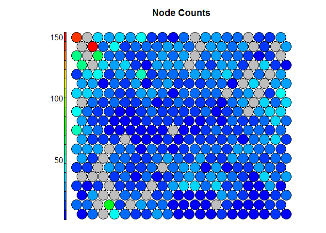
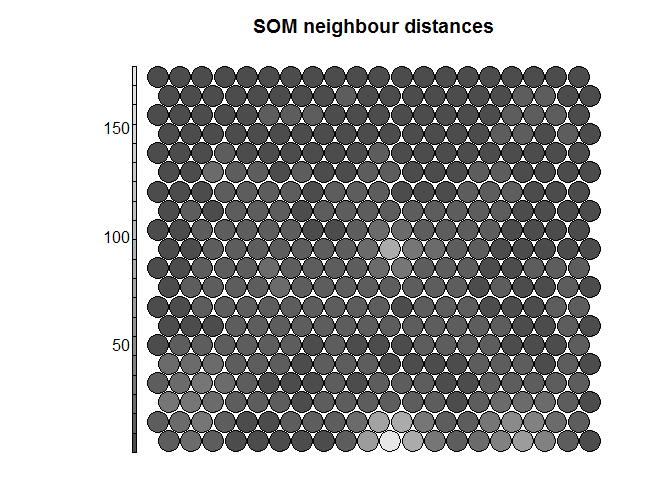
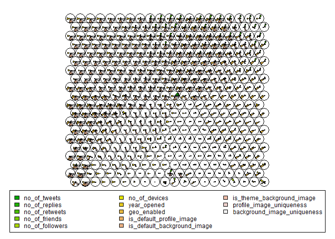
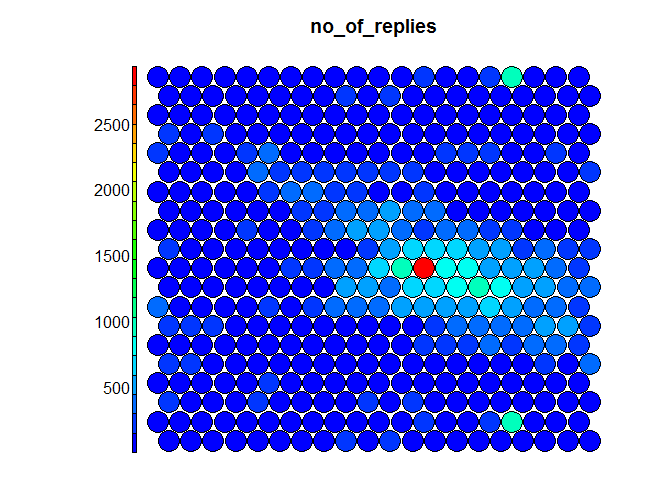
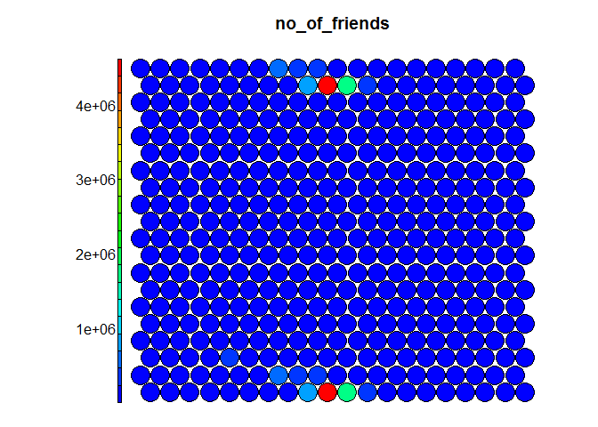
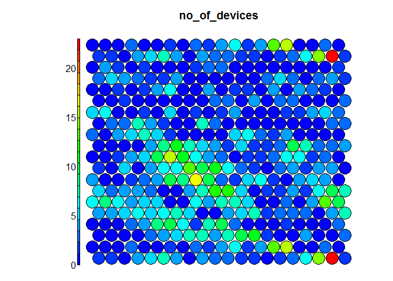
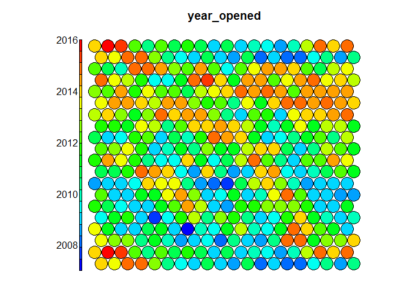
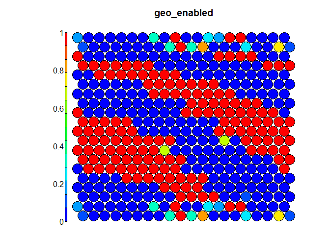
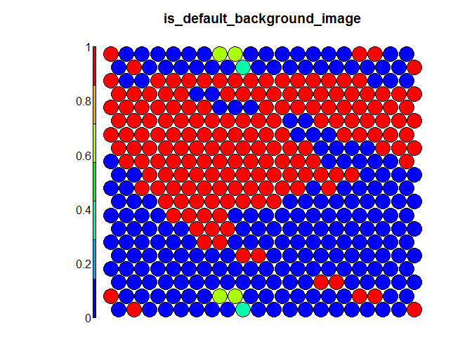
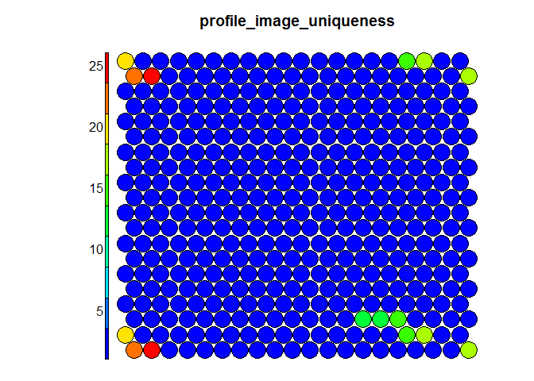

# SOM (Self Organised Maps)


High-dimensional data, meaning data that requires more than two or three dimensions to represent, can be difficult to interpret. One approach to simplification is to assume that the data of interest lie on an embedded non-linear manifold within the higher-dimensional space. If the manifold is of low enough dimension, the data can be visualised in the low-dimensional space.

Self-Organising Maps (SOMs) are an unsupervised data visualisation technique that can be used to visualise high-dimensional data sets in lower (typically 2) dimensional representations.

SOMs were first described by Teuvo Kohonen in Finland in 1982.

The key feature to SOMs is that the topological features of the original input data are preserved on the map. What this means is that similar input samples (where similarity is defined in terms of the input variables (age, sex, height, weight)) are placed close together on the SOM grid. Typical SOM visualisations are of “heatmaps”. A heatmap shows the distribution of a variable across the SOM.

SOMs only operate on numerical data. Categorical data must be converted to dummy variables.

Algorithm for Kohonen's Self Organizing Map
- Assume output nodes are connected in an array (usually 1 or 2 dimensional)
- Assume that the network is fully connected - all nodes in input layer are connected to all nodes in output layer.
- Use the competitive learning algorithm as follows:
 - Randomly choose an input vector x
 - Determine the "winning" output node i, where wi is the weight vector connecting the inputs to output node i.

Most of the code and comments below comes from the following web site:
https://www.r-bloggers.com/self-organising-maps-for-customer-segmentation-using-r/
I only applied the algorithms to my own dataset

## Connect to the database first


```r
library(RPostgreSQL)
```

```
## Loading required package: DBI
```

```r
# create a connection save the password that we can 'hide' it as best as we
# can by collapsing it
pw <- {
    ""
}

# loads the PostgreSQL driver
drv <- dbDriver("PostgreSQL")
# creates a connection to the postgres database note that 'con' will be used
# later in each connection to the database
con <- dbConnect(drv, dbname = "twitter", host = "localhost", port = 5432, user = "postgres", 
    password = "")
# user = postgres for UBUNTU

rm(pw)  # removes the password

# Connection success:
dbExistsTable(con, c("main", "experiment_tweets_shortest"))
```

```
## [1] TRUE
```

##Get a dataset of all users in the corpus
Get the following information from each user
[x] # of tweets
[x] # of tweets replied on
[x] # of retweets
[x] # of friends
[x] # of followers
[x] # of devices
[x] year account was opened
[x] geo enabled flag
[x] profile image uniqueness
[x] background image uniqueness
[x] default profile image flag
[x] default background image flag
[x] default themed background image flag


```r
users <- dbGetQuery(con, "SELECT * from main.experiment_user_shortest")
```

Total amount of users in the corpus: 6846


```r
# Preview user dataset
head(users)
```

```
##   userid  username no_of_tweets no_of_replies no_of_retweets no_of_friends
## 1    767      xeni         1000           270            347          3984
## 2  11332    Crissy         1000            19            408           481
## 3  12925    Janina         1000           103             28           899
## 4  18713      al3x         1002           612            153           403
## 5  27953   Busymom         1000           406             45          1912
## 6  30973 Starbucks          497           487              6         99958
##   no_of_followers no_of_devices year_opened geo_enabled
## 1           95486             4        2006           1
## 2           79178             8        2006           0
## 3          137646            13        2006           1
## 4           41133            10        2006           1
## 5           52686             1        2006           0
## 6        11654033             3        2006           1
##               location latitude longitude                   timezone
## 1     where data flows       NA        NA Pacific Time (US & Canada)
## 2                 Ohio       NA        NA Eastern Time (US & Canada)
## 3 all up in your DMs.        NA        NA Pacific Time (US & Canada)
## 4       Portland\\, OR       NA        NA Pacific Time (US & Canada)
## 5            Nashville       NA        NA Central Time (US & Canada)
## 6        Seattle\\, WA       NA        NA Pacific Time (US & Canada)
##                                                                             profile_image
## 1                     http://pbs.twimg.com/profile_images/702536731807973376/iDelKqT6.jpg
## 2                     http://pbs.twimg.com/profile_images/633119610477387776/K9aBQma2.jpg
## 3                     http://pbs.twimg.com/profile_images/583690049067155456/VovjQxPp.jpg
## 4                     http://pbs.twimg.com/profile_images/697959498711830528/glceGyFI.png
## 5 http://pbs.twimg.com/profile_images/1083701007/01598788-cc52-4433-a2b1-01a137c02e11.jpg
## 6                     http://pbs.twimg.com/profile_images/629049594047893504/ALcBvCnr.png
##                                                                  background_image
## 1 http://pbs.twimg.com/profile_background_images/462391105808388097/MMAmbCWF.jpeg
## 2 http://pbs.twimg.com/profile_background_images/378800000180398133/BdnLw2ye.jpeg
## 3 http://pbs.twimg.com/profile_background_images/525130313064669184/rxPZNvVF.jpeg
## 4                                http://abs.twimg.com/images/themes/theme1/bg.png
## 5                               http://abs.twimg.com/images/themes/theme16/bg.gif
## 6 http://pbs.twimg.com/profile_background_images/469156785677291520/33CmaU1r.jpeg
##   is_default_profile_image is_default_background_image
## 1                        0                           0
## 2                        0                           0
## 3                        0                           0
## 4                        0                           1
## 5                        0                           0
## 6                        0                           0
##   is_theme_background_image profile_image_uniqueness
## 1                         0                        1
## 2                         0                        1
## 3                         0                        1
## 4                         1                        1
## 5                         1                        1
## 6                         0                        1
##   background_image_uniqueness
## 1                           1
## 2                           1
## 3                           1
## 4                        3599
## 5                          20
## 6                           1
```

##Additional transformation of our data to add more indicators
This we can do at a later stage
[ ] continent number based on location
[ ] continent number based on timezone
[ ] # of other similar account users (names that is 90% similar)


##Train the SOM

```r
# Load the kohonen package
library(kohonen)
```

```
## Loading required package: class
```

```
## Loading required package: MASS
```

```r
# Create a training data set (rows are samples, columns are variables Here I
# am selecting a subset of my variables available in 'data'
data_train <- users[, c(3, 4, 5, 6, 7, 8, 9, 10, 17, 18, 19, 20, 21)]  #15-19
head(data_train)
```

```
##   no_of_tweets no_of_replies no_of_retweets no_of_friends no_of_followers
## 1         1000           270            347          3984           95486
## 2         1000            19            408           481           79178
## 3         1000           103             28           899          137646
## 4         1002           612            153           403           41133
## 5         1000           406             45          1912           52686
## 6          497           487              6         99958        11654033
##   no_of_devices year_opened geo_enabled is_default_profile_image
## 1             4        2006           1                        0
## 2             8        2006           0                        0
## 3            13        2006           1                        0
## 4            10        2006           1                        0
## 5             1        2006           0                        0
## 6             3        2006           1                        0
##   is_default_background_image is_theme_background_image
## 1                           0                         0
## 2                           0                         0
## 3                           0                         0
## 4                           1                         1
## 5                           0                         1
## 6                           0                         0
##   profile_image_uniqueness background_image_uniqueness
## 1                        1                           1
## 2                        1                           1
## 3                        1                           1
## 4                        1                        3599
## 5                        1                          20
## 6                        1                           1
```

```r
# Change the data frame with training data to a matrix Also center and scale
# all variables to give them equal importance during the SOM training
# process.
data_train_matrix <- as.matrix(scale(data_train))

# Create the SOM Grid - you generally have to specify the size of the
# training grid prior to training the SOM. Hexagonal and Circular topologies
# are possible
som_grid <- somgrid(xdim = 20, ydim = 20, topo = "hexagonal")

# Finally, train the SOM, options for the number of iterations, the learning
# rates, and the neighbourhood are available
som_model <- som(data_train_matrix, grid = som_grid, rlen = 250, alpha = c(0.05, 
    0.01), keep.data = TRUE, n.hood = "circular")

# remove datasets not required further
rm(som_grid, data_train_matrix)
```

##The analysis of the trained SOM

As the SOM training iterations progress, the distance from each node’s weights to the samples represented by that node is reduced. Ideally, this distance should reach a minimum plateau. This plot option shows the progress over time. If the curve is continually decreasing, more iterations are required.

```r
# Visualise the SOM model results Plot of the training progress - how the
# node distances have stabilised over time.

plot(som_model, type = "changes")
```

<!-- -->

The Kohonen packages allows us to visualise the count of how many samples are mapped to each node on the map. This metric can be used as a measure of map quality – ideally the sample distribution is relatively uniform. Large values in some map areas suggests that a larger map would be benificial. Empty nodes indicate that your map size is too big for the number of samples. Aim for at least 5-10 samples per node when choosing map size. 

```r
## custom palette as per kohonen package (not compulsory)
source("coolBlueHotRed.R")
# counts within nodes
plot(som_model, type = "counts", main = "Node Counts", palette.name = coolBlueHotRed)
```

<!-- -->

```r
# map quality
plot(som_model, type = "quality", main = "Node Quality/Distance", palette.name = coolBlueHotRed)
```

<!-- -->

Neighbour Distance:
Often referred to as the “U-Matrix”, this visualisation is of the distance between each node and its neighbours. Typically viewed with a grayscale palette, areas of low neighbour distance indicate groups of nodes that are similar. Areas with large distances indicate the nodes are much more dissimilar – and indicate natural boundaries between node clusters. The U-Matrix can be used to identify clusters within the SOM map.

```r
# neighbour distances
plot(som_model, type = "dist.neighbours", main = "SOM neighbour distances", 
    palette.name = grey.colors)
```

<!-- -->

Codes / Weight vectors:
The node weight vectors, or “codes”, are made up of normalised values of the original variables used to generate the SOM. Each node’s weight vector is representative / similar of the samples mapped to that node. By visualising the weight vectors across the map, we can see patterns in the distribution of samples and variables. The default visualisation of the weight vectors is a “fan diagram”, where individual fan representations of the magnitude of each variable in the weight vector is shown for each node. Other represenations are available, see the kohonen plot documentation for details. 

```r
# code spread
plot(som_model, type = "codes")
```

<!-- -->

##Heatmaps
Heatmaps are perhaps the most important visualisation possible for Self-Organising Maps. The use of a weight space view as in (4) that tries to view all dimensions on the one diagram is unsuitable for a high-dimensional (>7 variable) SOM. A SOM heatmap allows the visualisation of the distribution of a single variable across the map. Typically, a SOM investigative process involves the creation of multiple heatmaps, and then the comparison of these heatmaps to identify interesting areas on the map. It is important to remember that the individual sample positions do not move from one visualisation to another, the map is simply coloured by different variables.
The default Kohonen heatmap is created by using the type “heatmap”, and then providing one of the variables from the set of node weights. 


```r
# Plot the heatmap for a variable at scaled / normalised values
var <- 2
plot(som_model, type = "property", property = som_model$codes[, var], main = names(data_train)[var], 
    palette.name = coolBlueHotRed)
```

<!-- -->

It should be noted that this default visualisation plots the normalised version of the variable of interest. A more intuitive and useful visualisation is of the variable prior to scaling, which involves some R trickery – using the aggregate function to regenerate the variable from the original training set and the SOM node/sample mappings. The result is scaled to the real values of the training variable (in this case, unemployment percent).
<!-- --><!-- --><!-- --><!-- --><!-- --><!-- --><!-- --><!-- --><!-- --><!-- --><!-- --><!-- --><!-- -->

##Clustering
Clustering can be performed on the SOM nodes to isolate groups of samples with similar metrics. Manual identification of clusters is completed by exploring the heatmaps for a number of variables and drawing up a “story” about the different areas on the map. An estimate of the number of clusters that would be suitable can be ascertained using a kmeans algorithm and examing for an “elbow-point” in the plot of “within cluster sum of squares”.  

```r
# show the WCSS metric for kmeans for different clustering sizes.  Can be
# used as a 'rough' indicator of the ideal number of clusters
mydata <- som_model$codes
wss <- (nrow(mydata) - 1) * sum(apply(mydata, 2, var))
for (i in 2:25) wss[i] <- sum(kmeans(mydata, centers = i)$withinss)
par(mar = c(5.1, 4.1, 4.1, 2.1))
plot(1:25, wss, type = "b", xlab = "Number of Clusters", ylab = "Within groups sum of squares", 
    main = "Within cluster sum of squares (WCSS)")
```

<!-- -->

The Kohonen package documentation shows how a map can be clustered using hierachical clustering. The results of the clustering can be visualised using the SOM plot function again.

```r
# Colour palette definition
pretty_palette <- c("#1f77b4", "#ff7f0e", "#2ca02c", "#d62728", "#9467bd", "#8c564b", 
    "#e377c2")

# Form clusters on grid use hierarchical clustering to cluster the codebook
# vectors
som_cluster <- cutree(hclust(dist(som_model$codes)), 14)

# Show the map with different colours for every cluster
plot(som_model, type = "mapping", bgcol = pretty_palette[som_cluster], main = "Clusters")
add.cluster.boundaries(som_model, som_cluster)
```

<!-- -->

```r
# show the same plot with the codes instead of just colours
plot(som_model, type = "codes", bgcol = pretty_palette[som_cluster], main = "Clusters")
add.cluster.boundaries(som_model, som_cluster)
```

<!-- -->


###users.numbers

```r
# Create a training data set (rows are samples, columns are variables Here I
# am selecting a subset of my variables available in 'data'
data_train <- users[, c(3, 4, 5, 6, 7, 8, 9)]  #15-19
head(data_train)
```

```
##   no_of_tweets no_of_replies no_of_retweets no_of_friends no_of_followers
## 1         1000           270            347          3984           95486
## 2         1000            19            408           481           79178
## 3         1000           103             28           899          137646
## 4         1002           612            153           403           41133
## 5         1000           406             45          1912           52686
## 6          497           487              6         99958        11654033
##   no_of_devices year_opened
## 1             4        2006
## 2             8        2006
## 3            13        2006
## 4            10        2006
## 5             1        2006
## 6             3        2006
```

```r
# Change the data frame with training data to a matrix Also center and scale
# all variables to give them equal importance during the SOM training
# process.
data_train_matrix <- as.matrix(scale(data_train))

# Create the SOM Grid - you generally have to specify the size of the
# training grid prior to training the SOM. Hexagonal and Circular topologies
# are possible
som_grid <- somgrid(xdim = 20, ydim = 20, topo = "hexagonal")

# Finally, train the SOM, options for the number of iterations, the learning
# rates, and the neighbourhood are available
som_model <- som(data_train_matrix, grid = som_grid, rlen = 250, alpha = c(0.05, 
    0.01), keep.data = TRUE, n.hood = "circular")

# remove datasets not required further
rm(som_grid, data_train_matrix)

# Visualise the SOM model results Plot of the training progress - how the
# node distances have stabilised over time.
plot(som_model, type = "changes")
```

<!-- -->

```r
## custom palette as per kohonen package (not compulsory)
source("coolBlueHotRed.R")
# counts within nodes
plot(som_model, type = "counts", main = "Node Counts", palette.name = coolBlueHotRed)
```

<!-- -->

```r
# map quality
plot(som_model, type = "quality", main = "Node Quality/Distance", palette.name = coolBlueHotRed)
```

<!-- -->

```r
# show the WCSS metric for kmeans for different clustering sizes.  Can be
# used as a 'rough' indicator of the ideal number of clusters
mydata <- som_model$codes
wss <- (nrow(mydata) - 1) * sum(apply(mydata, 2, var))
for (i in 2:25) wss[i] <- sum(kmeans(mydata, centers = i)$withinss)
par(mar = c(5.1, 4.1, 4.1, 2.1))
plot(1:25, wss, type = "b", xlab = "Number of Clusters", ylab = "Within groups sum of squares", 
    main = "Within cluster sum of squares (WCSS)")
```

<!-- -->

```r
# Colour palette definition
pretty_palette <- c("#1f77b4", "#ff7f0e", "#2ca02c", "#d62728", "#9467bd", "#8c564b", 
    "#e377c2")

# Form clusters on grid use hierarchical clustering to cluster the codebook
# vectors
som_cluster <- cutree(hclust(dist(som_model$codes)), 10)

# Show the map with different colours for every cluster
plot(som_model, type = "mapping", bgcol = pretty_palette[som_cluster], main = "Clusters")
add.cluster.boundaries(som_model, som_cluster)
```

<!-- -->

```r
# show the same plot with the codes instead of just colours
plot(som_model, type = "codes", bgcol = pretty_palette[som_cluster], main = "Clusters")
add.cluster.boundaries(som_model, som_cluster)
```

<!-- -->

###users.images

```r
# Create a training data set (rows are samples, columns are variables Here I
# am selecting a subset of my variables available in 'data'
data_train <- users[, c(17, 18, 19, 20, 21)]  #15-19
head(data_train)
```

```
##   is_default_profile_image is_default_background_image
## 1                        0                           0
## 2                        0                           0
## 3                        0                           0
## 4                        0                           1
## 5                        0                           0
## 6                        0                           0
##   is_theme_background_image profile_image_uniqueness
## 1                         0                        1
## 2                         0                        1
## 3                         0                        1
## 4                         1                        1
## 5                         1                        1
## 6                         0                        1
##   background_image_uniqueness
## 1                           1
## 2                           1
## 3                           1
## 4                        3599
## 5                          20
## 6                           1
```

```r
# Change the data frame with training data to a matrix Also center and scale
# all variables to give them equal importance during the SOM training
# process.
data_train_matrix <- as.matrix(scale(data_train))

# Create the SOM Grid - you generally have to specify the size of the
# training grid prior to training the SOM. Hexagonal and Circular topologies
# are possible
som_grid <- somgrid(xdim = 5, ydim = 5, topo = "hexagonal")

# Finally, train the SOM, options for the number of iterations, the learning
# rates, and the neighbourhood are available
som_model <- som(data_train_matrix, grid = som_grid, rlen = 100, alpha = c(0.05, 
    0.01), keep.data = TRUE, n.hood = "circular")

# remove datasets not required further
rm(som_grid, data_train_matrix)

# Visualise the SOM model results Plot of the training progress - how the
# node distances have stabilised over time.
plot(som_model, type = "changes")
```

<!-- -->

```r
## custom palette as per kohonen package (not compulsory)
source("coolBlueHotRed.R")
# counts within nodes
plot(som_model, type = "counts", main = "Node Counts", palette.name = coolBlueHotRed)
```

<!-- -->

```r
# map quality
plot(som_model, type = "quality", main = "Node Quality/Distance", palette.name = coolBlueHotRed)
```

<!-- -->

```r
# show the WCSS metric for kmeans for different clustering sizes.  Can be
# used as a 'rough' indicator of the ideal number of clusters
mydata <- som_model$codes
wss <- (nrow(mydata) - 1) * sum(apply(mydata, 2, var))
for (i in 2:15) wss[i] <- sum(kmeans(mydata, centers = i)$withinss)
par(mar = c(5.1, 4.1, 4.1, 2.1))
plot(1:15, wss, type = "b", xlab = "Number of Clusters", ylab = "Within groups sum of squares", 
    main = "Within cluster sum of squares (WCSS)")
```

<!-- -->

```r
# Colour palette definition
pretty_palette <- c("#1f77b4", "#ff7f0e", "#2ca02c", "#d62728", "#9467bd", "#8c564b", 
    "#e377c2")

# Form clusters on grid use hierarchical clustering to cluster the codebook
# vectors
som_cluster <- cutree(hclust(dist(som_model$codes)), 2)

# Show the map with different colours for every cluster
plot(som_model, type = "mapping", bgcol = pretty_palette[som_cluster], main = "Clusters")
add.cluster.boundaries(som_model, som_cluster)
```

<!-- -->

```r
# show the same plot with the codes instead of just colours
plot(som_model, type = "codes", bgcol = pretty_palette[som_cluster], main = "Clusters")
add.cluster.boundaries(som_model, som_cluster)
```

<!-- -->


