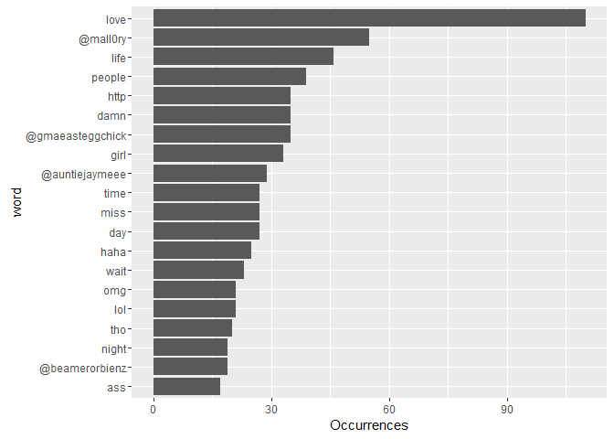
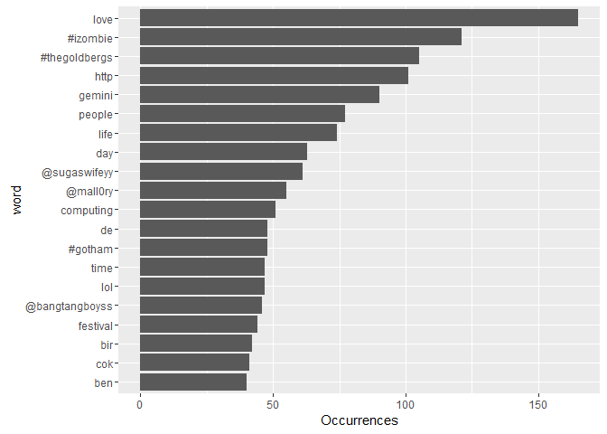
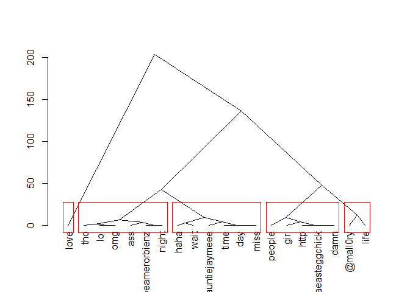
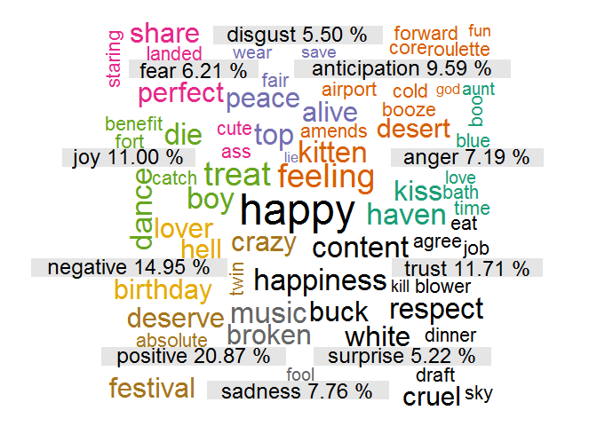
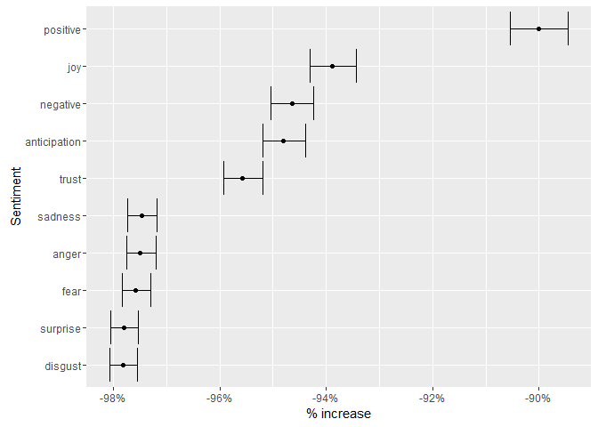
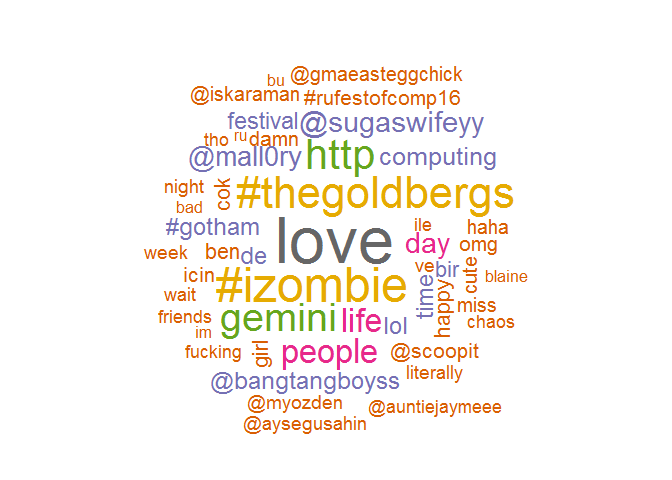
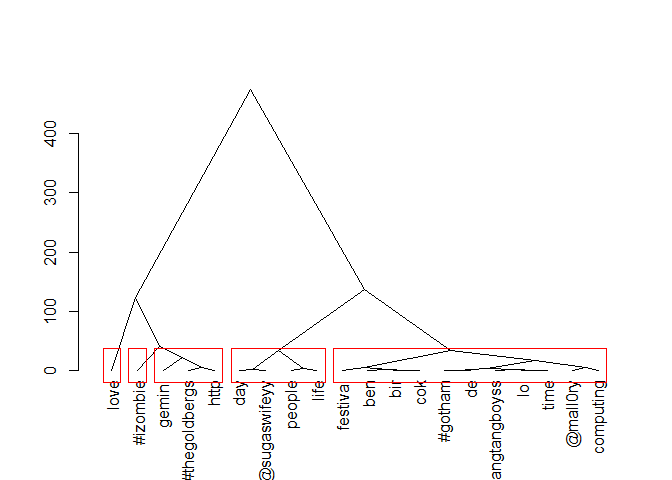
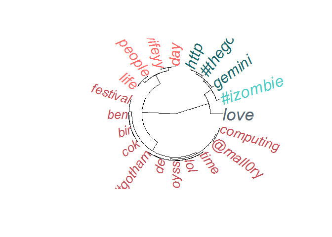
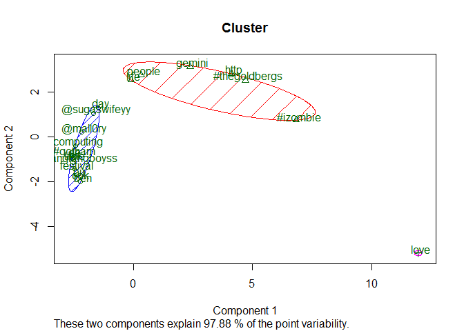
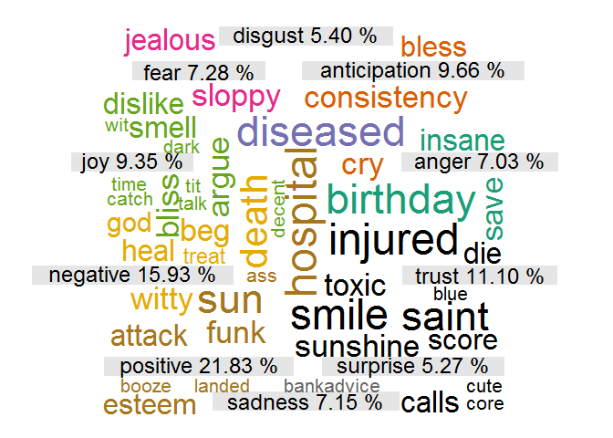

# Sentiment Analysis with Twitter Data


The aim here is to perform sentiment analysis from the content within tweets. We have various options in processing the content: we can rely on NLP libraries or we can use the language processing capabilities built into the SAP HANA library. We will try both and visually show the results in a wordcloud to measure any noticable differences at first.
We will then create a wordcloud for a select few users and measure there distance from the main word cloud, ie how much does their talk differ to that from the corpus.

## Connect to the database first


```r
library(RPostgreSQL)
```

```
## Loading required package: DBI
```

```r
# create a connection save the password that we can 'hide' it as best as we
# can by collapsing it
pw <- {
    ""
}

# loads the PostgreSQL driver
drv <- dbDriver("PostgreSQL")
# creates a connection to the postgres database note that 'con' will be used
# later in each connection to the database
con <- dbConnect(drv, dbname = "twitter", host = "localhost", port = 5432, user = "postgres", 
    password = "")
# user = postgres for UBUNTU

rm(pw)  # removes the password

# Connection success:
dbExistsTable(con, c("main", "experiment_tweets_shortest"))
```

```
## [1] TRUE
```

Connection success: TRUE

##Pull data from the database
We will pull the full corpus but selective fields for analysis due to memory limitations.
Ignore any retweets as we deem this to not be the original content from the user itself and not their opinion.
(we still potentially have to exclude content from bots)


```r
tweets <- dbGetQuery(con, "SELECT \"USERNAME\", \"USERID\", \"CREATEDAT\", \"CONTENT\",\"GEO_ENABLED\", \"LATITUDE\", \"LONGITUDE\", \"LOCATION\", \"TIMEZONE\" from main.experiment_tweets_shortest where \"RETWEET\" = 0 and \"USERNAME\" in ('Londs_','AbeaChou','shift_comma3','HorizonCDT','ttenraBsucraMaD','maknaewon','oliviagarrett25','yallsop','Blackdolphin5','aaleyiahpoisson')")
```

Total amount of tweets in the corpus: 2789

Total unique users: 9

Avg amount of tweets per user: 309.8888889

####Clean the text data
The following code is used to clean the data. We initially just first want to get rid of emoticons.


```r
# extract only content
df <- data.frame(tweets$CONTENT)
# rename column
df <- setNames(df, c("CONTENT"))
# showing that there is a lot of junk in the text
head(df)
```

```
##                                                                                                        CONTENT
## 1                                                                    @mall0ry_ please tell me you work tonight
## 2                                                                              I love everything about my life
## 3                                 @mall0ry_ GOD IS ALIVE! Thank ya Jesus. I can't wait to see you 😍
## 4                                                 This made me smile today ❤️ http://t.co/DSueGBTPJD
## 5                                                                                  My phone just cracked ..wtf
## 6 @JamesAustinCole exactly ☺️ chin up. You have so many great things to look forward to 😘
```

```r
# get only ASCII characters
df$CONTENT <- sapply(df$CONTENT, function(row) iconv(row, "latin1", "ASCII", 
    sub = ""))
head(df)
```

```
##                                                                                CONTENT
## 1                                            @mall0ry_ please tell me you work tonight
## 2                                                      I love everything about my life
## 3                     @mall0ry_ GOD IS ALIVE! Thank ya Jesus. I can't wait to see you 
## 4                                     This made me smile today  http://t.co/DSueGBTPJD
## 5                                                          My phone just cracked ..wtf
## 6 @JamesAustinCole exactly  chin up. You have so many great things to look forward to
```

The we use the text mining libary to remove stopword and also cater for word stemming


```r
# cleanup text
library(tm)
```

```
## Loading required package: NLP
```

```
## 
## Attaching package: 'NLP'
```

```
## The following object is masked from 'package:ggplot2':
## 
##     annotate
```

```r
tweetcorpus <- Corpus(DataframeSource(df))
tweetcorpus <- tm_map(tweetcorpus, removePunctuation)
tweetcorpus <- tm_map(tweetcorpus, tolower)
tweetcorpus <- tm_map(tweetcorpus, removeWords, stopwords("english"))
# remove word stemming
library(SnowballC)
tweetcorpus <- tm_map(tweetcorpus, stemDocument)
# remove whitespace
tweetcorpus <- tm_map(tweetcorpus, stripWhitespace)
# lastly - treat your preprocessed documents as text documents
tweetcorpus <- tm_map(tweetcorpus, PlainTextDocument)

df <- data.frame(text = unlist(sapply(tweetcorpus, `[`, "content")), stringsAsFactors = F)
df <- setNames(df, c("CONTENT"))

head(df)
```

```
##                                                        CONTENT
## 1                             mall0ry please tell work tonight
## 2                                          love everything lif
## 3              mall0ry god alive thank ya jesus cant wait see 
## 4                           made smile today httptcodsuegbtpjd
## 5                                       phone just cracked wtf
## 6 jamesaustincole exactly chin many great things look forward
```

##Per user
##Word clouds
It is then important to count the occurances of all words. We start with one user first to illustrate.


```r
# remove unwanted text from tweets emoticons, hashtags, mentions of people
library(tidytext)
library(stringr)

df <- tweets[tweets$USERNAME == "Londs_", ]

reg <- "([^A-Za-z\\d#@']|'(?![A-Za-z\\d#@]))"
tweet_words <- df %>% # remove quoted text
filter(!str_detect(CONTENT, "^\"")) %>% # remove hyperlinks
mutate(CONTENT = str_replace_all(CONTENT, "https://t.co/[A-Za-z\\d]+|&amp;", 
    "")) %>% unnest_tokens(word, CONTENT, token = "regex", pattern = reg) %>% 
    filter(!word %in% stop_words$word, str_detect(word, "[a-z]"))

# show results as bar, ordered (top 20)
tweet_words %>% count(word, sort = TRUE) %>% head(20) %>% mutate(word = reorder(word, 
    n)) %>% ggplot(aes(word, n)) + geom_bar(stat = "identity") + ylab("Occurrences") + 
    coord_flip()
```

<!-- -->

Build a word cloud for the user based on the word counts already done


```r
wf <- tweet_words %>% count(word, sort = TRUE) %>% head(200) %>% mutate(word = reorder(word, 
    n))

# build word cloud
library(wordcloud)
```

```
## Loading required package: RColorBrewer
```

```r
# library(wordcloud2) setting the same seed each time ensures consistent
# look across clouds
set.seed(42)
# limit words by specifying min frequency
pal2 <- brewer.pal(8, "Dark2")
wordcloud(wf$word, wf$n, max.words = 50, random.order = FALSE, colors = pal2)
```

<!-- -->

```r
# wordcloud2(wf[1:50,], size = 0.5,shape = 'circle', color =
# 'random-dark',backgroundColor = 'white')
```

We can also cluster the words together based on Euclidian distance.
This can be presented in various ways:
1. A Dendogram

```r
# Hierarchal Clustering First calculate distance between words & then
# cluster them according to similarity
library(cluster)
dfd <- wf[1:20, ]
labs <- dfd$word  # new labels
rownames(dfd) <- labs
d <- dist(dfd, method = "euclidian")
fit <- hclust(d = d, method = "ward.D")
hcd = as.dendrogram(fit)
```

2. Another version of a dentogram as a tree

```r
plot(hcd, type = "triangle")
# plot.new() plot(fit, hang=-1) groups <- cutree(fit, k=5) # 'k=' defines
# the number of clusters you are using
rect.hclust(fit, k = 5, border = "red")  # draw dendogram with red borders around the 5 clusters   
```

<!-- -->

3. A dendogram with a fan shape

```r
# show info as fan diagram
library(ape)
# vector of colors
mypal = c("#556270", "#4ECDC4", "#1B676B", "#FF6B6B", "#C44D58")
# cutting dendrogram in 5 clusters
clus5 = cutree(fit, 5)
# plot
op = par(bg = "white")
# Size reflects miles per gallon
plot(as.phylo(fit), type = "fan", tip.color = mypal[clus5], label.offset = 1, 
    cex = log(dfd$n, 10), col = "red")
```

<!-- -->

4. Or as a cluster

```r
# show info in cluster
library(fpc)
kfit <- kmeans(d, 3)
clusplot(as.matrix(d), kfit$cluster, color = T, shade = T, labels = 3, lines = 0, 
    main = "Cluster")
```

<!-- -->

####Sentiment analysis

```r
# sentiment analysis for each of the words
library(tidytext)
library(tidyr)
# get NRC Word-Emotion Association Lexicon
nrc <- sentiments %>% filter(lexicon == "nrc") %>% dplyr::select(word, sentiment)
# show values in dataset
head(nrc)
```

```
## # A tibble: 6 x 2
##        word sentiment
##       <chr>     <chr>
## 1    abacus     trust
## 2   abandon      fear
## 3   abandon  negative
## 4   abandon   sadness
## 5 abandoned     anger
## 6 abandoned      fear
```

```r
# apply sentiment to words
sources <- tweet_words %>% mutate(total_words = n()) %>% ungroup() %>% distinct(word, 
    total_words)

by_source_sentiment <- tweet_words %>% inner_join(nrc, by = "word") %>% count(sentiment, 
    word) %>% ungroup() %>% complete(sentiment, word, fill = list(n = 0)) %>% 
    inner_join(sources) %>% group_by(sentiment, total_words) %>% summarize(words = sum(n)) %>% 
    ungroup()
```

```
## Joining, by = "word"
```

```r
# show the sentiment
by_source_sentiment
```

```
## # A tibble: 10 x 3
##       sentiment total_words words
##           <chr>       <int> <dbl>
## 1         anger        3133   134
## 2  anticipation        3133   231
## 3       disgust        3133   125
## 4          fear        3133    90
## 5           joy        3133   338
## 6      negative        3133   287
## 7      positive        3133   454
## 8       sadness        3133   114
## 9      surprise        3133    87
## 10        trust        3133   188
```

```r
# use Poisson test to measure the difference in sentiment
library(broom)

sentiment_differences <- by_source_sentiment %>% group_by(sentiment) %>% do(tidy(poisson.test(.$words, 
    .$total_words)))

sentiment_differences
```

```
## Source: local data frame [10 x 9]
## Groups: sentiment [10]
## 
##       sentiment   estimate statistic       p.value parameter   conf.low
##           <chr>      <dbl>     <dbl>         <dbl>     <int>      <dbl>
## 1         anger 0.04277051       134 4.940656e-324      3133 0.03583570
## 2  anticipation 0.07373125       231 4.940656e-324      3133 0.06452898
## 3       disgust 0.03989786       125 4.940656e-324      3133 0.03321063
## 4          fear 0.02872646        90 4.940656e-324      3133 0.02309947
## 5           joy 0.10788382       338 4.940656e-324      3133 0.09668778
## 6      negative 0.09160549       287 4.940656e-324      3133 0.08131285
## 7      positive 0.14490903       454 4.940656e-324      3133 0.13188432
## 8       sadness 0.03638685       114 4.940656e-324      3133 0.03001466
## 9      surprise 0.02776891        87 4.940656e-324      3133 0.02224176
## 10        trust 0.06000638       188 4.940656e-324      3133 0.05173497
## # ... with 3 more variables: conf.high <dbl>, method <fctr>,
## #   alternative <fctr>
```

```r
# visualize confidence
library(scales)

sentiment_differences %>% ungroup() %>% mutate(sentiment = reorder(sentiment, 
    estimate)) %>% mutate_each(funs(. - 1), estimate, conf.low, conf.high) %>% 
    ggplot(aes(estimate, sentiment)) + geom_point() + geom_errorbarh(aes(xmin = conf.low, 
    xmax = conf.high)) + scale_x_continuous(labels = percent_format()) + labs(x = "% increase", 
    y = "Sentiment")
```

<!-- -->

```r
# separate text by sentiment
sents = levels(factor(by_source_sentiment$sentiment))
# get the labels and percents
tweet_words_sentiment <- tweet_words %>% inner_join(nrc, by = "word") %>% count(sentiment, 
    word) %>% ungroup()

labels <- lapply(sents, function(x) paste(x, format(round((length((tweet_words_sentiment[tweet_words_sentiment$sentiment == 
    x, ])$word)/length(tweet_words_sentiment$sentiment) * 100), 2), nsmall = 2), 
    "%"))

# build data for word cloud
nemo = length(sents)
emo.docs = rep("", nemo)
for (i in 1:nemo) {
    tmp = tweet_words_sentiment[by_source_sentiment$sentiment == sents[i], ]$word
    
    emo.docs[i] = paste(tmp, collapse = " ")
}
corpus = Corpus(VectorSource(emo.docs))
tdm = TermDocumentMatrix(corpus)
tdm = as.matrix(tdm)
colnames(tdm) = labels

# comparison word cloud
library(wordcloud)
comparison.cloud(tdm, colors = brewer.pal(nemo, "Dark2"), scale = c(3, 0.5), 
    random.order = FALSE, title.size = 1.5)
```

<!-- -->
                 
####Per full corpus

```r
# remove unwanted text from tweets emoticons, hashtags, mentions of people
df <- tweets

reg <- "([^A-Za-z\\d#@']|'(?![A-Za-z\\d#@]))"
tweet_words <- df %>% # remove quoted text
filter(!str_detect(CONTENT, "^\"")) %>% # remove hyperlinks
mutate(CONTENT = str_replace_all(CONTENT, "https://t.co/[A-Za-z\\d]+|&amp;", 
    "")) %>% unnest_tokens(word, CONTENT, token = "regex", pattern = reg) %>% 
    filter(!word %in% stop_words$word, str_detect(word, "[a-z]"))

# show results as bar, ordered (top 20)
tweet_words %>% count(word, sort = TRUE) %>% head(20) %>% mutate(word = reorder(word, 
    n)) %>% ggplot(aes(word, n)) + geom_bar(stat = "identity") + ylab("Occurrences") + 
    coord_flip()
```

<!-- -->

Build a word cloud for the user based on the word counts already done


```r
wf <- tweet_words %>% count(word, sort = TRUE) %>% head(200) %>% mutate(word = reorder(word, 
    n))

# build word cloud
library(wordcloud)
# library(wordcloud2) setting the same seed each time ensures consistent
# look across clouds
set.seed(42)
# limit words by specifying min frequency
pal2 <- brewer.pal(8, "Dark2")
wordcloud(wf$word, wf$n, max.words = 50, random.order = FALSE, colors = pal2)
```

<!-- -->

```r
# wordcloud2(wf[1:50,], size = 0.5,shape = 'circle', color =
# 'random-dark',backgroundColor = 'white')
```

We can also cluster the words together based on Euclidian distance.
This can be presented in various ways:
1. A Dendogram

```r
# Hierarchal Clustering First calculate distance between words & then
# cluster them according to similarity
library(cluster)
dfd <- wf[1:20, ]
labs <- dfd$word  # new labels
rownames(dfd) <- labs
d <- dist(dfd, method = "euclidian")
fit <- hclust(d = d, method = "ward.D")
hcd = as.dendrogram(fit)
```

2. Another version of a dentogram as a tree

```r
plot(hcd, type = "triangle")
# plot.new() plot(fit, hang=-1) groups <- cutree(fit, k=5) # 'k=' defines
# the number of clusters you are using
rect.hclust(fit, k = 5, border = "red")  # draw dendogram with red borders around the 5 clusters   
```

<!-- -->

3. A dendogram with a fan shape

```r
# show info as fan diagram
library(ape)
# vector of colors
mypal = c("#556270", "#4ECDC4", "#1B676B", "#FF6B6B", "#C44D58")
# cutting dendrogram in 5 clusters
clus5 = cutree(fit, 5)
# plot
op = par(bg = "white")
# Size reflects miles per gallon
plot(as.phylo(fit), type = "fan", tip.color = mypal[clus5], label.offset = 1, 
    cex = log(dfd$n, 10), col = "red")
```

<!-- -->

4. Or as a cluster

```r
# show info in cluster
library(fpc)
kfit <- kmeans(d, 3)
clusplot(as.matrix(d), kfit$cluster, color = T, shade = T, labels = 3, lines = 0, 
    main = "Cluster")
```

<!-- -->

####Sentiment analysis

```r
# sentiment analysis for each of the words
library(tidytext)
library(tidyr)
# get NRC Word-Emotion Association Lexicon
nrc <- sentiments %>% filter(lexicon == "nrc") %>% dplyr::select(word, sentiment)
# show values in dataset
head(nrc)
```

```
## # A tibble: 6 x 2
##        word sentiment
##       <chr>     <chr>
## 1    abacus     trust
## 2   abandon      fear
## 3   abandon  negative
## 4   abandon   sadness
## 5 abandoned     anger
## 6 abandoned      fear
```

```r
# apply sentiment to words
sources <- tweet_words %>% mutate(total_words = n()) %>% ungroup() %>% distinct(word, 
    total_words)

by_source_sentiment <- tweet_words %>% inner_join(nrc, by = "word") %>% count(sentiment, 
    word) %>% ungroup() %>% complete(sentiment, word, fill = list(n = 0)) %>% 
    inner_join(sources) %>% group_by(sentiment, total_words) %>% summarize(words = sum(n)) %>% 
    ungroup()
```

```
## Joining, by = "word"
```

```r
# show the sentiment
by_source_sentiment
```

```
## # A tibble: 10 x 3
##       sentiment total_words words
##           <chr>       <int> <dbl>
## 1         anger       13037   327
## 2  anticipation       13037   678
## 3       disgust       13037   284
## 4          fear       13037   316
## 5           joy       13037   798
## 6      negative       13037   698
## 7      positive       13037  1303
## 8       sadness       13037   330
## 9      surprise       13037   286
## 10        trust       13037   577
```

```r
# use Poisson test to measure the difference in sentiment
library(broom)

sentiment_differences <- by_source_sentiment %>% group_by(sentiment) %>% do(tidy(poisson.test(.$words, 
    .$total_words)))

sentiment_differences
```

```
## Source: local data frame [10 x 9]
## Groups: sentiment [10]
## 
##       sentiment   estimate statistic       p.value parameter   conf.low
##           <chr>      <dbl>     <dbl>         <dbl>     <int>      <dbl>
## 1         anger 0.02508246       327 9.881313e-324     13037 0.02243723
## 2  anticipation 0.05200583       678 9.881313e-324     13037 0.04816440
## 3       disgust 0.02178415       284 9.881313e-324     13037 0.01932402
## 4          fear 0.02423871       316 9.881313e-324     13037 0.02163960
## 5           joy 0.06121040       798 9.881313e-324     13037 0.05703661
## 6      negative 0.05353992       698 9.881313e-324     13037 0.04964117
## 7      positive 0.09994631      1303 9.881313e-324     13037 0.09459253
## 8       sadness 0.02531257       330 9.881313e-324     13037 0.02265490
## 9      surprise 0.02193756       286 9.881313e-324     13037 0.01946852
## 10        trust 0.04425865       577 9.881313e-324     13037 0.04072058
## # ... with 3 more variables: conf.high <dbl>, method <fctr>,
## #   alternative <fctr>
```

```r
# visualize confidence
library(scales)

sentiment_differences %>% ungroup() %>% mutate(sentiment = reorder(sentiment, 
    estimate)) %>% mutate_each(funs(. - 1), estimate, conf.low, conf.high) %>% 
    ggplot(aes(estimate, sentiment)) + geom_point() + geom_errorbarh(aes(xmin = conf.low, 
    xmax = conf.high)) + scale_x_continuous(labels = percent_format()) + labs(x = "% increase", 
    y = "Sentiment")
```

<!-- -->

```r
# separate text by sentiment
sents = levels(factor(by_source_sentiment$sentiment))
# get the labels and percents
tweet_words_sentiment <- tweet_words %>% inner_join(nrc, by = "word") %>% count(sentiment, 
    word) %>% ungroup()

labels <- lapply(sents, function(x) paste(x, format(round((length((tweet_words_sentiment[tweet_words_sentiment$sentiment == 
    x, ])$word)/length(tweet_words_sentiment$sentiment) * 100), 2), nsmall = 2), 
    "%"))

# build data for word cloud
nemo = length(sents)
emo.docs = rep("", nemo)
for (i in 1:nemo) {
    tmp = tweet_words_sentiment[by_source_sentiment$sentiment == sents[i], ]$word
    
    emo.docs[i] = paste(tmp, collapse = " ")
}
corpus = Corpus(VectorSource(emo.docs))
tdm = TermDocumentMatrix(corpus)
tdm = as.matrix(tdm)
colnames(tdm) = labels

# comparison word cloud
library(wordcloud)
comparison.cloud(tdm, colors = brewer.pal(nemo, "Dark2"), scale = c(3, 0.5), 
    random.order = FALSE, title.size = 1.5)
```

<!-- -->


####TODO
####Per continents

How many tweets have location enabled

How many tweets have location enabled per continent

Use timezone to determine continent/location iso geo points

User location to determine continent/location iso geo points

Word clouds for different continents over the full corpus

Sentiment per continent


####Per country

Word clouds for different continents over the full corpus

Sentiment per continent

##Close the Database connection

