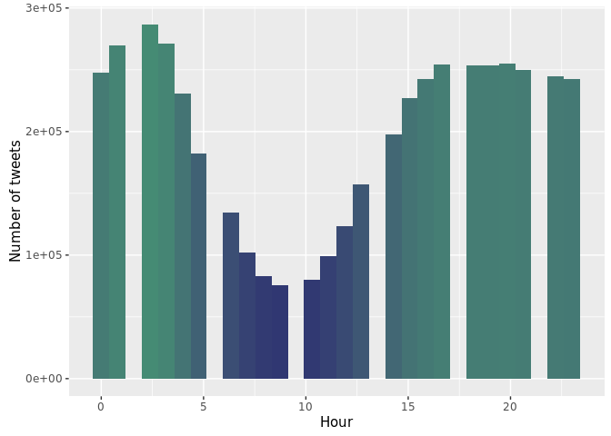
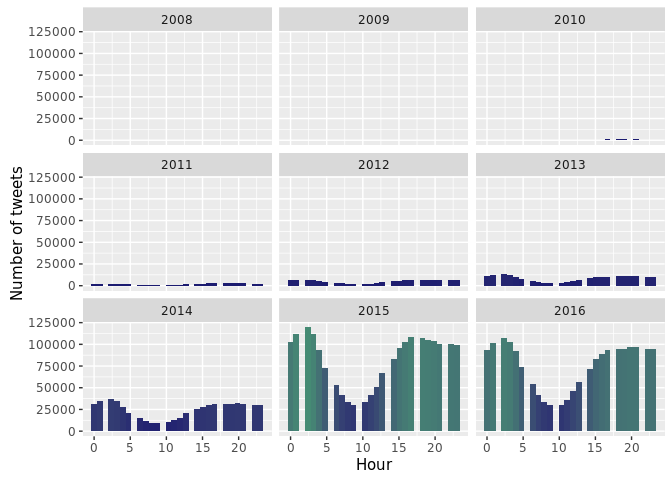
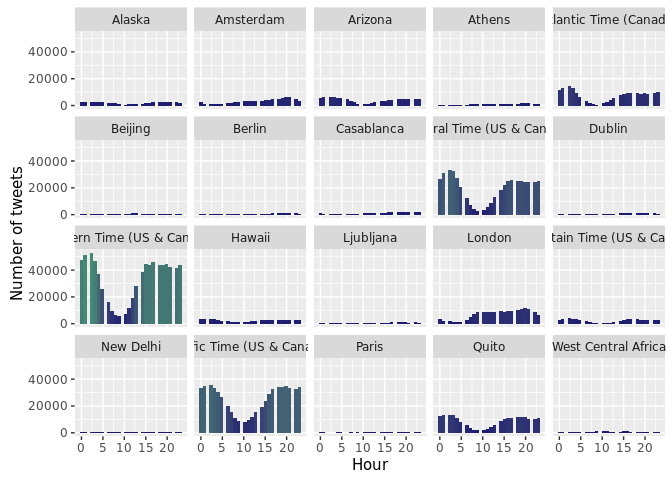

# Tweet Corpus Information


The aim is to understand the nature of the tweets a bit more. These could help us later in feature selection when building a indentity deception indicator.

## Connect to the database first

```r
# loads the PostgreSQL driver
drv <- dbDriver("PostgreSQL")
# creates a connection to the postgres database note that 'con' will be used
# later in each connection to the database
con <- dbConnect(drv, dbname = "twitter", host = "localhost", port = 5432, user = "postgres", 
    password = "")
```

Connection success: TRUE

##Pull data from the database
We will pull the full corpus but selective fields for analysis due to memory limitation


```r
tweets <- dbGetQuery(con, "SELECT \"ID\", \"CREATEDAT\", \"USERID\", \"RETWEET\", \"GEO_ENABLED\", \"LATITUDE\", \"LONGITUDE\", \"LOCATION\", \"TIMEZONE\" from main.experiment_tweets_shortest")
```

Total amount of tweets in the corpus: 4764733

Total unique users: 6846

##Dates of the tweets

####Per year
Show a plot off all tweets as per their creation date

```r
tweets$CREATEDAT <- ymd_hms(tweets$CREATEDAT)
tweets$YEAR <- year(tweets$CREATEDAT)

ggplot(data = tweets, aes(x = CREATEDAT)) + geom_histogram(aes(fill = ..count..)) + 
    theme(legend.position = "none") + xlab("Time") + ylab("Number of tweets") + 
    scale_fill_gradient(low = "midnightblue", high = "aquamarine4")
```

```
## `stat_bin()` using `bins = 30`. Pick better value with `binwidth`.
```

<!-- -->

####Per hour
Show a plot off all tweets as per hour

```r
ggplot(data = tweets, aes(x = hour(CREATEDAT))) + geom_histogram(aes(fill = ..count..)) + 
    theme(legend.position = "none") + xlab("Hour") + ylab("Number of tweets") + 
    scale_fill_gradient(low = "midnightblue", high = "aquamarine4")
```

```
## `stat_bin()` using `bins = 30`. Pick better value with `binwidth`.
```

<!-- -->

Is this the same per year?

```r
ggplot(data = tweets, aes(x = hour(CREATEDAT))) + geom_histogram(aes(fill = ..count..)) + 
    theme(legend.position = "none") + facet_wrap(~YEAR) + xlab("Hour") + ylab("Number of tweets") + 
    scale_fill_gradient(low = "midnightblue", high = "aquamarine4")
```

```
## `stat_bin()` using `bins = 30`. Pick better value with `binwidth`.
```

<!-- -->

Is the behavior the same for all timezones?

First show the top20 timezones

```r
toptz <- data.frame(sort(table(tweets$TIMEZONE), decreasing = T))
toptz <- toptz[1:20, ]
ggplot(data = toptz, aes(Var1, Freq)) + geom_bar(stat = "identity") + theme(legend.position = "none") + 
    xlab("Timezone") + ylab("Number of tweets") + scale_fill_gradient(low = "midnightblue", 
    high = "aquamarine4") + theme(axis.text.x = element_text(angle = 90, hjust = 1))
```

<!-- -->

Now show the tweets per hour per the top 20 timezones

```r
toptz_tweets <- tweets[tweets$TIMEZONE %in% toptz$Var1, ]

ggplot(data = toptz_tweets, aes(x = hour(CREATEDAT))) + geom_histogram(aes(fill = ..count..)) + 
    theme(legend.position = "none") + facet_wrap(~TIMEZONE) + xlab("Hour") + 
    ylab("Number of tweets") + scale_fill_gradient(low = "midnightblue", high = "aquamarine4")
```

```
## `stat_bin()` using `bins = 30`. Pick better value with `binwidth`.
```

<!-- -->

####Per weekday
Show a plot off all tweets as per week day

```r
ggplot(data = tweets, aes(x = wday(CREATEDAT, label = TRUE))) + geom_bar(aes(fill = ..count..)) + 
    theme(legend.position = "none") + xlab("Day of the Week") + ylab("Number of tweets") + 
    scale_fill_gradient(low = "midnightblue", high = "aquamarine4")
```

<!-- -->

Is this the same per year?

```r
ggplot(data = tweets, aes(x = wday(CREATEDAT, label = TRUE))) + geom_bar(aes(fill = ..count..)) + 
    theme(legend.position = "none") + facet_wrap(~YEAR) + xlab("Day of the Week") + 
    ylab("Number of tweets") + scale_fill_gradient(low = "midnightblue", high = "aquamarine4")
```

<!-- -->

####Per hour, per location
