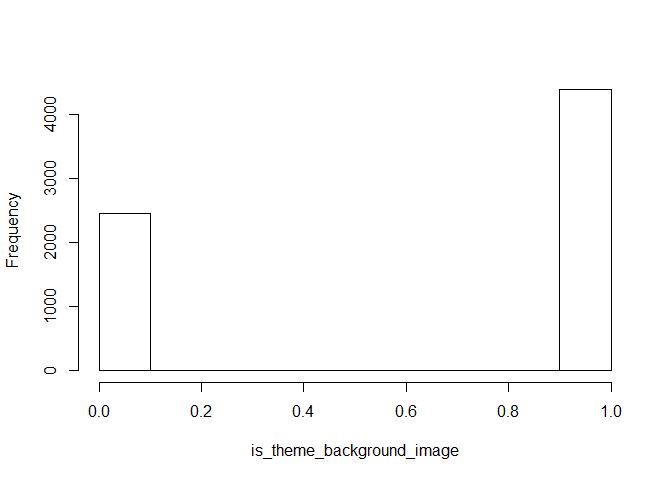

# Tweet Outliers


In statistics, a outlier is defined as a observation which stands far away from the most of other observations.
There are different methods to detect the outliers, including standard deviation approach and Tukey’s method which use interquartile (IQR) range approach.

Many machine learning algorithms are sensitive to the range and distribution of attribute values in the input data. Outliers in input data can skew and mislead the training process of machine learning algorithms resulting in longer training times, less accurate models and ultimately poorer results.
Even before predictive models are prepared on training data, outliers can result in misleading representations and in turn misleading interpretations of collected data. Outliers can skew the summary distribution of attribute values in descriptive statistics like mean and standard deviation and in plots such as histograms and scatterplots, compressing the body of the data.
Finally, outliers can represent examples of data instances that are relevant to the problem such as anomalies in the case of fraud detection and computer security.

Taxonomy of outlier detection methods, as follows:
•Extreme Value Analysis: Determine the statistical tails of the underlying distribution of the data. For example, statistical methods like the z-scores on univariate data.
•Probabilistic and Statistical Models: Determine unlikely instances from a probabilistic model of the data. For example, gaussian mixture models optimized using expectation-maximization.
•Linear Models: Projection methods that model the data into lower dimensions using linear correlations. For example, principle component analysis and data with large residual errors may be outliers.
•Proximity-based Models: Data instances that are isolated from the mass of the data as determined by cluster, density or nearest neighbor analysis.
•Information Theoretic Models: Outliers are detected as data instances that increase the complexity (minimum code length) of the dataset.
•High-Dimensional Outlier Detection: Methods that search subspaces for outliers give the breakdown of distance based measures in higher dimensions (curse of dimensionality).

Outliers are interesting. Depending on the context, they either deserve special attention or should be completely ignored. Take the example of revenue forecasting. If unusual spikes of revenue are observed, it's probably a good idea to pay extra attention to them and figure out what caused the spike. But if the outliers are due to mechanical error, measurement error or anything else that’s not generalizable, it’s a good idea to filter out these outliers before feeding the data to the modeling algorithm. 
Some models are more sensitive to outliers than others. For instance, AdaBoost might treat those outliers as "hard" cases and put tremendous weights on outliers while decision tree might simply count each outlier as one false classification. If the data set contains a fair amount of outliers, it's important to either use modeling algorithm robust against outliers or filter the outliers out. 

The aim is to understand which of the variables in twitter contain outliers, if at all.
This will help us determine if we need to clean the corpus from outliers before any machine learning.

## Connect to the database first


```r
library(RPostgreSQL)
```

```
## Loading required package: DBI
```

```r
# create a connection save the password that we can 'hide' it as best as we
# can by collapsing it
pw <- {
    ""
}

# loads the PostgreSQL driver
drv <- dbDriver("PostgreSQL")
# creates a connection to the postgres database note that 'con' will be used
# later in each connection to the database
con <- dbConnect(drv, dbname = "twitter", host = "localhost", port = 5432, user = "postgres", 
    password = "")
# user = postgres for UBUNTU

rm(pw)  # removes the password

# Connection success:
dbExistsTable(con, c("main", "experiment_tweets_shortest"))
```

```
## [1] TRUE
```

Connection success: TRUE

##Pull data from the database
We will pull the full corpus
##Get the tweets

```r
users <- dbGetQuery(con, "SELECT * from main.experiment_user_shortest")
```

Total amount of users in the corpus: 6846

##number of variables

```r
# number of variables
ncol(users)
```

```
## [1] 21
```

```r
# structure
str(users)
```

```
## 'data.frame':	6846 obs. of  21 variables:
##  $ userid                     : num  767 11332 12925 18713 27953 ...
##  $ username                   : chr  "xeni" "Crissy" "Janina" "al3x" ...
##  $ no_of_tweets               : num  1000 1000 1000 1002 1000 ...
##  $ no_of_replies              : num  270 19 103 612 406 487 504 0 4 34 ...
##  $ no_of_retweets             : num  347 408 28 153 45 6 224 0 250 807 ...
##  $ no_of_friends              : int  3984 481 899 403 1912 99958 177 1203 116 898 ...
##  $ no_of_followers            : int  95486 79178 137646 41133 52686 11654033 292 1038 35448433 332 ...
##  $ no_of_devices              : num  4 8 13 10 1 3 8 1 3 13 ...
##  $ year_opened                : num  2006 2006 2006 2006 2006 ...
##  $ geo_enabled                : int  1 0 1 1 0 1 0 0 0 1 ...
##  $ location                   : chr  "where data flows" "Ohio" "all up in your DMs. " "Portland\\, OR" ...
##  $ latitude                   : num  NA NA NA NA NA NA NA NA NA NA ...
##  $ longitude                  : num  NA NA NA NA NA NA NA NA NA NA ...
##  $ timezone                   : chr  "Pacific Time (US & Canada)" "Eastern Time (US & Canada)" "Pacific Time (US & Canada)" "Pacific Time (US & Canada)" ...
##  $ profile_image              : chr  "http://pbs.twimg.com/profile_images/702536731807973376/iDelKqT6.jpg" "http://pbs.twimg.com/profile_images/633119610477387776/K9aBQma2.jpg" "http://pbs.twimg.com/profile_images/583690049067155456/VovjQxPp.jpg" "http://pbs.twimg.com/profile_images/697959498711830528/glceGyFI.png" ...
##  $ background_image           : chr  "http://pbs.twimg.com/profile_background_images/462391105808388097/MMAmbCWF.jpeg" "http://pbs.twimg.com/profile_background_images/378800000180398133/BdnLw2ye.jpeg" "http://pbs.twimg.com/profile_background_images/525130313064669184/rxPZNvVF.jpeg" "http://abs.twimg.com/images/themes/theme1/bg.png" ...
##  $ is_default_profile_image   : int  0 0 0 0 0 0 0 0 0 0 ...
##  $ is_default_background_image: int  0 0 0 1 0 0 0 0 0 1 ...
##  $ is_theme_background_image  : int  0 0 0 1 1 0 1 0 0 1 ...
##  $ profile_image_uniqueness   : num  1 1 1 1 1 1 1 1 1 1 ...
##  $ background_image_uniqueness: num  1 1 1 3599 20 ...
```

##Box plots of each tweet variable

```r
# first remove all non numeric columns get columns that has numeric values
nums <- sapply(users, is.numeric)
# Then standard subsetting
users <- users[, nums]
str(users)
```

```
## 'data.frame':	6846 obs. of  16 variables:
##  $ userid                     : num  767 11332 12925 18713 27953 ...
##  $ no_of_tweets               : num  1000 1000 1000 1002 1000 ...
##  $ no_of_replies              : num  270 19 103 612 406 487 504 0 4 34 ...
##  $ no_of_retweets             : num  347 408 28 153 45 6 224 0 250 807 ...
##  $ no_of_friends              : int  3984 481 899 403 1912 99958 177 1203 116 898 ...
##  $ no_of_followers            : int  95486 79178 137646 41133 52686 11654033 292 1038 35448433 332 ...
##  $ no_of_devices              : num  4 8 13 10 1 3 8 1 3 13 ...
##  $ year_opened                : num  2006 2006 2006 2006 2006 ...
##  $ geo_enabled                : int  1 0 1 1 0 1 0 0 0 1 ...
##  $ latitude                   : num  NA NA NA NA NA NA NA NA NA NA ...
##  $ longitude                  : num  NA NA NA NA NA NA NA NA NA NA ...
##  $ is_default_profile_image   : int  0 0 0 0 0 0 0 0 0 0 ...
##  $ is_default_background_image: int  0 0 0 1 0 0 0 0 0 1 ...
##  $ is_theme_background_image  : int  0 0 0 1 1 0 1 0 0 1 ...
##  $ profile_image_uniqueness   : num  1 1 1 1 1 1 1 1 1 1 ...
##  $ background_image_uniqueness: num  1 1 1 3599 20 ...
```

```r
# draw boxplot for each variable with outliers
boxplot(users, horizontal = TRUE, las = 2)
```

<!-- -->

```r
# draw boxplot for each variable without outliers
boxplot(users, horizontal = TRUE, outline = FALSE, las = 2)
```

<!-- -->

```r
# userid is unique therefore remove from set as it wont serve any purpose in
# machine learning algorithm
users <- users[, 2:ncol(users)]
# draw boxplot for each variable with outliers seperately
for (i in 1:ncol(users)) {
    x <- users[, i, drop = FALSE]
    n <- colnames(users[i])
    boxplot(x, horizontal = TRUE, outline = TRUE, ylab = n)
    hist(users[, i], main = "", xlab = n)  #only accepts vector
}
```

<!-- --><!-- --><!-- --><!-- --><!-- --><!-- --><!-- --><!-- --><!-- --><!-- --><!-- --><!-- --><!-- --><!-- --><!-- --><!-- --><!-- --><!-- --><!-- --><!-- --><!-- --><!-- --><!-- --><!-- --><!-- --><!-- --><!-- --><!-- --><!-- --><!-- -->

```r
# for (i in 1:ncol(users))
# boxplot(users[,i,drop=FALSE],horizontal=TRUE,axes=FALSE,outline=FALSE)
```

## show data in terms of categories related to each other
###users.text
This category is not important for now. We are first investigating the user themselves before we will look at what they wrote
users.text

###users.numbers

```r
users.numbers <- users[, 1:7]
n <- colnames(users.numbers)
boxplot(users.numbers, horizontal = TRUE, outline = TRUE, names = n, las = 2)
```

<!-- -->

###users.images

```r
users.images <- users[, 11:ncol(users)]
n <- colnames(users.images)
boxplot(users.images, horizontal = TRUE, outline = TRUE, names = n, las = 2)
```

<!-- -->

###users.gps

```r
users.gps <- users[, 8:10]
n <- colnames(users.gps)
boxplot(users.gps, horizontal = TRUE, outline = TRUE, names = n, las = 2)
```

<!-- -->

##Close the Database connection

