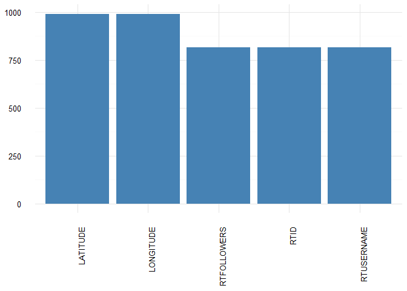

# Tweet Content Information


## Connect to the database first

```r
# loads the PostgreSQL driver
drv <- dbDriver("PostgreSQL")
# creates a connection to the postgres database note that 'con' will be used
# later in each connection to the database
con <- dbConnect(drv, dbname = "twitter", host = "localhost", port = 5432, user = "postgres", 
    password = "")
```

Connection success: TRUE

##Pull data from the database
We will only pull the data for one user to understand the structure and content initially


```r
tweets <- dbGetQuery(con, "SELECT * from main.experiment_tweets_shortest where \"USERNAME\" = 'Londs_'")
```

Amount of records retrieved: 1000

## Show first 5 records

```r
head(tweets)
```

```
##             ID
## 1 6.267694e+17
## 2 6.265920e+17
## 3 6.267700e+17
## 4 6.260581e+17
## 5 6.257871e+17
## 6 6.257856e+17
##                                                                                                                     CONTENT
## 1                                                                                 @mall0ry_ please tell me you work tonight
## 2                                                                                           I love everything about my life
## 3                                              @mall0ry_ GOD IS ALIVE! Thank ya Jesus. I can't wait to see you 😍
## 4                                                              This made me smile today ❤️ http://t.co/DSueGBTPJD
## 5              @JamesAustinCole exactly ☺️ chin up. You have so many great things to look forward to 😘
## 6 RT @JamesAustinCole: God Tilonda i absolutely love you @Londs_   you dont know how close I was to flipping out last night
##             CREATEDAT RETWEET         RTID      RTUSERNAME
## 1 2015-07-30 15:00:55       0           NA            <NA>
## 2 2015-07-30 03:15:40       0           NA            <NA>
## 3 2015-07-30 15:03:10       0           NA            <NA>
## 4 2015-07-28 15:54:05       0           NA            <NA>
## 5 2015-07-27 21:57:17       0           NA            <NA>
## 6 2015-07-27 21:51:26       1 6.257845e+17 JamesAustinCole
##             OPEN_DATE    USERID USERNAME     FULLNAME
## 1 2010-05-01 15:07:23 139102704   Londs_ Tilly ☮
## 2 2010-05-01 15:07:23 139102704   Londs_ Tilly ☮
## 3 2010-05-01 15:07:23 139102704   Londs_ Tilly ☮
## 4 2010-05-01 15:07:23 139102704   Londs_ Tilly ☮
## 5 2010-05-01 15:07:23 139102704   Londs_ Tilly ☮
## 6 2010-05-01 15:07:23 139102704   Londs_ Tilly ☮
##                                  DESCRIPTION GEO_ENABLED LATITUDE
## 1 To the moon & back\\, forever ❤️           1       NA
## 2 To the moon & back\\, forever ❤️           1       NA
## 3 To the moon & back\\, forever ❤️           1       NA
## 4 To the moon & back\\, forever ❤️           1       NA
## 5 To the moon & back\\, forever ❤️           1       NA
## 6 To the moon & back\\, forever ❤️           1       NA
##   LONGITUDE LOCATION                   TIMEZONE LANGUAGE FOLLOWERS FRIENDS
## 1        NA          Pacific Time (US & Canada)       en       673     480
## 2        NA          Pacific Time (US & Canada)       en       673     480
## 3        NA          Pacific Time (US & Canada)       en       673     480
## 4        NA          Pacific Time (US & Canada)       en       673     480
## 5        NA          Pacific Time (US & Canada)       en       673     480
## 6        NA          Pacific Time (US & Canada)       en       673     480
##   RTFOLLOWERS TRANSLATOR STATUS_COUNT
## 1          NA          0        45701
## 2          NA          0        45701
## 3          NA          0        45701
## 4          NA          0        45701
## 5          NA          0        45701
## 6         416          0        45701
##                                                         PROFILE_IMAGE
## 1 http://pbs.twimg.com/profile_images/704190279889391616/lUg_77m4.jpg
## 2 http://pbs.twimg.com/profile_images/704190279889391616/lUg_77m4.jpg
## 3 http://pbs.twimg.com/profile_images/704190279889391616/lUg_77m4.jpg
## 4 http://pbs.twimg.com/profile_images/704190279889391616/lUg_77m4.jpg
## 5 http://pbs.twimg.com/profile_images/704190279889391616/lUg_77m4.jpg
## 6 http://pbs.twimg.com/profile_images/704190279889391616/lUg_77m4.jpg
##                                                      BACKGROUND_IMAGE
## 1 http://pbs.twimg.com/profile_background_images/304967369/animal.jpg
## 2 http://pbs.twimg.com/profile_background_images/304967369/animal.jpg
## 3 http://pbs.twimg.com/profile_background_images/304967369/animal.jpg
## 4 http://pbs.twimg.com/profile_background_images/304967369/animal.jpg
## 5 http://pbs.twimg.com/profile_background_images/304967369/animal.jpg
## 6 http://pbs.twimg.com/profile_background_images/304967369/animal.jpg
##                                                     BANNER_IMAGE IS_FRIEND
## 1 https://pbs.twimg.com/profile_banners/139102704/1449461742/web         1
## 2 https://pbs.twimg.com/profile_banners/139102704/1449461742/web         1
## 3 https://pbs.twimg.com/profile_banners/139102704/1449461742/web         1
## 4 https://pbs.twimg.com/profile_banners/139102704/1449461742/web         1
## 5 https://pbs.twimg.com/profile_banners/139102704/1449461742/web         1
## 6 https://pbs.twimg.com/profile_banners/139102704/1449461742/web         1
##   IS_FOLLOWER IS_DEFAULT_PROFILE SIZE        LAST_UPDATED INREPLYTO
## 1           0                  0 2648 2016-03-03 02:57:30 162477103
## 2           0                  0 2416 2016-03-03 02:57:30        -1
## 3           0                  0 2696 2016-03-03 02:57:29 162477103
## 4           0                  0 4640 2016-03-03 02:57:30        -1
## 5           0                  0 2792 2016-03-03 02:57:30  33519881
## 6           0                  0 6032 2016-03-03 02:57:30        -1
##                                                                               SOURCE
## 1 <a href="http://twitter.com/download/iphone" rel="nofollow">Twitter for iPhone</a>
## 2 <a href="http://twitter.com/download/iphone" rel="nofollow">Twitter for iPhone</a>
## 3 <a href="http://twitter.com/download/iphone" rel="nofollow">Twitter for iPhone</a>
## 4 <a href="http://twitter.com/download/iphone" rel="nofollow">Twitter for iPhone</a>
## 5 <a href="http://twitter.com/download/iphone" rel="nofollow">Twitter for iPhone</a>
## 6 <a href="http://twitter.com/download/iphone" rel="nofollow">Twitter for iPhone</a>
```

## Structure of the data


```r
str(tweets)
```

```
## 'data.frame':	1000 obs. of  32 variables:
##  $ ID                : num  6.27e+17 6.27e+17 6.27e+17 6.26e+17 6.26e+17 ...
##  $ CONTENT           : chr  "@mall0ry_ please tell me you work tonight" "I love everything about my life" "@mall0ry_ GOD IS ALIVE! Thank ya Jesus. I can't wait to see you 😍" "This made me smile today ❤️ http://t.co/DSueGBTPJD" ...
##  $ CREATEDAT         : POSIXct, format: "2015-07-30 15:00:55" "2015-07-30 03:15:40" ...
##  $ RETWEET           : int  0 0 0 0 0 1 0 1 1 0 ...
##  $ RTID              : num  NA NA NA NA NA ...
##  $ RTUSERNAME        : chr  NA NA NA NA ...
##  $ OPEN_DATE         : POSIXct, format: "2010-05-01 15:07:23" "2010-05-01 15:07:23" ...
##  $ USERID            : num  1.39e+08 1.39e+08 1.39e+08 1.39e+08 1.39e+08 ...
##  $ USERNAME          : chr  "Londs_" "Londs_" "Londs_" "Londs_" ...
##  $ FULLNAME          : chr  "Tilly ☮" "Tilly ☮" "Tilly ☮" "Tilly ☮" ...
##  $ DESCRIPTION       : chr  "To the moon & back\\, forever ❤️" "To the moon & back\\, forever ❤️" "To the moon & back\\, forever ❤️" "To the moon & back\\, forever ❤️" ...
##  $ GEO_ENABLED       : int  1 1 1 1 1 1 1 1 1 1 ...
##  $ LATITUDE          : num  NA NA NA NA NA NA NA NA NA NA ...
##  $ LONGITUDE         : num  NA NA NA NA NA NA NA NA NA NA ...
##  $ LOCATION          : chr  "" "" "" "" ...
##  $ TIMEZONE          : chr  "Pacific Time (US & Canada)" "Pacific Time (US & Canada)" "Pacific Time (US & Canada)" "Pacific Time (US & Canada)" ...
##  $ LANGUAGE          : chr  "en" "en" "en" "en" ...
##  $ FOLLOWERS         : int  673 673 673 673 673 673 673 673 673 673 ...
##  $ FRIENDS           : int  480 480 480 480 480 480 480 480 480 480 ...
##  $ RTFOLLOWERS       : int  NA NA NA NA NA 416 NA 274 558 NA ...
##  $ TRANSLATOR        : int  0 0 0 0 0 0 0 0 0 0 ...
##  $ STATUS_COUNT      : int  45701 45701 45701 45701 45701 45701 45701 45701 45701 45701 ...
##  $ PROFILE_IMAGE     : chr  "http://pbs.twimg.com/profile_images/704190279889391616/lUg_77m4.jpg" "http://pbs.twimg.com/profile_images/704190279889391616/lUg_77m4.jpg" "http://pbs.twimg.com/profile_images/704190279889391616/lUg_77m4.jpg" "http://pbs.twimg.com/profile_images/704190279889391616/lUg_77m4.jpg" ...
##  $ BACKGROUND_IMAGE  : chr  "http://pbs.twimg.com/profile_background_images/304967369/animal.jpg" "http://pbs.twimg.com/profile_background_images/304967369/animal.jpg" "http://pbs.twimg.com/profile_background_images/304967369/animal.jpg" "http://pbs.twimg.com/profile_background_images/304967369/animal.jpg" ...
##  $ BANNER_IMAGE      : chr  "https://pbs.twimg.com/profile_banners/139102704/1449461742/web" "https://pbs.twimg.com/profile_banners/139102704/1449461742/web" "https://pbs.twimg.com/profile_banners/139102704/1449461742/web" "https://pbs.twimg.com/profile_banners/139102704/1449461742/web" ...
##  $ IS_FRIEND         : int  1 1 1 1 1 1 1 1 1 1 ...
##  $ IS_FOLLOWER       : int  0 0 0 0 0 0 0 0 0 0 ...
##  $ IS_DEFAULT_PROFILE: int  0 0 0 0 0 0 0 0 0 0 ...
##  $ SIZE              : int  2648 2416 2696 4640 2792 6032 2824 5776 5360 2416 ...
##  $ LAST_UPDATED      : POSIXct, format: "2016-03-03 02:57:30" "2016-03-03 02:57:30" ...
##  $ INREPLYTO         : chr  "162477103" "-1" "162477103" "-1" ...
##  $ SOURCE            : chr  "<a href=\"http://twitter.com/download/iphone\" rel=\"nofollow\">Twitter for iPhone</a>" "<a href=\"http://twitter.com/download/iphone\" rel=\"nofollow\">Twitter for iPhone</a>" "<a href=\"http://twitter.com/download/iphone\" rel=\"nofollow\">Twitter for iPhone</a>" "<a href=\"http://twitter.com/download/iphone\" rel=\"nofollow\">Twitter for iPhone</a>" ...
```

## Summary of the data


```r
summary(tweets)
```

```
##        ID              CONTENT            CREATEDAT                  
##  Min.   :5.920e+17   Length:1000        Min.   :2015-04-25 17:56:02  
##  1st Qu.:6.053e+17   Class :character   1st Qu.:2015-06-01 11:40:23  
##  Median :6.279e+17   Mode  :character   Median :2015-08-02 20:04:36  
##  Mean   :6.402e+17                      Mean   :2015-09-05 13:58:09  
##  3rd Qu.:6.775e+17                      3rd Qu.:2015-12-17 15:48:05  
##  Max.   :7.052e+17                      Max.   :2016-03-03 01:52:20  
##                                                                      
##     RETWEET           RTID            RTUSERNAME       
##  Min.   :0.000   Min.   :5.922e+17   Length:1000       
##  1st Qu.:0.000   1st Qu.:6.054e+17   Class :character  
##  Median :0.000   Median :6.279e+17   Mode  :character  
##  Mean   :0.185   Mean   :6.376e+17                     
##  3rd Qu.:0.000   3rd Qu.:6.739e+17                     
##  Max.   :1.000   Max.   :7.049e+17                     
##                  NA's   :815                           
##    OPEN_DATE                       USERID            USERNAME        
##  Min.   :2010-05-01 15:07:23   Min.   :139102704   Length:1000       
##  1st Qu.:2010-05-01 15:07:23   1st Qu.:139102704   Class :character  
##  Median :2010-05-01 15:07:23   Median :139102704   Mode  :character  
##  Mean   :2010-05-01 15:07:23   Mean   :139102704                     
##  3rd Qu.:2010-05-01 15:07:23   3rd Qu.:139102704                     
##  Max.   :2010-05-01 15:07:23   Max.   :139102704                     
##                                                                      
##    FULLNAME         DESCRIPTION         GEO_ENABLED    LATITUDE    
##  Length:1000        Length:1000        Min.   :1    Min.   :42.24  
##  Class :character   Class :character   1st Qu.:1    1st Qu.:42.26  
##  Mode  :character   Mode  :character   Median :1    Median :42.31  
##                                        Mean   :1    Mean   :42.30  
##                                        3rd Qu.:1    3rd Qu.:42.32  
##                                        Max.   :1    Max.   :42.34  
##                                                     NA's   :990    
##    LONGITUDE        LOCATION           TIMEZONE           LANGUAGE        
##  Min.   :-85.60   Length:1000        Length:1000        Length:1000       
##  1st Qu.:-85.60   Class :character   Class :character   Class :character  
##  Median :-85.55   Mode  :character   Mode  :character   Mode  :character  
##  Mean   :-84.83                                                           
##  3rd Qu.:-83.78                                                           
##  Max.   :-83.05                                                           
##  NA's   :990                                                              
##    FOLLOWERS      FRIENDS     RTFOLLOWERS         TRANSLATOR
##  Min.   :673   Min.   :480   Min.   :     151   Min.   :0   
##  1st Qu.:673   1st Qu.:480   1st Qu.:     432   1st Qu.:0   
##  Median :673   Median :480   Median :     647   Median :0   
##  Mean   :673   Mean   :480   Mean   :  205152   Mean   :0   
##  3rd Qu.:673   3rd Qu.:480   3rd Qu.:   49745   3rd Qu.:0   
##  Max.   :673   Max.   :480   Max.   :15797228   Max.   :0   
##                              NA's   :815                    
##   STATUS_COUNT   PROFILE_IMAGE      BACKGROUND_IMAGE   BANNER_IMAGE      
##  Min.   :45701   Length:1000        Length:1000        Length:1000       
##  1st Qu.:45701   Class :character   Class :character   Class :character  
##  Median :45701   Mode  :character   Mode  :character   Mode  :character  
##  Mean   :45701                                                           
##  3rd Qu.:45701                                                           
##  Max.   :45701                                                           
##                                                                          
##    IS_FRIEND  IS_FOLLOWER IS_DEFAULT_PROFILE      SIZE      
##  Min.   :1   Min.   :0    Min.   :0          Min.   : 2368  
##  1st Qu.:1   1st Qu.:0    1st Qu.:0          1st Qu.: 2488  
##  Median :1   Median :0    Median :0          Median : 2732  
##  Mean   :1   Mean   :0    Mean   :0          Mean   : 3795  
##  3rd Qu.:1   3rd Qu.:0    3rd Qu.:0          3rd Qu.: 4874  
##  Max.   :1   Max.   :0    Max.   :0          Max.   :16096  
##                                                             
##   LAST_UPDATED                  INREPLYTO            SOURCE         
##  Min.   :2016-03-03 02:57:23   Length:1000        Length:1000       
##  1st Qu.:2016-03-03 02:57:26   Class :character   Class :character  
##  Median :2016-03-03 02:57:29   Mode  :character   Mode  :character  
##  Mean   :2016-03-03 02:57:30                                        
##  3rd Qu.:2016-03-03 02:57:33                                        
##  Max.   :2016-03-03 02:57:37                                        
## 
```

## Find NA (not applicables) in dataset 
These could be a problem later in data analysis

```r
table(is.na(tweets))
```

```
## 
## FALSE  TRUE 
## 27575  4425
```

Are there any complete rows
Incomplete = 1000


```r
df <- data.frame(dose = c("Total", "Incomplete"), len = c(total_tweets, incomplete_tweets))
ggplot(data = df, aes(x = dose, y = len)) + geom_bar(stat = "identity", fill = "steelblue") + 
    theme_minimal() + coord_flip() + theme(axis.title = element_blank())
```

<!-- -->

```r
# counts = data.frame(total_tweets, incomplete_tweets)
# barplot(as.matrix(counts), main='Total vs Incompleted Rows', horiz=TRUE,
# names.arg=c('Total', 'Incomplete'), row=c('darkblue','red'))
```

Lets see which columns contribute

```r
toplot_noind <- data.frame(cols = colnames(tweets), count = colSums(is.na(tweets)))
# remove rows where count = 0
toplot_noind <- toplot_noind[toplot_noind$count > 0, ]

ggplot(data = toplot_noind, aes(x = cols, y = count)) + geom_bar(stat = "identity", 
    fill = "steelblue") + theme_minimal() + theme(axis.title = element_blank()) + 
    theme(axis.text.x = element_text(angle = 90, hjust = 1))
```

<!-- -->
